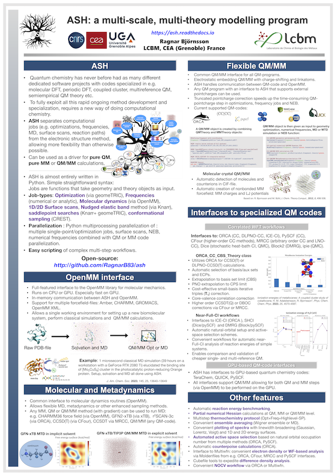

About ASH
==================================================

   
ASH is a Python-based computational chemistry and multiscale modelling program
designed for ultimate flexibility. This works by separating the Hamiltonians (of the QM or MM programs) from the 
typical jobtypes of computational chemistry (optimization, frequencies, MD, scans etc.).

The program allows for convenient ways of doing single-point calculations, geometry optimizations, surface scans, 
nudged elastic band optimizations, molecular dynamics and numerical frequencies using any MM or QM method in a program for which there is an interface.
MM and QM objects are easily combined into QM/MM objects.
ASH is a great solution for automating workflows and performing multi-scale and multi-theory calculations.
Interfaces are available to various popular QM codes, such as ORCA, xTB, CP2K, Psi4, PySCF, ccpy, Dalton, MRCC, CFour, MNDO, Terachem, QUICK, Gaussian, NWChem. 
Reaction profiles and saddlepoint optimizations can be performed using the nudged elastic band method (NEB).

The code is free and open-source and available on `Github <https://github.com/RagnarB83/ash>`_

The program is  developed in the research group of 
`Dr. Ragnar Bjornsson <https://sites.google.com/site/ragnarbjornsson/home>`_ in the `CoMX group <https://www.cbm-lab.fr/en/COMX>`_ , of the 
`Laboratory for Chemistry and Biology of Metals <https://www.cbm-lab.fr/en>`_,
at the `CEA <https://www.cea.fr>`_ in Grenoble, France.

Curious?
Try it out in a Google Colab notebook: `ASH in Google Colab <https://colab.research.google.com/drive/11-FG7eTElCvcMNZiTIEXcdWjcR4YWRS-#scrollTo=ViPg1cGuck_a>`_

#####################
Features
#####################

**Flexible coordinate input:**

- coordinate string
- XYZ file
- CIF file
- Fractional coordinate XTL file
- PDB file
- Amber CRD file
- Chemshell fragment file
- GROMACS .gro file
- Python lists
- ASH fragment file format (.ygg)
- Mol and SDF files (requires OpenBabel installation)

**Interfaces to various QM codes:**

- ORCA (general QM-program). Parallelization via OpenMPI. Flexible input, BS-DFT, pointcharge embedding
- xTB (semi-empirical QM (TB)). OpenMP parallelization
- DFTB+ (semi-empirical QM (DFTB) program)
- MNDO (semi-empirical QM program)
- Psi4 (general QM-program, Python library. Threaded parallelization
- PySCF (general QM library in Python, OpenMP parallelization
- ccpy (coupled cluster code in Python)
- CFour (WFT and CC program)
- MRCC (general QM-program and CC code)
- Dalton (general QM program)
- Dice (a selected CI code)
- Block2 (a DMRG code)
- NWChem (general QM program)
- Gaussian (general QM program)
- TeraChem (GPU-based QM code)
- QUICK (GPU-based QM code)
- CP2K (Periodic Gaussian-planewave DFT)
- Turbomole (general QM program)

**Parallelization :**

- Parallelization via Python multiprocessing.
- Simultaneous QM code parallelization also possible.
- Support for running many simultaneous single-point jobs.
- Parallelization of Numerical-Hessian displacement calculations.
- Parallelization of NEB image calculations.
- Parallelization of 1D and 2D surface scans.

**Single-point electrostic embedding QM/MM**

- Full QM/MM support (including pointcharge-gradient) for  ORCA, xTB, PySCF, CFour, MRCC, NWChem, CP2K, TeraChem and QUICK.

**Polarizable embedding via CPPE library**

- TODO

**Nonbonded Molecular Mechanics (MM) via pointcharges and Lennard-Jones potentials**

- Flexible definition of charges and Lennard-Jones potentials. Either via forcefield inputfile or in script.
- Both energy and gradient available.
- Slow Python version and fast Julia version available.

**Full Molecular Mechanics (MM) via OpenMM interface**

- Interface to OpenMM library (C++) via Python API (in-memory). Fast GPU-accelerated MM. CPU also available.
- Periodic or nonperiodic simulations
- Easy use of multiple built-in forcefields: CHARMM, AMBER, GAFF, OpenFF etc.
- Can also read CHARMM-files, Amberfiles, GROMACS-files or OpenMM XML-files.
- Workflows to setup a new biomolecular system from scratch (OpenMM_Modeller)
- Workflows to setup a new small molecule system from scratch
- Convenient small molecule forcefield parameterization (GAFF or OpenFF)

**Geometry optimization with internal coordinates**

- geomeTRIC interface: powerful optimizer supporting multiple internal coordinates (TRIC, HDLC, DLC etc.), frozen atoms, constraints.
- QM/MM optimizations. Support for HDLC internal coordinates.

**Numerical frequencies: one-point (forward difference) and two-point (central difference)**

- Partial Hessian possible
- Full parallelization.
- Support for any QM, MM or QM/MM Hamiltonian for which there is an ASH interface.
- IR intensities
- Raman intensities (if QM-code can do polarizabilities)
- Parallel QM/MM numerical frequencies available (not well tested).
- Possible to request analytical Hessian from ORCA and CFour

**Hessian analysis**

- Diagonalization of Hessian (from ASH or ORCA). Print frequencies and normal modes.
- Projection of translation/rotational modes
- Normal mode composition analysis in terms of individual atoms, elements and atom groups.
- Print vibrational densities of states files (with linebroadening)
- Mode mapping: compare normal modes of 2 Hessians (e.g. with isotope substitution) for similarity
- Read/write ORCA-style Hessian files
- Print XYZ-trajectory file for individual modes
- Thermochemistry according to RRHO or quasi-RRHO (Grimme or Truhlar).
- Write frequency output as pseudo ORCA-outputfile (enables visualization of modes in Chemcraft/Avogadro)

**Molecular dynamics**

- via OpenMM library: MM-only, QM/MM and QM-only
- Any method with gradient in an ASH interface can be used.
- NVE, NVT and NPT ensembles
- Flexible integrator options: allowing for stable 4 fs classical MD simulations
- Bond constraints, frozen atoms, mass modifications
- Metadynamics (via either OpenMM built-in MTD or interface to PLUMED)
- Trajectory analysis via mdtraj library
- MD workflows: Gentle_warm_up_MD, OpenMM_box_equilibration (continuous NPT until convergence)

**molcrys: Automatic Molecular crystal QM/MM**

- Read-in CIF-file, extract cell information and coordinates of asymmetric unit.
- Fill-up coordinates of unitcell.
- Expand unit cell.
- Create spherical cluster from unitcell (with only whole molecules).
- Near-automatic fragment indentification.
- Intelligent reordering of fragments (supports inconsistently ordered CIF-files)
- Automatic creation of nonbonded MM forcefield (charges and LJ potentials).
- Self-consistent QM/MM for charge definition of cluster.
- QM/MM Geometry optimization of central fragment of cluster to capture solid-state geometrical effects.
- QM/MM Numerical frequencies of central fragment of cluster.

**solvshell: Multi-shell solvation protocol for redox potentials, spectroscopy etc.**

- Reads snapshots from molecular dynamics trajectory and calculates VIE, VEA, redox pot. or other property.
- Parallelization over snapshots. Averages over snapshots and finds representative snapshots of trajectory.
- QM/MM single-points with/without increased QM-region.
- Bulk correction for aqueous solutions.
- Automatic procedure for accounting for short-range and long-range polarization effects.
- Polarizable embedding via Psi4 or PySCF (soon available).

