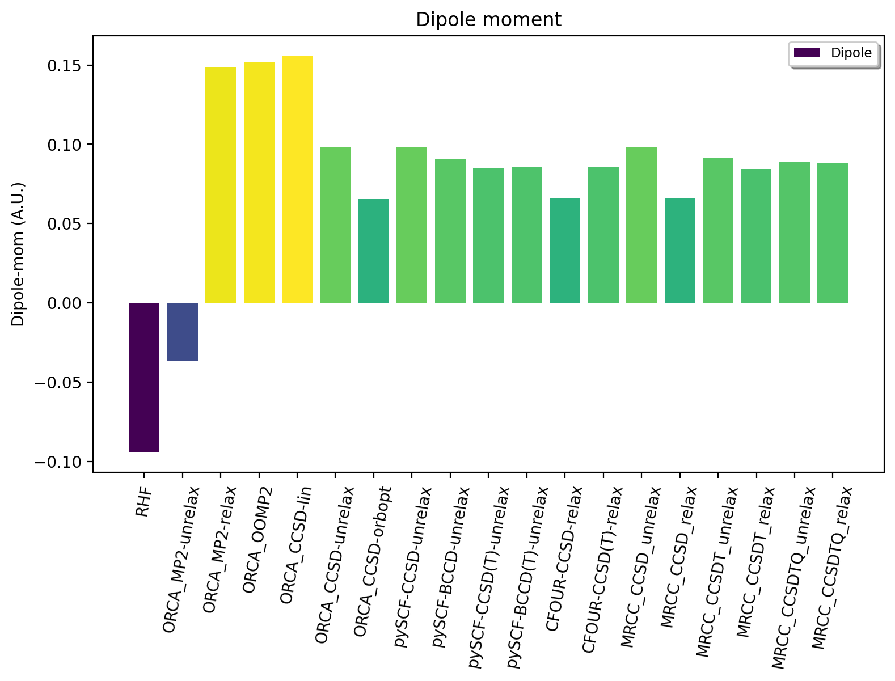
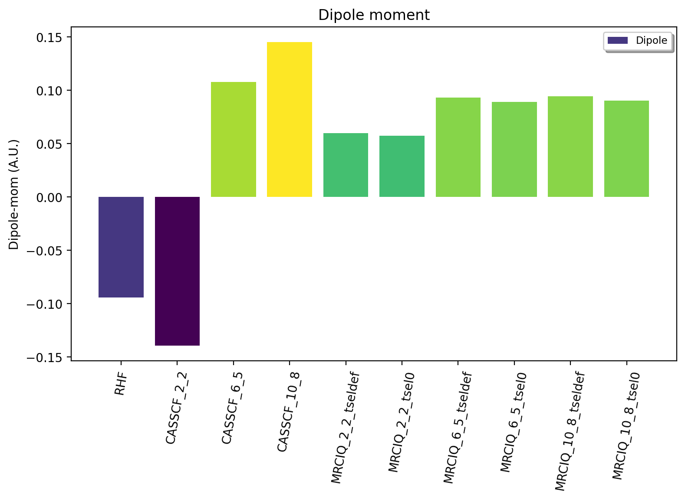
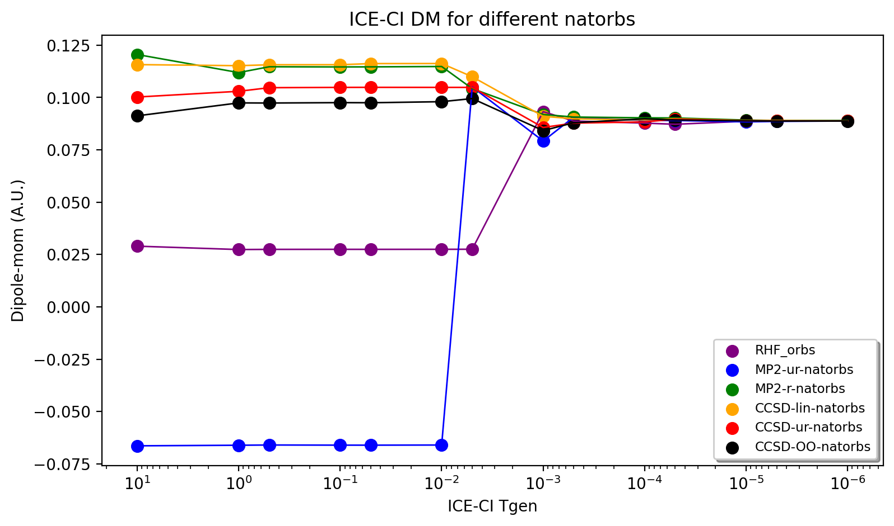
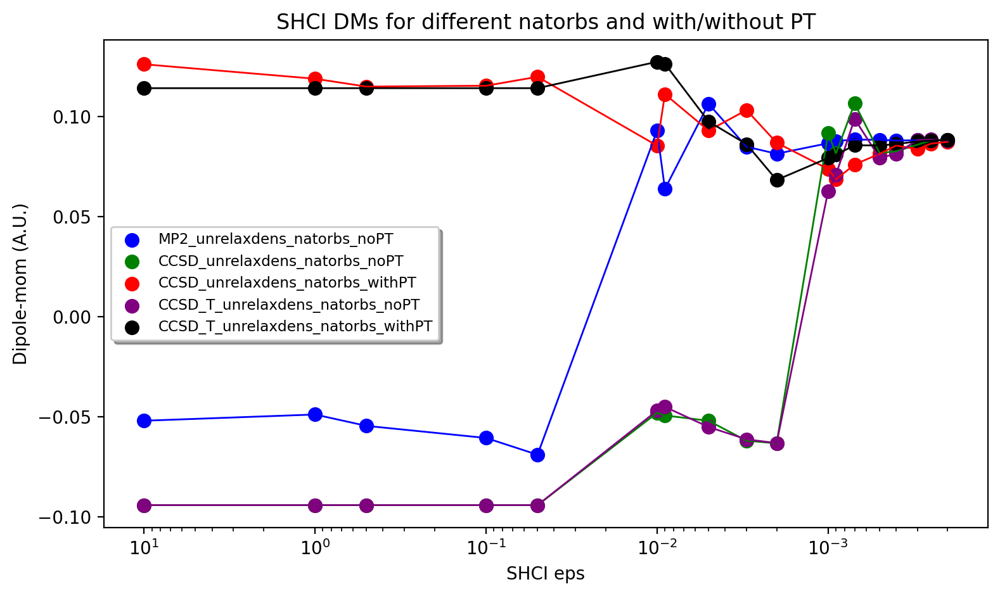
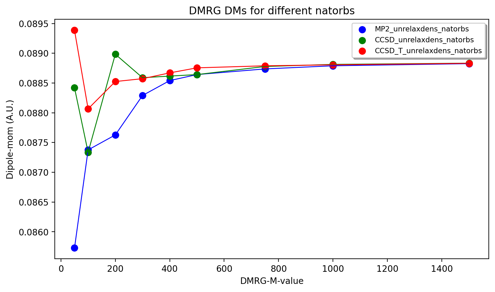
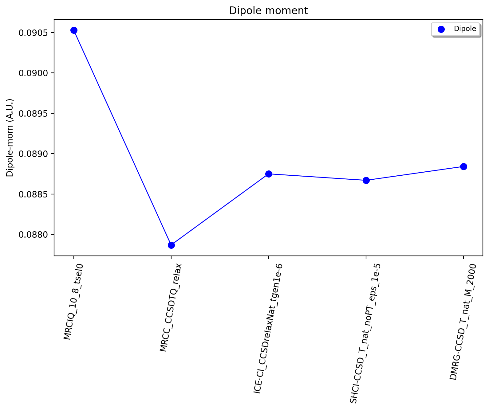
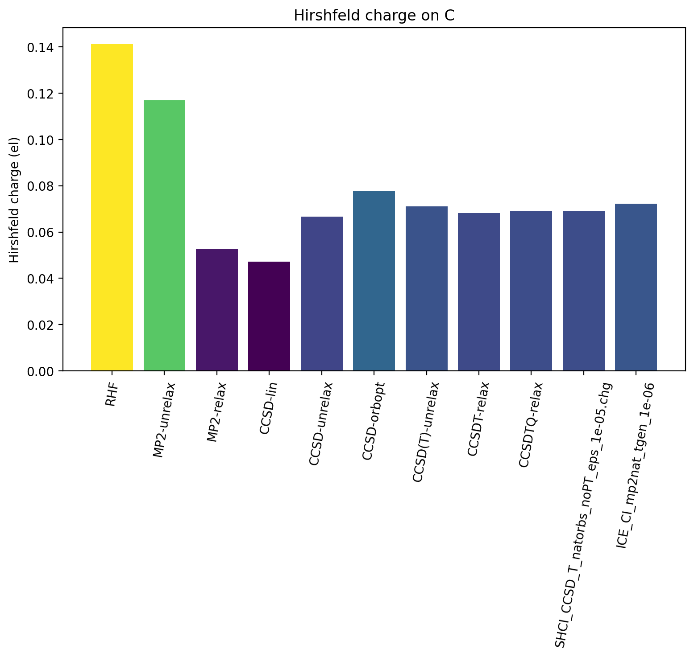
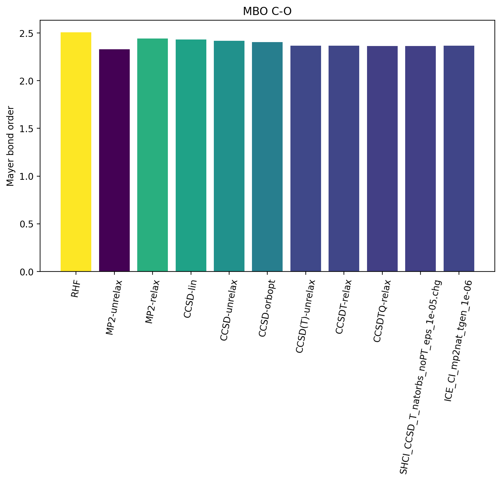
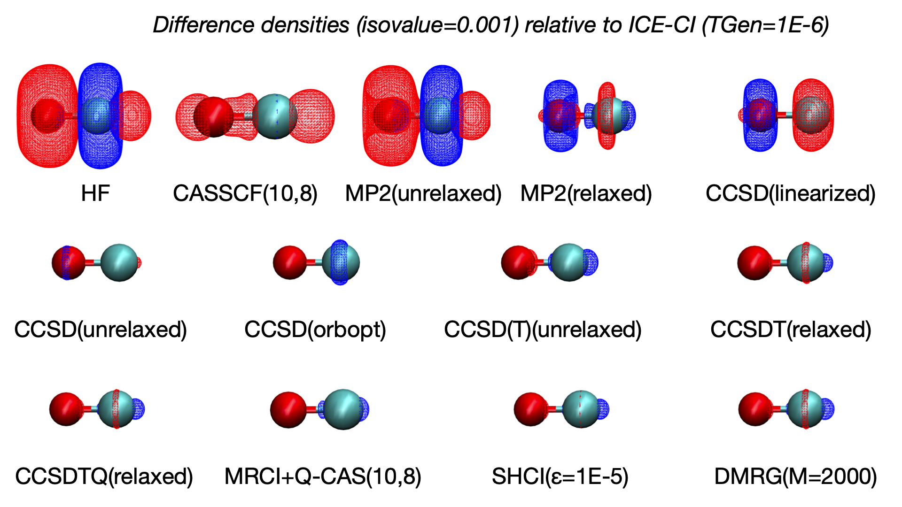

Tutorial: High-level wavefunction and density analysis
====================================================================================================

ASH allows convenient workflows for carrying out analysis of electron densities and related properties
from various types of correlated wavefunctions or Kohn-Sham determinants from different QM programs.
This is accomplished by creating Molden files from the natural orbitals of densities of correlated WFs and canonical orbitals from HF/DFT determinants.

In this tutorial we  show how we can acquire highly correlated densities from different QM programs using different WF expansions,
going all the way up to the near-exact Full-CI limit, for a small molecule in a small basis set and analyze how correlation affects the density.
By utilizing a fixed small basis set and approaching the Full-CI limit systematically using single-reference, multi-reference and near-Full-CI methods 
we can evaluate the accuracy of more cost-effective truncated WF approximations against the near-exact result. 
Being able to estimate the Full-CI limit, even in a small basis set, can thus give much insight into advantages and disadvantages of different 
truncated WF approximations.
If basis set effects can be also be controlled, DFT methods can furthermore be benchmarked against the high-level results.

All ASH scripts are available in the `examples/density-analysis/Tutorial-HLWFT-analysis/CO` directory of the ASH repository.
Reproducing the calculations in this tutorial requires separate installation of ORCA, MRCC, CFour, pySCF, Dice, DMRG.

##############################################################################
The nature of the problem
##############################################################################
Here we will perform correlated WF calculations on the CO molecule (**r**:sub:`e` = 1.1294 Å) in the cc-pVDZ basis set.
CO contains 14 electrons and 7 occupied orbitals. A cc-pVDZ basis set for CO gives 27 orbitals in total.
This means that the Full-CI/cc-pVDZ problem for CO is 14 electrons in 27 orbitals but if we apply the frozen-core approximation (i.e. we freeze the core C 1s and O 1s electrons)
this reduces the Full-CI problem to 10 electrons in 25 orbitals.

##############################################################################
Densities for correlated WF methods
##############################################################################

.. note::  When performing post-HF property/density calculations it is important to make sure that what you are analyzing 
   refers to the correlated WF rather than just the HF. The dipole moment may be printed for both the HF and the post-HF density.
   An ORCA GBW file for a post-HF method may only contain the HF orbitals.

For single-determinant methods (i.e. HF and Kohn-Sham DFT), the electron density and related properties is straightforwardly derived from the set of canonical orbitals calculated (via the SCF procedure). No additional calculations need to be carried out. 
We will use ORCA to perform the calculations and get the dipole moment. 
We can either use the **orca_2mkl** tool to get a Molden-file : 

.. code-block:: text

   orca_2mkl HF  # assumes that a file named HF.gbw is present

or we can use the ASH function **make_molden_file_ORCA** . The latter is more convenient as it can be used in the same script (see example files).

In the case of MP2, the correlated density is typically not automatically calculated (due to the additional cost).  If we want the correlated density we have to ask for it
in the ORCA inputfile,choosing between an unrelaxed and a relaxed MP2 density. We additionally request calculations of natural orbitals derived from the unrelaxed/relaxed density.

.. code-block:: text

   %mp2
   density unrelaxed
   natorbs true
   end

The MP2 calculation will produce a file named e.g. MP2calc.mp2nat . This is an ORCA GBW file containing the natural orbitals of the MP2 density.
To create a Moldenfile from this GBW file we can use the **orca_2mkl** tool again but note that we have to first rename the file to have a .gbw ending.

.. code-block:: text

   orca_2mkl MP2calc.mp2nat  # assumes that the file is named MP2calc.mp2nat.gbw

For CC methods, the energy is calculated by default and additionally a linearized density is calculated by default.
Additional equations have to be solved to define a more correct CC density. Densities are only available for the CCSD truncation in ORCA version 5.

.. code-block:: text

   %mdci
   density unrelaxed
   natorbs true
   end

The CC calculation will produce a file named e.g. CCSDcalc.mdci.nat containing the natural orbitals of the density chosen.

For CASSCF the density is available by default due to the variational nature of CASSCF. 
The GBW file from a CASSCF calculation will by default contain the natural orbitals of the CASSCF 1-particle density matrix.
For CASPT2/NEVPT2 the density is typically not available. For MRCI we can request a density in the inputfile like this:

.. code-block:: text

   %mrci
   donatorbs 2
   end

For near-Full-CI methods we can usually get the density. 
Here we use ICE-ICE (ORCA), SHCI (Dice and pySCF) and DMRG (Block2 and pySCF) methods using interfaces in ASH.

##############################################################################
Analysis of the dipole moment
##############################################################################

A convenient way of analyzing the convergence of the WF is to analyze the dipole moment,
a property closely related to the quality of the WF and density (and in the case of MP2 and CC, the approximation of the CC density used).

The experimental dipole moment of CO is 0.04799 au (0.112 Debye). See `Scuseria et al  <https://doi.org/10.1063/1.460293>`_ for a discussion of the dipole moment of CO.

As we will be utilizing a small cc-pVDZ basis set set to begin with, we can not expect to reproduce the experimental dipole moment.
In fact, the Full-CI WF result in a cc-pVDZ basis set appears to be approximately 0.088 au (as we will confirm later). 
However, utilizing a Full-CI result as a reference, even with a very small basis set can be useful to understand the accuracy of other WF methods.

**Convergence of single-reference WF methods**

Let us first examine the convergence of the dipole moment for single-reference WF methods.
RHF WF gets the dipole moment completely wrong (-0.09) compared to the expected result of +0.088 au (FCI/cc-pVDZ estimate).
Calculating an MP2 wavefunction with an approximate unrelaxed density improves things only gradually (-0.0368) while
calculating a relaxed MP2 density results in a much better, qualitatively correct result (+0.1488). 
Orbital-optimized MP2 only marginally improves the result (0.151), suggesting that we have reached the limit of what can be achieved with second-order perturbation theory.

Calculating a CCSD WF but with the default density approximation (calculated automatically by ORCA) at first glance offers no improvement (0.15610) over MP2,
however, this arises due to the use of the linearized density approximation which is rather crude and far from ideal here.
Calculating an unrelaxed CCSD density results in considerable improvement (0.0979) while utilizing the option "density orbopt" reduce the value down to 0.0653.
The "orbopt" CCSD density option in ORCA corresponds to a relaxed density but using the orbital-optimized CCSD method (OO-CCD). 
The OO-CCD density should be close to a relaxed CCSD density, which is confirmed by comparing to the exact relaxed CCSD density from CFour (0.0663).
This large variation in the CCSD dipole moment is a bit problematic, however, suggesting the lack of important correlation effects in CCSD.
ORCA does not offer densities with higher order CC methods so we now turn to other QM programs.

The pySCF unrelaxed CCSD density gives the same dipole moment as unrelaxed CCSD in ORCA (good sanity check). Additionally we can perform Brueckner CC (BCCD) instead of BCCD
which lowers the dipole moment to 0.0907. Including triples correlation effects in the form of both CCSD(T) and BCCD(T) unrelaxed densities we get 0.0850 and 0.0858, respectively.
CFour is the only program that allows calculation of a relaxed CCSD(T) density which results in a dipole moment of 0.0854, very close to the unrelaxed CCSD(T) result from pySCF.

To confirm whether we are reaching the Full-CI limit we turn to full CCSDT and CCSDTQ calculations via the MRCC program that offers both unrelaxed and relaxed densities with arbitrary CC wavefunctions (only with pure truncations).
We first see that MRCC gives unrelaxed and relaxed CCSD density results of 0.0979 and 0.0663 (in excellent agreement with ORCA/pySCF and CFour).
CCSDT-unrelaxed gives 0.0915 and CCSDT-relaxed gives 0.0844 a.u.
CCSDTQ-unrelaxed gives 0.0889 and CCSDTQ-relaxed gives 0.0879 a.u.

It seems that we have reached an effective FCI-limit using coupled cluster theory, based on the small changes seen between CCSD(T), CCSDT and CCSDTQ as well as the smaller variations between unrelaxed and relaxed densities.
Clearly, inclusion of triples correlation effects seems critical (quadruples effects less so) and the density approximation in CC needs to be reliable.

**Convergence of multi-reference WF methods**

Multiconfigurational and multireference methods are typically used to describe systems with strong static correlation.
This is not the case for carbon monoxide (no near-degeneracies), but it can still be useful to analyze how much dynamic electron correlation is 
captured by the CASSCF and MRCI+Q approaches for a molecule with a non-exotic electronic structure. This allows us to roughly estimate what accuracy
we can expect when we use these methods for genuine multireference systems.

Going to a minimal CASSCF(2,2) WF we see a deterioration (-0.13) of the RHF result which is not entirely surprising because an active space of (2,2) only results in 3 total configurations (vs. 1 for RHF)
and the small active space probably results in an imbalance of the WF. 
A larger CASSCF(6,5) WF includes 65 configurations which includes enough correlation for at least a qualitatively correct result of 0.1080 au.
Increasing to a full valence-space CASSCF(10,8) WF (784 configurations) WF interestingly diverges slightly, giving a value of 0.1451 a.u.
The multiconfigurational CASSCF approach performs Full-CI within the active space but actually does not capture very much electron correlation due to the still relatively small active space.
While we could increase the active space further in CASSCF, to a limit of about 14-16 orbitals (this can be increased to 40-60 orbitals via DMRG,ICE-CI or SHCI), this would not improve things very much as our active-space limitation
allows us only to capture correlation associated with a few number of occupied and virtual orbitals. 
It is actually in general typically more important to capture correlation associated with a large number of orbitals (i.e. dynamic correlation) even though the n-excitation level is smaller (e.g. single-reference CC).

To describe dynamic correlation with a multireference approach we could turn to CASPT2 or NEVPT2, however, densities are typically not available with these methods. 
They furthermore do not offer very high accuracy, being second-order perturbation theory approaches.
The MRCI method, however, allows us to perform effectively a CISD calculation on top of each of the CSF within the CASSCF reference WF.
This will capture dynamic correlation outside the active space and being a CI method, we can diagonalize the MRCI CI-matrix and get the energy, WF and density.
The quality of the MRCI WF depends on the size and composition of the CASSCF reference WF, i.e. the active space and also the quality of the size-consistency correction (here +Q).
Here, the results reveal that MRCI+Q is able to give a qualitatively correct result with a CASSCF(2,2) reference WF and then improves considerably
as we go to CAS(6,5) and CAS(10,8) reference WF.
The uncontracted MRCI module in ORCA (%mrci block) controls the diagonalization size of the MRCI matrix by an individual selection procedure (via 2nd-order perturbation theory).
The selection is controlled by two keywords (TSel and TPre, see ORCA manual). Results using the default values (TSel=1e-6 and TPre=1e-4) and complete-selection (TSel=0 and TPre=0; expensive!) are shown below. 
Some small errors from the perturbative selection can be seen.
The result using the largest MRCI+Q-CAS(10,8) (TSel=0, TPre=0) calculation is 0.0905 a.u. which is in good agrement with the FCI estimate of 0.088 au.

These results show that multireference methodology can be pushed to converge to the Full-CI limit for a non-multireference system like here.
However, for a molecule with no static correlation we are not gaining anything here compared to single-reference coupled cluster theory.
The MRCI+Q method scales worse than CC and it contains errors due to lack of size-consistency (not present in CC) which would introduce additional errors.

**Near-Full-CI methods**

An alternative to both single-reference methods and multireference methods are near-Full-CI methods.
These are methods designed to approximate Full-CI directly without relying on truncation of the n-excitation operator (such as in MP2 or CC methods)
or by partitioning the CI space into a small active space (treated by Full-CI as in CASSCF) and an external space (treated by MRPT2 or MRCI).
Below we discuss ICE-CI, SHCI and DMRG as examples of near-Full-CI methods.

.. note::  These near-Full-CI methods also see use as approximate Full-CI algorithms within a CASSCF framework. As they result in less-scaling Full-CI they 
    allow large active-space CASSCF calculations (up to 40-100 orbitals even). 
    Here, however, we will use them as stand-alone methods to approximate Full-CI with a full orbital space. This is only possible for small molecules with small basis sets.

We will perform calculations in the full orbital space except that the frozen-core approximation will be used, meaning that 1s orbitals of C and O are frozen (a very good approximation).

*Convergence of the ICE-CI CIPSI method*

The ICE-CI method is a variant of the CIPSI method which is a selected CI approach to approximate Full-CI. It is implemented in ORCA.
It relies on a systematic selection of many-particle basis functions (can be CFGs, CSFs or determinants) in the overall WF, 
based on a systematic selection procedure based on perturbation theory. In the CFG-form of ICE-CI (used here), only CFGs strongly interacting 
with selected generator CFGs are included.
The selection is controlled by the *TGen* parameter which controls the size of the generator set of configurations and *TVar* which controls the size of the variational space.
It is usually convenient to control the size of the ICE-CI WF only by the *TGen* threshold, in case of which *TVar* is automatically determined (*TVar* = *TGen* * 1e-7). This is done below.
If *TGen* (and *TVar*) are set to 0 then the exact Full-CI WF is recovered. 
However, because of the systematic tree-based selection procedure in ICE-CI,
using ICE-CI WF with e.g. *TGen* = 1e-4, the WF can be made much more compact ( < 1% of configurations of Full-CI) and can recover most of the correlation energy ( > 99 %).
Since ICE-CI is a CI-based method, the selected CI matrix is simply diagonalized to get the energy, WF and density. However, the method can contain some errors due to approximate CI 
not being fully size-consistent (errors will reduce with threshold).

In addition to depending on the *TGen* threshold, the ICE-CI WF will also depend on the input orbitals. This is because no orbital optimization is carried out (unless requested).

.. note::  It is possible to perform orbital-optimization with an ICE-CI WF using the %casscf module of ORCA (cistep ICE), however, when using ICE-CI to perform full CI (i.e. including the entire orbital space) it is more cost-effective to use approximate orbitals.

Useful approximate input orbitals are typically natural orbitals (orbitals that make the 1st-order density matrix diagonal) from some kind of approximate WF theory.
We will compare 5 types of input orbitals: RHF canonical orbitals, MP2 natural orbitals from an unrelaxed density, MP2 natural orbitals from a relaxed density,
CCSD natural orbitals from a linearized density, CCSD natural orbitals from an unrelaxed density and finally CCSD natural orbitals from a relaxed density.

Here we utilize a convenient function (**Auto_ICE_CAS**) in ASH that allows us to conveniently automate ORCA ICE-CI calculations by looping over *TGen* thresholds,
select different input-orbital approximations and control size of the orbital space (if desired).

.. code-block:: python

    for tgen in [10,1,5e-1,1e-1,5e-2,1e-2,5e-3,1e-3,5e-4,1e-4,5e-5,1e-5,5e-6,1e-6]:
        Auto_ICE_CAS(fragment=frag, basis="cc-pVDZ", nmin=1.999, nmax=0.0, numcores=8, CASCI=True, tgen=tgen, memory=10000,
            initial_orbitals='RI-MP2', MP2_density='relaxed')

Note that *nmin* and *nmax* are used to control the size of the orbital space using the natural occupations of the calculated natural orbitals (MP2 or CCSD).
Natural orbitals with occupation numbers < *nmin* and > *nmax* will be included. Here *nmin* = 1.999 will enforce a frozen-core approximation (check to make sure),
while *nmax* = 0.0 will include all virtual orbitals (i.e. Full-CI within a frozen-core approximation).
The inputfiles for these calculations can be found in the ORCA-ICE-CI directory.

The results of the ICE-CI calculations are shown above and reveal that regardless of the input orbitals, the ICE-CI WF converges to the same result (0.0888 - 0.0890) with very little variation 
in the *TGen* = 1e-4 to 1e-6 region. However, as can be seen, for small *TGen* thresholds the input orbitals can have a large effect.
The  RHF orbitals as well as the natural orbitals from the unrelaxed MP2 density clearly have some deficiency which results in non-ideal CFG selection for small *TGen* thresholds.
This seems likely related to the flawed dipole moment exhibited by both the HF and MP2-unrelaxed density seen in the earlier plot.
The use of the relaxed MP2 density seems to result in much better natural orbitals, giving a nice systematic trend of the ICE-CI dipole moment towards a presumed exact Full-CI limit.
The CCSD natural orbitals from a linearized density are additionally very similar and even better results are seen when using natural orbitals from an unrelaxed CCSD density
and especially from an orbital-optimized CCSD density.

Based on the convincing convergence it seems likely that the ICE-CI *TGen* = 1e-6 dipole moment of 0.0888 au is very close to the Full-CI limit. 

*Convergence of the (semi-stochastic) heat-bath CI (SHCI) method*

Semi-stochastic Heat-bath CI is another type of selected CI method. It is implemented in Dice and through the Dice and pySCF interface in ASH
one can conveniently perform SHCI calculations.
For the calculation of the density we actually have to turn off the stochastic part of the perturbation step of the SHCI method (not required for energy-only calculations),
meaning that the method reduces to the heat-bath CI method.
We furthermore can choose to include the perturbation contribution or not.
Additionally the accuracy depends on the epsilon selection threshold as well as the choice of input orbitals.

.. code-block:: python

    #pySCF object
    pyscf = PySCFTheory(basis="cc-pVDZ", numcores=actualcores, scf_type='RHF', conv_tol=1e-9,memory=50000)
    #Dice
    for eps in [10,1,5e-1,1e-1,5e-2,1e-2,9e-3,5e-3,3e-3,2e-3,1e-3,9e-4,7e-4,5e-4,4e-4,3e-4,2.5e-4,2e-4,1e-4,9e-5,8e-5,7e-5,6e-5,5e-5,4e-5,3e-5,2e-5,1e-5]:
        dicecalc = DiceTheory(pyscftheoryobject=pyscf, numcores=actualcores, SHCI=True, memory=50000,
                    SHCI_cas_nmin=1.999, SHCI_cas_nmax=0.0, SHCI_stochastic=True, SHCI_PTiter=400, SHCI_sweep_iter= [0,3,6],
                    SHCI_sweep_epsilon = [ 4*eps,2*eps,eps ], SHCI_davidsonTol=1e-8, SHCI_epsilon2=1e-8, SHCI_epsilon2Large=1e-5, SHCI_macroiter=0,
                    initial_orbitals='CCSD',SHCI_DoRDM=True)
        result = Singlepoint(fragment=frag, theory=dicecalc)

The figure below shows the results, a rather strong dependence is seen on both input orbitals and whether the perturbation contribution is included or not.
Overall, CCSD(T) unrelaxed natural orbitals, with PT contribution included, emerges as the best converging protocol.
Interestingly CCSD(T) unrelaxed natural orbitals without PT contribution behave worse.

*Convergence of the density matrix renormalization group  (DMRG) method*

The DMRG method is yet another method in the near-Full-CI category, similar in scope to selected CI methods.
Here we use the ASH-interface to Block2 and the DMRG-SCF interface within pySCF to carry out DMRG calculations.
The DMRG WF depends on the number of M renormalized states used as well as the input orbitals.
Use of the Block2 interface in ASH is quite straightforward, a PySCFTheory object is required, an input-orbital option and the max number of M renormalized states.

.. code-block:: python

    #Block2 DMRG settings
    maxM=500
    parmethod='OpenMP'
    initial_orbitals='MP2'
    singlet_embedding=True
    pyscf = PySCFTheory(basis="cc-pVDZ", numcores=8, scf_type='RHF', conv_tol=1e-9,memory=50000)
    for maxM in [1,20,50,100,200,300,400,500,750,1000,1500,2000,3000]:
        blockcalc = BlockTheory(pyscftheoryobject=pyscf, cas_nmin=1.999, cas_nmax=0.0, macroiter=0, numcores=8, 
            memory=30000, initial_orbitals=initial_orbitals, block_parallelization=parmethod, maxM=maxM, 
            singlet_embedding=singlet_embedding, DMRG_DoRDM=True)
        result = Singlepoint(fragment=frag, theory=blockcalc)

The DMRG results are shown below as a function of maxM (Max number of M renormalized states) and input orbitals.
The DMRG results are here only somewhat sensitive to input orbitals with CCSD(T) overall providing the best converging results.

TODO: explore localized input orbitals

**Convergence of the dipole moment to the complete basis set limit**

Based on the results above we can estimate the dipole moment of CO in the Full-CI limit with a cc-pVDZ basis set as:
0.088-0.089 au. This is based on : 0.0879 (CCSDTQ relaxed), 0.0888 au (ICE-CI), 0.0887 au (SHCI) and 0.0888 au (DMRG). The MRCI+Q-CAS(10,8) number of 0.0905 a.u. is likely less reliable and is not considered here to be a Full-CI estimate.
While the CCSDTQ WF does not include any higher order excitations (quintuples, hextuples etc.) it includes the most important triples and quadruples and unlike the other methods it is rigourously size-consistent.  
This Full-CI/cc-pVDZ estimate of 0.088-0.089 au is quite far from the experimental value of 0.04799 au, which is due to the small basis set used.

However, having now established the convergence of the many-electron WF with a small basis set we can now pick a well-behaved method 
and examine how the dipole moment converges with basis set.
Increasing the basis set captures additional correlation energy (due to the increase of virtual orbitals resulting in more possible excitations) which will reduce the basis set incompleteness error.
The previous results suggests multireference methods do not offer any advantages for this system (unsurprisingly), while single-reference CC theory is well-behaved as long as triples excitations effects are accounted for in some way.
The near-Full-CI methods SHCI, ICE-CI and DMRG are well-behaved once the selection threshold are chosen well, however, these methods can not easily be used to perform calculations with larger basis sets.
This is because increasing the basis set to the TZ or QZ level will increase the size of the total orbital space to 59 (TZ), 109 (QZ) and 181 (5Z) 
which are orbital limits outside the scope of these methods (approx. 50 for DMRG/ICE-CI and up to 100 for SHCI).
We will here choose CCSD(T) as our truncated WF approximation and will examine how the dipole moment converges with basis set.

.. image:: figures/Dipole_CCSD_T_basis.png
   :align: center
   :width: 600

The results calculated with both an unrelaxed CCSD(T) density (using pySCF) and a relaxed CCSD(T) density (using CFour) are shown above.
The results reveal considerable basis set effects (not surprisingly) as we go from the cc-pVDZ basis set to the cc-pV5Z basis set using the CCSD(T) method.
For the case of the dipole moment of CCSD(T), the general dynamic correlation effects captured by basis set expansion, clearly outweigh any beyond CCSD(T) correlation effects.
The FCI/cc-pVZ - CCSD(T)/cc-pVDZ difference amounts to approx. 0.0024 - 0.0029 au (CCSD(T) unrelaxed or relaxed), 
which is an order of magnitude smaller than the cc-pVDZ -> cc-pV5Z basis set effect of approx. -0.0378 - 0.0411 au.
However, one could include this Full-CI correction to the CCSD(T)/5Z result, evaluated at the cc-pVDZ basis to account for this.

Overall, the agreement for CCSD(T)/cc-pV5Z of 0.0443 - 0.0472 a.u. with experiment (0.0480 a.u.) is excellent.
Accounting for a FCI/DZ-correction to the CCSD(T)/cc-pV5Z value we get 0.0469 - 0.0502 a.u which is in basically perfect agreement, 
with only some minor uncertainty due mostly to basis set incompleteness error, density approximation and accuracy of the Full-CI correction.

The excellent performance of CCSD(T) is here entirely expected for a molecule with a non-exotic electronic structure.

##############################################################################
Population analysis
##############################################################################

While the dipole moment can be useful for analyzing the convergence of the WF, it may not reveal very much about the 
electronic-structure changes occurring in the molecule as electron correlation is captured.
Population analysis such as atomic charges and bond orders, however, can sometimes give a clearer picture.
Here we will analyze Hirshfeld atomic charges and Mayer bond orders of CO as a function of WF complexity, using the cc-pVDZ basis set.

As Hirshfeld population analysis and Mayer bond orders are not implemented in all the different QM codes used,
we utilize the ASH interface to Multiwfn (see :doc:`Multiwfn_interface`) to conveniently perform this analysis. This relies on providing Molden files to Multiwfn that 
that contain natural orbitals (the orbitals that make the first-order density matrix diagonal).

**Hirshfeld**

The Hirshfeld analysis for the different WFs can be conveniently performed in an automatic fashion using the ASH interface to Multiwfn.
One simply copies the desired Moldenfiles over to the directory and runs the script below.

.. code-block:: python

    from ash import *

    moldenfiles=glob.glob("*molden*")

    for moldenfile in moldenfiles:
        multiwfn_run(moldenfile, option='hirshfeld', grid=3, numcores=1)

This creates a .chg file for each Moldenfile (e.g. CCSD-unrelax.chg) that contains the Hirshfeld charges for each atom.

The Hirshfeld charge on the carbon atom is plotted below as a function of different WF, all using the same cc-pVDZ basis set.

The results reveal that upon increasing account of electron correlation, carbon monoxide becomes less ionic and more covalent, with less positive charge on C (and less negative charge on O).
The MP2-relaxed density and linearized CCSD density appear to have a tendency to overestimate covalency.

**Bond orders**

The Mayer bond order can also be easily calculated in a similar way using the Molden-files

.. code-block:: python

    from ash import *

    moldenfiles=glob.glob("*molden*")

    for moldenfile in moldenfiles:
        multiwfn_run(moldenfile, option='MBO', grid=3, numcores=1)
        os.rename("bndmat.txt", f"{moldenfile}_bndmat.txt")

The results reveal that the bond order is not overly sensitive to the WF complexity with HF and the MP2-unrelax showing the largest
deviations from the other results. This is not surprising though for an organic molecule with a strong covalent bond. For molecules with trickier electronic structure
e.g. transition metal complexes, one may expect more variation.

##############################################################################
Difference density analysis
##############################################################################

Difference density analysis is a simple but useful tool for understanding changes in the density as electron correlation is included.
One simply needs to plot the electron density on a grid for each calculation and then subtract the density of a reference density for each gridpoint
It is important to plot the density in the same way, i.e. using the same grid and the molecule needs to have the same orientation in Cartesian space.
Here we use the ASH interface to Multiwfn to conveniently perform this analysis using Molden-files of the natural orbitals for each previous WF calculation (using a cc-pVDZ basis set).
Specifically we use the **diffdens_tool** function in ASH that automatically reads all Moldenfiles and calls Multiwfn to create Cube density-files and then
performs the difference density. See :doc:`elstructure_analysis`.

.. code-block:: python

   from ash import *

   #Get list of Moldenfiles in current directory
   moldenfiles=glob.glob("*molden*")
   #Call diffdens_tool, specifying which file should be the reference
   diffdens_tool(reference_orbfile="ICE_CI_mp2nat_tgen_1e-06.molden",
      dir='.', grid=3)

The reference density can be chosen depending on the context, e.g. the HF density in which the density changes would directly reveal directly the effect of electron correalation.
Here we choose one of the near-Full-CI densities (ICE-CI with a TGen=1e-6 threshold), assumed to be practically at the exact FCI limit, as the reference density. 
The density changes for other methods can then mostly be interpreted as deficiencies with respect to Full-CI.

The densities are plotted on an isosurface with a value of 0.001 below.
To conveniently visualize the isosurfaces we utilize an ASH function **write_VMD_script_cube** that creates a VMD-statefile that will upon loading,
automatically load the Cubefiles and render them using the chosen isovalues and colors.

.. code-block:: python

   from ash import *

   diff_cubefiles=glob.glob("*diff_density.cube")

   #Optional VMD state-file
   write_VMD_script_cube(cubefiles=diff_cubefiles,VMDfilename="Diffdens.vmd",
                           isovalue=0.001, isosurfacecolor_pos="blue", isosurfacecolor_neg="red")

A large difference between HF and ICE-CI is found as expected, showing HF to be predicting a more polarized electron density than ICE-CI (more electron density associated with oxygen and less on carbon).
The CASSCF(10,8) density removes the main HF density artifact but still display some odd density changes. 
The unrelaxed MP2 density gives a very similar result as HF (consistent with the dipole moment analysis), demonstrating the failure of the unrelaxed MP2 density approximation.
The relaxed MP2 density is a big improvement and the linearized CCSD density is similar. An unrelaxed CCSD density further improves the result and overall higher-order CC WFs or densities become hard to tell apart.
The changes between SHCI, DMRG, CCSDTQ and MRCI+Q are overall very similar and small and are here not interpreted to be significant.

##############################################################################
ELF analysis
##############################################################################

TODO