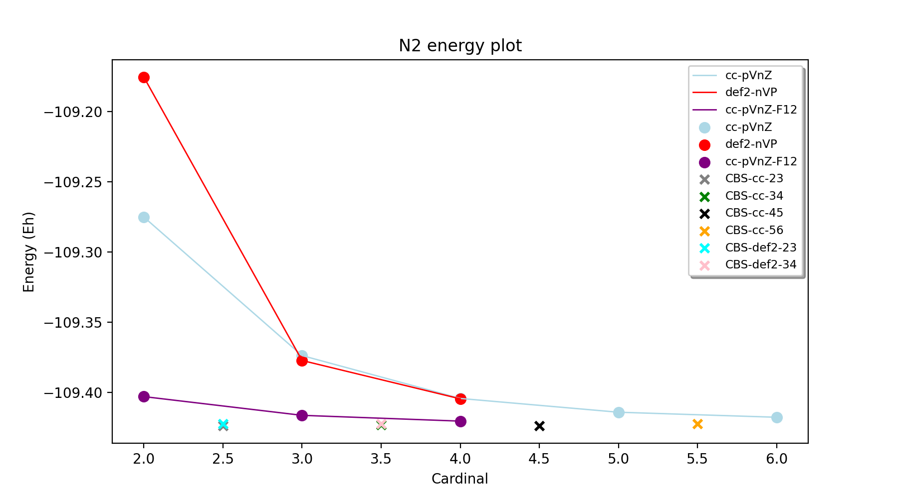

Tutorial: High-level CCSD(T)/CBS workflows
====================================================================================================

While it is relatively straightforward to carry out CCSD(T) calculations on small molecules in multiple QM programs, to acquire truly accurate results of chemical accuracy (~ 1 kcal/mol)
requires a bit of know-how about basis sets, extrapolations (or F12 methods), core-valence effects etc. Furthermore carrying out these multiple calculations and manually extrapolating and combining the results quickly becomes laborious.
Things become even more complicated when heavy elements or transition metals are involved when the user has to make a choice between all-electron vs. valence+ECP basis sets (sometimes basis sets missing for specific elements), relativistic approximations, frozen-core gives further complications.

To then perform coupled cluster calculations on larger molecules requires the use of local-correlation approximations such as the DLPNO approximation in ORCA, requiring further know-how.

The CC_CBS_Theory class in ASH allows one to carry out all these types of calculations in an easy semi-automatic way.
This page goes shows some examples on how to effectively use CC_CBS_Theory to carry out these calculations for both organic and inorganic systems.

You can find the inputfiles for all of these examples in ASH_SOURCE_DIR/examples/workflows/highlevel-thermochemistry 

##############################################################################
Example: CCSD(T)/CBS for the N2 total energy and Bond Dissociation Energy
##############################################################################

Let's start with the simple case of N2 and the total energy of the system.
If we plot the total CCSD(T) energy for basis sets: cc-pVDZ, cc-pVTZ, cc-pVQZ, cc-pV5Z, cc-pV6Z as well as def2-SVP, def2-TZVPP, def2-QZVPP
we obtain the following plot.

The plot shows how the total electronic energy of N2 gets lower with increasing basis set size (the cardinal number on the x-axis 
refers the basis-set size: e.g. 2 is a double-zeta basis set (cc-pVDZ or def2-SVP). Note the difference between cc-pVDZ and def2-SVP, in this case the cc-pVDZ is clearly a better basis set (basis set error of ~92 vs. 155 kcal/mol).
At the triple-zeta and quadruple-zeta level there is little difference between the def2 basis sets and the cc basis sets (for this system) giving estimated basis set errors of ~30 (TZ) and ~11 kcal/mol (QZ).
However, there is still a considerable basis set error present in all calculations and it is only at the cc-pV6Z level that a hint of convergence is seen. This demonstrates well the problem of converging the total energy, especially the correlation energy part in correlated wavefunction calculations.

The convergence of the explicitly correlated CCSD(T)-F12 calculations using the cc-pVDZ-F12, cc-pVTZ-F12 and cc-PVQZ-F12 basis sets shows a considerably improvement, seemingly converging much faster to the CBS limit.
Note, however a caveat: F12 basis sets of the same cardinal number (e.g. cc-pVDZ-F12 vs. cc-pVDZ) are generally larger in size and the F12 correction also comes with considerable overhead. The F12 calculations were performed like this.

.. code-block:: python
    
    N2=Fragment(xyzfile='n2.xyz')
    cc = CC_CBS_Theory(elements=["N"], cardinals = [2], basisfamily="cc-f12", F12=True) # This is a CCSD(T)-F12/cc-pVDZ-F12 calculation
    Singlepoint(theory=cc, fragment=N2)

Finally, shown as single points on the plots are the results of basis set extrapolations: e.g. CBS-cc-23 refers to a CCSD(T)/CBS extrapolation using cc-pVDZ and cc-pVTZ basis sets (separate extrapolation of HF and correlation energies).
Note that the extrapolations are shown for convenience with half-integer x-values, i.e. CBS-cc-23 is shown on the x-axis as x=2.5.
The extrapolations were performed like this:

.. code-block:: python
    
    N2=Fragment(xyzfile='n2.xyz')
    cc = CC_CBS_Theory(elements=["N"], cardinals = [2,3], basisfamily="cc") # This is CBS-cc-23
    Singlepoint(theory=cc, fragment=N2)

where basisfamily was "cc" or "def2" and cardinals were [2,3] (CBS-cc-23, CBS-def2-23), [3,4] (CBS-cc-34, CBS-def2-34), [4,5] (CBS-cc-45) or [5,6] (CBS-cc-56)

The advantage of CBS extrapolations for the total energy of N2 is obvious. All extrapolations lead to considerably lower energies than the individual basis set calculations and appear to converge well around an estimated CBS limit.
Note that an exact estimate of the basis set limit is not always completely clear. One might assume that it lies somwehere close to the CCSD(T)/cc-pV6Z, CCSD(T)-F12/cc-pVQZ-F12 and CBS-cc-56 values:
E(cc-pV6Z): -109.4177701
E(cc-pVQZ-F12): -109.4202075
E(CBS-cc-56): -109.4225008
Most likely there is still a systematic basis-set error present in the cc-pV6Z result (giving a higher energy than the CBS limit), and probably also in the CCSD(T)-F12 calculation (plus some numerical noise of either sign due to the F12 correction).
The extrapolated numbers should be more accurate the higher the cardinal numbers (i.e. CBS-cc-56 being the best) but there will also be some numerical error due to the nature of the extrapolation (dependence on extrapolation parameters) and that error could be of either sign.
Most likely, however, the CBS-cc-56 number is closest to the exact CBS limit.

These total energies nonetheless have a spread of ~3 kcal/mol, again highlighting how difficult it is to converge the total electronic energy even when using very large basis sets.
Luckily for reaction energies, most of the remaining basis set error is highly systematic and cancels out in most applications.
Let's now do the same comparison for the bond-dissociation energy of N2 (the energy of the reaction: N2 => 2N) instead.

.. image:: figures/N2_BDE.png
   :align: center
   :width: 700

The results for the BDE show overall similar trends but reveal how much easier it is to converge relative reaction energies to the basis set limit than total energies. 
The CCSD(T)/cc-pVDZ BDE is ~27 kcal/mol away from an estimated CBS BDE (here taken as CBS-cc-56) instead of ~92 kcal/mol for the N2 total energy. 
Interestingly, the def2-SVP basis shows a smaller basis error (~19 kcal/mol) than cc-pVDZ (~27 kcal/mol) for the BDE (opposite than for the total energy).
Again, however, we notice the relatively slow convergence of the CCSD(T) energy with respect to basis set, the BDE likely not even converged at cc-pV6Z.
The CCSD(T)-F12 series behaves a lot better, showing a smooth convergence from cc-pVDZ-F12 (error=3.4 kcal/mol), through cc-pVTZ-F12 (error=1.3 kcal/mol) to cc-pVQZ-F12 (error=0.4 kcal/mol).
The extrapolations again are well-behaved but here we notice more of a difference involving CBS-cc-23/CBS-def2-23 extrapolations and extrapolations with higher order cardinals.
The CBS-def2-23 extrapolation (error = 6.5 kcal/mol) is worse than CBS-cc-23 (error = 3 kcal/mol) though clearly better than the plain CCSD(T)/TZ result and only slightly worse than CCSD(T)/QZ. 
Once we get up to 3/4 extrapolations (CBS-def2-34 and CBS-cc-34) the 

##########################################################################################
Example: CCSD(T) and DLPNO-CCSD(T)/CBS calculations on threshold energy of chlorobenzene
##########################################################################################

##############################################################################
Example: DLPNO-CCSD(T)/CBS calculations on a 4d Transition metal complex 
##############################################################################

**4d Transition Metal Complex Example: DLPNO-CCSD(T1)/CBS with PNO extrapolation on a 4d-metal complex with the Ahlrichs def2-SVP/def2-TZVPP extrapolation:**

*Protocol 1: def2-23-extrap-NormalPNO*

.. code-block:: python

    complex=Fragment(xyzfile='ru-phosphine-complex.xyz')
    cc = CC_CBS_Theory(elements=["Ru", "P", "H", "O", "N" ], cardinals = [2,3], basisfamily="def2", DLPNO=True, 
                  pnosetting='NormalPNO', numcores=1)
    Singlepoint(theory=cc, fragment=complex)

*Protocol 2: cc-34-extrap-PNOextrap67*

.. code-block:: python

    complex=Fragment(xyzfile='ru-phosphine-complex.xyz')
    #Note: here providing list of elements more conveniently from the defined fragment
    cc = CC_CBS_Theory(elements=complex.elems, cardinals = [3,4], basisfamily="cc", DLPNO=True, 
                  pnosetting='extrapolation', pnoextrapolation=[6,7], numcores=1)
    Singlepoint(theory=cc, fragment=complex)

In this example of a large ruthenium metal complex we can not afford to do regular CCSD(T) calculations and we utilize instead the powerful local-correlation DLPNO approximation.
Here we use the def2 basis family and a def2-ECP effective core-potential will be automatically selected for ruthenium. We choose cardinals=[2,3] here and this means that we do the relatively cheap def2-SVP/def2-TZVPP extrapolation.
The DLPNO approximation utilizes thresholds that determine the accuracy of the DLPNO approximation (compared to unapproximated CCSD(T)). Note that here we use the more accurate but more expensive iterative triples (T1) approximation.
By setting pnosetting="NormalPNO" we get the default PNO settings that are reasonably accurate. Other options are: 'LoosePNO' (not recommended) and 'TightPNO' (more accurate, more expensive), and 'extrapolation' (see below).

DLPNO-CCSD(T)/CBS with PNO extrapolation on a 4d-metal complex with the cc-pVnZ and cc-pVnZ-PP (n=3,4) extrapolation:

For an even more accurate estimate of the coupled-cluster basis set limit the [3,4] extrapolation is much more reliable than [2,3] and here we also utilize the more accurate 
correlation-consistent basis set family ('cc'). For ruthenium, ASH tells ORCA to choose the cc-pVNZ-PP family for this heavy element and the 'SK-MCDHF' ECP.
To further reduce the error of the DLPNO approximation we use pnosetting="extrapolation" and pnoextrapolation=[6,7] which means that 2 DLPNO-CCSD(T) calculations will be performed
for each basis-set-cardinal calculation with different TCutPNO cutoffs (here TCutPNO=1e-6 and TCutPNO=1e-7). The results are then extrapolated to the PNO limit according to PNO extrapolation by Giovanni Bistoni and coworkers.
See these excellent papers: https://pubs.acs.org/doi/abs/10.1021/acs.jctc.0c00344 and https://pubs.acs.org/doi/abs/10.1021/acs.jpca.1c09106

##############################################################################
Example: DLPNO-CCSD(T)/CBS calculations on a 3d Transition metal complex 
##############################################################################

**3d Transition Metal Complex Example: DLPNO-CCSD(T1)/CBS with PNO extrapolation on a 4d-metal complex with the Ahlrichs def2-SVP/def2-TZVPP extrapolation:**

Example: DLPNO-CCSD(T)/CBS with PNO extrapolation on a 3d-metal complex with DKH relativistic approximation:

For 3d transition metal complexes (with the complicated 3d shell of the metal), effective core potentials are typically not very accurate and an all-electron relativistic approach is typically recommended in general.

.. code-block:: python

    complex=Fragment(xyzfile='fe-complex.xyz')
    #Note: here providing list of elements more conveniently from the defined fragment
    cc = CC_CBS_Theory(elements=complex.elems, cardinals = [3,4], basisfamily="cc-dk", DLPNO=True, 
                  relativity='DKH', pnosetting='extrapolation', pnoextrapolation=[6,7], numcores=1)
    Singlepoint(theory=cc, fragment=complex)

Here the Douglas-Kroll-Hess scalar relativistic Hamiltonian is used and this requires one to choose a basis-set family that has been recontracted for DKH Hamiltonians.
We could choose to use the 'cc-dk' but here we utilize the 'cc-CV-dk' family that in addition to being DKH-recontracted, features additional basis-functions typically used to describe core-valence 
correlation. The frozen-core approximation is still in use here, meaning that the extra basis functions instead serve to improve the valence-electron correlation problem instead.

https://pubs.acs.org/doi/abs/10.1021/acs.jctc.9b01109