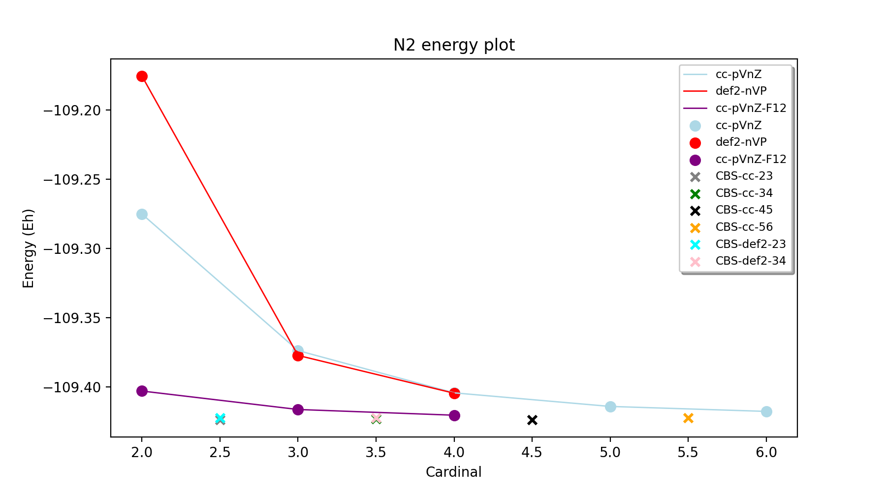
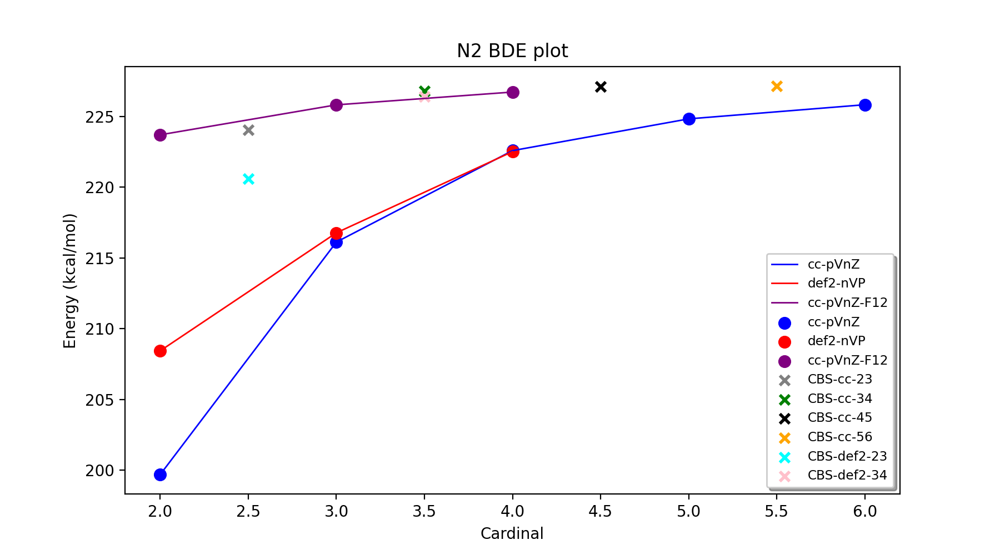

Tutorial: High-level CCSD(T)/CBS workflows
====================================================================================================

While it is relatively straightforward to carry out CCSD(T) calculations on small molecules in multiple QM programs, to acquire truly accurate results of chemical accuracy (~ 1 kcal/mol)
requires a bit of know-how about basis sets, extrapolations (or F12 methods), core-valence effects etc. Furthermore carrying out these multiple calculations and manually extrapolating and combining the results quickly becomes laborious.
Things become even more complicated when heavy elements or transition metals are involved when the user has to make a choice between all-electron vs. valence+ECP basis sets (sometimes basis sets missing for specific elements), relativistic approximations, frozen-core gives further complications.

To then perform coupled cluster calculations on larger molecules requires the use of local-correlation approximations such as the DLPNO approximation in ORCA, requiring further know-how.

The CC_CBS_Theory class in ASH allows one to carry out all these types of calculations in an easy semi-automatic way via the interface to ORCA.

See :doc:`module_highlevel_workflows` for all the options available in CBS_CC_Theory.

This tutorial shows some examples on how to effectively use CC_CBS_Theory to carry out these calculations for both organic and inorganic systems.

You can find the inputfiles for all of these examples in ASH_SOURCE_DIR/examples/workflows/highlevel-thermochemistry 

.. note:: CC_CBS_Theory for now only supports CCSD(T)/CBS calculations via the ORCA interface in ASH. Future work will allow use of CFour, Psi4 and/or MRCC for specific functionality (post-CCSD(T) corrections etc).

##############################################################################
Example: CCSD(T)/CBS for the N2 total energy and Bond Dissociation Energy
##############################################################################

ASH scripts to carry out these calculations: ASH_SOURCE_DIR/examples/workflows/highlevel-thermochemistry/N2-BDE 

Let's start with the simple case of N2 and the total energy of the system. We will use the experimental N-N distance of 1.0975 Å.
If we plot the total CCSD(T) energy for basis sets: cc-pVDZ, cc-pVTZ, cc-pVQZ, cc-pV5Z, cc-pV6Z as well as def2-SVP, def2-TZVPP, def2-QZVPP
we obtain the following plot.

The plot shows how the total electronic energy of N2 gets lower with increasing basis set size (the cardinal number on the x-axis 
refers the basis-set size: e.g. 2 is a double-zeta basis set (cc-pVDZ or def2-SVP). Note the difference between cc-pVDZ and def2-SVP, in this case the cc-pVDZ is clearly a better basis set (basis set error of ~92 vs. 155 kcal/mol).
At the triple-zeta and quadruple-zeta level there is little difference between the def2 basis sets and the cc basis sets (for this system) giving estimated basis set errors of ~30 (TZ) and ~11 kcal/mol (QZ).
However, there is still a considerable basis set error present in all calculations and it is only at the cc-pV6Z level that a hint of convergence is seen. This demonstrates well the problem of converging the total energy, especially the correlation energy part in correlated wavefunction calculations.
These single-basis CCSD(T) calculations can either be performed using ORCATheory or alternatively via CC_CBS_Theory like this:

.. code-block:: python
    
    N2=Fragment(xyzfile='n2.xyz')
    cc = CC_CBS_Theory(elements=["N"], cardinals = [2], basisfamily="cc") # This is a CCSD(T)/cc-pVDZ calculation
    Singlepoint(theory=cc, fragment=N2)

The convergence of the explicitly correlated CCSD(T)-F12 calculations using the cc-pVDZ-F12, cc-pVTZ-F12 and cc-PVQZ-F12 basis sets shows a considerable improvement, seemingly converging much faster to the CBS limit.
Note, however a caveat: F12 basis sets of the same cardinal number (e.g. cc-pVDZ-F12 vs. cc-pVDZ) are generally larger in size and the F12 correction also comes with considerable overhead. 
The F12 calculations were performed like this:

.. code-block:: python
    
    N2=Fragment(xyzfile='n2.xyz')
    cc = CC_CBS_Theory(elements=["N"], cardinals = [2], basisfamily="cc-f12", F12=True) # This is a CCSD(T)-F12/cc-pVDZ-F12 calculation
    Singlepoint(theory=cc, fragment=N2)

Finally, shown as single points on the plots are the results of basis set extrapolations: e.g. CBS-cc-23 refers to a CCSD(T)/CBS extrapolation using cc-pVDZ and cc-pVTZ basis sets (separate extrapolation of HF and correlation energies).
Note that the extrapolations are shown for convenience with half-integer x-values, i.e. CBS-cc-23 is shown on the x-axis as x=2.5.
The extrapolations were performed like this:

.. code-block:: python
    
    N2=Fragment(xyzfile='n2.xyz')
    cc = CC_CBS_Theory(elements=["N"], cardinals = [2,3], basisfamily="cc") # This is CBS-cc-23
    Singlepoint(theory=cc, fragment=N2)

where basisfamily are either "cc" or "def2" and cardinals were [2,3] (CBS-cc-23, CBS-def2-23), [3,4] (CBS-cc-34, CBS-def2-34), [4,5] (CBS-cc-45) or [5,6] (CBS-cc-56)

The advantage of CBS extrapolations for the total energy of N2 is obvious. All extrapolations lead to considerably lower energies than the individual basis set calculations and appear to converge well around an estimated CBS limit.
Note that an exact estimate of the basis set limit is not always completely clear. One might assume that it lies somewhere close to the CCSD(T)/cc-pV6Z, CCSD(T)-F12/cc-pVQZ-F12 and CBS-cc-56 values:

- E(cc-pV6Z): -109.4177701
- E(cc-pVQZ-F12): -109.4202075
- E(CBS-cc-56): -109.4225008

Most likely there is still a systematic basis-set error present in the cc-pV6Z result (giving a higher energy than the CBS limit), and probably also in the CCSD(T)-F12 calculation (plus some numerical noise of either sign due to the F12 correction).
The extrapolated numbers should be more accurate the higher the cardinal numbers (i.e. CBS-cc-56 being the best) but there will also be some numerical error due to the nature of the extrapolation (dependence on extrapolation parameters) and that error could be of either sign.
Most likely, however, the CBS-cc-56 number is closest to the exact CBS limit.

**Converging the reaction energy**

The best-estimate total energies candidates nonetheless have a spread of ~3 kcal/mol, again highlighting how difficult it is to converge the total electronic energy even when using very large basis sets.
Luckily for reaction energies, most of the remaining basis set error is highly systematic and cancels out in most applications.
Let's now do the same comparison for the bond-dissociation energy of N2 (the energy of the reaction: N2 => 2N) instead.

The BDE calculations can be carried out in ASH like this:

.. code-block:: python
    
    N2=Fragment(xyzfile='n2.xyz', charge=0, mult=1)
    N=Fragment(atom=['N'],charge=0, mult=4)
    specieslist=[N2,N]
    cc = CC_CBS_Theory(elements=["N"], cardinals = [2,3], basisfamily="cc") # This is CBS-cc-23
    energies = Singlepoint_fragments(theory=cc, fragments=specieslist, stoichiometry=[-1,2])

The results for the BDE show overall similar trends but reveal how much easier it is to converge relative reaction energies to the basis set limit than total energies. 
The CCSD(T)/cc-pVDZ BDE is ~27 kcal/mol away from an estimated CBS BDE (here taken as CBS-cc-56) instead of ~92 kcal/mol for the N2 total energy. 
Interestingly, the def2-SVP basis shows a smaller basis error (~19 kcal/mol) than cc-pVDZ (~27 kcal/mol) for the BDE (opposite than for the total energy).
Again, however, we notice the relatively slow convergence of the CCSD(T) energy with respect to basis set, the BDE likely not even converged at cc-pV6Z (error of 1.3 kcal/mol w.r.t. CBS-cc-56 extrapolated value).

The CCSD(T)-F12 series behaves a lot better, showing a smooth convergence from cc-pVDZ-F12 (error=3.4 kcal/mol), through cc-pVTZ-F12 (error=1.3 kcal/mol) to cc-pVQZ-F12 (error=0.4 kcal/mol).

The extrapolations again are well-behaved but here we notice more of a difference involving CBS-cc-23/CBS-def2-23 extrapolations and extrapolations with higher order cardinals.
The CBS-def2-23 extrapolation (error = 6.5 kcal/mol) is worse than CBS-cc-23 (error = 3 kcal/mol) though clearly better than the plain CCSD(T)/TZ result and only slightly worse than CCSD(T)/QZ. 
Once we get up to 3/4 extrapolations (CBS-def2-34 and CBS-cc-34) the extrapolated values have much smaller errors (0.4 kcal/mol for CBS-cc-34 and 0.7 kcal/mol for CBS-def2-34; w.r.t. CBS-cc-56).
Furthermore CBS-cc-45 and CBS-cc-56 extrapolated values are practically indistinguishable (0.02 kcal/mol difference) suggesting we have reached the CBS limit.
Generally 3/4 extrapolations tend to be highly reliable and capable of reaching chemical accuracy (~1 kcal/mol reaction energy errors). An alternative option is to use CCSD(T)-F12 
with cc-pVTZ-F12 (error=1.3 kcal/mol) or cc-pVQZ-F12 (error=0.4 kcal/mol) basis sets.

Our best estimate for the CCSD(T)/CBS BDE for N2 is 227.16 kcal/mol using the CBS-cc-56 extrapolation protocol (uses the frozen-core approximation).
This number can be compared to high-level values in Table III by Feller et al. (https://aip.scitation.org/doi/pdf/10.1063/1.2137323)
The CCSD(T)(FC) value in the table is 227.2+/-0.2 kcal/mol and was obtained by aug-cc-pn5Z (n=5,6,7) CCSD(T) extrapolations and a slightly different geometry (r_NN=1.0989).
The agreement between our calculation and theirs is excellent. The experimental BDE of N2 (corrected for ZPE) is 228.4 kcal/mol.
The remaining ~1.2 kcal/mol deviation comes primarily from core-valence correlation (~0.8 kcal/mol), CCSDTQ correlation (~0.4 kcal/mol), 
additional FCI correlation (~0.05 kcal/mol) and scalar relativistic effects (-0.1 kcal/mol) as shown in the paper.

All the calculations in this section and automatic creation of the plots
can be automatically performed using scripts available in: ASH_SOURCE_DIR/examples/workflows/highlevel-thermochemistry/N2-BDE

The  *Reaction-general-bigscript.py* script is a verbose manual version while
the *Reaction-general-function.py* script shows how to utilize the function **Reaction_Highlevel_Analysis** (see :doc:`module_highlevel_workflows`).

**Accounting for higher-order effects**

It is also possible to account for these contributions in ASH. If you add CVSR=True to CC_CBS_Theory and choose a core-valence basis set (here W1-mtsmall, only available for elements H-Ar),
ASH carries out a separate extra CCSD(T) calculation step that calculates the difference between having all electrons correlated and having only the valence electrons correlated (i.e. frozen-core approximation).
The DKH approximation is also active in the all-electron CCSD(T) calculation and the difference thus gives a combined CoreValence+ScalarRelativistic correction.

Accounting for post-CCSD(T) correlation effects is generally difficult to do and typically requires implementations of higher-level coupled-cluster wavefunctions (e.g. CCSDT, CCSDT(Q) or CCSDTQ). 
These theory levels are not yet available in ORCA but the calculations could be carried out using CFour or MRCC programs, see :doc:`CFour-interface` and :doc:`MRCC-interface` interfaces.
ASH includes the Goodson's continued fraction extrapolation formula that allows one to extrapolate coupled-cluster excitation levels to Full-CI.
The simplest way uses the HF-energy, the CCSD energy and the CCSD(T) energy to give an estimate for the Full-CI energy. By setting FCI=True in CBS_CC_Theory one can get the Full-CI correction estimate for free.

The code below shows how to add these corrections in a convenient way:

.. code-block:: python
    
    cc = CC_CBS_Theory(elements=["N"], cardinals = [5,6], basisfamily="cc", FCI=True,
                        CVSR=True, CVbasis="W1-mtsmall" ) # This is CBS-cc-34 with core-valence + scalar relativistic (CVSR) and FCI correction

See Reaction-CoreValence.py inside ASH_SOURCE_DIR/examples/workflows/highlevel-thermochemistry/N2-BDE

The combined core-valence-scalar-relativistic (CVSR) correction yield 0.87 kcal/mol in good agreement with the results from Feller et al. (0.8 -0.1 = 0.7 kcal/mol).
The highly approximate Goodson FCI correction is 0.47 kcal/mol which is here in excellent agreement with the combined post-CCSD(T) corrections by Feller et al. (0.4+0.05 = 0.45).

The final FCI/CBS bond dissociation energy calculated by ASH is 228.50 kcal/mol which is in excellent agreement with experiment: 228.4 kcal/mol (corrected for ZPE).

.. warning:: The Goodson extrapolation formula when using HF, CCSD and CCSD(T) energies has not always found to be a reliable approach.
    See discussion in: 

    - D. Feller and D. A. Dixon, J. Phys. Chem. A 107, 9641 (2003)
    - D. Feller and K. A. Peterson, J. Chem. Phys. 126, 114105 (2007).

##########################################################################################
Example: Atomization energy and formation enthalpy of Methane
##########################################################################################

Enthalpies of formation are a common quantity for describing the stability of molecules, referring to the relative energy of the molecule with respect to its elements in their standard state.
The most direct way of calculating the enthalpy of formation is usually via the atomization energy where one calculates the energy of the molecule relative to its atomic components and then via the known experimental enthalpies of formation of the atoms
one can derive the enthalpy of formation. Note th
The atomization energy, however, tends to be the most difficult quantity to calculate accurately as it requires the calculation to accurately capture all associated electron correlation effects, possible relativistic and vibratational effects.

Atomization energies and formation enthalpies can be straightforwardly calculated in ASH, via the tools of : CC_CBS_Theory, thermochemprotol_reaction function and the FormationEnthalpy function.

Shown below is a script for calculating the atomization energy of methane.
As before, we must create the necessary fragments: methane, C and H (making sure to specify the correct spin multiplicites).
We can then organize the fragments in a list and define the stoichiometry of the atomization reaction: CH4 -> C + 4H

Here we use the **thermochemprotocol_reaction** function to carry out all steps of the reaction: including geometry optimization of each species at the DFT-level (only methane in this case), calculate the Hessian (also with DFT) and derive ZPVE and thermal corrections as well as a high-level single-point calculation
at the CCSD(T)/CBS level of theory that includes corrections for core-valence+ scalar relativistic effects. We even include a correction for atomic spin-orbit correction.
**thermochemprotocol_reaction** will return a dictionary of the results from which we can find the total atomization energy at 0 K (TAE_0K) with ZPVE included or at 298.15 K.

The formation enthalpy can also be directly derived by passing the TAE to the function **FormationEnthalpy** along with the list of fragments, stoichiometry and specifying whether the enthalpy of formation at 0K or 298.15 K is desired.

.. code-block:: python

    from ash import *

    numcores=1

    #Define fragments
    methane=Fragment(xyzfile="methane.xyz", charge=0, mult=1)
    C=Fragment(atom="C", charge=0, mult=3)
    H=Fragment(atom="H", charge=0, mult=2)
    fragments=[methane,C,H] #Combining into a list
    stoichiometry=[-1,1,4] #Defining stoichiometry of reaction, here atomization reaction

    #Define Theories
    DFTopt=ORCATheory(orcasimpleinput="!r2scan-3c", numcores=numcores)
    HL=CC_CBS_Theory(elements=["C","H"], DLPNO=False, basisfamily="cc", cardinals=[3,4], CVSR=True, 
        numcores=numcores, Openshellreference="QRO", atomicSOcorrection=True)

    #RUn thermochemistry protocol: Opt+Freq using DFTOpt, final energy using HL theory
    thermochemdict = thermochemprotocol_reaction(fraglist=fragments, stoichiometry=stoichiometry, 
                        Opt_theory=DFTopt, SP_theory=HL, numcores=numcores, memory=5000,
                            analyticHessian=True, temp=298.15, pressure=1.0)
    print("thermochemdict:", thermochemdict)

    #Grabbing atomization energy at 0K (with ZPVE) or 298 K.
    TAE_0K=thermochemdict['deltaE_0']
    TAE_298K=thermochemdict['deltaH']

    #Calculate Enthalpy of formation from atomization energy
    deltaH_form_0K = FormationEnthalpy(TAE_0K, fragments, stoichiometry, RT=False)
    deltaH_form_298K = FormationEnthalpy(TAE_298K, fragments, stoichiometry, RT=True)

    print("\n FINAL RESULTS")
    print("="*50)
    print("\n\nCalculated deltaH_form_0K:", deltaH_form_0K)
    print("Calculated deltaH_form_298K:", deltaH_form_298K)
    print("-"*50)
    print("Experimental deltaH_form(0K): -15.908 kcal/mol")
    print("Experimental deltaH_form(298K): -17.812 kcal/mol")

The results of the atomization reaction energy are printed when the thermochemprotocol_reaction function is finished, and the different contributions can be analyzed.
Not surprisingly, the SCF-energy contribution dominates (~331 kcal/mol), followed by the CCSD correlation energy (~85 kcal/mol), followed by the ZPVE contribution of ~28 kcal/mol (relatively large since 4 bonds are broken), next is the triples correlation (~2.9 kcal/mol), the core-valence+scalar-relativistic contribution (~1.05 kcal/mol) and the atomic spin-orbit coupling (0.08 kcal/mol).

.. code-block:: text

    FINAL REACTION ENERGY:
    Enthalpy and Gibbs Energies for  T=298.15 and P=1.0
    --------------------------------------------------------------------------------
    Reaction_energy(Total ΔE_el):  420.66773231352124 kcalpermol
    Reaction_energy(Total Δ(E+ZPVE)):  392.7051331837455 kcalpermol
    Reaction_energy(Total ΔH(T=298.15):  397.6771692269534 kcalpermol
    Reaction_energy(Total ΔG(T=298.15):  368.7274457120811 kcalpermol
    --------------------------------------------------------------------------------
    Individual contributions
    Reaction_energy(ΔZPVE):  -27.9625991297763 kcalpermol
    Reaction_energy(ΔHcorr):  -22.99056308656977 kcalpermol
    Reaction_energy(ΔGcorr):  -51.940286601441855 kcalpermol
    --------------------------------------------------------------------------------
    Reaction_energy(ΔSCF):  331.4715014776347 kcalpermol
    Reaction_energy(ΔCCSD):  85.28909223866452 kcalpermol
    Reaction_energy(Δ(T)):  2.9421185749646073 kcalpermol
    Reaction_energy(ΔCCSD+Δ(T) corr):  88.23121081362918 kcalpermol
    Reaction_energy(ΔSO):  -0.08457346517516597 kcalpermol
    Reaction_energy(ΔCV+SR):  1.0495934874310884 kcalpermol
    --------------------------------------------------------------------------------

The total atomization at 0 K (with ZPVE) is 392.7 kcal/mol which is in excellent agreement with the rigourous theoretical 392.5 kcal/mol estimate by Karton et al. https://www.sciencedirect.com/science/article/abs/pii/S0166128007000565
As discussed in the paper by Karton et al., there are also other contributions that could be accounted for (not included in our calculations) such as the effects of higher-order correlation effects 
(full triples, quadruple and quintuple excitation effects), diagonal Born-Oppenheimer correction as well as a more accurate harmonic ZPVE (via CCSD(T)) and anharmonic effects.
Luckily, those other effects tend to be small or they happen to effectively cancel each other out (higher order correlation effects in particular).

Finally we can derive the enthalpy of formation at either 0K or 298.15 K by calling the **FormationEnthalpy** function and giving the TAE as input as well as the list of fragments and stoichiometry.
The **FormationEnthalpy** function includes high-accuracy enthalpies of formation of maingroup atoms from the Active Thermochemical Tables project (https://atct.anl.gov)

.. code-block:: python

    #Calculate Enthalpy of formation from atomization energy
    deltaH_form_0K = FormationEnthalpy(TAE_0K, fragments, stoichiometry, RT=False)
    deltaH_form_298K = FormationEnthalpy(TAE_298K, fragments, stoichiometry, RT=True)

The final results are in excellent agreement with experiment with a deviation of 0.1-0.25 kcal/mol.

.. code-block:: text

    Calculated deltaH_form_0K: -16.143469706881206
    Calculated deltaH_form_298K: -17.926930207374085
    --------------------------------------------------
    Experimental deltaH_form(0K): -15.908 kcal/mol
    Experimental deltaH_form(298K): -17.812 kcal/mol

##########################################################################################
Example: CCSD(T) and DLPNO-CCSD(T)/CBS calculations on threshold energy of chlorobenzene
##########################################################################################

Let's look at a slightly larger molecule where regular CCSD(T) calculations are doable but expensive and compare to the results when using the DLPNO local-correlation approximation.

**IN PROGRESS**

####################################################################################
Example: DLPNO-CCSD(T)/CBS 3d Transition metal complex: Ionization of Ferrocene 
####################################################################################

**INCOMPLETE**

**3d Transition Metal Complex Example: DLPNO-CCSD(T1)/CBS with PNO extrapolation on a 3d-metal complex with the Ahlrichs def2-SVP/def2-TZVPP extrapolation:**

Example: DLPNO-CCSD(T)/CBS with PNO extrapolation on a 3d-metal complex with DKH relativistic approximation:

For 3d transition metal complexes (with the complicated 3d shell of the metal), effective core potentials are typically not very accurate and an all-electron relativistic approach is typically recommended in general.

.. code-block:: python

    complex=Fragment(xyzfile='fe-complex.xyz')
    #Note: here providing list of elements more conveniently from the defined fragment
    cc = CC_CBS_Theory(elements=complex.elems, cardinals = [3,4], basisfamily="cc-CV_3dTM-cc_L", DLPNO=True, 
                  relativity='DKH', pnosetting='extrapolation', pnoextrapolation=[6,7], numcores=1)
    Singlepoint(theory=cc, fragment=complex)

Here the Douglas-Kroll-Hess scalar relativistic Hamiltonian is used and this requires one to choose a basis-set family that has been recontracted for DKH Hamiltonians.
We could choose to use the 'cc-dk' but here we utilize the 'cc-CV-dk' family that in addition to being DKH-recontracted, features additional basis-functions typically used to describe core-valence 
correlation. The frozen-core approximation is still in use here, meaning that the extra basis functions instead serve to improve the valence-electron correlation problem instead.

https://pubs.acs.org/doi/abs/10.1021/acs.jctc.9b01109

##############################################################################
Example: DLPNO-CCSD(T)/CBS calculations on a 4d Transition metal complex 
##############################################################################

Let's compare the options available for a 4d transition metal complex.
Here we choose the ruthenium-phosphine complex: XXX.

*Protocol 1: def2-23-extrap-NormalPNO*

.. code-block:: python

    complex=Fragment(xyzfile='ru-phosphine-complex.xyz')
    cc = CC_CBS_Theory(elements=["Ru", "P", "H", "O", "N" ], cardinals = [2,3], basisfamily="def2", DLPNO=True, T0=False,
                  pnosetting='NormalPNO', numcores=1)
    Singlepoint(theory=cc, fragment=complex)

In this example of a large ruthenium metal complex we can not afford to do regular CCSD(T) calculations and we utilize instead the powerful local-correlation DLPNO approximation.
Here we use the def2 basis family and a def2-ECP effective core-potential will be automatically selected for ruthenium. We choose cardinals=[2,3] here and this means that we do the relatively cheap def2-SVP/def2-TZVPP extrapolation.
The DLPNO approximation utilizes thresholds that determine the accuracy of the DLPNO approximation (compared to unapproximated CCSD(T)).
By setting pnosetting="NormalPNO" we get the default PNO settings that are reasonably accurate. Other options are: 'LoosePNO' (not recommended) and 'TightPNO' (more accurate, more expensive), and 'extrapolation' (see below).

*Protocol 2: cc-34-extrap-PNOextrap67*

.. code-block:: python

    complex=Fragment(xyzfile='ru-phosphine-complex.xyz')
    #Note: here providing list of elements more conveniently from the defined fragment
    cc = CC_CBS_Theory(elements=complex.elems, cardinals = [3,4], basisfamily="cc", DLPNO=True, 
                  pnosetting='extrapolation', pnoextrapolation=[6,7], numcores=1)
    Singlepoint(theory=cc, fragment=complex)

For an even more accurate estimate of the coupled-cluster basis set limit the [3,4] extrapolation is much more reliable than [2,3] and here we also utilize the typically more accurate 
correlation-consistent basis set family ('cc'). For ruthenium, ASH tells ORCA to choose the cc-pVNZ-PP family for this heavy element and the 'SK-MCDHF' ECP.
To further reduce the error of the DLPNO approximation we use pnosetting="extrapolation" and pnoextrapolation=[6,7] which means that 2 DLPNO-CCSD(T) calculations will be performed
for each basis-set-cardinal calculation with different TCutPNO cutoffs (here TCutPNO=1e-6 and TCutPNO=1e-7). The results are then extrapolated to the PNO limit according to PNO extrapolation by Giovanni Bistoni and coworkers.
See these excellent papers: https://pubs.acs.org/doi/abs/10.1021/acs.jctc.0c00344 and https://pubs.acs.org/doi/abs/10.1021/acs.jpca.1c09106

**TO FINISH**

