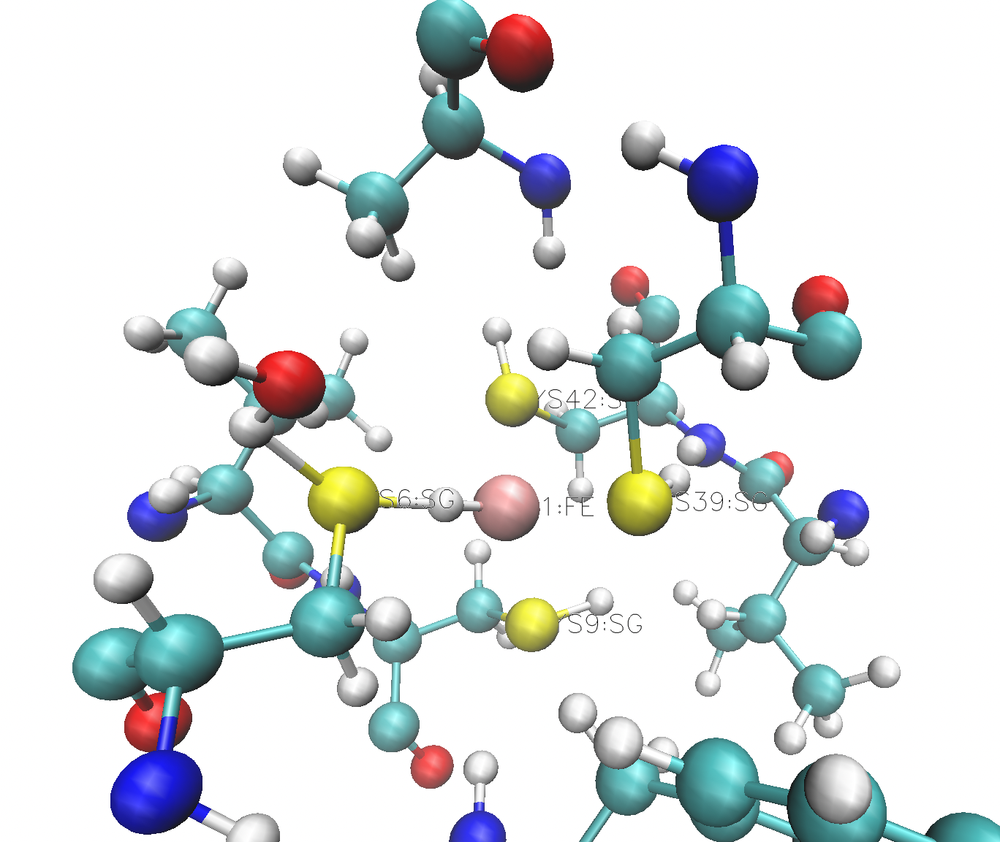
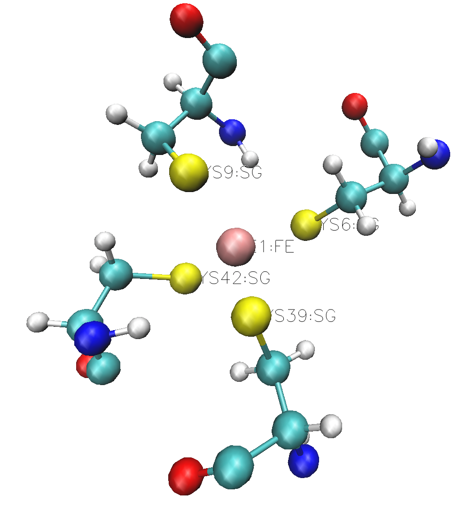

Metalloprotein tutorial I: Rubredoxin
======================================

How to set up an MM and QM/MM model from scratch using the ASH-OpenMM interface.
Test system: rubredoxin

This tutorial shows how to set up a classical model of the rubredoxin metalloprotein in ASH using the CHARMM36 forcefield.
Rubredoxin is one of the simplest metalloproteins having only a single metal-ion (Fe), bound to the protein via 4 cysteine residues but that makes
the system a good first test system to demonstrate the ASH-OpenMM interface.

The files for this tutorial can be found in the ASH source code directory under:
$ASHDIR/examples/OpenMM_Modeller-setups/rubredoxin or https://github.com/RagnarB83/ash/tree/master/examples/OpenMM_Modeller-setups/rubredoxin

######################################################
**1. Use OpenMM_Modeller to set up the system**
######################################################

We will set up a model for rubredoxin based on the `2DSX PDB file <https://www.rcsb.org/structure/2DSX>`_, a 0.68 Angstrom X-ray structure.
First we download the PDB-file and save it as 2dsx.pdb in our working directory.
Next we create a script (here called 1-modelsetup-bad1.py) that looks like:

*1-modelsetup-bad1.py:*

.. code-block:: python

    from ash import *

    #Define variable pdbfile that poitns to the original raw PDB-file (no hydrogens, nosolvent)
    pdbfile="2dsx.pdb"

    # Setting up system via OpenMM_Modeller and requesting the CHARMM36 forcefield
    OpenMM_Modeller(pdbfile=pdbfile, forcefield='CHARMM36')

The script calls the OpenMM_Modeller function. See :doc:`OpenMM-interface` for details on the OpenMM_Modeller.
OpenMM_Modeller will read the unmodified PDB-file and attempt to set up the system using the CHARMM36 protein forcefield.
This script will exit with an error, however, as OpenMM does not recognize the Fe ion in the PDB-file.

.. code-block:: text

    ValueError: No template found for residue 53 (FE).  This might mean your input topology is missing some 
        atoms or bonds, or possibly that you are using the wrong force field.

The relevant line in the PDB-file is:

.. code-block:: text

    HETATM  401 FE    FE A 501       2.866  -0.198   9.125  1.00  4.06          FE

The line indicates that atom 401 has an atomname: FE, residuename (FE), chain: A, resid 501, followed by xyz, coordinates ( 2.866  -0.198   9.125), occupancy (1.00), thermal factor (4.06) and element name (FE).
To fix this problem we need to make a residue definition for the Fe ion so that it matches the information in the PDB-file.

Let us create a file called specialresidue.xml that looks like:

.. code-block:: xml

    <ForceField>
    <AtomTypes>
    <Type name="FEX" class="Fe" element="Fe" mass="55.84700"/>
    </AtomTypes>
    <Residues>
    <Residue name="FE">
    <Atom name="FE" type="FEX"/>
    </Residue>
    </Residues>
    <NonbondedForce coulomb14scale="1.0" lj14scale="1.0">
    <Atom type="FEX" charge="0.0" sigma="1.3" epsilon="0.0"/>
    </NonbondedForce>
    <LennardJonesForce lj14scale="1.0">
    <Atom type="FEX" sigma="0.3" epsilon="0.00000"/>
    </LennardJonesForce>
    </ForceField>

This OpenMM XML file defines a forcefield associated with the Fe residue. A list of atomtypes needs to be defined (here only a single atomtype, FEX, is needed). 
Note that an atomtype can be applied to many atoms in a residue or many residues while an atomname is unique within a residue.
Then the extra residue needs to be defined (named "FE"). Next we define an atom name ("FE") that points to the atom type ("FEX").
Finally, we need to define nonbonded parameters associated with the residue and the single atom. Note that in this case we need to define both NonbondedForce and LennardJonesForce in order
to be consistent with the CHARMM36 forcefield as defined within OpenMM.

Now that we have created an XML-file (specialresidue.xml) associated with the Fe ion residue that OpenMM complained about, we can try to call OpenMM_Modeller again, this time telling OpenMM_Modeller about the extra forcefield file.

*1-modelsetup-bad2.py:*

.. code-block:: python

    from ash import *

    #Define variable pdbfile that poitns to the original raw PDB-file (no hydrogens, nosolvent)
    pdbfile="2dsx.pdb"

    # Setting up system via OpenMM_Modeller and requesting the CHARMM36 forcefield
    OpenMM_Modeller(pdbfile=pdbfile, forcefield='CHARMM36', extraxmlfile="specialresidue.xml")

While this script runs to completion in just a few seconds, we are not quite ready. The Fe ion is now defined in the combined forcefield, however, OpenMM does not know that the Fe ion is actually chemically bonded to 4 deprotonated cysteine
residues of the protein. Those 4 cysteine residues are Cys6, Cys9, Cys39 and Cys42.
Cysteine residues are by default assumed to have a protonated sidechain and we can see on the figure to the right that OpenMM added H-atoms to each thiol group of the cysteine sidechain.
This is obviously not what we want for our Fe ion that should be coordinated to 4 deprotonated cysteines.

In order to let OpenMM_Modeller know that we do not want those cysteine sidechains protonated we need to define the residue_variants keyword argument.
The residue_variants value needs to be a dictionary that points to alternative residuenames for residues with other protonation states.
Here we tell OpenMM_Modeller that these 4 cysteine residues should be CYX residues (deprotonated CYS).

*1-modelsetup_simple.py:*

.. code-block:: python

    from ash import *

    #Original raw PDB-file (no hydrogens, nosolvent)
    pdbfile="2dsx.pdb"

    #XML-file to deal with cofactor
    extraxmlfile="./specialresidue.xml"

    #Setting some manual protonation states. Note ASH, counts from 0
    #Here defining residues 5,8,38,41 (6,9,39,42 in the PDB-file) to be deprotonated cysteines (CYX).
    residue_variants={5:'CYX',8:'CYX',38:'CYX',41:'CYX'}

    # Setting up system via Modeller
    OpenMM_Modeller(pdbfile=pdbfile, forcefield='CHARMM36',
        extraxmlfile=extraxmlfile, residue_variants=residue_variants)

This is the final version of the setup script that will correctly setup the rubredoxin model, at least with respect to the coordinated Fe ion.
OpenMM_Modeller will print out the the following output in the end. 

.. code-block:: text

    Files written to disk:
    system_afterfixes.pdb
    system_afterfixes2.pdb
    system_afterH.pdb
    system_aftersolvent.pdb
    system_afterions.pdb and finalsystem.pdb (same)

    Final files:
    finalsystem.pdb  (PDB file)
    finalsystem.ygg  (ASH fragment file)
    finalsystem.xyz   (XYZ coordinate file)
    system_full.xml   (System XML file)

    OpenMM_Modeller done! System has been fully set up

    To use this system setup to define a future OpenMMTheory object for this system you can either do:

    1. Use full system XML-file:
    omm = OpenMMTheory(xmlsystemfile="system_full.xml", pdbfile="finalsystem.pdb", periodic=True)

    1. Define using separate forcefield XML files:
    omm = OpenMMTheory(xmlfiles=["charmm36.xml", "charmm36/water.xml", "./specialresidue.xml"], pdbfile="finalsystem.pdb", periodic=True)

OpenMM_Modeller has executed a multi-step protocol that fixes problems in the PDB-file, corrects for missing atoms, will add H-atoms according to an algorithm and takes pH into account (default pH=7.0) and finally will add a solvent box around the protein as well as ions according to a desired ion strength (here 0.1).
PDB-files are created for each step and can be inspected.

.. image:: figures/rubredoxin_setup_all72.png
   :align: center

Figure above shows a visualization of the PDB after basic fixes (missing heavy atoms added) at the top left, after adding all hydrogen atoms (top right), after adding a solvent box (bottom left) and after adding ions (bottom right).

The final version of the script shows how additional options can be used to control the size of the solvation box (solvent_padding), choose watermodel, 
    control protonation state of titratable residues according to pH value, change ionicstrength, positive and negative iontypes to add etc.

*1-modelsetup_advanced.py:*

.. code-block:: python

    from ash import *

    #Original raw PDB-file (no hydrogens, nosolvent)
    pdbfile="2dsx.pdb"

    #XML-file to deal with cofactor
    extraxmlfile="./specialresidue.xml"

    #Setting some manual protonation states. Note ASH, counts from 0
    #Here defining residues 5,8,38,41 (6,9,39,42 in the PDB-file) to be deprotonated cysteines (CYX).
    residue_variants={5:'CYX',8:'CYX',38:'CYX',41:'CYX'}

    # Setting up system via Modeller
    OpenMM_Modeller(pdbfile=pdbfile, forcefield='CHARMM36',
        extraxmlfile=extraxmlfile, watermodel="tip3p", pH=7.0, solvent_padding=10.0,
        ionicstrength=0.1, pos_iontype='Na+', neg_iontyp='Cl-', residue_variants=residue_variants)

###############################################################
**2a. Minimize system and run a classical MD simulation**
###############################################################

Once OpenMM_Modeller has finished setting up the system we need to some basic classical preparation to make sure the system is stable before attemping future QM/MM geometry optimizations or QM/MM MD system.
We create a new script called 2a-classicalMD1.py.

2a-classicalMD1.py:

.. code-block:: python

    from ash import *

    numcores=4

    #FeS4 indices (inspect finalsystem.pdb file to get atom indices). Note ASH counts from 0.
    cofactor_indices=[96, 136, 567, 607, 755]
    bondconstraints=[[755,96],[755,136],[755,567],[755,607]]

    #Defining fragment containing coordinates (can be read from XYZ-file, ASH fragment or PDB-file)
    fragment=Fragment(pdbfile="finalsystem.pdb")

    #Creating new OpenMM object from OpenMM full system file
    omm = OpenMMTheory(xmlsystemfile="system_full.xml", pdbfile="finalsystem.pdb", periodic=True, platform='OpenCL', numcores=numcores,
                        autoconstraints='HBonds', constraints=bondconstraints, rigidwater=True)

    #MM minimization for 100 steps
    OpenMM_Opt(fragment=fragment, theory=omm, maxiter=100, tolerance=1)

    #Classical MD simulation for 10 ps
    OpenMM_MD(fragment=fragment, theory=omm, timestep=0.001, simulation_time=5, traj_frequency=10, temperature=300,
        integrator='LangevinMiddleIntegrator', coupling_frequency=1, trajectory_file_option='DCD')

    #Re-image trajectory so that protein is in middle
    MDtraj_imagetraj("trajectory.dcd", "final_MDfrag_laststep.pdb", format='DCD')

2b-classicalMD1.py:

.. code-block:: python

    from ash import *

    numcores=4

    #FeS4 indices (inspect system_aftersolvent.pdb file to get indices)
    cofactor_indices=[96, 136, 567, 607, 755]
    bondconstraints=[[755,96],[755,136],[755,567],[755,607]]

    #Defining fragment containing coordinates (can be read from XYZ-file, ASH fragment, PDB-file)
    fragment=Fragment(pdbfile="finalsystem.pdb")

    #Creating new OpenMM object from OpenMM full system file
    omm = OpenMMTheory(xmlfiles=["charmm36.xml", "charmm36/water.xml", "./specialresidue.xml"], pdbfile="finalsystem.pdb", periodic=True,
            platform='OpenCL', numcores=numcores, autoconstraints='HBonds', constraints=bondconstraints, rigidwater=True)

    #MM minimization for 100 steps
    OpenMM_Opt(fragment=fragment, theory=omm, maxiter=100, tolerance=1)

    #Classical MD simulation for 10 ps
    OpenMM_MD(fragment=fragment, theory=omm, timestep=0.001, simulation_time=5, traj_frequency=10, temperature=300,
        integrator='LangevinMiddleIntegrator', coupling_frequency=1, trajectory_file_option='DCD')

###########################################################################
**2b. Run through an advanced NPT equilibration + long NVT simulation**
###########################################################################

###########################################################################
**3. Run semi-empirical GFN-xTB QM/MM MD simulation**
###########################################################################

Once we have performed an acceptable classical simulation and demonstrated that the system is stable we can move on to QM/MM calculations.
Typical Q

###########################################################################
**4. Run QM/MM geometry optimizations at the DFT-level in ORCA**
###########################################################################