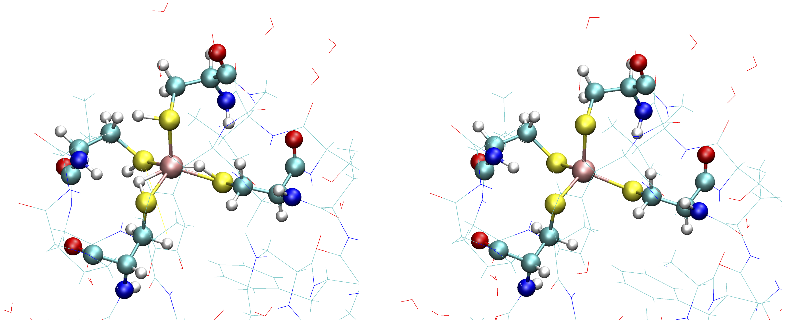
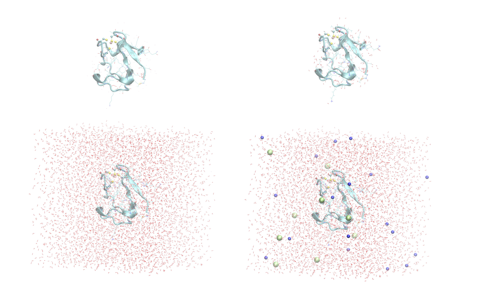
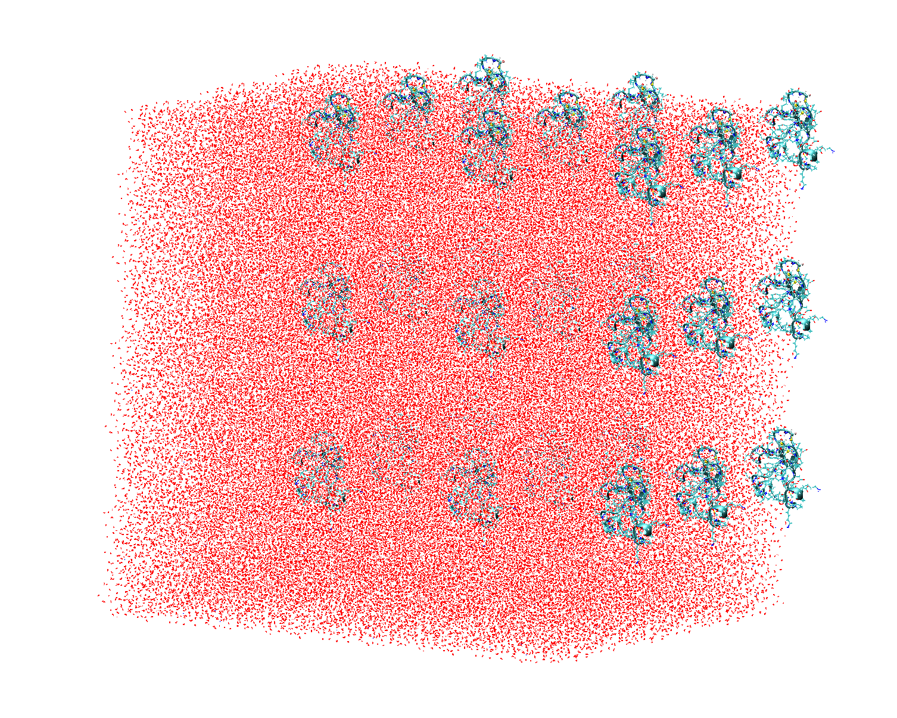
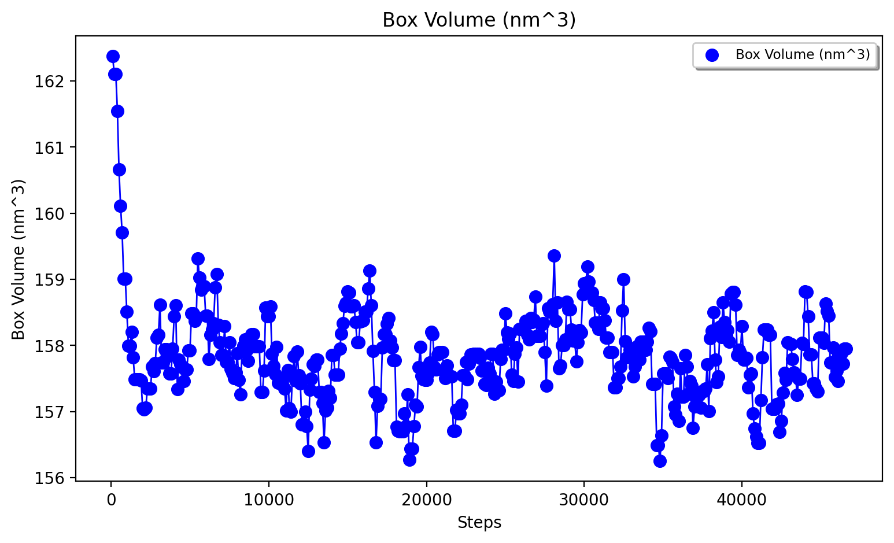
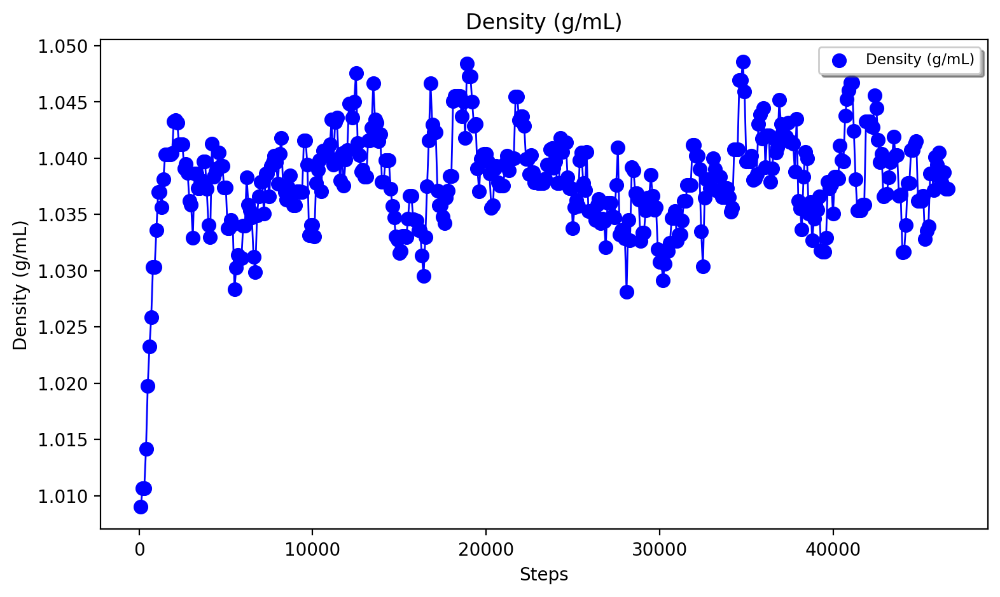
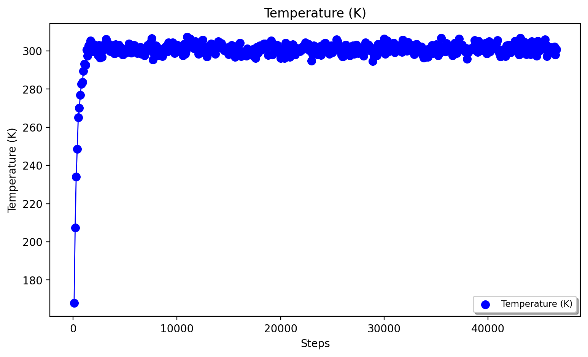
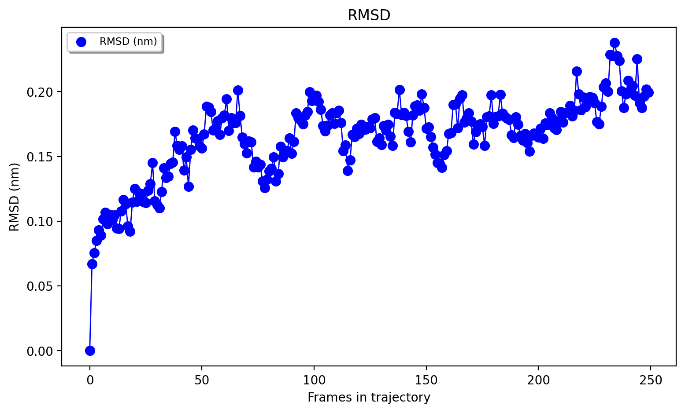
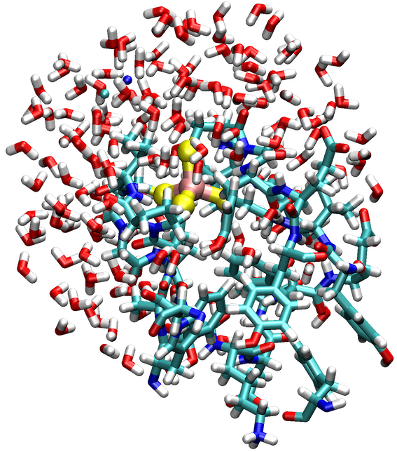

Metalloprotein tutorial I: Rubredoxin
======================================

How to set up an MM and QM/MM model from scratch using the ASH-OpenMM interface.

**Test system:** rubredoxin using CHARMM36 protein forcefield.

This tutorial shows how to set up a classical model of the rubredoxin metalloprotein in ASH using the CHARMM36 forcefield.
Rubredoxin is one of the simplest metalloproteins having only a single metal-ion (Fe), bound to the protein via 4 cysteine residues but that makes
the system a good first test system to demonstrate how to set up a relatively simple metalloprotein using the ASH-OpenMM interface with minimal modifications.

The files for this tutorial can be found in the ASH source code directory under $ASHDIR/examples/OpenMM_Modeller-setups/rubredoxin or 
`Github-repository <https://github.com/RagnarB83/ash/tree/master/examples/OpenMM_Modeller-setups/rubredoxin>`_

######################################################
**1. Use OpenMM_Modeller to set up the system**
######################################################

We will set up a model for rubredoxin based on the `2DSX PDB file <https://www.rcsb.org/structure/2DSX>`_, a 0.68 Å X-ray structure.
First we download the PDB-file and save it as 2dsx.pdb in our working directory.
If we inspect the file in a text editor we see at lot of crystallographic header information and beginning at line 275 we get the list of atom coordinates.
Note that typically only the lines beginning with ATOM or HETATM are parsed by ASH or OpenMM and header information can be safely deleted. 
The ANISOU line for each atom give anisotropic temperature factors, which will not be parsed either.

.. code-block:: text

    ATOM      1  N   MET A   1      -4.023 -14.590  -3.242  1.00 10.20           N
    ANISOU    1  N   MET A   1     1504     33   1339   -532    474   -365       N
    ATOM      2  CA  MET A   1      -2.749 -13.930  -3.045  1.00  8.61           C
    ANISOU    2  CA  MET A   1     1571    794    905   -365    151   -203       C
    ATOM      3  C   MET A   1      -2.934 -12.408  -2.948  1.00  9.14           C
    ANISOU    3  C   MET A   1     1918    845    710   -489    271   -169       C
    ATOM      4  O   MET A   1      -1.951 -11.665  -3.176  1.00 10.09           O
    ANISOU    4  O   MET A   1     1878    774   1182   -330    454   -142       O
    ATOM      5  CB  MET A   1      -1.819 -14.319  -4.216  1.00  9.28           C

As seen, the PDB-file does not contain information about hydrogen atom positions which of course needs to be fixed for the final model.
Next we create a simple naive ASH script (here called *1-modelsetup-bad1.py*) that looks like:

*1-modelsetup-bad1.py:*

.. code-block:: python

    from ash import *

    #Define pdbfile that points to the original raw PDB-file (typically without hydrogens and solvent)
    pdbfile="2dsx.pdb"

    # Setting up system via OpenMM_Modeller and requesting the CHARMM36 forcefield
    OpenMM_Modeller(pdbfile=pdbfile, forcefield='CHARMM36')

The script calls the **OpenMM_Modeller** function taking the PDB-file as input. See :doc:`OpenMM-interface` for details on all the options to **OpenMM_Modeller**.
**OpenMM_Modeller** will read the unmodified PDB-file and attempt to set up the system using the CHARMM36 protein forcefield.

-----------------------------------
1a. Multiple occupancy problems
-----------------------------------

The script will exit almost immediately with an error, however:

.. code-block:: text

    Now checking PDB-file for alternate locations, i.e. multiple occupancies:
    Found residues in PDB-file that have alternate location labels i.e. multiple occupancies:
    ...
    Chain A:
    VAL5
    GLU12
    PRO15
    PRO34
    LYS51

    These residues should be manually inspected and fixed in the PDB-file before continuing
    You should delete either the labelled A or B location of the residue-atom/atoms and then remove the A/B label from column 17 in the file
    Alternatively, you can choose use_higher_occupancy=True keyword in **OpenMM_Modeller** and ASH will keep the higher occupied form and go on
    Make sure that there is always an A or B form present.
    Exiting.
    ASH exiting with code: 1

This occurs due to the fact that the PDB-file contains alternate location lines for some atoms due to either low or multiple occupancies.
See https://pdb101.rcsb.org/learn/guide-to-understanding-pdb-data/dealing-with-coordinates (bottom of page) for more information on how this is reported in PDB files.
Inspection of the PDB-file for residue VAL5 as an example reveals:

.. code-block:: text

    ATOM     37  N   VAL A   5      -1.935  -3.345   2.189  1.00  5.74           N
    ANISOU   37  N   VAL A   5       35    503    642    -87   -132    -30       N
    ATOM     38  CA  VAL A   5      -0.944  -2.308   2.488  1.00  5.63           C
    ANISOU   38  CA  VAL A   5      999    549    593   -139    -43     -4       C
    ATOM     39  C   VAL A   5      -1.364  -1.610   3.790  1.00  4.80           C
    ANISOU   39  C   VAL A   5      820    435    567    -59    -80     20       C
    ATOM     40  O   VAL A   5      -2.514  -1.283   4.038  1.00  5.65           O
    ANISOU   40  O   VAL A   5      844    568    736    -35   -196     28       O
    ATOM     41  CB  VAL A   5      -0.826  -1.290   1.329  1.00  6.73           C
    ANISOU   41  CB  VAL A   5     1093    780    686   -161    -56     86       C
    ATOM     42  CG1AVAL A   5       0.273  -0.264   1.568  0.33  4.13           C
    ANISOU   42  CG1AVAL A   5      784    467    320   -227    -59    126       C
    ATOM     43  CG2AVAL A   5      -0.648  -1.978   0.026  0.33 11.27           C
    ANISOU   43  CG2AVAL A   5     3028    821    433   -825    -62     68       C
    ATOM     44  CG2BVAL A   5      -2.062  -0.597   0.943  0.33  6.91           C
    ANISOU   44  CG2BVAL A   5      975    880    772   -269   -320    421       C

Atom 42 has a low occupancy of only 0.33 and the atom has been labelled as CG1AVAL instead of "CG1 VAL".
Atom 43 and 44 correspond to alternate locations of the other carbon CG2.
This seems to be due to the isopropyl group of valine existing in multiple conformations in the crystal structure.
As suggested by the error message the solution is to modify manually the PDB-file here and make a conscious choice about which atoms to keep.
Visualization of the relevant residue-atoms with a program like VMD is recommended. 
For a residue like valine where the multiple conformations arise due to the free rotation of the sidechain the choice of which conformation is not critical.
If you have inspected the residue carefully and have concluded that the choice of which residue to pick is not critical you can also choose to use the 
option: use_higher_occupancy=True as a keyword argument to **OpenMM_Modeller**.
With this option active, ASH will keep the atom with the highest occupancy and delete the other.

-----------------------------------
1b. Unknown residue
-----------------------------------

If we continue using the use_higher_occupancy=True option:

*1-modelsetup-bad2.py:*

.. code-block:: python

    from ash import *

    #Define pdbfile that points to the original raw PDB-file (typically without hydrogens and solvent)
    pdbfile="2dsx.pdb"

    # Setting up system via OpenMM_Modeller and requesting the CHARMM36 forcefield
    OpenMM_Modeller(pdbfile=pdbfile, forcefield='CHARMM36', use_higher_occupancy=True)

we next come across another error:

.. code-block:: text

    Error: OpenMM modeller.addHydrogens signalled a ValueError
    This is a common error and suggests a problem in PDB-file or missing residue information in the forcefield.
    Non-standard inorganic/organic residues require providing an additional XML-file via extraxmlfile= option
    Note that C-terminii require the dangling O-atom to be named OXT
    Read the ASH documentation or the OpenMM documentation on dealing with this problem.

    Full error message from OpenMM:
    No template found for residue 53 (FE).  This might mean your input topology is missing some atoms or bonds, 
    or possibly that you are using the wrong force field.

    ASH exiting with code: 1

The relevant line in the PDB-file is:

.. code-block:: text

    HETATM  401 FE    FE A 501       2.866  -0.198   9.125  1.00  4.06          FE

The line indicates that atom 401 has the atomname: FE, residuename: FE, chain: A, resid: 501, followed by xyz coordinates: 2.866  -0.198   9.125), 
occupancy: 1.00, thermal factor: 4.06 and element name: FE

To fix this problem we need to extend our forcefield (currently CHARMM36, covering only protein residues and solvent) and make a residue definition for the Fe ion 
so that it matches the information in the PDB-file.

Let's create an OpenMM forcefield XML file that looks like:

*specialresidue.xml:*

.. code-block:: xml

    <ForceField>
    <AtomTypes>
    <Type name="FEX" class="Fe" element="Fe" mass="55.84700"/>
    </AtomTypes>
    <Residues>
    <Residue name="FE">
    <Atom name="FE" type="FEX"/>
    </Residue>
    </Residues>
    <NonbondedForce coulomb14scale="1.0" lj14scale="1.0">
    <Atom type="FEX" charge="3.0" sigma="1.0" epsilon="0.0"/>
    </NonbondedForce>
    <LennardJonesForce lj14scale="1.0">
    <Atom type="FEX" sigma="0.194215920554594" epsilon="1.046"/>
    </LennardJonesForce>
    </ForceField>

This OpenMM XML file defines a forcefield associated with the Fe residue. A list of atomtypes needs to be defined (here only a single atomtype, FEX, is needed). 
Note that an atomtype can be applied to many atoms in a residue or many residues while an atomname is unique within a residue.
Then the extra residue needs to be defined (named "FE"). Next we define an atom name ("FE") that points to the atom type ("FEX").
Finally, we need to define nonbonded parameters associated with the residue and the single atom (here an Fe3+ ion is defined). 
While we could ignore the LJ parameters for Fe, since this Fe is a fully coordinated metal ion (other residue-atoms unlikely to come close), 
in practice it is usually better to put some simple Lennard-Jones parameters on the ion to prevent artifical behaviour such as a water molecule attempting to bind to the +3 pointcharge. 
Here we use available parameters for the Zn(II) ion from the CHARMM forcefield which should be a fine approximation.

.. note:: The OpenMM XML file format to define forcefield parameters is documented in the `OpenMM documentation: Creating Force Fields <http://docs.openmm.org/7.6.0/userguide/application/05_creating_ffs.html>`_
    For the LJ parameters sigma is in units of nm and epsilon in units kJ/mol.

Note that in this case we need to define both NonbondedForce and LennardJonesForce in order to be consistent with the CHARMM36 forcefield as defined within OpenMM.
In the NonbondedForce block sigma/epsilon are set to dummy parameters 1.0 and 0.0 while the actual parameters are defined in the LennardJonesForce block instead.
The form of the XML file will be different if using another forcefield than CHARMM.

Now that we have created an XML-file (*specialresidue.xml*) associated with the Fe ion residue that OpenMM complained about, we can try to call **OpenMM_Modeller** again, this time telling **OpenMM_Modeller** about the extra forcefield file.

.. warning:: For OpenMM to correctly map the information from the specialresidue.xml onto the PDB-file topology, it is important that the PDB-file contains an element definition (column 77-78) for
    each element of the special residue.

-----------------------------------
1c. Protonation states
-----------------------------------

*1-modelsetup-bad3.py:*

.. code-block:: python

    from ash import *

    #Define pdbfile that points to the original raw PDB-file (typically without hydrogens and solvent)
    pdbfile="2dsx.pdb"

    #XML-file to deal with cofactor
    extraxmlfile="./specialresidue.xml"

    # Setting up system via OpenMM_Modeller and requesting the CHARMM36 forcefield
    OpenMM_Modeller(pdbfile=pdbfile, forcefield='CHARMM36', use_higher_occupancy=True, extraxmlfile=extraxmlfile)

While this script runs to completion in just a few seconds, we are not quite ready. The Fe ion is now defined in the combined forcefield, however, OpenMM does not know that the Fe ion is actually chemically bonded to 4 deprotonated cysteine
residues of the protein. Those 4 cysteine residues are Cys6, Cys9, Cys39 and Cys42.

Cysteine residues are by default assumed to have a protonated sidechain and we can see on the figure on the left that OpenMM added H-atoms to each thiol group of the cysteine sidechain.
This is obviously not what we want for our Fe ion that should be coordinated to 4 deprotonated cysteines (right figure)

In order to let **OpenMM_Modeller** know that we do not want those cysteine sidechains protonated we need to define 
the residue_variants keyword argument.
The residue_variants value needs to be a dictionary of dictionaries that points to alternative residuenames for residues with 
other protonation states in each chain (identified by chainname)
Here we tell **OpenMM_Modeller** that these 4 cysteine residues should be CYX residues (deprotonated CYS).

*1-modelsetup_simple.py:*

.. code-block:: python

    from ash import *

    #Original raw PDB-file (no hydrogens, nosolvent)
    pdbfile="2dsx.pdb"

    #XML-file to deal with cofactor
    extraxmlfile="./specialresidue.xml"

    #Setting some manual protonation states.
    #Here defining residues in chain A with resid values: 6,9,39,42 to be deprotonated cysteines (CYX). 
    #NOTE: Here the actual resid values in the PDB-file are used (ASH's 0-based indexing does not apply)
    residue_variants={'A':{6:'CYX',9:'CYX',39:'CYX',42:'CYX'}}

    # Setting up system via Modeller
    OpenMM_Modeller(pdbfile=pdbfile, forcefield='CHARMM36',
        extraxmlfile=extraxmlfile, residue_variants=residue_variants, use_higher_occupancy=True)

**OpenMM_Modeller** prints a table with to-be-modified residues indicated, that confirms that we have selected the correct residues (though best to visually confirm):

.. code-block:: text

    User defined residue variants per chain:
    Chain A : {6: 'CYX', 9: 'CYX', 39: 'CYX', 42: 'CYX'}

    MODELLER TOPOLOGY - RESIDUES TABLE

    ASH-resid   Resname      Chain-index  Chain-name   ResID-in-chain       User-modification
    ----------------------------------------------------------------------------------------------------
    0           MET          0            A            1
    1           ASP          0            A            2
    2           ILE          0            A            3
    3           TYR          0            A            4
    4           VAL          0            A            5
    5           CYS          0            A            6                   -- This residue will be changed to: CYX --
    6           THR          0            A            7
    7           VAL          0            A            8
    8           CYS          0            A            9                   -- This residue will be changed to: CYX --
    9           GLY          0            A            10
    10          TYR          0            A            11
    11          GLU          0            A            12
    ...

Valid alternative residue names for alternative protonation states of titratable residues:

- LYN instead of LYS: deprotonated lysine residue (NH2 instead of NH3)
- CYX instead of CYS: deprotonated cysteine residue (S- instead of SH)
- ASH instead of ASP: protonated aspartate residue (COOH instead of COO-)
- GLH instead of GLU: protonated glutamate residue (COOH instead of COO-)
- HID instead of HIS: histidine protonated at delta nitrogen
- HIE instead of HIS: histidine protonated at epsilon nitrogen

.. note:: These names can not be used in the PDB-file. Only use in the residue_variants dictionary that you provide to **OpenMM_Modeller**.

-----------------------------------
1d. Final setup
-----------------------------------

Script *1-modelsetup_simple.py* is the final version of the setup script that will setup a more-or-less acceptable model for solvated rubredoxin.
When **OpenMM_Modeller** runs through the whole protocol without errors, it will print out the the following output in the end:

.. code-block:: text

    Files written to disk:
    system_afterfixes.pdb
    system_afterfixes2.pdb
    system_afterH.pdb
    system_aftersolvent.pdb
    system_afterions.pdb and finalsystem.pdb (same)

    Final files:
    finalsystem.pdb  (PDB file)
    finalsystem.ygg  (ASH fragment file)
    finalsystem.xyz   (XYZ coordinate file)
    system_full.xml   (System XML file)

    OpenMM_Modeller done! System has been fully set up

    To use this system setup to define a future OpenMMTheory object for this system you can either do:

    1. Use full system XML-file:
    omm = OpenMMTheory(xmlsystemfile="system_full.xml", pdbfile="finalsystem.pdb", periodic=True)

    1. Define using separate forcefield XML files:
    omm = OpenMMTheory(xmlfiles=["charmm36.xml", "charmm36/water.xml", "./specialresidue.xml"], pdbfile="finalsystem.pdb", periodic=True)

**OpenMM_Modeller** has here executed a multi-step protocol that fixes problems in the PDB-file, corrects for missing atoms, intelligently added H-atoms according to topology and takes pH into account for titratable residues (default pH=7.0) 
and finally added a solvent box around the protein as well as ions according to a desired ion strength (here 0.1).
PDB-files are created for each step and can be inspected.

Figure above shows a visualization of the PDB after basic fixes (missing heavy atoms added) at the top left, after adding all hydrogen atoms (top right), after adding a solvent box (bottom left) and after adding ions (bottom right).

.. note:: Even though **OpenMM_Modeller** exits successfully without errors you should be highly 
    critical of the final results and visual inspection of the final system PDB-file should always be a requirement. 
    Pay special attention to the environment around unusual residues and inspect the protonation states of titratable residues, 
    e.g. by analyzing hydrogen bonding networks.
    Histidine protonation states are especially important (and C/N assignments may even be wrong in the X-ray structure).

Another version of the script below shows how additional options can be used to control the size of the solvation box (solvent_padding), choose watermodel, 
control protonation state of titratable residues according to pH value, change ionic strength, positive and negative iontypes to add etc.

*1-modelsetup_advanced.py:*

.. code-block:: python

    from ash import *

    #Original raw PDB-file (no hydrogens, nosolvent)
    pdbfile="2dsx.pdb"

    #XML-file to deal with cofactor
    extraxmlfile="./specialresidue.xml"

    #Setting some manual protonation states.
    #Here defining residues in chain A with resid values: 6,9,39,42 to belsetup_sime deprotonated cysteines (CYX). 
    #NOTE: Here the actual resid values in the PDB-file are used (ASH's 0-based indexing does not apply)
    residue_variants={'A':{6:'CYX',9:'CYX',39:'CYX',42:'CYX'}}

    # Setting up system via Modeller
    OpenMM_Modeller(pdbfile=pdbfile, forcefield='CHARMM36',
        extraxmlfile=extraxmlfile, watermodel="tip3p", pH=7.0, solvent_padding=10.0,
        ionicstrength=0.1, pos_iontype='Na+', neg_iontype='Cl-', residue_variants=residue_variants, use_higher_occupancy=True)

###############################################################
**2a. Minimize system and run a classical MD simulation**
###############################################################

Once **OpenMM_Modeller** has finished setting up the system we need to do some basic classical simulations to make sure 
the system is stable before attemping future QM/MM geometry optimizations or QM/MM MD. While **OpenMM_Modeller** returns a valid OpenMMTheory ASH object that could be used 
as input in the next steps, it is more
convenient to separate the **OpenMM_Modeller** setup in one script and simulations in another script. It is also required in this case as we
need to be able define bond-constraints for the metal ion in the OpenMMTheory definition. 

To create an OpenMMTheory object in a new script from the **OpenMM_Modeller** setup we can read in a list of forcefield XML files that were used in the original setup together with the PDB-file:

.. code-block:: python

    #Creating new OpenMM object by specifying the general CHARMM36 XML files and the special residue file
    omm = OpenMMTheory(xmlfiles=["charmm36.xml", "charmm36/water.xml", "./specialresidue.xml"], pdbfile="finalsystem.pdb", periodic=True,
                numcores=numcores, autoconstraints='HBonds', constraints=bondconstraints, rigidwater=True)

The charmm36.xml and charmm36/water.xml files should be found automatically in the OpenMM library while the specialresidue.xml file needs to be present in the directory.

Alternatively, we can also read in the XML-file that **OpenMM_Modeller** created for the full system ("system_full.xml") together with 
the PDB-file ("finalsystem.pdb") using the xmlsystemfile= option to OpenMMTheory:

.. code-block:: python

    #Creating new OpenMM object from OpenMM full system file
    omm = OpenMMTheory(xmlsystemfile="system_full.xml", pdbfile="finalsystem.pdb", periodic=True, numcores=numcores,
                        autoconstraints='HBonds', constraints=bondconstraints, rigidwater=True)

.. warning:: The xmlsystemfile="system_full.xml" option has the disadvantage that all constraints of the system have been hardcoded into the XML file and can not be changed later.
    This it not a good option for future QM/MM optimizations since these constraints are not compatible with QM/MM optimization runs (using geomeTRIC).

.. note:: pdbfile=  input in OpenMMTheory is used to define the topology and needs to match the assumed topology in the XML-files. 
    The PDB-coordinates are generally not used by OpenMMTheory (though they may be used to define user constraints).

To show how we can run classical simulations of our rubredoxin setup consider the script below. It should run in less than 3-5 minutes on a decent CPU or GPU.

.. note:: If you have access to a GPU on your laptop or your HPC-cluster it will be much more effient to set platform='OpenCL' (or platform='CUDA' for Nvidia cards)
    inside OpenMMTheory (default platform is 'CPU'). This will make OpenMM use the GPU instead of the CPU which will speed things up considerably.

*2a-classicalMD.py:*

.. code-block:: python

    from ash import *

    numcores=4

    #Defining list of lists of bond-constraints.  
    #WARNING: ASH counts atom indices from 0.
    bondconstraints=[[755,96],[755,136],[755,567],[755,607]]

    #Defining fragment containing coordinates (can be read from XYZ-file, ASH fragment or PDB-file)
    fragment=Fragment(pdbfile="finalsystem.pdb")

    #Creating new OpenMM object from OpenMM full system file
    omm = OpenMMTheory(xmlfiles=["charmm36.xml", "charmm36/water.xml", "specialresidue.xml"], pdbfile="finalsystem.pdb", periodic=True,
                platform='CPU', numcores=numcores, autoconstraints='HBonds', constraints=bondconstraints, rigidwater=True)

    #MM minimization for 100 steps
    OpenMM_Opt(fragment=fragment, theory=omm, maxiter=100, tolerance=1)

    #Gentle warmup MD (3 MD simulations: 10/50/200 steps with timesteps 0.5/1/1 fs at 1 K/10K/300K)
    Gentle_warm_up_MD(fragment=fragment, theory=omm, time_steps=[0.0005,0.001,0.001],
                    steps=[10,50,200], temperatures=[1,10,300])

    #Classical NVT MD simulation for 5 ps at 300 K
    OpenMM_MD(fragment=fragment, theory=omm, timestep=0.001, simulation_time=5, traj_frequency=10, temperature=300,
        integrator='LangevinMiddleIntegrator', coupling_frequency=1, trajectory_file_option='DCD')

    #Re-image trajectory so that protein is in middle
    MDtraj_imagetraj("trajectory.dcd", "trajectory_lastframe.pdb", format='DCD')

.. note:: All optimizers and MD-simulators in ASH that take an ASH fragment as input will upon completion, update the coordinates of that ASH fragment
    with the coordinates of the last step.

This script defines an ASH fragment from the final PDB-file created by **OpenMM_Modeller**. It then defines an OpenMM_Theory object using the 
full system XML file (and PDB topology). In addition to basic automatic X-H bondconstraints and rigid-water constraints we also have to
add constraints associated with the Fe-S cysteine bonds as our simple forcefield does not define bonded parameters associated with the Fe-Cysteine interaction.
The bond constraints are easily defined as a list of lists using the atom indices of the Fe (755) and the sulfurs (96,136,567,607). Note that ASH counts from 0.
Alternatively, we could also have added harmonic bond restraints instead of rigid constraints.

We next provide the ASH fragment and the OpenMMTheory as input to the OpenMM_Opt minimizer and run a minimization of 100 steps.
For a large MM system it is typically not needed to minimize the whole system until convergence (and can in fact be very hard to accomplish).
Here we simply minimize for 100 steps in order to remove the largest starting forces from the system (due to the addition of H-atoms, solvent, ions etc.) before we
go on to perform an MM simulation. There are cases where OpenMM_Opt fails to reduce these forces (and can even crash) sufficiently.
We can also use Gentle_warm_up_MD (see :doc:`OpenMM-interface`) to gently warm up the system starting from a very low temperature.

Next we perform an MM MD simulation using OpenMM_MD. Here we do a very short MD simulation for 5 picoseconds using a timestep 
of 0.001 ps (1 fs) at 300 K. We use a Langevin integrator that also acts as thermostat and we will thus sample the NVT ensemble.

The trajectory can be visualized using VMD:

.. code-block:: shell

    vmd trajectory_lastframe.pdb trajectory.dcd

.. raw:: html

    

    <video width="320" height="240" controls>
    <source src="_static/rubredoxin-weirdbox-720p.mov" type="video/mp4">
    </video>
    

The trajectory or the PDB-file associated with the last snapshot (trajectory_lastframe.pdb) may appear quite odd as seen above with the protein
being partially outside the box and centered on one of the box corners (and then jumping between corners). It is important to realize that there is 
nothing wrong with the simulation, it's only a visualization oddity due to the periodic boundary conditions enforced during the simulation (and OpenMM's choice of image representation). 
If one inspects neighbouring boxes in VMD (Periodic tab in the Graphical Representations window) one can see that each protein is fully solvated 
if surrounding boxes are visualized.

However, it is also possible to reimage the trajectory so that the protein appears more pleasingly in the center of the box as shown below (or last line in the script above)

.. code-block:: python

    MDtraj_imagetraj("trajectory.dcd", "trajectory_lastframe.pdb", format='DCD')

The reimaged trajectory, "trajectory_imaged.dcd",  will look like this:

.. raw:: html

    

    <video width="320" height="240" controls>
    <source src="_static/rubredoxin-reimaged-720p.mov" type="video/mp4">
    </video>
    

###########################################################################
**2b. Run through an advanced NPT equilibration + long NVT simulation**
###########################################################################

Step 2a above only ran a very short 5 ps MD simulation and only served to demonstrate the basic principles in a short runtime.
5 ps is much too short of a simulation time to properly equilibrate a solvated protein system.
Here we will instead run through a longer multistep simulation protocol that will make sure the system is equilibrated.
We will use a 4fs timestep which is relatively large (a longer timestep allows longer simulation times but can lead to instabilities if poorly chosen). 
Classical MD simulations in OpenMM with the LangevinMiddleIntegrator and appropriate constraints (autoconstraints='HBonds', rigidwater=True, default hydrogenmass scaling of 1.5)
can typically use such large timesteps without problems.

We will use the original files from **OpenMM_Modeller**, redo the 100-step minimization but then request a long NPT simulation (using the OpenMM_box_equilibration function)
that uses both a barostat that changes the box dimensions (to keep pressure constant) until the volume and density of the system reaches convergence.
Once the simulation is found to be converged, the last snapshot together with the converged box vectors are used to start a long 1 ns NVT simulation.

*2b-classicalMD.py:*

.. code-block:: python

    from ash import *

    numcores=4

    #Defining list of lists of bond-constraints.  
    #WARNING: ASH counts atom indices from 0.
    bondconstraints=[[755,96],[755,136],[755,567],[755,607]]

    #Defining fragment containing coordinates (can be read from XYZ-file, ASH fragment or PDB-file)
    fragment=Fragment(pdbfile="finalsystem.pdb")

    #Creating new OpenMM object from OpenMM full system file
    omm = OpenMMTheory(xmlfiles=["charmm36.xml", "charmm36/water.xml", "specialresidue.xml"], pdbfile="finalsystem.pdb", periodic=True,
                numcores=numcores, autoconstraints='HBonds', constraints=bondconstraints, rigidwater=True)

    #MM minimization for 100 steps
    OpenMM_Opt(fragment=fragment, theory=omm, maxiter=100, tolerance=1)

    #Gentle warmup MD (3 MD simulations: 10/50/200 steps with timesteps 0.5/1/4 fs at 1 K/10K/300K)
    Gentle_warm_up_MD(fragment=fragment, theory=omm, time_steps=[0.0005,0.001,0.004],
                    steps=[10,50,200], temperatures=[1,10,300])

    #NPT simulation until density and volume converges
    OpenMM_box_equilibration(fragment=fragment, theory=omm, datafilename="nptsim.csv", numsteps_per_NPT=10000,
                          volume_threshold=1.0, density_threshold=0.001, temperature=300, timestep=0.004,
                          traj_frequency=100, trajfilename='relaxbox_NPT', trajectory_file_option='DCD', coupling_frequency=1)

    #NVT MD simulation for 1000 ps = 1 ns. Here using trajfilename to name the trajectory file and last-frame PDB-file
    OpenMM_MD(fragment=fragment, theory=omm, timestep=0.004, simulation_time=1000, traj_frequency=1000, temperature=300,
        integrator='LangevinMiddleIntegrator', coupling_frequency=1, trajfilename='NVTtrajectory',trajectory_file_option='DCD',
        datafilename="nvtsim.csv")

    #Re-image trajectory so that protein is in middle
    MDtraj_imagetraj("NVTtrajectory.dcd", "NVTtrajectory_lastframe.pdb", format='DCD')

The NPT trajectory (from the **OpenMM_box_equilibration** call) and the NVT trajectory (from the regular **OpenMM_MD** call) can be analyzed.
The datafile nptsim.csv contains temperature, kinetic energy, potential energy, Box volume and density.
Note that to get a data-file from the **OpenMM_MD** call (here nvtsim.csv) the keyword argument "datafilename" should be present in the **OpenMM_MD** function above.

A convenient script to plot temperature, density and box-volume as a function of step size for the NPT simulation is provided in the scripts directory:

.. code-block:: text

    #Plot temperature, box volume and density from the NPT-simulation data (nptsim.csv)
    python3 ASH-code/scripts/plot_md_data.py nptsim.csv
    #Plot temperature from the NVT simulation (nvtsim.csv)
    python3 ASH-code/scripts/plot_md_data.py nvtsim.csv

More analysis of the MD trajectory is beyond the scope of this tutorial and typically requires dedicated trajectory-analysis tools not directly implemented in ASH.
The `mdtraj <https://www.mdtraj.org>`_ library  (used above to reimage trajectory) is, however, a very powerful tool for 
performing all sorts of MD-trajectory analysis and is best used on its own.

A simple script utilizing mdtraj to calculate the protein heavy-atom RMSD of the NVT trajectory can be found in the scripts directory of the ASH-code and can be called like this:

.. code-block:: text

    python3 ~/PROGRAMS/ASH-PROGRAM/ash/scripts/plot_rmsd_via_mdtraj.py NVTtrajectory_imaged.dcd NVTtrajectory_lastframe_imaged.pdb

That script can be adapted for plotting various other quantities of interest (if implemented in mdtraj).

###########################################################################
**3. Run semi-empirical GFN-xTB QM/MM MD simulation**
###########################################################################

Once we have performed an acceptable classical simulation (with the Fe-S bonds of the metal site constrained) and demonstrated that the system is stable 
we can move on to QM/MM calculations that allow a more realistic description of the metal site and allows us to remove artificial constraints associated 
with the Fe-S bonds (we constrained them because we did not have bonded MM parameters available).

Typical QM/MM calculations involve geometry optimizations (see :doc:`Geometry-optimization`) of a system-subset : see step 4 below.
But here, due to the small cofactor involved and the availability of a decent cheap semi-empirical method (GFN-XTB) that can handle transition metals we can perform
GFN-xTB/CHARMM36 QM/MM MD simulations for a few picoseconds and explore the dynamic nature of the metal site properly (the accuracy of such a simulations depends 
of course on how well the semi-empirical method handles the system).

Use of xTB requires xtb to be downloaded and the xtb binary needs to be available in your PATH environment variable. See 
`xtb-documentation <https://xtb-docs.readthedocs.io>`_

.. note:: Note that during the MD simulation, OpenMM will run with periodic boundary conditions active while the QM-theory (here xTB) does not know about
    the periodic boundary conditions and will calculate a non-periodic box instead. This is an approximation but should be fairly reliable.

Below we define a minimal QM-region for the Fe site in rubredoxin, truncating the cysteine residues as SCH2 groups. These groups are capped with hydrogen linkatoms during the QM calculation steps.
See :doc:`QM-MM-boundary_tutorial` for more information on how to define a good QM/MM boundary for a system (rubredoxin as an example).

*3-QMMM_MD.py:*

.. code-block:: python

    from ash import *

    #Define number of cores variable
    numcores=4

    #Fe(SCH2)4 indices (inspect system_aftersolvent.pdb file to get indices)
    qmatoms=[93,94,95,96,133,134,135,136,564,565,566,567,604,605,606,607,755]

    #Defining fragment containing coordinates (can be read from XYZ-file, ASH fragment, PDB-file)
    lastpdbfile="trajectory_lastframe.pdb"
    fragment=Fragment(pdbfile=lastpdbfile)

    #Creating new OpenMM object from OpenMM full system file
    omm = OpenMMTheory(xmlfiles=["charmm36.xml", "charmm36/water.xml", "specialresidue.xml"], pdbfile=lastpdbfile, periodic=True,
                numcores=numcores, autoconstraints='HBonds', constraints=bondconstraints, rigidwater=True)

    #QM theory: GFN1-xTB. Note that the xtb program needs to be installed
    xtb = xTBTheory(xtbmethod="GFN1", numcores=numcores)
    #QM/MM theory
    qmmm = QMMMTheory(qm_theory=xtb, mm_theory=omm, fragment=fragment,
            embedding="Elstat", qmatoms=qmatoms, printlevel=1)

    #QM/MM MD simulation for 10 ps. More conservative timestep
    OpenMM_MD(fragment=fragment, theory=qmmm, timestep=0.001, simulation_time=10, traj_frequency=50, temperature=300,
        integrator='LangevinMiddleIntegrator', trajfilename="QM_MM", coupling_frequency=1, charge=-1, mult=6)

The QM/MM MD trajectory can be visualized using e.g VMD. 

Finally, note that we are of course not limited to semi-empirical methods for QM/MM MD.
The xTBTheory we used as QM theory can be replaced by any QM-theory implemented in ASH that supports QM/MM, including ORCATheory, allowing for a regular DFT method as QM-method instead.
This, however, will mean that each QM energy+gradient step will take much longer, meaning only shorter timescales can be reached.

####################################################################################
**4. Run QM/MM geometry optimizations at the DFT-level using ORCA as QM theory**
####################################################################################

QM/MM geometry optimizations are the most typical way of running QM/MM calculations of a protein active site.
One defines a QM-region that can be chosen to be as large as one can afford and an active region that can be considerably larger (typically consisting of all QM atoms and many surrounding MM atoms, usually around 1000 atoms).
The QM-theory can then be chosen to be any QM-method within a QM-theory interface available in ASH. Note that you most certainly want the QM-method to have an analytic gradient available 
(usually the case for most DFT, HF and MP2 methods but rarer for e.g. WFT methods like CCSD(T)).

We will here run QM/MM geometry optimization using the ORCATheory interface and will choose the DFT-composite method r2SCAN-3c as our QM-level.
We will first choose a small active region that consists only of the QM-region (17 atoms + 4 linkatoms). This means that we don't have to worry too much about what happens at the MM-level since the whole MM-region is frozen and will interact
with the QM-region via electrostatic embedding (MM pointcharges polarizing the QM electron density), short-range Lennard-Jones interactions (MM atoms interacting with QM atoms via the Lennard-Jones parameters defined in the forcefield) as well 
as via the bonded terms occurring at the QM and MM boundary. 

See :doc:`QM-MM-boundary_tutorial` for more information on how to define a good QM/MM boundary for a system (rubredoxin as an example).

See :doc:`Geometry-optimization` for information on the Optimizer function.

*4-QMMM_Opt_smallact.py:*

.. code-block:: python

    from ash import *

    #Define number of cores variable
    numcores=4

    #Fe(SCH2)4 indices (inspect system_aftersolvent.pdb file to get indices)
    qmatoms=[93,94,95,96,133,134,135,136,564,565,566,567,604,605,606,607,755]

    #Defining fragment containing coordinates (can be read from XYZ-file, ASH fragment, PDB-file)
    lastpdbfile="trajectory_lastframe_imaged.pdb"
    fragment=Fragment(pdbfile=lastpdbfile)

    #Creating new OpenMM object from OpenMM XML files (built-in CHARMM36 and a user-defined one)
    omm = OpenMMTheory(xmlfiles=["charmm36.xml", "charmm36/water.xml", "./specialresidue.xml"], pdbfile=lastpdbfile, periodic=True,
                platform='CPU', numcores=numcores, autoconstraints=None, rigidwater=False)

    #QM theory: r2SCAN-3c DFT-composite method using ORCA
    orca = ORCATheory(orcasimpleinput="! r2SCAN-3c tightscf", numcores=numcores)
    #QM/MM theory
    qmmm = QMMMTheory(qm_theory=orca, mm_theory=omm, fragment=fragment,
            embedding="Elstat", qmatoms=qmatoms, printlevel=1)

    # QM/MM geometry optimization
    #Defining active region as QM-region
    actatoms=qmatoms
    Optimizer(fragment=fragment, theory=qmmm, ActiveRegion=True, actatoms=actatoms, maxiter=200,
        charge=-1, mult=6)

This optimization should converge in about 13 optimization steps.
geomeTRICOptimizer writes out 2 trajectory files that can be visualized: geometric_OPTtraj.xyz (active-region only) geometric_OPTtraj_Full.xyz (full system) using e.g VMD:
See :doc:`Geometry-optimization`

.. code-block:: text

    vmd geometric_OPTtraj.xyz  # visualize trajectory with active region 
    vmd geometric_OPTtraj_Full.xyz # visualize full trajectory
    vmd trajectory_lastframe_imaged.pdb geometric_OPTtraj_Full.xyz # visualize trajectory with topology information available

.. raw:: html

    

    <video width="320" height="240" controls>
    <source src="_static/rubredoxin-opt-traj-smallactonly720p.mov" type="video/mp4">
    </video>
    <video width="320" height="240" controls>
    <source src="_static/rubredoxin-opt-traj-smallact-full720p.mov" type="video/mp4">
    </video>
    

.. note:: Unlike the active-region trajectory above that shows only the QM atoms, if you inspect the ORCA inputfile created by ASH  (orca.inp by default) you will notice that the QM-coordinates provided by ASH to ORCA contain 4 extra hydrogen atoms on each carbon atom.
    These are link atoms that turn each methylene group in the QM-region into a methyl group in order to maintain a simple closed-shell electronic structure.
    The forces acting on the linkatoms are projected onto the MM atoms by ASH automatically.

While our QM/MM geometry optimization with this small active region can be an acceptable first approximation, a more realistic calculation that accounts for protein environment flexibility
is to allow a larger active region. We will here choose a large active region of ~ 1000 atoms, surrounding the metal-site. Note that while an even larger active region is of course possible,
really large active regions create minimization problems as well MM local minima problems occurring in QM/MM reaction profile studies. In order to conveniently choose the active region we can 
create a little temporary script (here called define_activeregion.py) that calls the actregiondefine function and defines a list of
atom indices of whole residues that are 12 Å away from the origin atom (here the Fe ion).

*define_activeregion.py:*

.. code-block:: python

    from ash import *

    #Defining fragment containing coordinates (can be read from XYZ-file, ASH fragment, PDB-file)
    lastpdbfile="trajectory_lastframe_imaged.pdb"
    fragment=Fragment(pdbfile=lastpdbfile)

    #Creating new OpenMM object from OpenMM XML files (built-in CHARMM36 and a user-defined one)
    omm = OpenMMTheory(xmlfiles=["charmm36.xml", "charmm36/water.xml", "./specialresidue.xml"], pdbfile=lastpdbfile, periodic=True,
                platform='CPU',  autoconstraints=None, rigidwater=False)

    #Defining active region as within X Å from originatom 755 (Fe)
    actregiondefine(mmtheory=omm, fragment=fragment, radius=12, originatom=755)

The script will create the following output:

.. code-block:: text

                      ###########################
                      #                         #
                    #     ActregionDefine     #
                      #                         #
                      ###########################

    Radius: 12
    Origin atom: 755 (Fe)
    Will find all atoms within 12 Å from atom: 755 (Fe)
    Will select all whole residues within region and export list
    Wrote list to file: active_atoms
    Active region size: 908
    Active-region indices written to file: active_atoms
    The active_atoms list  can be read-into Python script like this:	 actatoms = read_intlist_from_file("active_atoms")
    Wrote Active region XYZfile: ActiveRegion.xyz  (inspect with visualization program)

This active_atoms file just contains a list of atom indices indicating which atoms should be active (all others are frozen).
The file can be manually modified if required. The ActiveRegion.xyz file can be visualized to make sure that the active-region looks reasonable.
The active region does not have to be completely spherical and the ~1000 atom size is mostly a guideline.

.. warning:: While it might be tempting to call the actregiondefine function directly within your regular ASH QM/MM optimization script, this is typically 
    not a good idea as the active region is then redefined for each set of new system coordinates. It's possible that the active region might slightly change in subsequent jobs due to e.g. water molecules being randomly in 
    or out out of the sphere-radius when the function is run. This will result in an inconsistent energy surface. Instead: run the actregion definition script only once to define the active-atoms 
    list and use for all subsequent jobs.

While we do not need to apply constraints to the X-H bonds of the protein in an optimization (as is typically done in MD simulations to allow longer timesteps) we do have to make sure that the water molecules remain
rigid as they should be according to the model definition (applies to standard water forcefields like TIP3, TIP4P, SPC). Since we use the geomeTRICOptimizer here, this information
needs to be provided using the constraints keyword argument.
We use this simple code below to define a constraints dictionary that can then be passed onto the geomeTRICOptimizer.

.. code-block:: python

    actatoms = read_intlist_from_file("active_atoms")
    #Defining water constraints for atoms in the active region
    waterconlist = getwaterconstraintslist(openmmtheoryobject=omm, atomlist=actatoms, watermodel='tip3p')
    waterconstraints = {'bond': waterconlist}

Now we are ready to perform our QM/MM geometry optimization using our large active region of 908 atoms:
While the cost of each optimization cycle should remain  the same (the QM-region and QM theory level is the same as before), because 908 atoms are active instead
of 17 atoms, the minimization problem is tougher and we should expect many more optimization cycles to take place.
The number of optimization cycles may be especially large since we are minimizing from an MD simulation snapshot rather than a previously optimized structure.

*4-QMMM_Opt_bigact.py:*

.. code-block:: python

    from ash import *

    #Define number of cores variable
    numcores=4

    #Fe(SCH2)4 indices (inspect system_aftersolvent.pdb file to get indices)
    qmatoms=[93,94,95,96,133,134,135,136,564,565,566,567,604,605,606,607,755]

    #Defining fragment containing coordinates (can be read from XYZ-file, ASH fragment, PDB-file)
    lastpdbfile="trajectory_lastframe_imaged.pdb"
    fragment=Fragment(pdbfile=lastpdbfile)

    #Creating new OpenMM object from OpenMM XML files (built-in CHARMM36 and a user-defined one)
    omm = OpenMMTheory(xmlfiles=["charmm36.xml", "charmm36/water.xml", "./specialresidue.xml"], pdbfile=lastpdbfile, periodic=True,
                platform='CPU', numcores=numcores, autoconstraints=None, rigidwater=False)

    #QM theory
    orca = ORCATheory(orcasimpleinput="! r2SCAN-3c tightscf", numcores=numcores)
    #QM/MM theory
    qmmm = QMMMTheory(qm_theory=orca, mm_theory=omm, fragment=fragment,
            embedding="Elstat", qmatoms=qmatoms, printlevel=1)

    # QM/MM geometry optimization

    #Define active-region by reading from active_atoms file
    actatoms = read_intlist_from_file("active_atoms")

    #Defining water constraints for atoms in the active region
    waterconlist = getwaterconstraintslist(openmmtheoryobject=omm, atomlist=actatoms, watermodel='tip3p')
    waterconstraints = {'bond': waterconlist}

    #Calling geomeTRICOptimizer with defined constraints
    geomeTRICOptimizer(fragment=fragment, theory=qmmm, ActiveRegion=True, actatoms=actatoms, maxiter=200, constraints=waterconstraints,
        charge=-1, mult=6)

