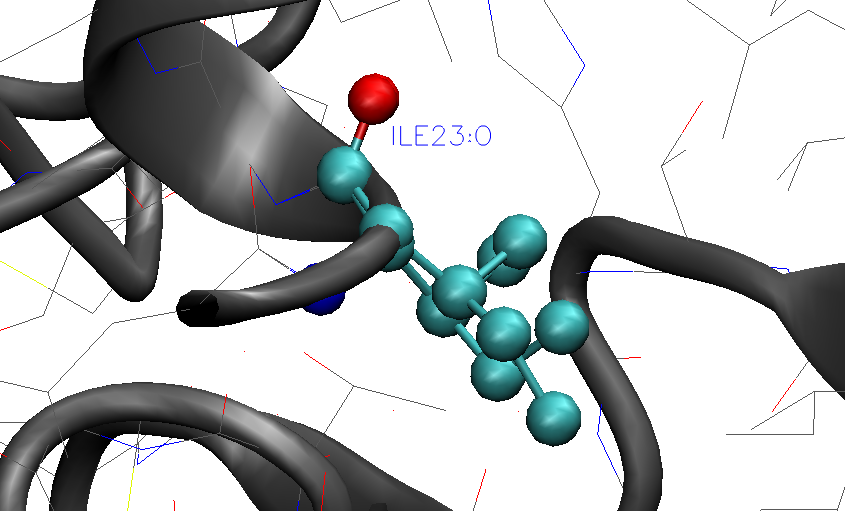
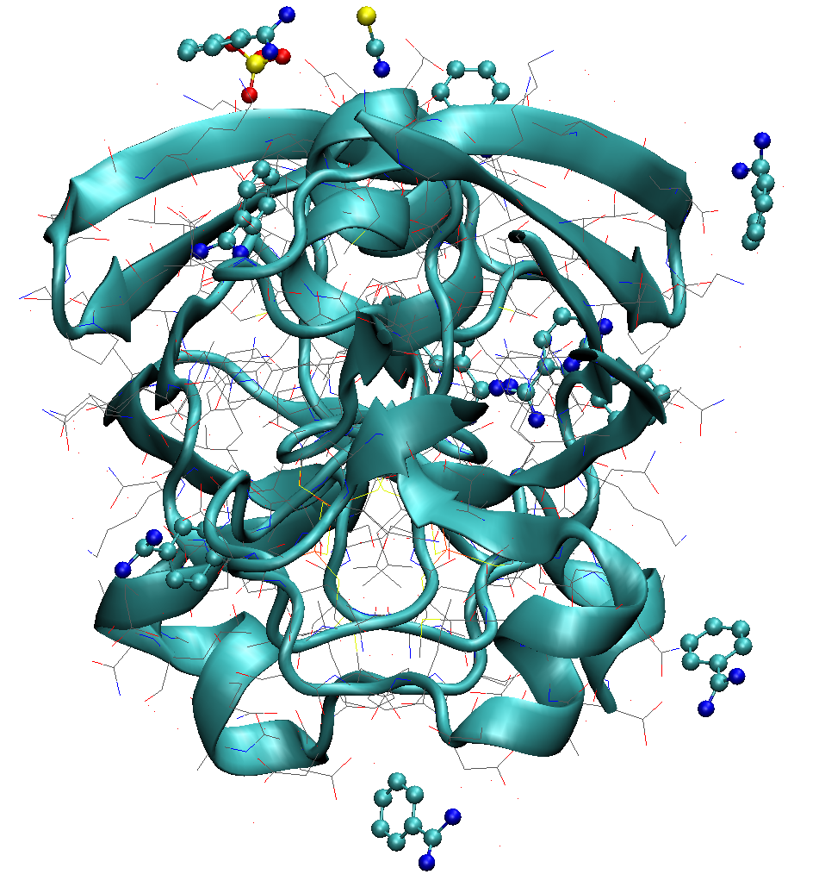
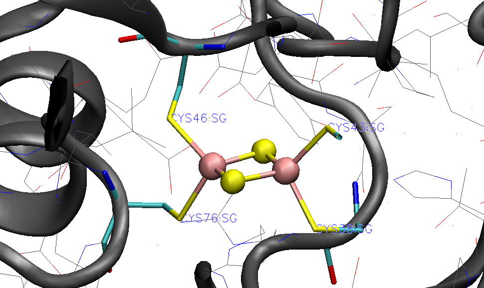

Metalloprotein tutorial II: Ferredoxin
======================================

If you have not gone through the rubredoxin tutorial before, then please do so before.
Here we encounter a slightly more complex metalloprotein example, ferredoxin.
This protein setup require slightly more work due to errors arising parsing the more complicated PDB-file with a slightly more complicated metal cluster.

Ferredoxin contains 2 copies of the [2Fe-2S] cofactor bound to 4 deprotonated cysteines. 
Additionally, the X-ray structure contains additional molecules: SCN\ :sup:`-` \ and SO\ :sub:`4`:sup:`2-` \ anions and a benzamidine molecule. 

The files for this tutorial can be found in the ASH source code directory under $ASHDIR/examples/OpenMM_Modeller-setups/ferredoxin or 
`Github-repository <https://github.com/RagnarB83/ash/tree/master/examples/OpenMM_Modeller-setups/ferredoxin>`_

######################################################
1. OpenMM_Modeller PDB parsing errors
######################################################

If we download the 6lk1.pdb file and read into OpenMM_Modeller:

.. code-block:: python

    from ash import *
    #Original raw PDB-file (no hydrogens, nosolvent)
    pdbfile="6lk1.pdb"
    # Setting up system via Modeller
    OpenMM_Modeller(pdbfile=pdbfile,forcefield="CHARMM36")

-----------------------------------
1a. Multiple occupancy problems
-----------------------------------

we will get this error:

.. code-block:: text

    Found residues in PDB-file that have alternate location labels i.e. multiple occupancies:
    Chain A:
    ILE23
    GLU28
    ...

    Chain B:
    ASP20
    ILE23
    ...

    These residues should be manually inspected and fixed in the PDB-file before continuing.
    You should delete either the labelled A or B location of the residue-atom/atoms and then remove the A/B label from column 17 in the file
    Alternatively, you can choose use_higher_occupancy=True keyword in OpenMM_Modeller and ASH will keep the higher occupied form and go on
    Make sure that there is always an A or B form present.
    Exiting.
    ASH exiting with code: 1

This means that the PDB-file contains multiple occupancies for some atoms of some residues in the PDB-file. It is best to now visually inspect these residues in the PDB, using e.g. VMD, before continuing.
Depending on the importance of these residues you may choose to keep either form A or B of these residues.
As an example for residue ILE23 in chain A in the PDB-file we have:

.. code-block:: text

    ATOM    168  N   ILE A  23       4.324   3.322  14.973  1.00  5.48           N
    ANISOU  168  N   ILE A  23      764    686    507     94    -97    -89       N
    ATOM    169  CA AILE A  23       3.083   3.972  15.441  0.72  5.57           C
    ANISOU  169  CA AILE A  23      714    705    572    141    -15    -72       C
    ATOM    170  CA BILE A  23       3.078   3.888  15.468  0.28  5.59           C
    ANISOU  170  CA BILE A  23      805    655    539    144     20     -3       C
    ATOM    171  C   ILE A  23       3.137   4.183  16.956  1.00  5.62           C
    ANISOU  171  C   ILE A  23      774    668    567     89    -73    -83       C
    ATOM    172  O   ILE A  23       2.785   5.260  17.422  1.00  6.14           O
    ANISOU  172  O   ILE A  23      946    662    584    162   -104    -74       O
    ATOM    173  CB AILE A  23       1.848   3.204  14.948  0.72  7.07           C
    ANISOU  173  CB AILE A  23      874   1044    607    -20    -54   -250       C
    ATOM    174  CB BILE A  23       1.888   2.931  15.191  0.28  5.35           C
    ANISOU  174  CB BILE A  23      650    656    605    357   -287    -91       C
    ATOM    175  CG1AILE A  23       1.736   3.459  13.417  0.72  9.07           C
    ANISOU  175  CG1AILE A  23     1360   1209    672    245   -314   -256       C
    ATOM    176  CG1BILE A  23       1.631   2.627  13.721  0.28  6.19           C
    ANISOU  176  CG1BILE A  23      584   1013    616    458   -190   -102       C
    ATOM    177  CG2AILE A  23       0.549   3.592  15.635  0.72 11.02           C
    ANISOU  177  CG2AILE A  23      711   2093   1133    141    -68   -310       C
    ATOM    178  CG2BILE A  23       0.628   3.478  15.877  0.28  4.77           C
    ANISOU  178  CG2BILE A  23      586    572    545    411   -433   -162       C
    ATOM    179  CD1AILE A  23       0.876   2.420  12.788  0.72 13.20           C
    ANISOU  179  CD1AILE A  23     1175   2543   1000   -202   -285   -837       C
    ATOM    180  CD1BILE A  23       1.064   3.763  12.898  0.28  5.93           C
    ANISOU  180  CD1BILE A  23     1050    781    287     36     33     29       C

where the lines indicate that there is multiple occupancy of sites A and B for some atoms with occupancy of 0.72 and 0.28 respectively.
If we visualize this residue in the PDB-file using VMD we see that the multiple occupancy corresponds to slightly different conformers of the ILE sidechain.
For a flexible residue like ILE this is not surprising as this would most likely arise due to dynamic disorder. and we can simply choose either conformer A or B and proceed.

For this example we would could delete e.g. the lines for conformer B (lower occupancy) and remove the 'A' characters in front of 'ILE' for the lines corresponding to site A.

If, after visual inspection of all residues we are confident that the multiple occupancy present is not a significant issue (e.g. simple dynamic disorder) and that it should be fine to simply keep the higher
occupancy conformer then we can use the keyword option, use_higher_occupancy=True, to proceed.
This will simply keep the higher occupancy version of each atom that has multiple occupancy and proceed: 

.. code-block:: python

    from ash import *
    #Original raw PDB-file (no hydrogens, nosolvent)
    pdbfile="6lk1.pdb"
    # Setting up system via Modeller
    OpenMM_Modeller(pdbfile=pdbfile,forcefield="CHARMM36", use_higher_occupancy=True)

---------------------------------------------------
1b. Missing forcefield parameters for FeS cluster
---------------------------------------------------

The next problem encountered occurs as OpenMM tries to apply the chosen forcefield to the system topology of the PDB-file.

.. code-block:: text

    Error: OpenMM modeller.addHydrogens signalled a ValueError
    This is a common error and suggests a problem in PDB-file or missing residue information in the forcefield.
    Non-standard inorganic/organic residues require providing an additional XML-file via extraxmlfile= option
    Note that C-terminii require the dangling O-atom to be named OXT
    Read the ASH documentation or the OpenMM documentation on dealing with this problem.

    Full error message from OpenMM:
    No template found for residue 190 (FES).  This might mean your input topology is missing some atoms or bonds, 
    or possibly that you are using the wrong force field.

This arises simply because the FES residue in the PDB-file, i.e. the [2Fe-2S] cluster is not present in the CHARMM36 forcefield.
In the PDB-file the residue is defined like this:

.. code-block:: text

    HETATM 1457 FE1  FES A 101       5.508  -6.531  22.895  1.00  7.55          FE
    HETATM 1458 FE2  FES A 101       4.734  -4.618  21.086  1.00  6.50          FE
    HETATM 1459  S1  FES A 101       5.095  -4.352  23.250  1.00  7.17           S
    HETATM 1460  S2  FES A 101       4.997  -6.752  20.748  1.00  7.46           S

If we tell OpenMM_Modeller about the extra residue: 

.. code-block:: python

    from ash import *

    #Original raw PDB-file (no hydrogens, nosolvent)
    pdbfile="6lk1.pdb"

    #XML-file to deal with FeS cluster
    extraxmlfile="specialresidue.xml"

    # Setting up system via Modeller
    OpenMM_Modeller(pdbfile=pdbfile,forcefield="CHARMM36", use_higher_occupancy=True,
        extraxmlfile="specialresidue.xml")

where specialresidue.xml contains:

.. code-block:: python

    <ForceField>
    <AtomTypes>
    <Type name="FEX" class="Fe" element="Fe" mass="55.84700"/>
    <Type name="SXM" class="S" element="S" mass="32.065"/>
    </AtomTypes>
    <Residues>
    <Residue name="FES">
    <Atom name="FE1" type="FEX"/>
    <Atom name="FE2" type="FEX"/>
    <Atom name="S1" type="SXM"/>
    <Atom name="S2" type="SXM"/>
    </Residue>
    </Residues>
    <NonbondedForce coulomb14scale="1.0" lj14scale="1.0">
    <Atom type="FEX" charge="0.0" sigma="0.194215920554594" epsilon="1.046"/>
    <Atom type="SXM" charge="0.0" sigma="1.3" epsilon="0.0"/>
    </NonbondedForce>
    <LennardJonesForce lj14scale="1.0">
    <Atom type="FEX" sigma="0.194215920554594" epsilon="1.046"/>
    <Atom type="SXM" sigma="0.3" epsilon="0.00000"/>
    </LennardJonesForce>
    </ForceField>

Here we have chosen, like for rubredoxin, to define LJ parameters (sigma and epsilon) for the Fe ion, using available parameters in the CHARMM forcefield for Zn.
Charges for Fe and S in the [2Fe-2S] cluster are for now set to 0.0 but will be changed to appropriate values later.

.. warning:: For OpenMM to correctly map the information from the specialresidue.xml onto the PDB-file topology, it is important that the PDB-file contains an element definition (column 77-78) for
    each element of the special residue.

Running this script we may get instead another error (OpenMM version specific):

.. code-block:: text

    ValueError: No template found for residue 191 (FES).  The set of atoms matches FES, but the bonds are different.  
    Perhaps the chain is missing a terminal group?

This error messages suggest that OpenMM Modeller recognizes our residue definition for FES but is confused about bonding. This arises due to the presence of bonding information in the bottom of the PDB-file
in the form of CONE lines (each line indicates which atom indices should be considered to have a bond between them):

.. code-block:: text

    CONECT  299 1457
    CONECT  338 1457
    CONECT  356 1458
    CONECT  575 1458
    CONECT 1033 1523
    CONECT 1064 1523
    CONECT 1082 1524
    CONECT 1298 1524
    CONECT 1457  299  338 1459 1460
    CONECT 1458  356  575 1459 1460
    CONECT 1459 1457 1458

While we could add bonding information to specialresidue.xml and try to match the connectivity in the PDB-file an easier solution is to remove the connectivity information by creating a modified version
of the PDB-file. This should probably always be an acceptable solution since we will constrain our metal-cluster residue anyway, as we don't have forcefield parameters available.
Thus we make a modified version, called 6lk1-mod.pdb, that does not contain the CONE lines and we also remove most header lines of the PDB-file (all lines before ATOM/HETATM section begins).

Next we run our script again (now using 6lk1-mod.pdb as input PDB file):

.. code-block:: python

    from ash import *

    #Original raw PDB-file (no hydrogens, nosolvent)
    pdbfile="6lk1-mod.pdb"

    #XML-file to deal with cofactor
    extraxmlfile="specialresidue.xml"

    # Setting up system via Modeller
    OpenMM_Modeller(pdbfile=pdbfile,forcefield="CHARMM36", use_higher_occupancy=True,
        extraxmlfile="specialresidue.xml")

---------------------------------------------------
1c. Unrecognized ligands in PDB-file
---------------------------------------------------

When we run this script we instead get a different error message:

.. code-block:: text

    ValueError: No template found for residue 192 (BEN).  The set of atoms is similar to INDA, but it is missing 6 hydrogen atoms.

This message refers to the fact that the PDB-file contains BEN residues (benzamidine) that are neither present in the CHARMM36 protein forcefield or in our specialresidue.xml file.
As benzamidine is simply a crystallized molecule from the buffer solution and has little do with the protein, we here make the choice to simply remove the BEN residues from 6lk1-mod.pdb.

We then get similar messages associated with missing residue definitions for SCN and SO4

.. code-block:: text

    ValueError: No template found for residue 191 (SCN).  The set of atoms is similar to THAZ, but it is missing 5 atoms.

    ValueError: No template found for residue 191 (SO4).  The set of atoms is similar to MSO4, but it is missing 4 atoms.

and again we make the choice to remove these crystallized contaminants from 6lk1-mod.pdb.
Once we have done this, OpenMM_Modeller proceeds without problems but this does not mean of course that the system is correctly set up.

######################################################
2. OpenMM residue variants: protonation states
######################################################

As previously occurred for rubredoxin, OpenMM Modeller protonates the cysteine residues that are coordinated to the Fe ions.

Since we want to avoid this, we again define a dictionary with information about abnormal residues and pass this on to OpenMM_Modeller.
Since the protein contains two protein chains (named 'A' and 'B' in the PDB-file) with the [2Fe-2S] cofactor coordinated to 4 cysteines in each chain,
we need to define all of these cysteines to be deprotonated ('CYX' label) in each chain.

.. code-block:: python

    from ash import *

    #Original raw PDB-file (no hydrogens, nosolvent)
    pdbfile="6lk1-mod.pdb"

    #XML-file to deal with FeS cluster
    extraxmlfile="specialresidue.xml"

    #Defining deptonated cysteine residues
    residue_variants={'A':{38:'CYX',43:'CYX',46:'CYX',76:'CYX'},'B':{38:'CYX',43:'CYX',46:'CYX',76:'CYX'}}

    # Setting up system via Modeller
    OpenMM_Modeller(pdbfile=pdbfile,forcefield="CHARMM36", use_higher_occupancy=True,
        extraxmlfile="specialresidue.xml",  residue_variants=residue_variants)

The printed table shows what Cys residues we selected to deprotonate:

.. code-block:: text

    User defined residue variants per chain:
    Chain A : {38: 'CYX', 43: 'CYX', 46: 'CYX', 76: 'CYX'}
    Chain B : {38: 'CYX', 43: 'CYX', 46: 'CYX', 76: 'CYX'}

    MODELLER TOPOLOGY - RESIDUES TABLE

    ASH-resid   Resname      Chain-index  Chain-name   ResID-in-chain       User-modification
    ----------------------------------------------------------------------------------------------------
    0           ALA          0            A            1
    1           TYR          0            A            2
    2           LYS          0            A            3
    ...
    37          CYS          0            A            38                  -- This residue will be changed to: CYX --
    38          ARG          0            A            39
    39          ALA          0            A            40
    40          GLY          0            A            41
    41          ALA          0            A            42
    42          CYS          0            A            43                  -- This residue will be changed to: CYX --
    43          SER          0            A            44
    44          SER          0            A            45
    45          CYS          0            A            46                  -- This residue will be changed to: CYX --
    ...
    75          CYS          0            A            76                  -- This residue will be changed to: CYX --

In this tutorial we only change the protonation states of the Cys residues but a more careful study should visually inspect
the protonation states of all titratable residues in the protein: HIS, GLU, ASP, ARG, LYS.
When these residues are on the surface of the protein they can usually be assumed to be in their regular free-form protonation states (e.g deprotonated (ASP,GLU), protonated (LYS,ARG), singly-protonated (HIS)).
However, when these residues are buried in a protein the local pH may be quite different and residues may be in a different protonation state. 

Programs like PROPKA may be used to help in determining protonation states of residues: 
https://github.com/jensengroup/propka
https://server.poissonboltzmann.org

When the X-ray structure of the protein is of sufficient quality the hydrogen bonding network may more clearly reveal whether a residue should be protonated or not.
Special attention should be paid to the protonation state of HIS residue as it can be both doubly and singly protonated and when singly protonated, it can protonated on the delta-nitrogen or the epsilon-nitrogen
of the imidazole ring. The hydrogen bonding network in the X-ray structure can often be used to make this assignment.
In rare cases, note that the atoms of the imidazole ring of HIS may have been mis-assigned due to the similar electron densities around carbon and nitrogen. This can be spotted if you see e.g. a carbon atom of the imidazole ring
in hydrogen-bonding distance to another heavy atom. To fix such a problem requires modifying the coordinates in the PDB-file.

###########################################################
3. A more realistic nonbonded model for the [2Fe-2S] 
###########################################################

While a pragmatic solution to dealing with simple inorganic residues like the [2Fe-2S] cluster is to simply create 
dummy forcefield parameters in the specialresidue.xml file to begitn with, this will likely lead to artifacts in an MD simulation.
If the charges of the Fe and S atoms in [2Fe-2S] are zero, then this means no electrostatic interaction is present between
these atoms and the rest of the protein+solvent during a classical MD simulation. Furthermore, if epsilon or sigma parameters are 0.0 then no repulsion (or attractive dispersion)
forces are present between [2Fe-2S] and other atoms, meaning that other atoms could start to occupy the same space as the [2Fe-2S] cluster.

.. note:: In electrostatically embedded QM/MM the metal cluster will most often be in the QM-region and any atom charges defined for the cluster will not be used.
    Note, however, that the LJ interactions between QM and MM atoms are calculated and the LJ parameters may be important.

Thus a more realistic scenario is to come up with a proper nonbonded model for the [2Fe-2S] cluster: i.e. atomic charges and Lennard-Jones parameters.
There are 3 main choices here:

1. Search the literature for a study using nonbonded MM parameters for the same/similar residue. Ideally with the same protein forcefield.
2. Derive the parameters using similar residues already present in the forcefield.
3. Derive the parameters from a DFT calculation and a population analysis.

Option 3 is the more general solution but as only nonbonded parameters are derived, this furthermore requires the residues to be frozen/constrained/restrained during a classical MD simulation.

ASH features a convenient way of automatically creating a valid XML-file with appropriate nonbonded parameters for an inorganic residue.
`More info here <https://ash.readthedocs.io/en/latest/OpenMM-interface.html#create-nonbonded-forcefield-file-for-ligand>`_

.. code-block:: python

    from ash import *

    frag=Fragment(xyzfile="Fe2S2.xyz", charge=2, mult=1)

    #Script to get nonbonded model parameters for a ligand
    orcatheory=ORCATheory(orcasimpleinput="! UKS r2scan ZORA ZORA-def2-TZVP tightscf CPCM", numcores=1,
        brokensym=True, HSmult=11, atomstoflip=[0])

    write_nonbonded_FF_for_ligand(fragment=frag, theory=orcatheory, resname="test",
        coulomb14scale=1.0, lj14scale=1.0, charmm=True, charge_model="CM5_ORCA", LJ_model="UFF")

Here we read the inorganic residue coordinates from an XYZ-file into an ASH fragment, define an appropriate level of theory, and then call the ASH function
**write_nonbonded_FF_for_ligand** giving the fragment and theory objects as input. We choose the coulomb14scale and lj14scale parameters to be consistent with the
CHARMM forcefield (1.0) and tell the function to create an XML-file in CHARMM forcefield format (separate <NonbondedForce and <LennardJonesForce blocks in the XML-file).
Finally we tell the function to derive CM5 atomic charges (scaled Hirshfeld charges) and to use element-specific UFF Lennard-Jones parameters for the atoms of the residue.
This will create a file, here called test.xml that contains a forcefield definition for the residue that could be used instead of the dummy file previously used.

.. code-block:: text

    <ForceField>
    <AtomTypes>
    <Type name="FeX0" class="FeX0" element="Fe" mass="55.845"/>
    <Type name="FeX1" class="FeX1" element="Fe" mass="55.845"/>
    <Type name="SX2" class="SX2" element="S" mass="32.065"/>
    <Type name="SX3" class="SX3" element="S" mass="32.065"/>
    </AtomTypes>
    <Residues>
    <Residue name="MCMtest">
    <Atom name="FeY0" type="FeX0"/>
    <Atom name="FeY1" type="FeX1"/>
    <Atom name="SY2" type="SX2"/>
    <Atom name="SY3" type="SX3"/>
    </Residue>
    </Residues>
    <NonbondedForce coulomb14scale="1.0" lj14scale="1.0">
    <Atom type="FeX0" charge="1.0271058194510412" sigma="0.0" epsilon="0.0"/>
    <Atom type="FeX1" charge="1.007310147382089" sigma="0.0" epsilon="0.0"/>
    <Atom type="SX2" charge="-0.013198936151894144" sigma="0.0" epsilon="0.0"/>
    <Atom type="SX3" charge="-0.02122203068123596" sigma="0.0" epsilon="0.0"/>
    </NonbondedForce>
    <LennardJonesForce lj14scale="1.0">
    <Atom type="FeX0" sigma="0.2594297067224668" epsilon="0.054392"/>
    <Atom type="FeX1" sigma="0.2594297067224668" epsilon="0.054392"/>
    <Atom type="SX2" sigma="0.3594776327696269" epsilon="1.146416"/>
    <Atom type="SX3" sigma="0.3594776327696269" epsilon="1.146416"/>
    </LennardJonesForce>
    </ForceField>

There are several caveats associated with this approach:

- We derive the parameters here for a bare [2Fe-2S] cluster, ignoring the fact that this cluster is bound to the protein via 4 Cys residues. An alternative approach would use some kind of capping groups to give a more realistic ligand-field for the [2Fe-2S] cluster, e.g. 4 SH- or SMe groups. This would, however, require deleting the capping atoms afterwards  and the total charge of the bare [2Fe-2S] cluster would also have to be adjusted as it must add up to full charge of the cluster (some charge-transfer always takes place between residues in a QM calculation).
- The theory level (here ZORA-r2SCAN with a TZ basis set) and population analysis (here CM5) will affect the values of the calculated charges and is here chosen as a somewhat realistic level to describe iron-sulfur clusters. However, the atomic charges defined like this are not necessarily compatible with how charges are defined in the protein forcefield, here CHARMM. In CHARMM, atomic charges for residues are typically defined at the HF/6-31G* level level of theory which is unrealistic for transition metal complexes. A better way to deal with this problem might involve scaling the atomic charges so that the magnitude of the charges are more in line with the charges of protein residues. It is unclear what the best way to do this would be.
- The **write_nonbonded_FF_for_ligand** function does not recognize the symmetry of the cluster and will create an atomtype for each atom in the cluster. This might be undesirable and the user may choose to instead combine atomtypes, e.g. a common atomtype for the Fe and S ions, respectively.
- The UFF parameters are not ideal as they are element-specific and do not take into account different oxidation states of Fe and S. 

###########################################################
4. Classical MD simulation
###########################################################

TO BE DONE...