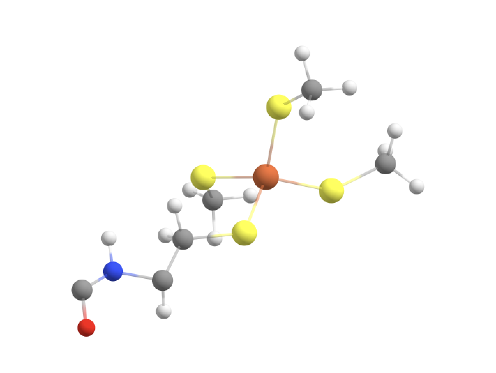

Tutorial: QM/MM boundary
======================================

The definition of the QM-region (a list of atom indices) is important when modelling proteins by QM/MM as the QM/MM boundary will be defined accordingly.
ASH will not allow any type of boundary to be defined, only certain types of cuts are allowed.

Most QM/MM programs (including ASH) do not allow a situation where 2 linkatoms get added to the same dangling QM-atom (ASH will complain if you try to do this). 
Thus one must always avoid such a boundary. 

The standard linkatom strategy in QM/MM is not perfect but it works extremely well as long as the following conditions are met:

-	You make a QM-MM boundary by cutting through a single plain bond (no double or triple cuts)
-	The bond in question is ideally a plain carbon-carbon bond (no heteronuclear bonds, e.g. C-O or C-N) 
-	The C-C bond is as nonpolar as possible (can not always be fulfilled).
-	You don‘t cut throuch a charge-group of the MM forcefield.

ASH will exit if the QM-region definition leads to a situation where 2 linkatoms would be added to the same dangling QM-atom.
ASH will also exit if the QM-MM definition leads to a heteronuclear bond being cut through (e.g. C-O or C-N) as this is rarely desired.
However, this behaviour can be overridden via the use of the keyword option *unusualboundary=True* .

Since knowledge of CHARMM charge groups in amino acid residues can influence our QM-region choice we show here the CHARMM residue definitions for deprotonated cysteine (named CYM by CHARMM) and
valine (VAL). This can be found in CHARMM `top_all36_prot.rtf <https://github.com/RagnarB83/ash/blob/master/databases/forcefields/openmm_xml_conversions/charmm-all/top_all36_prot.rtf>`_ files.

.. code-block:: text

    RESI CYM          -1.00 ! Anionic Cysteine
    ATOM N    NH1    -0.47  !     |
    ATOM HN   H       0.31  !  HN-N
    ATOM CA   CT1     0.07  !     |   HB1
    ATOM HA   HB1     0.09  !     |   |     - 
    GROUP                   !  HA-CA--CB--SG    (thiolate)
    ATOM CB   CS     -0.38  !     |   |  
    ATOM HB1  HA2     0.09  !     |   HB2   
    ATOM HB2  HA2     0.09  !   O=C
    ATOM SG   SS     -0.80  !     |
    GROUP
    ATOM C    C       0.51
    ATOM O    O      -0.51

    RESI VAL          0.00
    GROUP   
    ATOM N    NH1    -0.47  !     |    HG11 HG12
    ATOM HN   H       0.31  !  HN-N      | / 
    ATOM CA   CT1     0.07  !     |     CG1--HG13
    ATOM HA   HB1     0.09  !     |    /
    GROUP                   !  HA-CA--CB-HB  
    ATOM CB   CT1    -0.09  !     |    \     
    ATOM HB   HA1     0.09  !     |     CG2--HG21
    GROUP                   !   O=C    / \   
    ATOM CG1  CT3    -0.27  !     | HG21 HG22
    ATOM HG11 HA3     0.09
    ATOM HG12 HA3     0.09
    ATOM HG13 HA3     0.09
    GROUP   
    ATOM CG2  CT3    -0.27
    ATOM HG21 HA3     0.09
    ATOM HG22 HA3     0.09
    ATOM HG23 HA3     0.09
    GROUP   
    ATOM C    C       0.51
    ATOM O    O      -0.51

    RESI THR          0.00
    GROUP   
    ATOM N    NH1    -0.47  !     |  
    ATOM HN   H       0.31  !  HN-N  
    ATOM CA   CT1     0.07  !     |     OG1--HG1
    ATOM HA   HB1     0.09  !     |    /
    GROUP                   !  HA-CA--CB-HB  
    ATOM CB   CT1     0.14  !     |    \     
    ATOM HB   HA1     0.09  !     |     CG2--HG21
    ATOM OG1  OH1    -0.66  !   O=C    / \    
    ATOM HG1  H       0.43  !     | HG21 HG22 
    GROUP                 
    ATOM CG2  CT3    -0.27
    ATOM HG21 HA3     0.09
    ATOM HG22 HA3     0.09
    ATOM HG23 HA3     0.09
    GROUP   
    ATOM C    C       0.51
    ATOM O    O      -0.51

################################################################################
Defining different QM-region for an Fe-cysteine protein (rubredoxin).
################################################################################

Here we will use a QM/MM model of rubredoxin as an example. See :doc:`Metalloprotein-I` on how to set up the system using the CHARMM36 forcefield.
You can find the files for this MM-setup in the
`Github-repository <https://github.com/RagnarB83/ash/tree/master/examples/OpenMM_Modeller-setups/rubredoxin>`_ .
For ASH scripts related to the QM-region definitions in this tutorial see directory named *QM-MM-boundary-setup*

In rubredoxin the Fe ion is bound to 4 cysteine residues.
It is always best to try to start as simple as possible and figure out what the minimal QM-region is for a decent description of the system.
Note that visualizing the PDB-file of the full system (containing all atoms) in a visualization program like VMD 
is probably the best way to figure out what a good QM-region should look like and to get the atom indices involved (VMD like ASH will count atom indices from 0).
Visualizing the PDB-file is better than an XYZ-file because VMD will then show atomnames and residuenames and resids when you select individual atoms.

--------------------------------------------------------------
Option 1: Only Fe and S-atom in the QM-region (BAD)
--------------------------------------------------------------

We can first try to define the QM-region to only include the Fe atom (no. 755) and the 4 S atoms of the 4 bound cysteines (96,136,567,607).

.. code-block:: python

    #Note that ASH counts from 0 (not 1).
    qmatoms=[96,136,567,607,755]
    #Note: unusualboundary=True keyword is ne
    qmmm = QMMMTheory(qm_theory=orca, mm_theory=omm, fragment=fragment, qm_charge=-1, qm_mult=6,
            qmatoms=qmatoms, unusual_boundary=True)

ASH would print the following in the output:

.. code-block:: text

    QM-region coordinates (before linkatoms):
    96    S  28.35000000   36.95500000   29.37100000
    136    S  32.02800000   37.58300000   29.84000000
    567    S  30.30900000   34.16000000   30.68100000
    607    S  30.11200000   37.06500000   32.95600000
    755   Fe  30.20200000   36.48400000   30.72700000

    Determining QM-MM boundary
    Parameters determing connectivity:
    Scaling factor: 1.0
    Tolerance: 0.4
    QM atoms: [96, 136, 567, 607, 755]
    QM atoms to be excluded from boundary creation (excludeboundaryatomlist):  []
    Warning: QM-MM boundary is not the ideal C-C scenario:
    QM-MM boundary: S(96) - C(93)
    Make sure you know what you are doing (also note that ASH counts atoms from 0 not 1). Exiting.
    To override exit, add: unusualboundary=True  to QMMMTheory object
    ASH exiting with code: 1

ASH here exited actually, and this is because it recognized that the QM-MM boundary is not the ideal C-C type (and best avoided).
We can override this, however, if we want by specifying the *unusualboundary=True* option (to QMMMTheory object).
Note that ASH also prints the QM-region coordinates in the output (without any linkatoms) which can be useful to check in a visualization program to make sure that the QM-region is defined as intended.

If we use the *unusualboundary=True*  keyword to override the ASH-exit, ASH will continue and it will automatically determine linkatoms
to terminate the boundary to make 4 Fe-S-L(H) junctions.  The linkatom (L) would be a H-atom added automatically by ASH but only when the QM-calculation is being performed.
The QM-code would thus see coordinate for an Fe(SH)4 complex.
If the QM-code is ORCA the ORCA inputfile created by ASH will look something like this:

.. code-block:: text

    ! r2SCAN-3c tightscf
    %pointcharges "orca.pc"
    *xyz -1 6
    S 28.35 36.955 29.371
    S 32.028 37.583 29.84
    S 30.309 34.16 30.681
    S 30.112 37.065 32.956
    Fe 30.202 36.484 30.727
    H 28.14714878591415 36.3121362117398 28.51445021470574
    H 32.19930481797761 38.5935834563914 29.469222793303494
    H 30.094505037372087 33.61119681224084 31.598009799354752
    H 30.663321996844005 37.47906579137972 33.80021180766738
    *

We can see that ASH has added 4 H-atoms to the QM-region (to terminate the boundary) which allows a realistic QM-calculation to be carried out.
Visualizing the coordinates we see the 4 H-linkatoms have been added, the S-H bonds all point in the direction of the actual S-CH2 junctions.

However, this type of QM-region (and resulting QM-MM boundaries) is actually bad for a few reasons:

-	The S-C bond is slightly polar and not the ideal C-C scenario. 
-	Being so close to the metal ion you would risk creating artifacts. For an open-shell Fe ion you would e.g. expect some spin-density on the S-atoms and having an artificial linkatom there (during the QM-calculation) is not ideal.
-	For the case of the CHARMM forcefield: The S-atom is part of a charge group with the neighbouring CH2 group for both neutral CYS residues and also deprotonated CYS residues (either labelled CSD or CYM in forcefield files). A chargegroup is a group of close atoms together whose pointcharges sum to either zero (e.g. for neutral sidechains) or -1/+1 (e.g. for charged sidechains). Making a QM-MM boundary here (which sets the pointcharges of the QM-atoms to zero will create a charged fractional MM-pointcharge-group here.

--------------------------------------------------------------
Option 2: Fe, SCH2 groups in the QM-region (GOOD)
--------------------------------------------------------------

A more realistic QM-region would include the methylene (CH2) groups of each Cys residue as well.

.. code-block:: python

    qmatoms= [93,94,95,96,133,134,135,136,564,565,566,567,604,605,606,607,755]
    #Note: unusualboundary=True keyword is no longer necessary in QMMMTheory object
    qmmm = QMMMTheory(qm_theory=orca, mm_theory=omm, fragment=fragment, qm_charge=-1, qm_mult=6, qmatoms=qmatoms)

This would terminate the boundary to make a Fe-S-CH2-L junction. The linkatom (L) would be an H-atom added automatically by ASH but only when the QM-calculation is being performed.

The ORCA inputfile created by ASH would look like this:

.. code-block:: text

    ! r2SCAN-3c tightscf
    %pointcharges "orca.pc"
    *xyz -1 6
    C 28.013 35.887 27.948
    H 28.865 36.091 27.265
    H 28.239 34.876 28.349
    S 28.35 36.955 29.371
    C 32.326 39.341 29.195
    H 32.491 39.979 30.089
    H 33.302 39.355 28.664
    S 32.028 37.583 29.84
    C 29.942 33.221 32.25
    H 28.838 33.268 32.37
    H 30.163 33.89 33.109
    S 30.309 34.16 30.681
    C 31.072 37.786 34.426
    H 30.458 38.511 35.002
    H 31.94 38.377 34.063
    S 30.112 37.065 32.956
    Fe 30.202 36.484 30.727
    H 27.096022970908088 35.92119472939536 27.359711084075737
    H 31.554800155167054 39.75364007067431 28.544554789852715
    H 30.311808749506998 32.20547050428352 32.39156741192065
    H 31.58959570776056 37.14146008749057 35.13646673707513
    *

This is a good option because:

-	We cut through a relatively nonpolar C-C bond
-	We are farther away from the metal ion
-	We don‘t cut through the (SCH2) charge group.

This QM-region definition actually includes the whole sidechain of each CYS residue. 
This is usually a pretty good QM-MM boundary option for most amino acids, things get more difficult as we go beyond this as next we have to cut through a peptide backbone.
Making cuts through peptide backbones is a bit more problematic. 
The best choice is often to avoid it if you think the QM-region is large enough but if you think it is necessary then continue below.

-----------------------------------------------------------------------------------------
Option 3: Fe, SCH2 groups +  Cys-6 C(alpha) + H(alpha) in the QM-region (NOT ALLOWED)
-----------------------------------------------------------------------------------------

Going beyond the Cys sidechain we go into the peptide backbone, the smallest imaginable QM-region addition would involve adding the CH 
group which is the alpha-carbon group. We can try to do this for one of the Cys sidechains (resid 6).

.. code-block:: python

    #QM-III (bad): QM-II + C_alpha and H_alpha of Cys-6 backbone. ASH will not allow this
    #Adding indices 89 and 90 to the QM-region (C-alpha and H-alpha of CYS resid 6)
    qmatoms= [93,94,95,96,133,134,135,136,564,565,566,567,604,605,606,607,755,89,90]
    qmmm = QMMMTheory(qm_theory=orca, mm_theory=omm, fragment=fragment, qm_charge=-1, qm_mult=6, qmatoms=qmatoms)

This, however, results in ASH exiting with an error:

.. code-block:: text

    Determining QM-MM boundary
    Parameters determing connectivity:
    Scaling factor: 1.0
    Tolerance: 0.4
    QM atoms: [89, 90, 93, 94, 95, 96, 133, 134, 135, 136, 564, 565, 566, 567, 604, 605, 606, 607, 755]
    QM atoms to be excluded from boundary creation (excludeboundaryatomlist):  []
    Problem. Found more than 1 boundaryatom for QM-atom 89 . This is not allowed
    This typically either happens when your QM-region is badly defined or a QM-atom is clashing with an MM atom
    QM atom :  89
    MM Boundaryatoms (connected to QM-atom based on distance) :  [87, 91]
    Please define the QM-region so that only 1 linkatom would be required.
    MM Boundary atom coordinates (for debugging):
    87 N 26.853 34.952 26.065
    91 C 26.287 37.344 26.68
    ASH exiting with code: 1

This QM-region is actually not allowed by ASH as it would require adding 2 linkatoms being added to the alpha-carbon (index 89) due to 2 cuts.
Furthermore for this QM-region definition we would cut through a C-N bond anyway which is not good (we would get problematic forces at the boundary).

------------------------------------------------------------------------------------
Option 4: Fe, SCH2 groups + Cys-6 1 CH(alpha) + Cys-6 NH group + CO of Val-5 (GOOD)
------------------------------------------------------------------------------------

.. code-block:: python

    #QM-IV: QM-II + CH(alpha) and NH of Cys-6 backbone + CO of Val-5 backbone
    qmatoms= [93,94,95,96,133,134,135,136,564,565,566,567,604,605,606,607,755,89,90,87,88,75,76]
    qmmm = QMMMTheory(qm_theory=orca, mm_theory=omm, fragment=fragment, qm_charge=-1, qm_mult=6, qmatoms=qmatoms)

In order to avoid the double linkatom scenario (on the same QM-atom) we have to extend QM-region a little further.
We are forced to include the whole nearest amide group (C=O-NH) as peptide bonds are known 
to have partial double-bond character and we want to avoid cutting through a C-N bond anyway.

We then end up with a dangling C=O bond on the left side of the image (belong to Val-5) where a linkatom would be added to create 
an effective aldehyde group here. That link replaces the C-alpha of Val-5.
This cut is not perfect as the cut C-C bond involves a slightly polar carbon of the Val-5 carbonyl group but it‘s really the only good possibility here. 

The C=O is its own CHARMM charge group (of the Val residue) so we are not cutting through a charge group (which is good). 
Furthermore CH(alpha) and NH together (belonging to Cys-6) also belong to a charge group but there is no problem since we including the whole charge group.

Finally this QM-region definition also makes a cut between the Cys-6 alpha-carbon and the C of the Cys-6 C=O group.
However, this is fine since now there is only 1 possible linkatom on the Cys-6 alpha-carbon. QM-region with linkatoms is shown below.

Both QM-MM boundaries here actually cut the same type of C(alpha)-C (of C=O) which is the best possible choice when cutting through a peptide backbone.

-----------------------------------------------------------------------------------------------------------------------------------------
Option 5: Fe, SCH2 groups + Cys-6 CH(alpha) and NH peptide group + CO of Val-5 + NH-CH backbone of Thr-7 and part of sidechain of (GOOD)
-----------------------------------------------------------------------------------------------------------------------------------------

The QM-region above is arguably a bit unbalanced from a QM perspective since we are only extending the peptide backbone in 1 direction.
We could try to extend the QM-region further on the right side (towards Thr-7), keeping in mind that we don‘t want to cut through either 
the C-N bond (between Cys-6 and Thr-7) or the N-C bond (within Thr-7). 
Again we are forced to avoid the double-linkatom-on-same-QM-atom scenario so we have to extend further. 
Here we choose to include part of the sidechain of Thr-7, specifically the CH-OH part which according to the CHARMM definition of the Thr residue forms a charge group.

.. code-block:: python

    #QM-V: QM-IV + CH-NH of Thr-7 backbone + part of Thr-7 sidechain
    qmatoms= [93,94,95,96,133,134,135,136,564,565,566,567,604,605,606,607,755,89,90,87,88,75,76,91,92,97,98,99,100,103,104,105,106]
    qmmm = QMMMTheory(qm_theory=orca, mm_theory=omm, fragment=fragment, qm_charge=-1, qm_mult=6, qmatoms=qmatoms)

This now results in 3 QM-MM boundaries and 3 linkatoms are required.

------------------------
Additional options:
------------------------

These are not the only options for extended QM-regions. A cleaner option than option 5 above (only slightly more expensive) 
would include the whole sidechain of Thr-7 (1 extra methyl group).

Another option that avoids the Thr sidechain would have instead extended the peptide backbone towards Val-8.
The latter would be more expensive since one would have to go quite far to make a good cut. 
However, since this option would actually include the Val-8 N-H bond in the QM-region which according 
to the X-ray structure makes a hydrogen bond to the sulfur atom of Cys-6 this may in some sense be a better option.
Furthermore, for the rubredoxin active site one would normally want to expand the QM-region associated with the 4 cysteine residues in a balanced manner
anyway and at some point including large peptide chain segments may be necessary.

Overall defining extended QM-regions requires a bit of know-how and careful consideration.
The best option is to start simple and then carefully expand the QM-region as needed.

--------------------------------------------------------------
Further reading
--------------------------------------------------------------

As you can see, making good cuts for extended QM-regions requires a bit of know-how.

Some useful reading:

- `W. Thiel: QM/MM Methodology: Fundamentals, Scope, and Limitations <https://juser.fz-juelich.de/record/153086/files/FZJ-2014-02761.pdf>`_
- `H. M. Senn, W. Thiel: QM/MM Methods for Biological Systems <https://link.springer.com/content/pdf/10.1007/128_2006_084.pdf>`_

