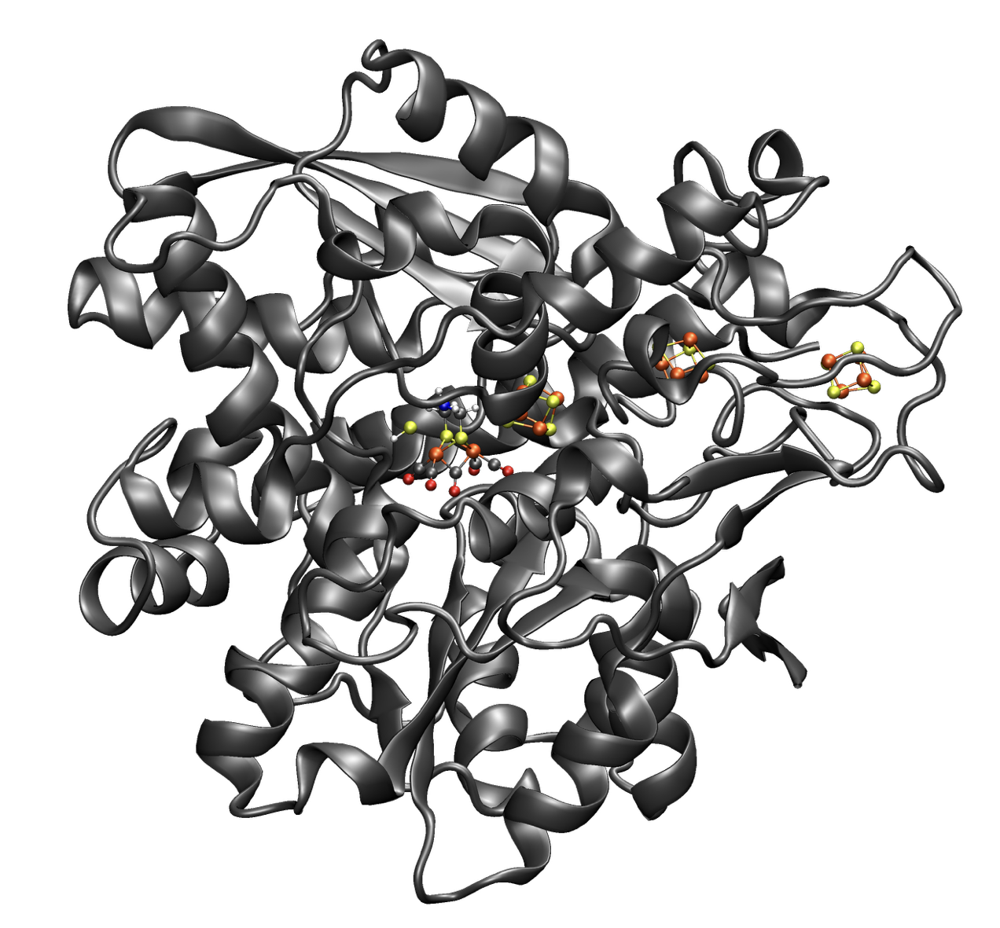
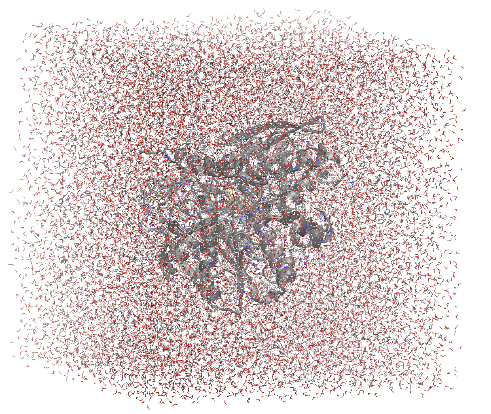

QM/MM on a protein
======================================

How to do QM/MM calculations of a protein in ASH
This tutorial is in progress...

######################################################
**1. Prepare a classical MM model of the system.**
######################################################

This step is often the most time-consuming part of setting up a new QM/MM model of a protein.
It involves finding a good starting structure (e.g. an X-ray structure), preparing the PDB-file, choose a forcefield,
adding missing hydrogens, removing disorder-coordinates, removing unnecessary residues, adding missing residues,
choosing protonation state of titratable residues, solvate the protein, add counterions, fix unphysical orientations in the structure, solvating the protein,
minimizing the structure and finally running at the very least a simple MD simulation to check for correctness.
This must all be done before starting the QM/MM calculations and this step should be done carefully as mistakes in this step
are not easily corrected later on.

Some useful reading:
https://www.mdy.univie.ac.at/people/boresch/sommerschule2019.pdf

There are many programs capable of setting up a classical model of the protein.

ASH is currently capable of reading in :

- CHARMM forcefield files (PSF-file, top and prm files, **tested**)
- GROMACS files, using various forcefields  (untested)
- Amber files (PRMTOP)   (untested)
- OpenMM files (XML-file)   (untested)

*Option a. GROMACS using the CHARMM forcefiled*

GROMACS is a popular open-source code MM code and comes with convenient tools for preparing a new protein model from scratch.

- `Basic tutorial (lysozyme) <http://www.mdtutorials.com/gmx/lysozyme/index.html>`_

- `Metalloprotein tutorial <https://sites.google.com/site/ragnarbjornsson/mm-and-qm-mm-setup>`_

Once the system has been prepared using GROMACS, and an MD simulation run, one would extract the coordinates of snapshot
from the MD trajectory (e.g. after 5 ns simulation time). The coordinates should ideally be written out in Cartesian
coordinates in Å and prepared as an XYZ-file. While the GROMACS files can be read in by ASH, it may also be more convenient
to have GROMACS write out CHARMM forcefield files (if using CHARMM) or AMBER forcefield files (if using AMBER).
Note that ParMed may help here: https://parmed.github.io/ParmEd/html/index.html

*Option b. OpenMM using the CHARMM forcefield*

IN PROGRESS

An alternative to GROMACS is to set up the system and run the classical simulation using OpenMM instead.
This has the convenience of using the same MM program that ASH uses, that may already been installed as
part of the ASH installation. A drawback is that OpenMM is not as versatile and may require other tools to set up the
system first such as: CHARMM-GUI (http://www.charmm-gui.org), QwikMD (http://www.ks.uiuc.edu/Research/qwikmd/)

Description on setting up a system in OpenMM:

http://docs.openmm.org/7.2.0/userguide/application.html#model-building-and-editing

Useful links:

| http://openmm.org/tutorials/hsp90_adp_mg/
| http://openmm.org/tutorials/b2ar_membrane/
| https://github.com/tdudgeon/simple-simulate-complex
| http://openmm.org/tutorials/hkmt_tip4pew/

######################################################
**2a. Read coordinates and forcefield into ASH**
######################################################

Here we will read in the coordinates and forcefield files from the classical system preparation.
The coordinates can be read-in in multiple ways: e.g. from a previous ASH-file on disk (file.ygg), an XYZ-file (XMol format, file.xyz),
a PDB-file (See :doc:`coordinate-tools` on reading/writing PDB-files), or even a Chemshell fragment file (file.c).
The forcefield can be read in using CHARMM files or Amber files

CHARMM example:

.. code-block:: python

    from ash import *

    # Read in forcefield files
    forcefielddir="/home/bjornsson/ASH-vs-chemshell-protein/QM-MM/FeMoco-test1/forcefielddir/"
    topfile=forcefielddir+"top_all36_prot.rtf"
    parfile=forcefielddir+"par_all36_prot.prm"
    psffile=forcefielddir+"new-XPLOR-psffile.psf"

    #Read coordinates from either an XYZ-file, a PDB-file, or an ASH-file (.ygg)
    frag = Fragment(xyzfile="system.xyz", conncalc=False)
    #frag = Fragment(pdbfile="system.pdb", conncalc=False)
    #frag = Fragment(fragfile="system.ygg", conncalc=False)
    #frag = Fragment(chemshellfile="system.c", conncalc=False)

    #Creating OpenMMobject using CHARMM forcefield files
    openmmobject = OpenMMTheory(psffile=psffile, CHARMMfiles=True, charmmtopfile=topfile,
        charmmprmfile=parfile)

    #Run a simple energy+gradient job at the MM level to test whether everything is correct.
    Singlepoint(theory=openmmobject, fragment=frag)

Amber example:

.. code-block:: python

    from ash import *

    #Amber files
    prmtopfile="ps2_ALL.prmtop"
    inpcrdfile="PS2_ALL.inpcrd"

    #Read coordinates from Amber INPCRD and PRMTOP FILES
    elems,coords,boxdims=module_coords.read_ambercoordinates(prmtopfile=prmtopfile, inpcrdfile=inpcrdfile)
    frag=Fragment(elems=elems,coords=coords, conncalc=False)

    #Creating OpenMMobject using AMBER forcefield files
    openmmobject = OpenMMTheory(Amberfiles=True, amberprmtopfile=prmtopfile, printlevel=1, periodic=True, periodic_cell_dimensions=boxdims)

    #Run a simple energy+gradient job at the MM level to test whether everything is correct.
    Singlepoint(theory=openmmobject, fragment=frag)

The script above (e.g. called MMtest.py) can then be executed like this:

.. code-block:: shell

    python-jl MMtest.py

############################################################################
**3. Create the QM/MM model and test it by running an energy calculation**
############################################################################

Assuming step 2 worked well, the next step is to setup the QM/MM model.
We reuse most of the script above and add information about the QM-theory, create a QM/MM object and then
run a single-point energy job for testing purposes.
The division of the system into a QM-region and an MM-region is handled by defining a list of atom-indices that are
QM-atoms (create a list called qmatoms) and pass that list to the qmatoms keyword argument of the QMMMTheory class.

If the QM-MM boundary crosses a covalent bond (usually the case for proteins) then a linkatom (hydrogen)is
automatically created.
The linkatom coordinates are added to the QM-region coordinates when passed to the QM program.

.. code-block:: python

    from ash import *

    # Read in forcefield files
    forcefielddir="/home/bjornsson/ASH-vs-chemshell-protein/QM-MM/FeMoco-test1/forcefielddir/"
    topfile=forcefielddir+"top_all36_prot.rtf"
    parfile=forcefielddir+"par_all36_prot.prm"
    psffile=forcefielddir+"new-XPLOR-psffile.psf"

    #Read coordinates from either an XYZ-file, a PDB-file, or an ASH-file (.ygg)
    frag = Fragment(xyzfile="system.xyz", conncalc=False)

    #Creating OpenMMobject using CHARMM forcefield files
    openmmobject = OpenMMTheory(psffile=psffile, CHARMMfiles=True, charmmtopfile=topfile,
        charmmprmfile=parfile)

    #Forcefield files
    forcefielddir="/home/bjornsson/ASH-vs-chemshell-protein/QM-MM/FeMoco-test1/forcefielddir/"
    topfile=forcefielddir+"top_all36_prot.rtf"
    parfile=forcefielddir+"par_all36_prot.prm"
    psffile=forcefielddir+"new-XPLOR-psffile.psf"

    #Define QM region
    #IMPORTANT: Atom indices start at 0 in ASH.
    # Define either as lists in script:
    #qmatoms = [0, 5, 6, 7, 8]
    #Or read in list from file called: qmatoms (atom indices separated by space)
    qmatomlist = read_intlist_from_file("qmatoms")

    #Define QM-theory. Here ORCA
    orcadir="/opt/orca_current"
    ORCAinpline="! TPSSh RIJCOSX  D3BJ SARC/J ZORA-def2-SVP ZORA tightscf slowconv"
    ORCAblocklines="""
    %maxcore 2000
    %scf
    MaxIter 500
    end
    """

    #QM-region: Charge and multiplicity
    charge=-5
    mult=4

    #Create ORCA QM object
    orcaobject = ORCATheory(orcadir=orcadir, charge=charge,mult=mult, orcasimpleinput=ORCAinpline,
                            orcablocks=ORCAblocklines, nprocs=8)

    # Create QM/MM OBJECT
    qmmmobject = QMMMTheory(qm_theory=orcaobject, mm_theory=openmmobject,
        fragment=frag, embedding="Elstat", qmatoms=qmatomlist, printlevel=2)

    # Single-point job to test QM/MM setup
    Singlepoint(theory=qmmmobject, fragment=frag)

The script above (e.g. called QM_MMtest.py) can be run like this:

.. code-block:: shell

    python-jl QM_MMtest.py

It will run both the MM part and the QMpart using the chosen theory. Choose a small QM-region for testing purposes if
run directly in the shell.

######################################################
**4. Run a QM/MM geometry optimization**
######################################################

Assuming the QM/MM single-point energy test went well, then everything should be ready for running a QM/MM geometry
optimization. A geometry optimization is the most common job to run for QM/MM modelling of proteins. Note that typically we only optimize a small part of the system in QM/MM (this active region is commonly ~1000 atoms). The list of active atoms is defined similarly to the qmatoms list (see above) but as the actatoms list is typically long it is usually more convenient to create this list via a script (e.g. actregiondefine.py).

actregiondefine.py:

.. code-block:: python

    from ash import *

    #Forcefield files:
    forcefielddir="/home/bjornsson/path-to-forcefield"
    topfile=forcefielddir+"/top_all36_prot.rtf"
    parfile=forcefielddir+"/par_all36_prot.prm"
    psffile=forcefielddir+"/newxplor.psf"

    #Fragment file
    frag = Fragment(pdbfile="protein.pdb")

    #Creating OpenMMobject
    openmmobject = OpenMMTheory(psffile=psffile, CHARMMfiles=True, 
        charmmtopfile=topfile, charmmprmfile=parfile)

    #Define active region based on radius (in Å) around origin-atom (atomindex).
    #Whole residues will be included in selection. Note: ASH counts from 0.
    actatoms = actregiondefine(mmtheory=openmmobject, fragment=frag, radius=11, originatom=25107)

.. warning:: While tempting to use the actregiondefine function within your regular ASH QM/MM geometry optimization job, this is typically not a good idea as the active region is then redefined in each job. It's possible that the active region might slightly change in subsequent jobs due to e.g. water molecules being in or out out of the sphere-radius when the function is run. This results in an inconsistent energy surface. Instead: run the actregiondefine.py script only once to define the active-atoms list and use for all subsequent jobs.

Once the QM-region and Active Region has been defined one can then run a geometry optimization of the full system where
only the active region is allowed to move. Instead of calling the Singlepoint function, one would call the
geomeTRICOptimizer like below:

.. code-block:: python

    #Read in the active atoms list from file
    actatomslist = read_intlist_from_file("active_atoms")

    #Run QM/MM geometry optimization using geomeTRIC optimizer and HDLC coordinates
    #Only active-region passed to optimizer
    geomeTRICOptimizer(theory=qmmmobject, fragment=frag, ActiveRegion=True, actatoms=actatomslist, maxiter=500, coordsystem='hdlc')

If the optimization finishes successfully, the optimized coordinates will be written to disk as both XYZ-file, ASH fragfile etc. An optimization trajectory of both the full system and the frozen system.

.. seealso:: it's possible to add a command at the end where a PDB-file is written out (See :doc:`coordinate-tools` on reading/writing PDB-files) for visualization purposes: write_pdbfile(frag, outputname="OptimizedFragment.pdb",openmmobject=openmmobject)

For completeness, the inputfile for a QM/MM geometry optimization should look something like this:

.. code-block:: python

    from ash import *

    # Read in forcefield files
    forcefielddir="/home/bjornsson/ASH-vs-chemshell-protein/QM-MM/FeMoco-test1/forcefielddir/"
    topfile=forcefielddir+"top_all36_prot.rtf"
    parfile=forcefielddir+"par_all36_prot.prm"
    psffile=forcefielddir+"new-XPLOR-psffile.psf"

    #Read coordinates from either an XYZ-file, a PDB-file, or an ASH-file (.ygg)
    frag = Fragment(xyzfile="system.xyz", conncalc=False)

    #Creating OpenMMobject using CHARMM forcefield files
    openmmobject = OpenMMTheory(psffile=psffile, CHARMMfiles=True, charmmtopfile=topfile,
        charmmprmfile=parfile)

    #Forcefield files
    forcefielddir="/home/bjornsson/ASH-vs-chemshell-protein/QM-MM/FeMoco-test1/forcefielddir/"
    topfile=forcefielddir+"top_all36_prot.rtf"
    parfile=forcefielddir+"par_all36_prot.prm"
    psffile=forcefielddir+"new-XPLOR-psffile.psf"

    #Define QM region
    #IMPORTANT: Atom indices start at 0 in ASH.
    # Define either as lists in script:
    #qmatoms = [0, 5, 6, 7, 8]
    #Or read in list from file called: qmatoms (atom indices separated by space)
    qmatomlist = read_intlist_from_file("qmatoms")

    #Define Active Region
    #Read in the active atoms list from file
    actatomslist = read_intlist_from_file("active_atoms")

    #Define QM-theory. Here ORCA
    orcadir="/opt/orca_current"
    ORCAinpline="! TPSSh RIJCOSX  D3BJ SARC/J ZORA-def2-SVP ZORA tightscf slowconv"
    ORCAblocklines="""
    %maxcore 2000
    %scf
    MaxIter 500
    end
    """

    #QM-region: Charge and multiplicity
    charge=-5
    mult=4

    #Create ORCA QM object
    orcaobject = ORCATheory(orcadir=orcadir, charge=charge,mult=mult, orcasimpleinput=ORCAinpline,
                            orcablocks=ORCAblocklines, nprocs=8)

    # Create QM/MM OBJECT
    qmmmobject = QMMMTheory(qm_theory=orcaobject, mm_theory=openmmobject,
        fragment=frag, embedding="Elstat", qmatoms=qmatomlist, printlevel=2)

    #Run QM/MM geometry optimization using geomeTRIC optimizer and HDLC coordinates
    #Only active-region passed to optimizer
    geomeTRICOptimizer(theory=qmmmobject, fragment=frag, ActiveRegion=True, actatoms=actatomslist, maxiter=500, coordsystem='hdlc')

    #Write a PDB-file of the final coordinates.
    write_pdbfile(frag, outputname="OptimizedFragment.pdb",openmmobject=openmmobject)

######################################################
**5. Modifying the coordinates of the QM-region**
######################################################

To run a QM/MM optimization to find other minima, one would typically change the coordinates of the fragment file or XYZ-file outside
ASH (e.g. using a visualization program).

See :doc:`coordinate-tools` for information on using fragedit.py  and fragupdate.py

######################################################
**6. Adding/removing atoms of the system**
######################################################

If you need to add or remove atoms to your QM/MM system this is a bit more involved than modifying the coordinates. The reason is that both the coordinate and forcefield file needss to be updated and also: if you delete e.g. atom 4556 then all atom indices >4556 change.

There are two options:

1. Go back to the original MM-system preparation and prepare a new MM model with the added/deleted atom(s). This is a safe option but inconvenient.

2. Modify the coordinate-file (XYZ-file, YGG-file, PDB-file), the forcefield file and update atom-indices-files (e.g. active_atoms and qmatoms files).

    a. CHARMM files:
        The PSF-file has to be regenerated and the topology and parameter-files may also need modifications.

        Use PSFgen to create a new PSF-file.

        MORE INFORMATION TO COME...

######################################################
**7. Other QM/MM jobtypes**
######################################################

One can also run a numerical frequency job using the same QM/MM ASH object:

.. code-block:: python

    #Numerical Frequencies. npoint=2 (two-point numerical differentiation). runmode='serial' means that each
    #displacement (Energy+Gradient job on each geometry) is run sequentially. runmode='parallel' currently not possible
    #for QM/MM jobs.
    freqresult = NumFreq(fragment=frag, theory=qmmmobject, npoint=2, runmode='serial')

Or a nudged-elastic band job in order to find a minimum energy path and saddlepoint

.. code-block:: python

    fragA = Fragment(xyzfile="minA.xyz", conncalc=False)
    fragB = Fragment(xyzfile="minB.xyz", conncalc=False)
    #NEB-CI job. Final saddlepoint structure stored in new object "Saddlepoint"
    Saddlepoint = interface_knarr.NEB(reactant=fragA, product=fragB, theory=qmmmobject, images=10, CI=True,
        ActiveRegion=True, actatoms=qmatomslist, idpp_maxiter=800)
    Saddlepoint.print_system(filename='saddlepoint.ygg')