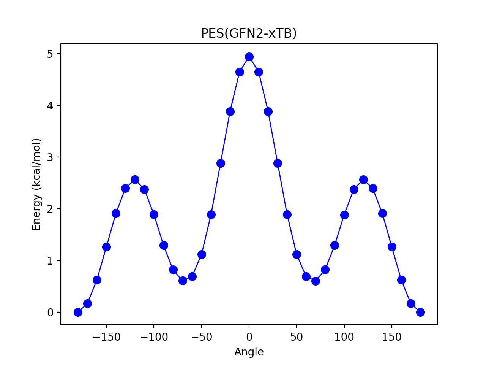

Tutorial: Training a Δ-Learning Model
==================================================================

Δ-machine learning (Δ-ML) is an appealing technique for incorporating machine-learning in computational chemistry and can be viewed as a physics-informed machine-learning approach.
The basic idea is to train a machine-learning model to learn the difference (Δ) between a base-line result (or low-level theory) and a target result (or high-level theory).
Modern advances in training neural network potentials (i.e. neural networks capable of learning energy as a function of nuclear coordinates) 
are usually applicable within a Δ-learning framework. Instead of learning the total energy directly, the neural network learns the energy difference between two levels of theory.

In this tutorial, we will demonstrate how to set up and train a Δ-learning model using ASH.

For more information on machine learning in ASH, please refer to :doc:`Machine_learning_in_ASH`

#######################################################################################
0. Testing different theory-levels on a simple conformational energy surface: n-butane
#######################################################################################

The potential energy surface of butane is a nice simple system with a very simple conformational landscape.
It still shows some differences in the torsional barrier heights for different quantum chemistry methods.
Figure 1 shows a relaxed surface scan of butane, calculated with different levels of theory.
It was run using the ASH *calc_surface* function as follows:

.. code-block:: python

    from ash import *
    #Creating the ASH fragment 
    frag = Fragment(databasefile="butane.xyz", charge=0, mult=1)
    #Defining a theory: here tblitetheory (GFN2-xTB)
    theory = tbliteTheory(method="GFN2-xTB")

    #Calling the calc_surface function
    surfacedictionary = calc_surface(fragment=frag, theory=theory, scantype='Relaxed',
        resultfile='surface_results.txt', runmode='serial',
        RC1_range=[-180,180,10], RC1_type='dihedral', RC1_indices=[0,1,2,3])

Figure 1. Relaxed surface scan at GFN2-xTB level of theory.

A simple NDO-based semiempirical method like AM1 is capable of capturing the conformational energy between the 2 minima, but severely underestimates both torsional barriers.
A more modern semiempirical tightbinding method like GFN2-xTB performs better, but still underestimates the barriers.
DFT methods do better. 
MP2 is the highest level of theory used here, and even with a small basis set the accuracy is very good (when compared against even higher level coupled cluster methods). We will use MP2 as our target high-level theory in the following. 
Here we will show how to train a Δ-ML model to learn the difference between AM1 and MP2 for butane.

It is important to note that the butane test system chosen here is deliberately simple for pedagogic purposes and for being computationally affordable to carry out the training, even on a laptop.
A model trained to reproduce the energy surface of butane is probably not particularly useful.

################################################################################
1. Training a Δ-ML model on the energy surface of butane
################################################################################

------------------------------------------
a. Generating training configurations
------------------------------------------

First we need a set of molecular configurations to train from. 
These configurations need to be somehow relevant to the energy surface that we seek to reproduce. 
Obviously a model trained only on a limited part of the energy surface can not be expected to perform well in another part.
For the conformational energy surface of butane it is sufficient to simply run molecular dynamics at 300 K, as the barrier heights are not too high, at some cheap level of theory.
However, it is even better to perform a biased MD run, e.g. via the well-temperated metadynamics (MTD) algorithm.
See :doc:`mtd_tutorial` for a tutorial on performing metadynamics simulations in ASH (featuring butane). 
The script below shows how we can perform a semiempirical GFN1-xTB MTD simulation for 100 ps.

.. code-block:: python

    from ash import *

    #Creating the ASH fragment
    frag = Fragment(databasefile="butane.xyz", charge=0, mult=1)
    #Defining the xTB theory (GFN1-xTB)
    theory = xTBTheory(runmode='library', xtbmethod="GFN1")

    #The name and path of the biasdirectory
    biasdir="./biasdir"

    #Calling the OpenMM_metadynamics function with a time of 1 ps
    OpenMM_metadynamics(fragment=frag, theory=theory,
                timestep=0.001, simulation_time=100, traj_frequency=1,
                temperature=300,
                CV1_atoms=[0,1,2,3], CV1_type='dihedral', CV1_biaswidth=0.5,
                biasfactor=6, height=1,
                frequency=100, savefrequency=100,
                biasdir=biasdir)

    #Plot the final (this function can also be called outside this script)
    metadynamics_plot_data(biasdir=biasdir, dpi=200, imageformat='png')

This gives a free-energy surface:

Figure 2.

------------------------------------------------------
b. Selecting molecular configurations for training
------------------------------------------------------

The free-energy surface plot above reveals that the simulation sampled both minima and even sampled the saddlepoint regions.
We can plot dihedral angles from the frames of the trajectory directly on the same plot.

Figure 3.

How should we select configurations from the trajectory ?
Selecting useful configurations to train a ML-model is an important research question.
Here for simplicity we can simply opt to take the trajectory from the MTD run as a whole and randomly select molecular configurations from it.

Alternatively we could adopt some kind of pre-filtering (removing high-energy or superfluous configurations) or intelligent selection.
TO-BE-DONE

------------------------------------------
c. Generating the training data
------------------------------------------

Once we have chosen a source of configurations we need to generate the final training data.
In addition to the molecular configurational coordinates (that will serve as feature vectors in ML language) 
we also need energies and gradients (labels in ML language).

ASH features a convenient function *create_ML_training_data* for generating the final training data.
The function reads a source of molecular configurations: can be an XYZ-trajectory, directory containing individual XYZ-frames or a DCD-compressed MD trajectory.
From this source it can either choose all the configurations or randomly choose X configurations from the source.
One then needs to define the theory-levels that will be used to calculate energies for each molecular configuration.
If 2 levels of theory are provided, ASH will assume Δ-learning and will calculate the energy difference from the 2 theories.
If the *Grad* boolean is active, the gradient will be calculated for each theory-level as well (usually desired).

Here we will read in a XXX trajectory (containing XXX frames) and tell create_ML_training_data to randomly choose 100 configurations.

.. code-block:: python

    from ash import *

    numcores=1

    #LL
    theory1=theory = xTBTheory(runmode='library', xtbmethod="GFN1")
    #HL
    theory2= xTBTheory(runmode='library', xtbmethod="GFN2")

    #Reading in XYZ-trajectory
    create_ML_training_data(xyz_trajectory="MDtraj_10ps.xyz", num_snapshots=100,
        random_snapshots=True, theory_1=theory1, theory_2=theory2, Grad=True)

The function produces the following files: train_data.xyz, train_data.energies, train_data.gradients
containing coordinates, energies (ΔE-values actually) and gradients (gradient differences actually) in the same order.
Alternative the same data is available as a MACE-formatted file: train_data_mace.xyz

------------------------------------------
d. Training the Δ-ML potential
------------------------------------------

Once the final training data is available we can simply train the potential using a suitable ML-theory.
This can either be done outside ASH or using an available ASH interface.
Here we utilize the interface to the equivariant graph neural network MACE architecture.

.. code-block:: python

    #Create MACETheory object and train
    mace_theory = MACETheory(device="cuda")
    # Train the MACE-model, providing the training-file and various options.
    mace_theory.train(train_file="train_data_mace.xyz",
        energy_weight=1, forces_weight=100, max_num_epochs=500, valid_fraction=0.1)

As training is computationally intensive and much faster on a GPU we choose the device of the MACETheory object to be 'cuda' (requires a CUDA-compatible GPU).
We also choose the weight between energy and forces to be 1:100 (100-1000 usually recommended) and max number of training epochs to be 500.
The split of the training set into a validation set and sub-training set is controlled by valid_fraction and is here 0.1, meaning 10 % of the data is used for validation.

Once training is complete, the RMSE on energies and forces can be inspected from the training log.
The final model is saved to the file: mace_stagetwo_compiled.model.

------------------------------------------
e. Testing the Δ-ML potential
------------------------------------------

The real testing is seeing how well the trained Δ-ML potential works in practice on something other than the training data
and something other than energies and forces.
Here we will do a relaxed surface scan to test how well the Δ-ML potential works. 
This will test the robustness (a series of geometry optimizations are carried out) as well as the final accuracy of the conformational landscape we care about.

First we need to define our final theory in ASH. Because the ML-model is trained to learn only the difference between 2 levels of theory, we need to define a composite theory that also contains the low-level theory (or baseline).
For this we use the WrapTheory class in ASH and define a theory that sums both energies and gradients from the low-level theory and the trained MACE model.
We can then run the calc_surface function as we did before, but now with the composite Δ-ML theory.

.. code-block:: python

    from ash import *

    #Define low-level theory
    ll_theory = xTBTheory(runmode='library', xtbmethod="GFN1")
    #Define trained MACE model
    mace_theory = MACETheory(model_file="mace_model.pt", device="cpu")
    #Wrap the 2 theories into a composite Δ-ML theory
    delta_ml_theory = WrapTheory(theory_1=ll_theory, theory_2=mace_theory)

    #Calling the calc_surface function
    surfacedictionary = calc_surface(fragment=frag, theory=theory, scantype='Relaxed',
        resultfile='surface_results.txt', runmode='serial',
        RC1_range=[-180,180,10], RC1_type='dihedral', RC1_indices=[0,1,2,3])

Plotting the final energy-profile together with reference surfaces we can see that the model performs very well, accurately reproducing the MP2 reference surface.