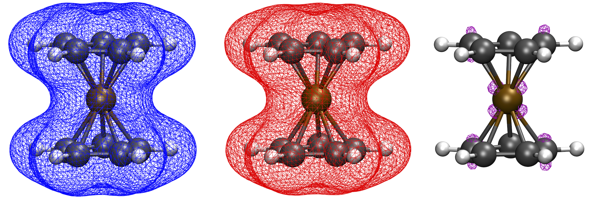

Electronic structure analysis
======================================

ASH contains some basic functionality for electronic structure analysis that can be useful.

NOTE: Some functions on this page requires you to import the functions_elstructure module:

.. code-block:: python

    from ash.functions.functions_elstructure import *

######################################################
Creating and modifying Gaussian Cube files
######################################################

Functions to read Gaussian Cube file, 

.. code-block:: python

    #Read Cube file into dictionary
    def read_cube(cubefile):

    #Write Cube dictionary into file
    def write_cube(cubedict, name="Default"):

    #Subtract one Cube-file from another
    def write_cube_diff(cubedict1,cubedict2, name="Default"):

    #Sum of 2 Cube-files
    def write_cube_sum(cubedict1,cubedict2, name="Default"):

    #Product of 2 Cube-files
    def write_cube_product(cubedict1,cubedict2, name="Default"):

    # Read cubefile. Grabs coords. Calculates density if MO
    def create_density_from_orb (cubefile, denswrite=True, LargePrint=True):

How to use the functions:

.. code-block:: python

    from ash import *

    #Read 2 Cube-files into dictionaries
    mo2=read_cube("hf.mo2a.cube")
    mo3=read_cube("hf.mo3a.cube")

    #Subtract, sum and multiply previously read-in Cube-file dictionaries
    write_cube_diff(mo2,mo3, name="MO_2-3-diff") #Creates file MO_2-3-diff.cube
    write_cube_sum(mo2,mo3, name="MO_2-3-sum") #Creates file MO_2-3-sum.cube
    write_cube_product(mo2,mo3, name="MO_2-3-prod") #Creates file MO_2-3-prod.cube

    # Create density from MO from a Cube-file.
    create_density_from_orb("hf.mo2a.cube") #Creates file hf.mo2a-dens.cube

**Create Cubefiles from orbital files**

It is also possible to directly create Cubefiles from wavefunction files.
If an ORCA GBW file (containing the SCF wavefunction), ORCA natural orbital file or a Molden file (e.g. created by CFOUR or MRCC) 
is provided then create_cubefile_from_orbfile can directly create a Cubefile from the associated WF.
The function recognized the file type from the file extension and creates the Cubefile accordingly with the help of the orca_2mkl program (requires ORCA to be installed),
and Multiwfn via the Multiwfn-ASH interface (See :doc:`Multiwfn-interface` for details).

.. code-block:: python

	def create_cubefile_from_orbfile(orbfile, grid=3, delete_temp_molden_file=True, printlevel=2):

**Create difference density from 2 Cubefiles**

A more convenient option than using the **write_cube_diff** function above.
The **diffdens_of_cubefiles** function reads 2 Cube-files directly and creates a difference density Cubefile.

.. code-block:: python

	def diffdens_of_cubefiles(ref_cubefile, cubefile):

**Create multiple difference densities from all orbital-files in directory**

Sometimes one would like to conveniently create difference densities from all orbital/WF files in a directory.
The **diffdens_tool** function can be used for this purpose.
It reads all files in a directory with a given extension (e.g. .gbw, .molden, .nat) and creates difference densities
w.r.t. to a reference file (e.g. HF.gbw).

This function use Multiwfn via the Multiwfn-ASH interface (See :doc:`Multiwfn-interface` for details).

.. code-block:: python

	def diffdens_tool(reference_orbfile="HF.gbw", dir='.', grid=3, printlevel=2):

**Example: Vertical ionization of Cobaltocene**

An example might be to create a difference density plot between two redox states of a molecule. 
This can only cleanly be done for a vertical redox process.

.. code-block:: python

	from ash import *
	import shutil

	string="""
	Co       6.344947000     -1.560817000      5.954256000
	C        6.026452000     -0.546182000      7.802276000
	C        5.793563000     -1.965872000      7.908267000
	C        7.027412000     -2.657637000      7.660083000
	C        7.976024000     -1.681400000      7.254253000
	C        7.360141000     -0.371346000      7.359546000
	H        5.287260000      0.234934000      7.955977000
	H        4.853677000     -2.430623000      8.196105000
	H        7.174908000     -3.733662000      7.680248000
	H        7.845323000      0.573837000      7.130600000
	C        7.003675000     -1.909758000      4.002507000
	C        6.025582000     -2.892708000      4.310293000
	C        4.831240000     -2.191536000      4.690416000
	C        5.029751000     -0.780020000      4.468693000
	C        6.380790000     -0.601338000      4.083942000
	H        8.038293000     -2.097559000      3.727053000
	H        6.179063000     -3.967316000      4.350882000
	H        3.905308000     -2.652860000      5.025216000
	H        6.875603000      0.346060000      3.887076000
	H        4.297348000      0.002948000      4.644348000
	H        8.999375000     -1.871686000      6.940915000
	"""

	#Defining fragment for redox reaction
	Co_neut=Fragment(coordsstring=string, charge=0, mult=2)
	Co_ox=Fragment(coordsstring=string, charge=1, mult=1)
	label="Cocene_"+'_'
	#Defining QM theory as ORCA here
	qm=ORCATheory(orcasimpleinput="! BP86 def2-SVP tightscf notrah")

	#Run neutral species with ORCA
	e_neut=Singlepoint(theory=qm, fragment=Co_neut)
	shutil.copyfile(qm.filename+'.gbw', label+"neut.gbw") # Copy GBW file
	#Run orca_plot to request electron density creation from ORCA gbw file
	run_orca_plot(label+"neut.gbw", "density", gridvalue=80)
	
	#Run oxidized species with ORCA
	e_ox=Singlepoint(theory=qm, fragment=Co_ox)
	shutil.copyfile(qm.filename+'.gbw', label+"ox.gbw")  # Copy GBW file
	#Run orca_plot to request electron density creation from ORCA gbw file
	run_orca_plot(label+"ox.gbw", "density", gridvalue=80)

	#Read Cubefiles from disk. 
	neut_cube_data = functions.functions_elstructure.read_cube(label+"neut.eldens.cube")
	ox_cube_data = functions.functions_elstructure.read_cube(label+"ox.eldens.cube")
	#Write out difference density as a Cubefile
	functions.functions_elstructure.write_cube_diff(neut_cube_data, ox_cube_data, label+"diffence_density.cube")

The script will output the files Cocene_neut.eldens.cube and Cocene_ox.eldens.cube that are here generated by orca_plot. 
The file Cocene_diffence_density.cube is generated by **write_cube_diff**.

######################################################
Various analysis tools
######################################################

CM5 charges can be calculated using the **calc_cm5** function. This function requires the atomic numbers (list), coordinates (numpy array) and Hirschfeld charges (list) of the system:

.. code-block:: python

    def calc_cm5(atomicNumbers, coords, hirschfeldcharges):

Functions to calculate J-couplings according to Yamaguchi, Bencini or Noodleman formulas.
All functions requires the energy of the high-spin and broken-symmetry energy.

.. code-block:: python

    #Yamaguchi equation also requires the <S^2> values of the high-spin and BS state.
    def Jcoupling_Yamaguchi(HSenergy,BSenergy,HS_S2,BS_S2):
    #The Bencini equation (strong-interaction limit, i.e. bond-formation) requires the maximum spin of the system.
    def Jcoupling_Bencini(HSenergy,BSenergy,smax):
    #The Noodleman equation (weak-interaction limit) also requires the maximum spin of the system.
    def Jcoupling_Noodleman(HSenergy,BSenergy,smax):

######################################################
NOCV analysis
######################################################

NOCV analysis can be performed in ASH in 2 different ways: **NOCV_density_ORCA** or **NOCV_Multiwfn**

**NOCV_density_ORCA** calls on ORCA to perform the NOCV and ETS-NOCV. 
It is unfortunately limited to closed-shell systems but the advantage is that the ETS-NOCV is performed exactly.

.. code-block:: python

    def NOCV_density_ORCA(fragment_AB=None, fragment_A=None, fragment_B=None, theory=None, griddensity=80,
                                NOCV=True, num_nocv_pairs=5, keep_all_orbital_cube_files=False,
                                make_cube_files=True):

The **NOCV_Multiwfn** function calls on Multiwfn to perform the NOCV and ETS-NOCV.
The advantage is that it can be used for open-shell systems but the disadvantage is that the energy decomposition analysis
is approximate as full ETS method is not performed.

.. code-block:: python

    def NOCV_Multiwfn(fragment_AB=None, fragment_A=None, fragment_B=None, theory=None, gridlevel=2, openshell=False,
                                num_nocv_pairs=5, make_cube_files=True, numcores=1, fockmatrix_approximation="ETS"):

######################################################
Various ORCA-specific analysis tools
######################################################

Read/write Fock matrix from/to ORCA outputfile.

.. code-block:: python

    # Convert Fock matrix into ORCA-format for printing. Returns string
    def get_Fock_matrix_ORCA_format(Fock):
    # Read Fock matrix from ORCA outputfile. Returns 2 numpy arrays (alpha and beta)
    def read_Fock_matrix_from_ORCA(file):
    # Write Fock matrix to disk as a dummy ORCA outputfile. Can be used by Multiwfn 
    def write_Fock_matrix_ORCA_format(outputfile, Fock_a=None,Fock_b=None, openshell=False):

Create difference density for 2 calculations differing in either fragment or theory-level.
Theory level has to be ORCATheory. Difference density is written to disk as a Cube-file.

.. code-block:: python

    #Create difference density for 2 calculations differing in either fragment or theory-level
    def difference_density_ORCA(fragment_A=None, fragment_B=None, theory_A=None, theory_B=None, 
        griddensity=80, cubefilename='difference_density'):

######################################################
Density sensitivity metric
######################################################

A common problem in computational chemistry is DFT-method sensitivity and this is a particular problem in transition metal chemistry.
In addition to energies changing there are cases where there are non-negligible changes in the electron density.
Martin-Fernández and Harvey proposed an interesting normalized density sensitivity metric in 2021: `see article <https://pubs.acs.org/doi/10.1021/acs.jpca.1c01290>`_

ASH has an implementation of this metric that allows one to easily check whether a particular molecule or system suffers from density sensitivity which would generally suggest
that any DFT calculation on such a system should be carefully evaluated.

The ASH function *density_sensitivity_metric* performs DFT calculations of a system (an input fragment) with 2 different 
functionals, first in a regular self-consistent way, and then using the density of the second functional to calculate the energy with the 
former. Since modifying the HF Exchange frequently is the source of the most sensitivity, we choose 2 functionals with different amount of HF Exchange.
Martin-Fernández and Harvey chose in their paper to use B3LYP with either 20 % or 25 % HF exchange. 
The ASH function allows one to choose a different hybrid functional form (e.g. PBE0) as well as changing the 2 HF Exchange percentages used.
The function is hard-coded to perform these calculations using ORCA (ORCA must be in the environment PATH).

After the calculations are done we derive an energy-change due to density, E_D, and the energy-change due to functional, E_F,
then the eps_D metric and finally the S_rho metric.

.. code-block:: python

	def density_sensitivity_metric(fragment=None, functional="B3LYP", basis="def2-TZVP", percentages=[0.20,0.25], numcores=1):

Example below shows how the metric is evaluated on 2 simple molecule using B3LYP functional, varying the HF exchange from 20 % to 25 % (as used in the paper).

.. code-block:: python

	from ash import *

	#Molecules
	H2O=Fragment(databasefile="h2o", charge=0, mult=1)
	FeCO5=Fragment(xyzfile="feco5.xyz", charge=0, mult=1)

	print("Calculating density_sensitivity_metric for H2O")
	density_sensitivity_metric(fragment=H2O, functional="B3LYP/G", basis="def2-TZVP", percentages=[0.20, 0.25], numcores=4)
	print("Calculating density_sensitivity_metric for Fe(CO)5")
	density_sensitivity_metric(fragment=FeCO5, functional="B3LYP/G", basis="def2-TZVP", percentages=[0.20, 0.25], numcores=4)

.. code-block:: text

	This results in the output:

	# For H2O

	Density sensitivity metrics
	------------------------------
	delta_E: -25.661 kcal/mol
	delta_E_F: -25.675  kcal/mol
	delta_E_D:   0.014  kcal/mol
	eps_D:   0.054 %
	S_rho:    2.15

	# For Fe(CO)5

	Density sensitivity metrics
	------------------------------
	delta_E: -284.224 kcal/mol
	delta_E_F: -284.685  kcal/mol
	delta_E_D:   0.461  kcal/mol
	eps_D:   0.162 %
	S_rho:    6.49

As the results reveal there is clearly a much larger density sensitivity associated with the organometallic Fe(CO)5 compared to a plain water molecule,
both according to the normalized S_rho metric, the eps_D metric and the delta_E_D metric.

As discussed in the original article, molecules can be roughly grouped into categories of density sensitivity based
on the metrics above. Note that some of the metrics will be more sensitive to the precise protocol used (i.e. functional and HF exchange amounts used).

+---------------------+------------+-----------+------------+--------------+
| group               | delta_E_D  | eps_D (%) | S_rho      | examples     |
+=====================+============+===========+============+==============+
| less sensitive      | <0.5       | <0.150    | <5.0       | alkanes      |
+---------------------+------------+-----------+------------+--------------+
| sensitive           | 0.5-2.0    | 0.15-0.20 | 4.0-8.0    | TM complexes |
+---------------------+------------+-----------+------------+--------------+
| extremely sensitive | >3.5       | >0.20     |       >8.5 | FeMoco       |
+---------------------+------------+-----------+------------+--------------+
