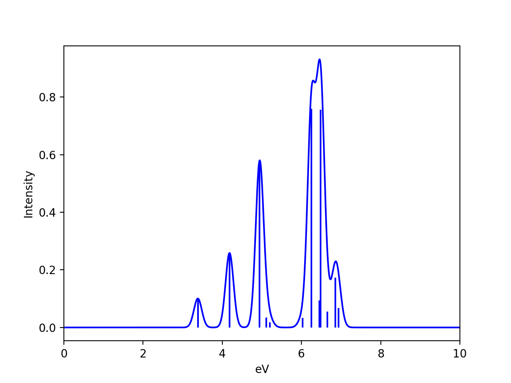
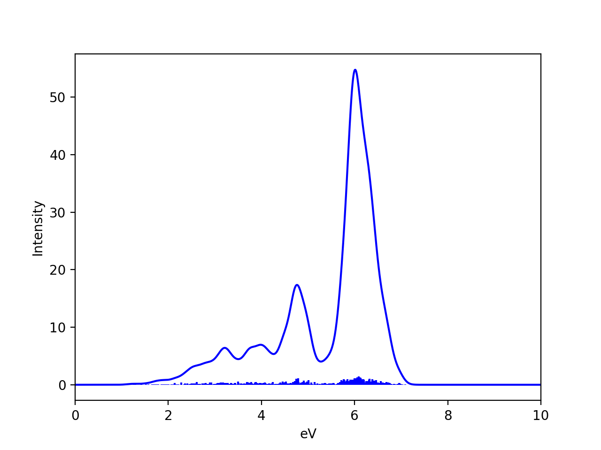

Ensemble averaging
======================================

Calculating an ensemble of structures instead of a single structure is a very simple way of approximately capturing 
vibrational and temperature dependent properties. 
Such an ensemble could be generated by a molecular dynamics simulation but here we demonstrate the simpler, cheaper alternative 
which is to utilize a Wigner distribution which generates a distribution of structures from the Hessian (i.e. harmonic approximation).

With a molecular ensemble available (from either Wigner or MD) it is straightforward to use ASH to perform ensemble-averaged calculations.

######################################################
Wigner sampling
######################################################

Calculation of a Wigner ensemble in ASH, requires simply previously minimized structure (at some level of theory) 
and the Hessian (at same level of theory). The ensemble is then easily generated by the **wigner_distribution** function (utilizes functionality within the geomeTRIC library):

.. code-block:: python

    def wigner_distribution(fragment=None, hessian=None, temperature=300, num_samples=100,normal_modes=None):

The function requires simply an ASH fragment, a 2D Numpy array of the Hessian, an input temperature and the number of samples.

The Hessian can be calculated by ASH via either the NumFreq or AnFreq function or a previously calculated Hessian can be read in (**read_hessian** function)
Below is a complete working example for generating a Wigner example for H2O using the xTB level of theory:

.. code-block:: python

    from ash import *

    #Define fragment and Opt/Freq theory
    frag = Fragment(databasefile="h2o.xyz", charge=0, mult=1)
    optfreq_theory = xTBTheory(xtbmethod="GFN2-XTB")
    #Optimize and calculate frequencies
    Optimizer(theory=optfreq_theory,fragment=frag)
    result_freq = NumFreq(fragment=frag, theory=optfreq_theory)
    #Generate Wigner ensemble
    wigner_frags = wigner_distribution(fragment=frag, hessian=result_freq.hessian, 
        temperature=300, num_samples=100)

The script above defines an ASH fragment for water, an XTBTheory object (GFN2-xTB method) and then performs a numerical frequency calculation
to generate the Hessian. The Hessian (part of result_freq object) is then passed to the **wigner_distribution** function which 
generates 100 structures at temperature of 300K. An XYZ-trajectory file, Wigner_traj.xyz, is written to disk that can be visualized (e.g. in VMD) and
the function returns a list (here named wigner_frags) that can be used directly for further calculations.
Note that the Wigner_traj.xyz trajectory-file can also be read separately like this: 

.. code-block:: python

    fragments = get_molecules_from_trajectory("Wigner_traj.xyz")

To perform an ensemble-averaged calculation 

######################################################
Examples:
######################################################

If a Wigner ensemble trajectory file (or a list of fragments containing the structures of the ensemble) is available, we can 
then simply loop over the fragments of the list, performing the desired calculation on each fragment. 

**IP ensemble average of H2O**

A simple example is to calculate the ensemble-averaged ionization energy.
Here we use GFN2-xTB for optimization and Hessian of water to get the Wigner ensemble.
We then loop over the ensemble structures and calculate the IP-EOM-CCSD ionization energy for each structure.

.. code-block:: python

    from ash import *

    numcores=4
    #Define fragment and Opt/Freq theory
    frag = Fragment(databasefile="h2o.xyz", charge=0, mult=1)
    optfreq_theory = xTBTheory(xtbmethod="GFN2-XTB", numcores=numcores)
    #Optimize and calculate frequencies
    Optimizer(theory=optfreq_theory,fragment=frag)
    result_freq = NumFreq(fragment=frag, theory=optfreq_theory)
    #Generate Wigner ensemble
    wigner_frags = wigner_distribution(fragment=frag, hessian=result_freq.hessian, 
        temperature=300, num_samples=100)

    #Define theory for IP calculation
    ipeom = ORCATheory(orcasimpleinput="! IP-EOM-CCSD def2-SVP tightscf", numcores=numcores)
    #Loop over fragments and perform IP-EOM calculation
    IPs=[]
    for frag in wigner_frags:
        #Perform single-point TDDFT calculation
        result = Singlepoint(theory=ipeom, fragment=frag)
        #Grab IP from output file

        IPs.append(ip)
    print("All IPs:", IPs)
    print("Ensemble average IP:", np.mean(IPs))
    print("Ensemble stdev. IP:", np.std(IPs))

Giving the following output:

.. code-block:: text

    All IPs: [11.591, 12.011, 12.184, 11.599, 11.883, 12.451, 11.918, 11.795, 11.895, 11.609, 11.842, 11.951, 11.607, 12.144, 12.146, 11.809, 11.865, 11.282, 11.512, 11.639,
    11.28, 11.485, 11.783, 11.778, 11.971, 12.152, 11.859, 11.999, 12.282, 11.554, 12.059, 12.195, 11.646, 11.767, 11.64, 11.623, 12.043, 11.657, 12.075, 12.476, 12.121, 12
    .084, 11.66, 11.727, 11.685, 12.09, 11.65, 11.54, 12.009, 12.045, 11.952, 11.678, 12.21, 11.911, 11.81, 11.762, 12.156, 11.732, 12.051, 11.798, 11.757, 12.054, 11.671, 1
    1.692, 11.956, 11.493, 11.351, 11.896, 12.362, 11.794, 11.696, 11.989, 11.683, 11.656, 11.875, 11.659, 12.008, 11.756, 11.883, 11.504, 11.414, 12.335, 11.741, 11.816, 12
    .107, 11.638, 12.089, 11.676, 11.819, 11.838, 11.407, 11.804, 11.781, 12.056, 11.84, 11.928, 12.012, 11.923, 11.598, 12.185]
    Ensemble average IP: 11.844699999999998
    Ensemble stdev. IP: 0.24641349394868786

**TDDFT ensemble average**

A slightly more complicated workflow is to calculate an ensemble-averaged TDDFT absorption spectrum.
Below we have already generated the ensemble, we then read in the Wigner ensembler trajectory, define the theory level and then loop over the fragments,
calculating a single-point TDDFT calculation for each fragment. The transition energies and intensities are collected and then in the end
fed to the plot_Spectrum function that applies Gaussian-broadening to every stick (from each fragment) and plots the final spectrum.

.. code-block:: python

    from ash import *
    #Read in ORCA functions to grab TDDFT results
    from ash.interfaces.interface_ORCA import tddftgrab,tddftintens_grab

    #Read in structures from trajectory as a list of ASH fragments
    fragments = get_molecules_from_trajectory("Wigner_traj.xyz")

    #Define theory (here a TDDFT calculation)
    tddft_theory = ORCATheory(orcasimpleinput="! PBE0 def2-TZVP tightscf CPCM(METHANOL)", TDDFT=True, TDDFTroots=20)

    #List of results
    all_trans_energies=[]
    all_trans_intensities=[]

    #Loop over fragments and perform TDDFT calculation
    for frag in fragments:
        #Perform single-point TDDFT calculation
        result = Singlepoint(theory=tddft_theory, fragment=frag)
        transition_energies = tddftgrab(f"{tddft_theory.filename}.out")
        transition_intensitites = tddftintens_grab(f"{tddft_theory.filename}.out")

        all_trans_energies += transition_energies
        all_trans_intensities += transition_intensitites
    
    # Plot spectrum (applies broadening to every stick)
    plot_Spectrum(xvalues=all_trans_energies, yvalues=all_trans_intensities, plotname='TDDFT', 
        range=[0,10], unit='eV', broadening=0.1, points=10000, imageformat='png', dpi=200, matplotlib=True, 
        CSV=True, color='blue', plot_sticks=True)

We can compare the spectrum for a single equilibrium structure and the Wigner-ensemble-average.
Here we have used the nitronapthalene molecule as an example (PBE0/def2-TZVP/CPCM TDDFT on B3LYP/def2-TZVP structures):

See the `excellent paper by González and coworkers <https://pubs.acs.org/doi/epdf/10.1021/acs.jctc.8b00198>`_  for a good discussion of vibrational sampling of nitronapthalene.
As discussed, better agreement with experiment can be obtained by going from implicit solvation (CPCM) to explicit (QM/MM) and use an ensembler from a QM/MM MD trajectory instead.

Note that the results will of course also depend on the value chosen for the broadening of each stick (here 0.1 eV was chosen), the number of points and the shape of the lineshape function (here a Gaussian).
The Wigner ensemble is not expected to be highly accurate and will not compare favorably against high-resolution vibrationally resolved experimental spectra.
It can capture basic vibrational broadening, within the limits of the harmonic approximation.

**NMR chemical shift ensemble average**

Example not ready.