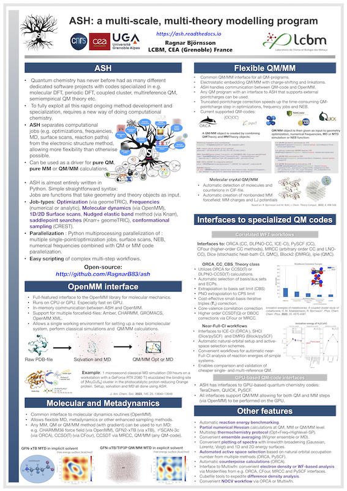

.. Ash documentation master file, created by
   sphinx-quickstart on Mon Jan 27 14:15:55 2020.
   You can adapt this file completely to your liking, but it should at least
   contain the root `toctree` directive.

.. meta::
   :google-site-verification: 5qignFHfdjABkOliMOSjdGHeSs7Pbg7X6kLzzpkCtSY

ASH: Documentation
======================================

ASH is a Python-based computational chemistry and multiscale modelling program
designed for ultimate flexibility. This works by separating the Hamiltonians (of the QM or MM programs) from the 
typical jobtypes of computational chemistry (optimization, frequencies, MD, scans etc.).
The program is open-source and the code is available on `Github <https://github.com/RagnarB83/ash>`_

The program allows for convenient ways of doing single-point calculations, geometry optimizations, surface scans, 
nudged elastic band optimizations, molecular dynamics and numerical frequencies using any MM or QM method in a program for which there is an interface.
MM and QM objects are easily combined into QM/MM objects.
ASH is a great solution for automating workflows and performing multi-scale and multi-theory calculations.
Interfaces are available to various popular QM codes, such as ORCA, xTB, CP2K, Psi4, PySCF, ccpy, Dalton, MRCC, CFour, MNDO, Terachem, QUICK, Gaussian, NWChem. 
Reaction profiles and saddlepoint optimizations can be performed using the nudged elastic band method (NEB).

..
   .. raw:: html

      

      
      

The program is  developed in the research group of 
`Dr. Ragnar Bjornsson <https://sites.google.com/site/ragnarbjornsson/home>`_ in the `CoMX group <https://www.cbm-lab.fr/en/COMX>`_ , of the 
`Laboratory for Chemistry and Biology of Metals <https://www.cbm-lab.fr/en>`_,
at the `CEA <https://www.cea.fr>`_ in Grenoble, France.

Curious?
Try it out in a Google Colab notebook: `ASH in Google Colab <https://colab.research.google.com/drive/11-FG7eTElCvcMNZiTIEXcdWjcR4YWRS-#scrollTo=ViPg1cGuck_a>`_

.. toctree::
   :maxdepth: 2
   :caption: ASH

   About
   setup
   basics
   basic-examples
   ash_program_philosophy
   coordinate-input
   parallelization
   QM-interfaces
   scientific_articles

.. toctree::
   :maxdepth: 2
   :caption: Jobtypes

   job-types
   singlepoint
   Geometry-optimization
   module_freq
   module_dynamics
   Biased-sampling
   neb
   surfacescan

.. toctree::
   :maxdepth: 2
   :caption: Tools

   coordinate-tools
   
.. toctree::
   :maxdepth: 2
   :caption: MM and Hybrid theories

   MM-interfaces
   OpenMM-interface
   module_Hybrid_Theory
   module_QM-MM
   module_ONIOM
   Machine_learning_in_ASH

.. toctree::
   :maxdepth: 2
   :caption: Workflows

   ensemble_averaging
   elstructure_analysis
   module_workflows
   module_highlevel_workflows
   specific_workflows
   module_benchmarking
   module_molcrys
   module_PES
   module_plotting

.. toctree::
   :maxdepth: 2
   :caption: Interfaces

   ORCA-interface
   xTB-interface
   DFTB+-interface
   CP2K-interface
   MRCC-interface
   CFour-interface
   Dalton-interface
   PySCF-interface
   ccpy-interface
   Dice-interface
   Block-interface
   Psi4-interface
   crest-interface
   QUICK-interface
   NWChem-interface
   Gaussian-interface
   TeraChem-interface
   Multiwfn-interface
   MNDO-interface
   MLatom-interface
   torch_interface
   MACE-interface
   helper_programs

.. toctree::
   :maxdepth: 2
   :caption: Tutorials

   Explicit-solvation
   Metalloprotein-I
   Metalloprotein-II
   mtd_tutorial
   protein_ligand_binding
   QM-MM-protein
   QM-MM-boundary_tutorial
   workflows-examples
   Highlevel_CC_CBS_workflows
   Highlevel-density-analysis
   Density-inversion
   Tutorial_fast_QM_MM_MD
   Dev-writing-newQMinterface

.. role:: underline
    :class: underline

.. warning:: This is ASH version 0.9. Use at your own risk!

Indices and tables
==================

* :ref:`genindex`
* :ref:`modindex`
* :ref:`search`
