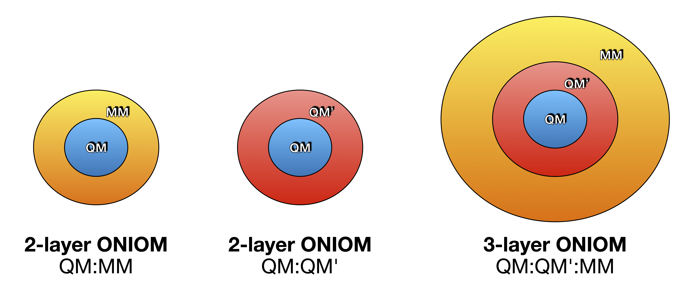

ONIOM
==========================

ONIOM is a type of multilevel method (see :doc:`module_Hybrid_Theory`) where 2 or more different theory-levels for different parts of the system are combined to give a combined description of the system. 
The purpose is usually to approximate a high-level theory description of the whole system (usually out of reach directly) by a combination of a high-level-theory description of the important part of the system and a low-level-theory description of the environment part of the system.
Overall, this is similar to QM/MM methodology (see :doc:`module_QM-MM`) but works a little differently and has more flexilibity in defining the various high-level and low-level theories.

In particular the ability to combine 2 (or potentially more) QM-levels of theory (such as DFT and semi-empirical or WFT and DFT) offers particularly interesting 
multilevel method strategies.
The advantage of using a program like ASH for ONIOM unlike QM-programs with built-in ONIOM capability, 
is that ASH offers the ability to perform ONIOM calculations by combining QM-levels of theory from multiple QM programs, 
as long as interfaces are available.

An ONIOMTheory can be used for geometry optimizations, surface scans, NEB calculations, molecular dynamics etc.
As long as all theory components of an ONIOMTheory object are capable of producing a gradient, then these job-types will automatically work.

######################################################
The basics of ONIOM
######################################################

ONIOM uses a subtractive expression (unlike QM/MM where an additive expression is usually used).
The simplest 2-layer ONIOM description looks like this

**2-layer ONIOM**

.. math::

    E_{ONIOM} = E^{LL}_{12} + E^{HL}_{1} - E^{LL}_{1}

The 2-layer ONIOM method requires a low-level theory (LL) energy evaluation for the full system (labeled 12), a high-level theory (HL) calculation of the important part of the system (region 1) and a low-level theory (LL) calculation of the same region 1 (to avoid double-counting).
While this is very similar to QM/MM there are some differences:

- A full LL description of the whole system is required (if LL is MM then MM parameters for the core region are required).
- The LL theory does not have to be MM but can also be a lower-level QM theory (e.g. semi-empirical QM or a cheap DFT treatment).
- The coupling between HL and LL works a little differently than in QM/MM.

**3-layer ONIOM**

.. math::

    E_{ONIOM} = E^{LL}_{123} + (E^{HL}_{1} - E^{ML}_{1}) + (E^{ML}_{2} - E^{LL}_{2})

The 3-layer ONIOM method requires 3 levels of theory, a low-level theory (LL),  a high-level theory (HL) and a medium-level (ML).

Note: 3-layer ONIOM is currently only available for energies, not gradients yet.

**n-layer ONIOM**

While more n-layer ONIOM expressions are in principle possible, they are not available in ASH for now and it is unclear how useful they would be in practice.

######################################################
ONIOMTheory
######################################################

**ONIOM** is an ASH Theory class that wraps two different theory objects to get a combined theory description. 

.. code-block:: python

    class ONIOMTheory(Theory):
    def __init__(self, theories_N=None, regions_N=None, regions_chargemult=None,
                 embedding="mechanical", full_pointcharges=None, chargemodel="CM5", dipole_correction=False,
                 fullregion_charge=None, fullregion_mult=None, fragment=None, label=None, 
                 chargeboundary_method="shift", excludeboundaryatomlist=None,
                 linkatom_method='ratio', linkatom_simple_distance=None, linkatom_forceproj_method="adv",
                 linkatom_ratio=0.723, printlevel=2, numcores=1):

**ONIOMTheory** options:

.. list-table::
   :widths: 15 15 15 60
   :header-rows: 1

   * - Keyword
     - Type
     - Default value
     - Details
   * - ``theories_N``
     - list
     - None
     - | Required: A list of ASH Theory objects to use in n-layer ONIOM.
   * - ``theories_N``
     - list of lists
     - None
     - | Required: A list of lists of atom indices defining the 2 or 3 regions.
   * - ``fragment``
     - ASH Fragment
     - None
     - Required: ASH fragment, needed for setting up the regions.
   * - ``fullregion_charge``
     - integer
     - None
     - | Required: Specify the charge of the entire system
   * - ``fullregion_mult``
     - integer
     - None
     - | Required: Specify the charge of the entire system
   * - ``embedding``
     - string
     - 'mechanical'
     - | The coupling between the different theory levels. Options: 'mechanical', 'elstat'
   * - ``full_pointcharges``
     - list
     - None
     - | For embedding='elstat', a list of atomic charges for Full-system 
   * - ``chargemodel``
     - string
     - 'CM5'
     - | For embedding='elstat', if full_pointcharges not defined, how to define atomic charges from Full-system using ORCATheory.
   * - ``excludeboundaryatomlist``
     - list
     - None
     - Optional: List of atoms that are excluded from adding linkatoms to.
   * - ``chargeboundary_method``
     - string
     - chargeshift
     - | What chargeboundary method to use for covalent ONIOM boundary. 
       | Default option: shift' . Other option: 'rcd'
   * - ``dipole_correction``
     - Boolean
     - True
     - | For chargeboundary='shift', whether to add additional charges to preserve dipole
   * - ``linkatom_method``
     - string
     - 'ratio'
     - | What linkatom method to use. Options: 'simple', 'ratio'
   * - ``linkatom_simple_distance``
     - float
     - None
     - | For linkatom_method='simple', what QM1-L linkatom distance to use. Default setting is 1.09 Å.
   * - ``linkatom_ratio``
     - float
     - 0.723
     - | For linkatom_method='ratio', what ratio to use. Default is 0.723.
   * - ``linkatom_forceproj_method``
     - string
     - 'adv'
     - | What linkatom force projection method to use. Options: 'adv', 'lever'
   * - ``printlevel``
     - integer
     - 2
     - | Optional: The printlevel setting. If printlevel >= 3 then more printing
       | and gradient files are written to disk.
   * - ``numcores``
     - integer
     - 1
     - | Optional: Number of CPU cores to use for qm_theory. If defined, takes
       | precedence over QMTheory setting.

######################################################
Embedding options
######################################################

*Mechanical embedding*

The standard and the most flexible ONIOM scheme can be described as utilizing a mechanical embedding scheme (similar to mechanical embedding in QM/MM).
What this means is that the coupling between the 2 regions (here 2-layer ONIOM) is calculated at the low-level theory during the calculation of the full system, via the :math:`E^{LL}_{12}` term.
If the LL theory is a classical MM theory then this is very similar to QM/MM where the electrostatic coupling takes place via pointcharge-interactions between both regions, 
the vdW term via Lennard-Jones potentials and covalent boundaries via MM bonded terms (as well as linkatoms).
However, if the LL theory is a QM-theory then the coupling between regions is in a sense more QM in nature as the LL theory is a QM theory.
A potential drawback of this approach is that the HL (and LL) calculation of region1 takes place entirely without any environment present. 
For systems with strong polarization effects between regions this could results in some artifacts. 
A pragmatic solution is to increase the size of region1 to include more of the environment and reduce this effect.

*Electrostatic embedding*

The :math:`E^{HL}_{1} - E^{LL}_{1}` terms in 2-layer ONIOM can be viewed as a high-level correction to the low-level description of the whole system ( the :math:`E^{LL}_{12}` term).
As discussed above this correction is calculated without the environment present which could result in artifacts.
It is possible to include electrostatic embedding in the ONIOM calculation to allow for some region polarization effects to be present during the calculation of the correction.
This requires MM pointcharges to be defined for the full system, regardless of whether the LL theory is an MM-theory or not.
To use electrostatic embedding within ONIOM in ASH, one sets *embedding*='elstat' and additionally the charges of the whole system have to be specified.
ASH allows 2 ways to define these charges:

- By specifying a list of atomic charges for the full system: *full_pointcharges* keyword. Requires the charges to be defined manually.
- If LL is MM: By taking the charges from the MM-theory used (happens automatically if the LL theory is an OpenMMTHeory or NonBondedTheory object)
- If LL is QM: By having the charges automatically calculated by the low-level QMTheory object during the full system calculation.
   This option is only available for an ORCATheory object or an xTBTheory object. For an ORCATheory object, one can choose between Hirshfeld or CM5 charges by specifying 
   the  *chargemodel* keyword.

TODO: Add details about 3-layer ONIOM.

######################################################
Covalent boundaries
######################################################

Like in QM/MM it is also possible to define ONIOM regions that cross a covalent bond.
We use the linkatom strategy where a hydrogen linkatom is used to cap the dangling QM-bond of a QM-theory region during the calculation
of the :math:`E^{HL}_{1} - E^{LL}_{1}` terms in 2-layer ONIOM.

See (see :doc:`module_QM-MM`) for discussion about the linkatom-strategy as it works the same in QMMMTheory and ONIOMTheory,
with the same options available: *linkatom_method*, *linkatom_simple_distance*, *linkatom_ratio*, *linkatom_forceproj_method*.

When mechanical embedding is used, with or without linkatoms, the description of the boundary between regions is fairly straightforward.
The linkatoms are present during the QM-calculations of region 1 (2-layer ONIOM) but are invisible to LL-theory calculation of the full-system.
The linkatom force is projected onto the boundary atoms.

However, in electrostatic embedding, the presence of the linkatom, as well as a bonded MM atom being so close, creates problems, 
that if not treated this would lead to some artifical overpolarization.
To prevent this overpolarization, the atom charge of the MMatom is traditionally shifted towards its bonded neighbours 
(MM2 atoms) with some kind of dipole correction also applied.

ASH includes 2 different chargeboundary-methods for preventing overpolarization at the QM-MM boundary which are controlled 
by the *chargeboundary_method* keyword in the ONIOMTheory object.

See :doc:`module_QM-MM` , section **QM/MM boundary treatment: mechanical vs. electrostatic embedding**, 
for more details about the chargeboundary-methods. They work the same in ONIOMTheory and QMMMTheory.

######################################################
Examples
######################################################

**2-layer QM/QM2 ONIOM with mechanical embedding**

In a regular QM/QM2 ONIOM calculation, the energy and gradient is simply defined by the combination of the low-level theory for the whole region and a low-level -> high-level correction for region 1 (the important region).
The correction for region 1 is calculated without region 1 "sensing" the environmental-effect of region 2. 
We refer to this as mechanical embedding here since there is no polarization effect present during the correction part (the polarization effect between regions being present, however, in the full region calculation).

.. code-block:: python

    from ash import *

    #Peptide pair
    frag = Fragment(xyzfile="full.xyz")

    #Region definitions
    region1_atoms=list(range(0,11+1))
    #Region 2 defined as the difference between all-atoms and Region1-atoms
    region2_atoms=listdiff(frag.allatoms,region1_atoms)

    #HL and LL theory objects
    ORCA = ORCATheory(orcasimpleinput="!revPBE D4 def2-TZVP def2/J tightscf", orcablocks="")
    xtb = xTBTheory(xtbmethod="GFN2")

    #ONIOMTheory object
    oniom = ONIOMTheory(fragment=frag, theories_N=[ORCA,xtb], regions_N=[region1_atoms,region2_atoms],
        fullregion_charge=0, fullregion_mult=1, regions_chargemult=[[0,1],[0,1]], embedding="mechanical")

    #Single-point energy calculation of ONIOM object
    result = Singlepoint(theory=oniom, fragment=frag, charge=0, mult=1, Grad=True)

**2-layer QM/QM2 ONIOM with electrostatic embedding**

It is possible to allow polarization effects to be present during the low-level -> high-level correction by enabling electrostatic embedding (embedding="Elstat").
This can be thought of as a semi-classical polarization effect affecting the introduction of the high-level part.
This should be somewhat more realistic, especially if there are larger polarization effects present between regions.

.. code-block:: python

    from ash import *

    #Peptide pair
    frag = Fragment(xyzfile="full.xyz")

    #Region definitions
    region1_atoms=list(range(0,11+1))
    #Region 2 defined as the difference between all-atoms and Region1-atoms
    region2_atoms=listdiff(frag.allatoms,region1_atoms)

    #HL and LL theory objects
    ORCA = ORCATheory(orcasimpleinput="!revPBE D4 def2-TZVP def2/J tightscf", orcablocks="")
    xtb = xTBTheory(xtbmethod="GFN2")

    #ONIOMTheory object
    oniom = ONIOMTheory(fragment=frag, theories_N=[ORCA,xtb], regions_N=[region1_atoms,region2_atoms],
        fullregion_charge=0, fullregion_mult=1, regions_chargemult=[[0,1],[0,1]], embedding="elstat")

    #Single-point energy calculation of ONIOM object
    result = Singlepoint(theory=oniom, fragment=frag, charge=0, mult=1, Grad=True)

######################################################
More Examples: Flexible theory handling
######################################################

As the ONIOM implementation in ASH is so general, it is possible to perform ONIOM by combining almost any
theory levels, including different external programs such as xTB and ORCA in the examples above. 
One could also combine a QM-theory with a machine-learning (ML) interatomic potential through the respective interface etc. (see :doc:`Machine_learning_in_ASH`).

It is even possible for an ONIOMTheory to be combined with other hybrid-theory approaches in ASH. 

*Wrapping ONIOMTheory with another object*

An ONIOMTheory object can be combined into a WrapTheory object (see :doc:`module_Hybrid_Theory`).
This could e.g. be used to combine an ONIOMTheory with a  :math:`\Delta`-ML correction in an additive way,
(see :doc:`Machine_learning_in_ASH`) as in the example below:

.. code-block:: python

    from ash import *

    #Peptide pair
    frag = Fragment(xyzfile="full.xyz")

    #Region definitions
    region1_atoms=list(range(0,11+1))
    #Region 2 defined as the difference between all-atoms and Region1-atoms
    region2_atoms=listdiff(frag.allatoms,region1_atoms)

    #HL and LL theory objects
    ORCA = ORCATheory(orcasimpleinput="!revPBE D4 def2-TZVP def2/J tightscf", orcablocks="")
    xtb = xTBTheory(xtbmethod="GFN2")

    #ONIOMTheory object
    oniom = ONIOMTheory(fragment=frag, theories_N=[ORCA,xtb], regions_N=[region1_atoms,region2_atoms],
        fullregion_charge=0, fullregion_mult=1, regions_chargemult=[[0,1],[0,1]], embedding="elstat")

    #A Pre-trained machine-learning correction
    ml = MACETheory(model_file="trained_deltaML.model")

    # Combining ONIOM and ML objects in a WrapTheory object
    #DeltaML correction is here defined to only a subset of atoms (here Region1)
    wraptheory = WrapTheory(theories=[oniom,ml], theory2_atoms=region1_atoms)

*Combining other hybrid theories into an ONIOMTheory object*

A more elaborate hybrid strategy is even possible where a QM/MM object is combined into an ONIOMTheory object with another theory.
Below, we first define a QMMMTheory object by combining a QM-theory (xTBTheory) with an MM-theory (OpenMMTheory) with the default electrostatic embedding.
We then define a machine-learning theory (MACETheory) that uses a foundational MACE-ML-model trained on the large OMol dataset.
By combining the QMMMTheory and MACETheory objects in the subtractive 2-layer ONIOM scheme we can effectively correct
Region1 with another theory. The QMMMTheory object here acts as a low-level (LL) theory for the whole system while MACETheory acts as 
a high-level theory (HL) for Region 1 alone.

.. math::

    E_{ONIOM} = E^{LL}_{12} + E^{HL}_{1} - E^{LL}_{1}

This strategy is suitable here because it incorporates electrostatic embedding via QM/MM using a supported QM-theory (xTB) in the low-level theory,
while we use an ML-model to make a correction in region 1 (an ML-theory does not support electrostatic embedding). 
This would not be possibly by the ONIOM-definition alone.

.. note:: The use of a QMMMTheory within an ONIOM scheme works here because ASH automatically recognizes the nature of the theory-object
  when calculating the low-level-Region 1 term (last term in equation above) and only performs a plain QMTheory-calculation on region 1 in the calculation.

.. code-block:: python

  from ash import *

  # H2O...MeOH fragment defined. Reading XYZ file
  frag = Fragment(xyzfile=f"h2o_MeOH.xyz")
  pdbfile="h2o_MeOH.pdb"
  #Defining QM-region / Region1
  qmatoms=[3,4,5,6,7,8]
  #Defining Region II
  region2atoms = listdiff(frag.allatoms,qmatoms)

  # QM theory
  qm = xTBTheory()
  # MM: OpenMMTheory using XML-file
  mm = OpenMMTheory(xmlfiles=[f"MeOH_H2O-sigma.xml"], pdbfile=pdbfile, autoconstraints=None, rigidwater=False)
  # Creating QM/MM object
  qm_mm = QMMMTheory(fragment=frag, qm_theory=qm, mm_theory=mm, qmatoms=qmatoms,
                          embedding='Elstat', qm_charge=0, qm_mult=1)
  # ML theory
  ml = MACETheory(model_file="../MACE-omol-0-extra-large-1024.model")

  #Combining everything into an ONIOMTheory
  oniom = ONIOMTheory(theories_N=[ml,qm_mm], regions_N=[qmatoms,region2atoms], regions_chargemult=[[0,1],[0,1]],
                  embedding="mechanical", fragment=frag, fullregion_charge=0, fullregion_mult=1)

  # Single-point energy calculation of ONIM object
  result = Singlepoint(theory=oniom, fragment=frag, Grad=True)