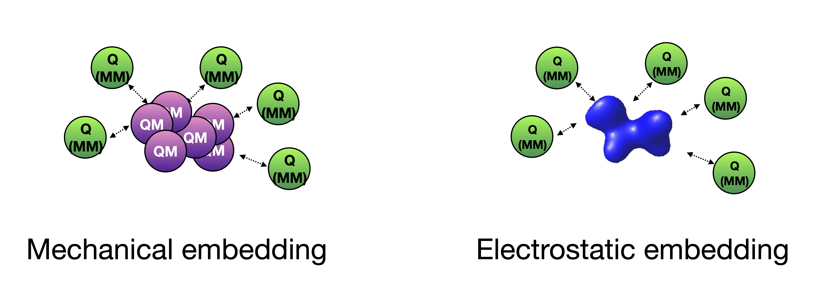

QM/MM Theory
==========================

.. image:: figures/qm_mm_more.png
   :align: center
   :width: 600

QM/MM is a type of multilevel method (see :doc:`module_Hybrid_Theory`) where a QM theory-level and an MM-theory level are used for different parts of the system to give a combined description of the system. 
The purpose is usually to approximate the QM-theory description of the whole system (usually out of reach) by replacing most of the system by a classical MM-theory while retaining a quantum description of the important part of the system.

The method can be described by the equations:

.. math::

    E_{QM/MM} = E_{QM} + E_{MM} + E_{coupling} 

    E_{coupling} = E_{elstat} + E_{vdW} + E_{covalent}

where :math:`E_{QM}` is the QM-energy of the QM-region, :math:`E_{MM}` is the MM-energy of the MM-region and  :math:`E_{coupling}` is the interaction between the QM and MM region. The coupling terms account for electrostatic, vdW and covalent (bonded) interactions between the QM and MM regions.

QM/MM in ASH is highly flexible as one can combine any QM-theory in ASH with an MMTheory object of class NonbondedTheory (see :doc:`MM-interfaces`) or OpenMMTheory (see :doc:`OpenMM-interface`).
One simply needs to combine a defined QMtheory object (:doc:`QM-interfaces`) and an MMtheory object (usually OpenMMTheory, see :doc:`OpenMM-interface`) within a QMMMTheory object.
Additionally one specifies which atoms are QM and which are MM and the type of QM-MM coupling (either mechanical or electrostating embedding).
Note that in contrast to a QMtheory object or an MMtheory object, we also pass a fragment object to a QMMMTheory object as the atom-information is needed for defining the division of QM-region and MM-regions.

######################################
QMMMTheory class
######################################

.. code-block:: python
 
  class QMMMTheory:
      def __init__(self, qm_theory=None, qmatoms=None, fragment=None, mm_theory=None, charges=None,
                  embedding="elstat", printlevel=2, numcores=1, actatoms=None, frozenatoms=None, excludeboundaryatomlist=None,
                  unusualboundary=False, openmm_externalforce=False, TruncatedPC=False, TruncPCRadius=55, TruncatedPC_recalc_iter=50,
                  qm_charge=None, qm_mult=None, chargeboundary_method="shift",
                  dipole_correction=True, linkatom_method='simple', linkatom_simple_distance=None,
                  linkatom_forceproj_method="adv", linkatom_ratio=0.723):

**QMMMTheory** options:

.. list-table::
   :widths: 15 15 15 60
   :header-rows: 1

   * - Keyword
     - Type
     - Default value
     - Details
   * - ``qm_theory``
     - ASHTheory
     - None
     - | Required: The theory level for the QM-region. Must be a valid ASH Theory
       | that supports electrostatic embedding.
   * - ``qmatoms``
     - list
     - None
     - | Required: List of QM-atom indices that defined the QM-region. Atoms not
       | in list are treated as MM atoms.
   * - ``mm_theory``
     - ASHTheory
     - None
     - | Required: The theory level for the MM-region. Must be an object of class
       | OpenMMTheory or NonbondedTheory.
   * - ``fragment``
     - ASH Fragment
     - None
     - Required: ASH fragment, needed for setting up QM-region and MM-region.
   * - ``qm_charge``
     - integer
     - None
     - | Optional: Specify the charge of the QM-region. This takes precedence
       | over other charge specifications.
   * - ``qm_mult``
     - integer
     - None
     - | Optional: Specify the spin multiplicity of the QM-region. This takes
       | precedence over other mult specifications.
   * - ``charges``
     - list
     - None
     - | Optional: list of atom charges. If not defined then charges will be read
       | from mm_theory.
   * - ``printlevel``
     - integer
     - 2
     - | Optional: The printlevel setting. If printlevel >= 3 then more printing
       | and gradient files are written to disk.
   * - ``numcores``
     - integer
     - 1
     - | Optional: Number of CPU cores to use for qm_theory. If defined, takes
       | precedence over QMTheory setting.
   * - ``excludeboundaryatomlist``
     - list
     - None
     - Optional: List of atoms that are excluded from adding linkatoms to.
   * - ``unusualboundary``
     - Boolean
     - False
     - Optional: Boundary-option: overrides ASH from quitting if an unusual QM-MM boundary is found. 
   * - ``openmm_externalforce``
     - Boolean
     - False
     - Optional: Option for passing QM/MM force as an external force to OpenMMTheory.
   * - ``TruncatedPC``
     - Boolean
     - False
     - Optional: Truncated Pointcharge Option on or off.
   * - ``TruncPCRadius``
     - float
     - 55
     - Optional: Truncated PC option; Radius (Å) for the truncated PC region.
   * - ``TruncatedPC_recalc_iter``
     - integer
     - 50
     - Optional: Truncated PC option; frequency for recalculating with full PC field.
   * - ``actatoms``
     - list
     - None
     - | Optional: List of active atoms in QM/MM. NOTE: Only compatible if
       | mm_theory is of NonBondedTheory class.
   * - ``frozenatoms``
     - list
     - None
     - | Optional: List of frozen atoms in QM/MM, alternative to actatoms. 
       | NOTE: Only compatible if mm_theory is of NonBondedTheory class.
   * - ``chargeboundary_method``
     - string
     - shift
     - | What chargeboundary method to use for covalent QM-MM boundary. 
       | Default option: shift' . Other option: 'rcd'
   * - ``dipole_correction``
     - Boolean
     - True
     - | For chargeboundary='shift', whether to add additional charges to preserve dipole
   * - ``linkatom_method``
     - string
     - 'simple'
     - | What linkatom method to use. Options: 'simple', 'ratio'
   * - ``linkatom_simple_distance``
     - float
     - None
     - | For linkatom_method='simple', what QM1-L linkatom distance to use. Default setting is 1.09 Å.
   * - ``linkatom_ratio``
     - float
     - 0.723
     - | For linkatom_method='ratio', what ratio to use. Default is 0.723.
   * - ``linkatom_forceproj_method``
     - string
     - 'adv'
     - | What linkatom force projection method to use. Options: 'adv', 'lever'

Dummy example showing how to combine a QMTheory and MMTheory object into a QMMMTheory object:

.. code-block:: python

    #QM theory: xTB
    qm = xTBTheory(xtbmethod='GFN1')

    #Creating new OpenMM object from OpenMM XML files (built-in CHARMM36 and a user-defined one)
    omm = OpenMMTheory(xmlfiles=["charmm36.xml", "charmm36/water.xml", "./specialresidue.xml"], pdbfile="topology.pdb", 
              periodic=True, platform='CPU', numcores=numcores, autoconstraints=None, rigidwater=False)

    #QM/MM theory object. QM-region defined as atom indices 500,501,502 and 503
    qmmm = QMMMTheory(qm_theory=qm, mm_theory=omm, fragment=fragment, embedding="elstat", 
              qmatoms=[500,501,502,503], printlevel=2, qm_charge=-1, qm_mult=6)

##################################################################
Defining the charge and spin multiplicity of the QM-region
##################################################################

To define the charge and spin multiplicity of the QM-region in QM/MM calculations you can choose between 3 options:

\- Define qm_charge and qm_mult attributes when defining the QMMMTheory object (**recommended**):

.. code-block:: python

    qmmm = QMMMTheory(qm_theory=qm, mm_theory=omm, fragment=frag, qm_charge=-1, qm_mult=6)

\- Define as input to the job-function (e.g. Singlepoint):

.. code-block:: python

    Singlepoint(theory=qmmm, fragment=frag, charge=-1, mult=6)

\- Provide the information in the fragment definition:

.. code-block:: python

    frag=Fragment(xyzfile="system.xyz", charge=-1, mult=6)

This information will be passed onto the QM-program when called. The qm_charge/qm_mult option takes precedence over the other options, followed by the job-type keyword.

Note that the specified charge and multiplicity of the QM-region needs to be consistent with what chemical groups are present in the QM-region. 

######################################
Defining QM-region and active region
######################################

The QM-region needs to be defined in the QMMMTheory object by specifying which atom indices (of the full system) should be QM-atoms (everything else is MM).

.. code-block:: python

    qmmm = QMMMTheory(qm_theory=qm, mm_theory=omm, fragment=fragment, 
              qmatoms=[500,501,502,503], qm_charge=-1, qm_mult=6)

Similarly the active-region (when performing a geometry optimization) needs to be defined by specifying which atoms are allowed to move.
This information should be provided to the Optimizer instead (not the QMMMTheory object). 

.. code-block:: python

    Optimizer(fragment=fragment, theory=QMMMobject, ActiveRegion=True, actatoms=[400,450,500,501,502,503,550,600,700])

Note that for MD simulations one should use the frozenatoms option instead of actatoms.

Both the QM-region and Active regions are thus defined as simple Python lists of integers (corresponding to atom indices).
This approach allows you considerable flexibility in defining the QM/MM job. The QM-regions and active regions can be the same or different (quite common).

Definition of the QM-region when part of a larger molecule (e.g. a protein) requires a bit of insight into the system and knowledge of how the QM/MM boundary works (see next section).
It is usually best to define the QM-region by manually creating the list of atoms. 
One can double-check whether the region is correct by using the **fragedit.py** script (see :doc:`coordinate-tools`) or check the QM-region coordinates printed in the ASH output.

The active region is typically much larger than the QM-region (for a protein, an active region of approx. 1000 atoms is common)
and it is usually inconvenient to define it manually. ASH provides a convenient function **actregiondefine** (see :doc:`coordinate-tools`) to define
such a large list of atom indices. This function can also be used to define the QM-region.

As these lists can be large it is convenient to read them from a file. 
ASH provides a function **read_intlist_from_file** (see :doc:`coordinate-tools`) to read a list of integers from a file and return a Python list.
The file should contain integers separated by spaces or newlines.

.. code-block:: python

    qmatoms = read_intlist_from_file("qmatoms")
    actatoms = read_intlist_from_file("active_atoms")

    qmmm = QMMMTheory(qm_theory=qm, mm_theory=omm, fragment=fragment, 
                qmatoms=qmatoms, qm_charge=-1, qm_mult=6)
    Optimizer(fragment=fragment, theory=QMMMobject, ActiveRegion=True, actatoms=actatoms)

.. note::  Note that if one wants to use an active region in MD simulations at the QM/MM level one would have to define frozenatoms inside the OpenMMTheory object.

####################################################################
QM/MM coupling: mechanical vs. electrostatic embedding
####################################################################

QM/MM typically comes in 2 flavours: mechanical embedding and electrostatic embedding. The approaches differ in how the the QM/MM energy expression is actually constructed:

.. math::

    E_{QM/MM} = E_{QM} + E_{MM} + E_{coupling} 

    E_{coupling} = E_{elstat} + E_{vdW} + E_{covalent}

Mechanical embedding is the simplest QM/MM coupling scheme where the  :math:`E_{elstat}` term is calculated at the MM-level as a classical Coulomb term of pointcharge interactions between the QM and MM regions.
Choose *embedding* = 'mechanical' when defining the QMMMTheory object to use mechanical embedding.
Mechanical embedding requires pointcharges to be defined for each atom inside the QM-region which can introduce problem if the QM-region contains exotic entities such as metal complexes or clusters, and the QM-region atom charge definitions will requires some care.
The main drawback of mechanical embedding is that the QM-energy of the QM-region (:math:`E_{QM}`) is calculated entirely without any environment present. For systems with strong polarization effects between regions this can be a major drawback.

Electrostatic embedding is a more sophisticated QM/MM coupling scheme where the :math:`E_{elstat}` term is calculated at the QM-level, by calculating it at the same time as the (:math:`E_{QM}`) term via the QM-program.
Choose *embedding* = 'elstat' when defining the QMMMTheory object to use electrostatic embedding (it is the default).
By including all MM pointcharges as additional nuclei-like terms in the 1-electron Hamiltonian of the QM-energy expression, the QM-energy is calculated in a field of the MM pointcharges, i.e. the QM electron density is polarized by the environment.
The :math:`E_{vdW}` is in contrast calculated at the MM-level as a classical Lennard-Jones term between the QM and MM regions and is calculated at the same time as the MM-energy of the MM-region. The covalent bonded term (:math:`E_{covalent}`) also gets incorporated in the MM-energy calculation (though the linkatom part is handled by the QM-part).
This means that in electrostatic embedding the QM/MM energy expression is actually calculated like this:

.. math::

    E_{QM/MM} = (E_{QM} + E_{elstat}) + (E_{MM} + E_{vdW} + E_{covalent}) = E_{QM}^{pol} + E_{MM}^{mod}

where the :math:`E_{QM}^{pol} = (E_{QM} + E_{elstat})` term is calculated simultaneously as one term by the QM-program while the :math:`E_{MM}^{mod} = (E_{MM} + E_{vdW} + E_{covalent})` term is calculated as one term by the MM-program. 
The presence of the MM pointcharges during the QM-calculation has the effect of the QM-calculation sensing the electrostatic part of the environment, the QM-density will be (mostly) correctly polarized and hence QM properties will also be more realistic.
Electrostatic embedding is considered the standard QM/MM coupling scheme and is the default in ASH. It is more sophisticated than mechanical embedding and is usually the preferred choice for QM/MM calculations.
The drawbacks of electrostatic embedding are :

- It can only be used if the QM-program supports pointcharge embedding (including gradients on pointcharges). ASH currently supports pointcharge embedding for programs: ORCA, CFour, MRCC, xTB, pySCF, NWChem, QUICK, CP2K, MNDO, TeraChem.
- The presence of a large number of MM pointcharges in the QM-calculation can slow down the QM-calculation considerably. Especially the QM-pointcharge gradient can be slow to calculate. See the *TruncatedPC* option below for a way to deal with this issue.
- It requires some care in the handling of the covalent QM/MM boundary (see next sections on linkatoms, charge-shifting etc.)

See later one this page how to do further decomposition of the QM/MM energy.

More sophisticated polarized embedding approaches are not yet available in ASH.

######################################
QM/MM boundary treatment: linkatoms
######################################

If the QMregion-MMregion boundary is between two bonded atoms, then a boundary correction needs to be applied as the QM-region will otherwise have a dangling bond, which would result in artifacts.
In ASH this is treated by the popular linkatom method where a hydrogen-linkatom is added to cap the QM-subsystem. The hydrogen linkatoms are only visible to the QM theory, not the MM theory. The linkatoms are only used temporarily (automatically created and deleted) during the calculation of the QM-part and are never part of the system.

The need for a linkatom is automatically detected by ASH by noticing that 2 boundary atoms (QM1 and MM1) are bonded to each other according to connectivity information (determined by distances).
ASH next places a hydrogen atom (H) along the bond axis between QM1 and MM1. The linkatom distance is determined according to which *linkatom_method* has been chosen.
The standard *linkatom_method* = 'simple' option uses a fixed linkatom distance which is by default 1.09 Å (corresponds to a C-H bond length). The default distance can be changed by setting the *linkatom_simple_distance* keyword in the QMMMTheory object.
This simple fixed-linkatom distance method is simplistic but works well in most cases as long as the QM-MM boundary is chosen well, i.e. the QM-MM boundary is not through a polar bond but rather a nonpolar C-C bond.
See :doc:`QM-MM-boundary_tutorial` for more information on how to define a good QM/MM boundary for proteins.

An alternative *linkatom_method* option is *linkatom_method* = 'ratio' which calculates the linkatom position by scaling the difference between the QM1 and MM1 positions:
 
 :math:`r_{L} = r_{QM1} + ratio*(r_{MM1}-r_{QM1})`

The *linkatom_ratio* is by default 0.723 but can be changed (*linkatom_ratio* keyword).

Finally, during a QM/MM gradient calculation there will be a gradient/force calculated on the (fictious) linkatom. This force is projected onto the QM1 and MM1 atoms to give the correct gradient for the QM/MM system.
Two different forceprojections are available in ASH, controlled by the *linkatom_forceproj_method* keyword. The default is *linkatom_forceproj_method* = 'adv' 
which is an advanced projection of the linkatom force onto the QM and MM atoms while the alternative is *linkatom_forceproj_method* = 'lever' utilizes the simple lever rule to determine how the force should be projected onto QM1 and MM1.
Both approaches give similar results.

Overall, the recommended way of using link atoms is to define the QM-MM boundary for two carbon atoms that are as non-polar as possible.
In the CHARMM forcefield one should additionally make sure that one does not make a QM-MM boundary through a charge-group (check topology file).
By default ASH will exit if you try to define a QM-MM covalent boundary between two atoms that are not carbon atoms (since this is almost never desired). 
To override this behaviour add "unusualboundary=True" as keyword argument when creating QMMMTheory object.

In rare cases you may want to prevent ASH from adding a linkatom for a specific QM-atom, e.g. if you are making unusual QM-MM boundaries. 
This can be accomplished like below. Note, however, that the QM-MM bonded terms will still be included.

.. code-block:: python

    #Excluding QM-atom 5785 from linkatom-creation.
   qmmmobject = QMMMTheory(qm_theory=orcaobject, mm_theory=openmmobject, fragment=frag, embedding="Elstat",
            qmatoms=qmatoms, excludeboundaryatomlist=[5785])

**General recommendations for biomolecular systems:**

Special care should be taken when defining a QM-region for a biomolecular system

- Always cut a C-C bond that is as nonpolar as possible.
- Focus on including nearby sidechains of residues that are charged (e.g. Arg, LYS, ASP, GLU) or are involved in important hydrogen bonding. 
- Amino acid sidechains are straighforward but make sure to not cut through CHARMM charge groups.
- Including protein backbone is more involved and needs careful inspection. The only good option is typically to cut the C-C bond between the C=O and the C-alpha.

See :doc:`QM-MM-boundary_tutorial` for more information on how to define a good QM/MM boundary for proteins.

####################################################################
QM/MM boundary treatment: mechanical vs. electrostatic embedding
####################################################################

The chosen coupling scheme (mechanical vs. electrostatic) influences the treatment of the QM/MM boundary, including the linkatom handling.
For mechanical embedding there is nothing besides the linkatom-treatment (see above) that needs to be done: the linkatoms are present during the QM-calculation but invisible to the MM-part and the linkatom force is projected onto the QM1 and MM1 atoms.

However, in electrostatic embedding, the presence of the linkatom, as well as a bonded MM atom being so close, created problems, that if not treated this would lead to some artifical overpolarization.
To prevent this overpolarization, the atom charge of the MMatom is traditionally shifted towards its bonded neighbours (MM2 atoms) with a possible dipole correction also applied.

ASH includes 2 different chargeboundary-methods for preventing overpolarization at the QM-MM boundary which are controlled by the *chargeboundary_method* keyword in the QMMMTheory object:

**Charge-shift method**

The *chargeboundary_method* = 'shift' option employs the popular charge-shifting strategy by Paul Sherwood and coworkers. See de Vries et al. J. Phys. Chem. B 1999, 103, 6133-6141.
This method is the default in ASH when electrostatic embedding is chosen.

The charge of the MM1 atom is set to 0.0 and is shifted towards the MM2 atoms. Effectively, the original charge-value of the MM1 is divided by the number of MM2 atoms bonded to the MM1 atom and each
MM2 atom receives a fraction of the original MM1 charge. This charge-shifting has the effect of avoiding the overpolarization that would have occured in the QM1-L and MM1 region while maintaining the overall charge of the system.
The drawback, however, is that the MM1-MM2 dipole is no longer correct which is why a dipole correction is also applied. The dipole correction adds extra pointcharges around the MM2 atom to compensate. 
In ASH the dipole correction is applied automatically by default but can be turned off ( dipole_correction=False).

**RCD: Redistributed charge and Dipole scheme**

The *chargeboundary_method* = 'rcd' option employs the RCD method by Donald Truhlar and coworkers. See Lin et al. J. Phys. Chem. A 2005, 109, 3991-4004.

The RCD method is similar to the chargeshift method above but has some additional flexibility and can sometimes give better results.
It also involves setting the charge of the MM1 pointcharge to 0.0 and redistributing the charge away. 
However, instead of placing a fraction of the MM1 charge on the MM2 atoms the charges are instead placed along the MM1-MM2 bond midpoints. This defines the RC (redistributed charge) method.
The RCD method involves in addition, changing the values of the charges placed on the MM1-MM2 bond midpoints to be twice as large as the divided MM1 charge-fraction. 
Additionally the pointcharge on each MM2 atom is reduced by the same amount as the original MM1 charge-fraction. This redistribution in the RCD method has the effect of preserving the MM1-MM2 bond dipoles.

############################################
How QM/MM works behind the scenes in ASH
############################################

During a QM/MM energy+gradient calculation in ASH the following steps take place:

1.	QM/MM program reads in the full model of the system, containing all atoms (no fake atoms,dummy atoms or linkatoms).
2.	ASH determines connectivity of the system, i.e. finds what atoms are bonded to each other. E.g. atom no. 17 and atom no. 18 may be close enough that ASH thinks they are bonded.
3.	The program parses the qmatoms list. The qmatoms list only contains real atoms (not linkatoms because they don‘t exist yet). The qmatoms list may e.g. contain atoms 1,2,3,4,14,15,16,17) and the program next checks if there is a covalent QM-MM boundary. Since atom no. 17 was (according to step 2)  bound to atom no. 18 (which is an MM-atom) then that means we have a covalent QM-MM boundary.
4.	ASH will next automatically calculate the need for a linkatom for all QM-MM boundaries. Any required linkatom (H) coordinates will be calculated and MM charges will be modified to account for the QM-MM boundary.
5.	The Cartesian coordinates of the QM-atoms are taken and passed to the QM-program. A hydrogen link atom is automatically added to this list of QM-coordinates (so that the QM-system will not have a dangling boundary). Additionally the MM pointcharges (also passed to the QM-program) are modified so that overpolarization will not occur (electron density at atom no. 17 and linkatom would be overpolarized by the closeness to MM-atom no. 18 ). Additional MM charges are also added so that the dipole is more realistic.
6.	The QM-program calculates the energy and gradient of the QM-atoms (with linkatoms) with the electrostatic effect of the MM-atoms included (enters the 1-electron Hamiltonian). The QM energy and gradient (of the QM-atoms and also the PC gradient of the MM atoms) is passed back to ASH.
7.	An MM calculation is performed for the whole system. The pointcharges of the atoms that have been labelled QM-atoms have been set to zero to avoid calculating the electrostatic energy (would double-count otherwise). Bonded MM terms for the same QM-atoms are removed (if present, to avoid doublecounting). Bonded terms at the QM-MM boundary are dealt with in a special way. The MM program never sees any linkatoms,charge-shifted MM charges or dipole charges. 
8.	The QM/MM energy is calculated by combining the contribution calculated by the QM-program and the MM-program. This will include the coupling energy of the QM and MM subsystems. Correction for artificial linkatom energy could be done here (not done in practice in ASH). The QM/MM gradient of the full system is assembled from the QM-gradient, MM-gradient and PC-gradient. The gradient calculated on the dummy linkatom during the QM-atoms (which does  not exist in the real system) is taken and it is projected onto the relevant MM and QM-atoms instead.
9.	The complete QM/MM gradient of the whole system is used to make a step in the relevant job.
10. if part of a geometry optimization then the step is taken so as to minimize the QM/MM gradient
11. or: if part of a dynamics simulation is taken according to Newton‘s equations  (the QM/MM gradient or force is used to calculate an acceleration which results in a change in velocity and positions of all the (real) atoms).

.. note:: Neither the geometry optimization or dynamics algorithms see or experience any linkatoms, only real atoms of the system.

######################################
Doing QM/MM energy decomposition
######################################

As outlined earlier a general additive QM/MM energy expression is written as:

.. math::

    E_{QM/MM} = E_{QM} + E_{MM} + E_{coupling} 

    E_{coupling} = E_{elstat} + E_{vdW} + E_{covalent}

however, when we do electrostatic embedding QM/MM we write the expression as:

.. math::

    E_{QM/MM} = (E_{QM} + E_{elstat}) + (E_{MM} + E_{vdW} + E_{covalent}) = E_{QM}^{pol} + E_{MM}^{mod}

where :math:`E_{QM}^{pol}` is the polarized QM energy and :math:`E_{MM}^{mod}` incorporates the QM-MM vdW coupling term. 
When you perform an ASH QM/MM calculation (e.g. using *Singlepoint* or *Optimizer* functions) with electrostatic embedding enabled, ASH will automatically print the 
:math:`E_{QM}^{pol}` and :math:`E_{MM}^{mod}` terms in addition to :math:`E_{QM/MM}` (make sure printlevel of the QMMMTheory object is at least 2).
The QM-code calculates the :math:`E_{QM}^{pol}` term while the MM-code calculates the :math:`E_{MM}^{mod}` term.

Further decomposition of these 2 terms is possible, but it is not done automatically. This is because decomposition requires additional calculations to be performed.
If you want to get further decomposition you can use the *compute_decomposed_QM_MM_energy* function:

.. code-block:: python

  # A single-point energy function to 
  compute_decomposed_QM_MM_energy(fragment=None, theory=None):

The function:

- runs the QM-part both with and without the MM pointhcharges in order to separate the :math:`E_{QM}` and :math:`E_{elstat}` terms
- runs the MM part with and without the LJ-epsilon of each QM-atoms set to zero to get :math:`E_{vdw}`.
- runs the MM part with and without modified QM-MM bonded terms at boundary to get :math:`E_{covalent}`.

We note that decomposition into the :math:`E_{covalent}` term is a bit more approximate.

Running the function above will give the following output:

.. code-block:: text

  ======================================================================
  The standard QM/MM energy terms that ASH always prints:
  ----------------------------------------------------------------------
  E_QM/MM (Total QM/MM energy): -115.81618377958931
  E_QM^pol (polarized QM-energy): -115.49500923449936
  E_MM^mod (MM-energy with QM-MM vdw contribution) -0.3211745450899459
  ----------------------------------------------------------------------
  The decomposed terms:
  ----------------------------------------------------------------------
  E_QM/MM (Total QM/MM energy): -115.81618377958931
  E_QM (The pure QM energy) -115.48674231434218
  E_MM (The pure MM energy) -0.3226951819929531
  E_coupling (QM-MM total coupling energy) -0.006746283254176033
  E_QM-MM_elstat (QM-MM elstat coupling energy) -0.008266920157183222
  E_QM-MM_vdw (the QM-MM vdw coupling energy) 0.0015206369030071887
  E_QM_MM_bond (the QM-MM covalent coupling energy) 0.0
  ======================================================================

######################################
QM/MM Truncated PC approximation
######################################

For large systems (e.g. > 50 000 atoms) the evaluation of the QM-pointcharge interaction (calculated by the QM-code) will start to dominate the cost of the calculation in each QM/MM calculation step.
The QM-pointcharge gradient calculation is the main culprit and it depends on the QM-code how efficiently this step is carried out for a large number of pointcharges.
ASH features a convenient workaround for this problem in QM/MM geometry optimizations. Instead of reducing the system size, ASH can temporarily reduce the size of the PC field (MM calculation size remains the same) during the geometry optimization which can speed up the calculation a lot.
The size of the truncated PC field is controlled by the TruncPCRadius variable (radius in Å) which results in a truncated spherical PC field.

The algorith works like this:

.. code-block:: text

    Opt cycle 1: 
        Calculate truncated and full pointcharge field. Calculate gradient and energy correction.
    Opt cycle n: 
        if Opt cycle n is a multiple of TruncatedPC_recalc_iter then: 
            Recalculate correction using both full pointcharge field and truncated.
        else: 
            Use truncated PC field (defined by TruncPCRadius) in each QM run. Combine with energy and gradient corrections.
    Final Opt cycle: 
        Recalculate final geometry using full pointcharge field.

In a typical truncated-PC QM/MM optimization, the full pointcharge field (e.g. 1 million PCs) is used in the 1st step (expensive) but in later steps an approximated spherical PC-region (cheap) is used during the QM-steps (e.g. a spherical 35 Å radius region) 
until step 50/100/150 etc. (if TruncatedPC_recalc_iter=50) where the full pointcharge field is recalculated. When the optimization converges, e.g step 80, a final energy evaluation is performed using the full PC field.
For such an 80-iteration job, the full PC gradient may be calculated only 3 times (instead of 80 times) that can result in considerable time savings.

Note that QM and QM/MM energies are approximate during the optimization steps where a truncated PC field is used. The final energy is always calculated using the full PC field.
The error from the approximation depends on the TruncPCRadius parameter (smaller values than 30 not recommended) and TruncatedPC_recalc_iter (how often the full PC field is used). If TruncatedPC_recalc_iter=1 then no truncation is performed.

.. code-block:: python

    #QM/MM theory object defined with the truncated PC approximation
    qmmm = QMMMTheory(qm_theory=qm, mm_theory=omm, fragment=frag, embedding="Elstat", qmatoms=qmatoms, printlevel=2,
        TruncatedPC=True, TruncPCRadius=35, TruncatedPC_recalc_iter=50)

  
#############################################
Example: QM/MM with ORCA and NonbondedTheory
#############################################

Example for a H2O-MeOH system where the MeOH is described by QM and H2O by MM. 
Here we read in a forcefield-file containing a nonbonded forcefield (see :doc:`MM-interfaces`).
The files for this example are available in the `examples/QM-MM-examples/QM-MM-ORCA-nonbondedtheory <https://github.com/RagnarB83/ash/tree/master/ash/examples/QM-MM-examples/QM-MM-ORCA-nonbondedtheory>`_ directory of the ASH repository.  

.. code-block:: python

    from ash import *

    #H2O...MeOH fragment defined. Reading XYZ file
    H2O_MeOH = Fragment(xyzfile="h2o_MeOH.xyz")

    # Specifying the QM atoms (3-8) by atom indices (MeOH). The other atoms (0,1,2) is the H2O and MM.
    #IMPORTANT: atom indices begin at 0.
    qmatoms=[3,4,5,6,7,8]

    # Charge definitions for whole fragment. Charges for the QM atoms are not important (ASH will always set QM atoms to zero)
    atomcharges=[-0.8, 0.4, 0.4, 0.0, 0.0, 0.0, 0.0, 0.0, 0.0]

    #Defining atomtypes for whole system
    atomtypes=['OT','HT','HT','CX','HX', 'HX', 'HX', 'OT', 'HT']

    #Read forcefield (here containing LJ-part only) from file
    MM_forcefield=MMforcefield_read('MeOH_H2O-sigma.ff')

    #QM and MM objects
    ORCAQMpart = ORCATheory(orcasimpleinput="!BP86 def2-SVP def2/J tightscf", orcablocks="")
    MMpart = NonBondedTheory(charges = atomcharges, atomtypes=atomtypes, forcefield=MM_forcefield, 
        LJcombrule='geometric', codeversion="py")
    QMMMobject = QMMMTheory(fragment=H2O_MeOH, qm_theory=ORCAQMpart, mm_theory=MMpart, qmatoms=qmatoms,
                            charges=atomcharges, embedding='Elstat')

    #Single-point energy calculation of QM/MM object
    result = Singlepoint(theory=QMMMobject, fragment=H2O_MeOH, charge=0, mult=1)

    print("Single-point QM/MM energy:", result.energy)

    #Geometry optimization of QM/MM object (this may not converge)
    result2 = Optimizer(fragment=H2O_MeOH, theory=QMMMobject, coordsystem='tric', ActiveRegion=True, actatoms=[3,4,5,6,7,8], charge=0, mult=1)
    print("Optimized QM/MM energy:", result2.energy)

##########################################
Example: QM/MM with ORCA and OpenMMTheory
##########################################

See also :doc:`QM-MM-protein`.

The files for this example (DHFR protein) are available in the `examples/QM-MM-examples/QM-MM-CHARMM-example <https://github.com/RagnarB83/ash/blob/master/examples/QM-MM-examples/QM-MM-CHARMM-example>`_ directory of the ASH repository.  

.. code-block:: python

  from ash import *

  numcores=1

  #Defining path to dir containing forcefield files and coordinates
  forcefielddir="./"
  psffile=forcefielddir+"step3_pbcsetup.psf"
  topfile=forcefielddir+"top_all36_prot.rtf"
  prmfile=forcefielddir+"par_all36_prot.prm"
  xyzfile=forcefielddir+"coordinates.xyz"

  #Read coordinates from XYZ-file
  frag = Fragment(xyzfile=xyzfile)

  #Creating OpenMM object
  openmmobject = OpenMMTheory(psffile=psffile, CHARMMfiles=True, charmmtopfile=topfile,
      charmmprmfile=prmfile, periodic=True, periodic_cell_dimensions=[80.0, 80.0, 80.0, 90.0, 90.0, 90.0],
      do_energy_decomposition=True, autoconstraints=None, rigidwater=False)

  #Creating ORCATheory object
  ORCAinpline="! HF-3c tightscf"
  ORCAblocklines="""
  %maxcore 2000
  """
  #Create ORCA QM object. Attaching numcores so that ORCA runs in parallel
  orcaobject = ORCATheory(orcasimpleinput=ORCAinpline,
                          orcablocks=ORCAblocklines, numcores=numcores)

  #act and qmatoms lists. Defines QM-region (atoms described by QM) and Active-region (atoms allowed to move)
  #IMPORTANT: atom indices begin at 0.
  #Here selecting the side-chain of threonine
  qmatoms = [569,570,571,572,573,574,575,576]
  actatoms = qmatoms #Same active region as QM-region here

  # Create QM/MM OBJECT by combining QM and MM objects above
  qmmmobject = QMMMTheory(qm_theory=orcaobject, mm_theory=openmmobject, printlevel=2,
                          fragment=frag, embedding="Elstat", qmatoms=qmatoms)

  #Run geometry optimization using geomeTRIC optimizer and HDLC coordinates. Using active region.
  Optimizer(theory=qmmmobject, fragment=frag, ActiveRegion=True, actatoms=actatoms,
                      maxiter=500, coordsystem='hdlc', charge=0,mult=1)

