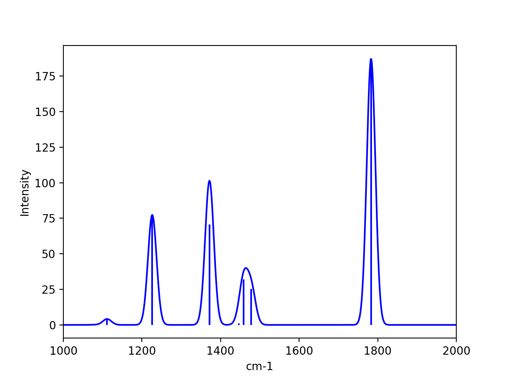

Vibrational frequencies
======================================

A frequency calculation can be performed either numerically or analytically. 
The numerical approach is more genera and is implemented directly in ASH. This approach can always be applied to any QM or MM theory or hybrid theories like QM/MM, ONIOM and Wrap theories, as long as an accurate gradient (typically analytic) is available.

For some QM-programs it is also possible to request an analytical Hessian. This is only available for some QM programs and requires this features to be enabled in the ASH interface. Currently supported programs: ORCA, CFour, pyscf.

For hybrid theories like QM/MM Hamiltonians, the numerical approach is often the only available option.

#########################################
Numerical frequencies
#########################################

Numerical frequencies can be performed with ASH using any QM, MM or QM/MM theory object.
A QM-method that has available an analytical gradient (i.e. 1st derivative of energy) in the external code should typically be used.
Most HF, DFT, MP2 and CASSCF methods have analytical gradients implemented in QM codes.

Note that a numerical 2nd derivative on top of a numerical 1st derivative can in principle be done but is not recommended (accumulation of numerical noise).

Use the **NumFreq** function to request a numerical frequency job. The function requires a fragment object and a theory level at minimum.
The fragment object should typically contain a fragment with optimized coordinates at same level of theory (i.e. an already optimized minimum or saddlepoint).

.. code-block:: python

    def NumFreq(fragment=None, theory=None, npoint=2, displacement=0.005, hessatoms=None, numcores=1, runmode='serial', 
            temp=298.15, pressure=1.0, hessatoms_masses=None, printlevel=1, charge=None, mult=None):

.. list-table::
   :widths: 15 15 15 60
   :header-rows: 1

   * - Keyword
     - Type
     - Default value
     - Details
   * - ``fragment``
     - ASH Fragment
     - None
     - ASH Fragment object.
   * - ``theory``
     - ASHTheory object
     - None
     - ASH Theory object.
   * - ``runmode``
     - String
     - 'serial
     - | Whether to run the numerical frequency displacement calculations in serial (sequentially) 
       | or in parallel using Python multiprocessing.
   * - ``npoint``
     - Integer
     - 2
     - | Whether to do a 1-point or 2-point approximation for the Hessian. 1-point takes half as many
       | displacements as 2-point and is less accurate.
   * - ``displacement``
     - Float
     - 0.005
     - Size of displacement (in Å) to take.
   * - ``hessatoms``
     - list
     - None
     - | Optional list of atom indices that will be displaced and define a partial Hessian instead
       | of a full Hessian. If None, all atoms in Fragment will be displaced.
   * - ``temp``
     - Float
     - 298.15
     - Temperature (in K) to use in thermochemistry calculation. 
   * - ``pressure``
     - Float
     - 1.0
     - Pressure (in atm) to use in thermochemistry calculation.
   * - ``hessatoms_masses``
     - list
     - None
     - Optional list of masses for the Hessian atoms.
   * - ``charge``
     - integer
     - None
     - Optional charge. Will override charge attribute of ASH Fragment.
   * - ``mult``
     - integer
     - None
     - Optional spin multiplicity. Will override mult attribute of ASH Fragment.
   * - ``printlevel``
     - integer
     - 1
     - The printlevel.

-----------------------------------
1-point vs. 2-point Hessian
-----------------------------------
Additionally you can select to do a 1-point Hessian or a 2-point Hessian by the *npoint* keyword (value of 1 or 2).
A 1-point Hessian makes a single displacement (+ direction) for each atom and each x,y and z-coordinate from the input geometry. This option is reasonably accurate and is the default.
A more accurate 2-point Hessian makes displacement in both + and - directions (for each x-, y- and z-coordinate of each atom), is twice as expensive (double the displacements)
but is more accurate.
The displacement step can be changed if required. The default recommended setting is: 0.0005 Å.

-----------------------------------
Serial or parallel calculation
-----------------------------------
Two runmodes are available: 'serial' and 'parallel'. 

*Serial*

The default 'serial' mode will run each displacement sequentially.
The Energy+Gradient calculation of each displacment can, however, still be parallelized if the QM or QM/MM object has this information available.
For example if an **ORCATheory** object has been defined with numcores=8 then ORCA will run each Energy+Gradient evaluation with 8 cores using the OpenMPI parallelization of ORCA.

*Parallel*

For numerical frequencies, it is usually much more efficient, however, to run the displacement jobs simultaneously in parallel fashion.
This is accomplished using *runmode='parallel'* and the parallelization will be linear scaling (almost always recommended).
As there are almost always many more displacements available than CPUs, the parallelization of the QM or QM/MM object should usually be turned off and instead as many displacements
are run simultaneously as there are number of cores. For example, for a 30-atom system, there are 90 XYZ coordinates. For a 2-point Hessian, this means
that 180 displacements to be calculated. If 20 cores are available, then 20 displacements can be run simultaneously, fully utilizing all 20 cores.
This will require 9 runs in total (20*9=180).

.. warning:: Parallel runmode is currently not available for QM/MM calculations.

-----------------------------------
Full or partial Hessian
-----------------------------------
A partial Hessian can be easily performed instead of the full Hessian. This is an excellent approximation for vibrational modes with rather local character
and the quality of the approximation can be controlled. 

For a QM/MM model of a protein active site with a common active region of about 1000 atoms, the full Hessian
of all 1000 atoms would actually not be a doable or recommended calculation.
Instead a partial Hessian job of the important atoms (e.g. the QM region) makes more sense.

A partial Hessian job is performed if a list of Hessian atoms (e.g. hessatoms=[0,1,2] ) is passed to the **NumFreq** function. In this case, the displacements
will only be calculated for the list of "hessatoms" and the result is a partial Hessian for the chosen atoms of the system.

-----------------------------------
Final output
-----------------------------------

Once the displacements are complete, the gradients for all displacements are combined to give the full (or partial) Hessian.
The Hessian is mass-weighted and diagonalized which results in the harmonic vibrational frequencies as eigenvalues and the normal modes as eigenvectors.
Rotational and translational modes are projected out if the full Hessian is calculated.

An elemental normal mode composition factor analysis is automatically performed on the modes and thermochemistry based on the rigid-rotor-harmonic-oscillator (RRHO) approximation with a default temperature and pressure of 298 K and 1 atm.

Upon completion of the job, the full Hessian can be accessed in a few different ways:

- It is stored in the **hessian** attribute of the ASH_Results object returned from the **NumFreq** function (see example below).
- It is present in a file named "Hessian" in the "Numfreq_dir" (created by ASH). Can be read back into ASH using the **read_hessian** function.
- It is present in an ORCA_formatted Hessian-file named "orcahessfile.hess". Can be read back into ASH using **read_ORCA_Hessian**

Additionally ASH creates a file "orcahessfile.hess_dummy.out" which is a dummy ORCA output file that contains the frequencies and normal modes.
This file can be conveniently opened by some visualization programs such as Chemcraft and allows you to visualize the normal modes.

**Examples:**

*Numerical frequencies in serial mode (QM-code parallelization instead used):*

.. code-block:: python

    from ash import *

    #the total number of CPU cores available to Ash (should match the job-script)
    numcores=8

    frag=Fragment(xyzfile="h2o.xyz", charge=0, mult=1)

    #ORCA theory object, ORCA parallelization turned off by not providing numcores keyword
    ORCAcalc = ORCATheory(orcasimpleinput="! r2SCAN-3c tightscf", numcores=numcores)

    #Serial Numfreq job (default):
    freqresult = NumFreq(fragment=frag, theory=ORCAcalc, npoint=2, runmode='serial')

    print("freqresult:", freqresult)
    #Print Hessian
    print("Hessian:", freqresult.hessian)

The resulting object from a NumFreq calculation is an ASH_Results dataclass object.
It contains the calculated frequencies, eigenvectors, normalmodes, list-of frequencies and a dictionary of thermochemical properties.

*Numerical frequencies in parallel mode (QM-code parallelization turned off):*

.. code-block:: python

    from ash import *

    #the total number of CPU cores available to Ash (should match the job-script)
    numcores=8

    frag=Fragment(xyzfile="h2o.xyz", charge=0, mult=1)

    #ORCA theory object, ORCA parallelization turned off by not providing numcores keyword
    ORCAcalc = ORCATheory(orcasimpleinput="! r2SCAN-3c tightscf")

    #Parallel mode: ASH will use the number of cores given to run same number of displacments simultaneously.
    freqresult = NumFreq(fragment=frag, theory=ORCAcalc, npoint=2, runmode='parallel', numcores=numcores)

    print("Vibrational frequencies (cm**-1) : ", freqresult.frequencies)
    print("ZPVE (Eh) : ", freqresult.thermochemistry['ZPVE'])
    print("Gibbs energy corrections (Eh) : ", freqresult.thermochemistry['Gcorr'])

#########################################
Analytical frequencies
#########################################

Some QM programs have analytical frequencies implemented and the ASH interface may support
requesting the calculation of the analytical Hessian and reading Hessian back.
Currently analytical frequencies are only supported in the QM codes: **ORCATheory** and **CFourTheory**

An analytical Hessian calculation is requested by the AnFreq function that takes fragment and theory as necessary arguments:

.. code-block:: python

    def AnFreq(fragment=None, theory=None, numcores=1, temp=298.15, pressure=1.0)

Example:

.. code-block:: python

    HF_frag=Fragment(xyzfile="hf.xyz")
    ORCAcalc = ORCATheory(orcasimpleinput='BP86 def2-SVP def2/J tightscf', orcablocks="", numcores=1)
    freqresult = AnFreq(theory=ORCAcalc, fragment=HF_frag)

    print("Thermochem properties dict:", freqresult.thermochemistry)
    print("Vibrational frequencies (cm**-1) : ", freqresult.frequencies)

##############################################################################
thermochemistry corrections
##############################################################################

Thermochemistry corrections are automatically calculated when either a **Numfreq** or **Anfreq** job is requested.

.. code-block:: python

    result_anfreq = AnFreq(theory=ORCAcalc, fragment=HF_frag)
    result_numfreq = NumFreq(theory=ORCAcalc, fragment=HF_frag)

    print("Thermochem property dict:", result_numfreq.thermochemistry)
    print("ZPVE (Eh) : ", result_numfreq.thermochemistry['ZPVE'])
    print("Gibbs energy corrections (Eh) : ", result_numfreq.thermochemistry['Gcorr'])
  
The return object from **AnFreq** or **NumFreq** contains a thermochemistry dictionary that contains the following 
information as dictionary keys.
Note that the entropy terms (TS) are in energy units (Eh) as they have been multiplied by temperature T.

+------------------+-----------------------------------------------------+
| **Key**          | **Property**                                        |
+------------------+----------------+------------------------------------+
| frequencies      | The harmonic vibrational frequencies (list).        |
+------------------+---------------------------+-------------------------+
| ZPVE             | Zero-point vibrational energy (harmonic)            |      
+------------------+---------------------------+-------------------------+
| E_trans          | Translational energy at temp T.                     |
+------------------+---------------------------+-------------------------+
| E_rot            | Translational energy at temp T.                     |          
+------------------+---------------------------+-------------------------+
| E_vib            | Vibrational energy at temp T.                       |              
+------------------+---------------------------+-------------------------+
| E_tot            | Total energy at temp T.                             |   
+------------------+---------------------------+-------------------------+
| TS_trans         | Translational entropy at temp T (in energy units).  |      
+------------------+---------------------------+-------------------------+
| TS_rot           | Rotational entropy at temp T (in energy units)      |       
+------------------+---------------------------+-------------------------+
| TS_vib           | Vibrational entropy at temp T (in energy units)     |      
+------------------+---------------------------+-------------------------+
| TS_el            | Electronic entropy at temp T (in energy units)      |            
+------------------+---------------------------+-------------------------+
| TS_tot           | Total entropy at temp T (in energy units)           |         
+------------------+---------------------------+-------------------------+
| vibenergycorr    | Vibrational energy correction at temp T.            |  
+------------------+---------------------------+-------------------------+
| Hcorr            | Total enthalpy correction at temp T.                |         
+------------------+---------------------------+-------------------------+
| Gcorr            | Gibbs free energy correction at temp T.             | 
+------------------+---------------------------+-------------------------+

Alternatively, the thermochemcalc function can be called directly.

.. code-block:: python

    def thermochemcalc(vfreq,atoms,fragment, multiplicity, temp=298.18,pressure=1.0):

This function calculates the thermodynamic corrections from a list of available frequencies, number of atoms, ASH fragment object and spin multiplicity.
The temperature (default: 298.15 K) and pressure (default: 1.0 atm) can be specified.

.. code-block:: python

    h2o_frag = Fragment(xyzfile="h2o.xyz")
    #Manually defined frequencies for system
    frequencies=[1600.1, 2300.2, 2400.3]
    thermochemcalc(frequencies,3,h2o_frag, 1, temp=298.18, pressure=1.0)

#########################################
Calculating IR and Raman spectra
#########################################

Calculation of IR and Raman spectra requires either the dipole derivatives or the polarizability derivatives along the normal modes.
This means that to get IR/Raman intensitites from a numerical frequency calculation the dipole moment (IR) or polarizability (Raman) 
must be calculated for each displacement by the QM-code.

IR/Raman spectra can be calculated for any QM-level of theory for which analytical gradients (first derivatives) are available and if dipole moments/polarizabilities
are available in the code or supported by ASH interface (see below). QM/MM theories within ASH are also supported.

**IR intensities:**

In the ASH interfaces to ORCA, pySCF, xTB, MRCC, CFour, Block and Dice, the dipole moments are automatically available and the NumFreq module will
in this case get the dipole moment from each calculation and automatically calculate the dipole derivatives along the normal modes and provide the 
final IR intensity for each normal mode. The IR intensities are stored in the ASH_Results object returned from the NumFreq function.

*Example: IR intensities using ORCA*

.. code-block:: python

  from ash import *

  frag=Fragment(databasefile="h2o.xyz", charge=0, mult=1)

  #ORCA theory
  ORCAcalc = ORCATheory(orcasimpleinput="! r2SCAN-3c tightscf", numcores=4)

  #Serial Numfreq job
  result = NumFreq(fragment=frag, theory=ORCAcalc, npoint=2, runmode='serial')

  print("Vibrational frequencies (cm**-1) : ", result.frequencies)
  print("IR intensities (km/mol): ", result.IR_intensities)

**Raman activities:**

Raman activities are a bit more complicated. Analytic polarizabilities are not always available in the QM-code and they are much more expensive.
Polarizabilities are available in the ASH interface to ORCA, pySCF and CFour.
To get the Raman activities one must i) tell the QM-code to calculate polarizabilities and ii) tell the NumFreq module that one wants Raman (Raman=True).

*Example: Raman activities using ORCA*

.. code-block:: python

  from ash import *

  frag=Fragment(databasefile="h2o.xyz", charge=0, mult=1)

  # ORCA Theory requesting polarizability calculation
  blocks="""
  %elprop
  polar 1
  end
  """
  ORCAcalc = ORCATheory(orcasimpleinput="! r2SCAN-3c tightscf", orcablocks=blocks, numcores=4)

  #NumFreq
  result = NumFreq(fragment=frag, theory=ORCAcalc, npoint=2, runmode='serial', Raman=True)

  print("Vibrational frequencies (cm**-1) : ", result.frequencies)
  print("Raman activities (Å^4/amu): ", result.Raman_activities)

  
**Plot IR/Raman spectra:**

The vibrational frequencies, IR intensities and Raman activitites can be found in the ASH output:

.. code-block:: text

  ----------------------------------------
  VIBRATIONAL FREQUENCY SUMMARY
  ----------------------------------------
  Note: imaginary modes shown as negative
    Mode    Freq(cm**-1)   IR Int.(km/mol)  Raman Act.(Å^4/amu)
    0             0.0000        0.0000          0.0000            (TR mode)
    1             0.0000        0.0000          0.0000            (TR mode)
    2             0.0000        0.0000          0.0000            (TR mode)
    3             0.0000        0.0000          0.0000            (TR mode)
    4             0.0000        0.0000          0.0000            (TR mode)
    5             0.0000        0.0000          0.0000            (TR mode)
    6          1608.3146       81.7550          1.3155
    7          3851.9971        4.3099         74.7428
    8          3993.9783       63.5039         22.0644

and can also be found in the ASH Results object.
If one wants to plot a broadened IR/Raman spectra one can use **plot_Spectrum** function (see :doc:`module_plotting`),
providing the frequencies and intensities from the Results object as x- and y-values.

.. code-block:: python

  from ash import *

  frag=Fragment(databasefile="acetone.xyz", charge=0, mult=1)

  #ORCA theory object
  ORCAcalc = ORCATheory(orcasimpleinput="! r2SCAN-3c", numcores=4)

  #Optimization
  Optimizer(fragment=frag, theory=ORCAcalc)
  #Frequencies
  result = NumFreq(fragment=frag, theory=ORCAcalc, npoint=2, runmode='serial')

  print("Vibrational frequencies (cm**-1) : ", result.frequencies)
  print("IR intensities (km/mol): ", result.IR_intensities)

  #Plotting broadened IR spectrum (11 cm-1 broadening, 5000 points) for 1000-2000 cm-1 window.
  plot_Spectrum(xvalues=result.frequencies, yvalues=result.IR_intensities, plotname='IR_spectrum', range=[1000,2000], unit='cm-1',
      broadening=11, points=5000, imageformat='png', dpi=200)

#########################################
Modifying masses 
#########################################

If specific masses (isotopes) are wanted when calculating vibrational frequencies, then this can be done by providing a list of masses (hessatoms_masses keyword) to the **NumFreq** function.
If you have already performed a NumFreq calculation and want to see the effect of mass-change/isotope substitution then this can be performed by reading in the ASH_Results object from a file,
grabbing the data needed, changing masses and then re-diagonalize a Hessian with new masses.

.. code-block:: python

  from ash import *

  frag = Fragment(databasefile="h2o.xyz")

  #Assuming previous calculation run like the commented-out lines below
  #theory = PySCFTheory(scf_type="RHF",basis="def2-SVP", printlevel=1)
  # NumFreq
  #result = NumFreq(theory=theory,fragment=frag, Raman=True)
  #Writing Result object to disk (nowadays this is default)
  #result.write_to_disk(filename="ASH.result")

  #Read Result-file from disk (shown as this can be used to avoid repeating the above Numfreq calculation)
  result = read_results_from_file(filename="ASH_NumFreq.result")
  print(result)

  #Print the previous masses (for comparison)
  print("Current Hessian masses:", result.freq_masses)

  #Defining new masses
  hessmasses= [18.0, 1.0, 1.0]

  #Grabbing previous data from ASH-Results object (Polarizability data can be skipped if not available)
  hessian=result.hessian
  hesselems=result.freq_elems
  hessatoms=result.freq_atoms
  hesscoords=result.freq_coords
  TRmodenum=result.freq_TRmodenum
  projection=result.freq_projection
  scaling_factor=result.freq_scaling_factor
  dipole_derivs=result.freq_dipole_derivs
  polarizability_derivs=result.freq_polarizability_derivs
  polarizability_derivs = [np.array(i) for i in polarizability_derivs]
  Raman=result.freq_Raman

  #Diagonalize Hessian
  frequencies, nmodes, evectors, mode_order = ash.modules.module_freq.diagonalizeHessian(hesscoords,hessian,hessmasses,hesselems,TRmodenum=TRmodenum,projection=projection)
  print("Diagonalization of frequencies complete")
  print("Now scaling frequencies by scaling factor:", scaling_factor)
  frequencies = scaling_factor * np.array(frequencies)

  # IR intensities if dipoles available
  IR_intens_values = ash.modules.module_freq.calc_IR_Intensities(hessmasses,evectors,dipole_derivs)

  # Raman activities if polarizabilities available
  Raman_activities, depolarization_ratios = ash.modules.module_freq.calc_Raman_activities(hessmasses,evectors,polarizability_derivs)

  # Print out Freq output.
  ash.modules.module_freq.printfreqs(frequencies,len(hessatoms),TRmodenum=TRmodenum, intensities=IR_intens_values,
                Raman_activities=Raman_activities)

  # Print thermochemistry for new vibrational frequencies
  thermodict = ash.modules.module_freq.thermochemcalc(frequencies,hessatoms, frag, frag.mult)
