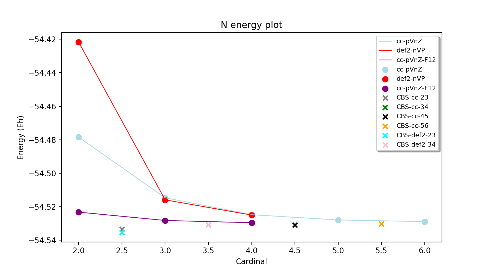

Highlevel workflows
======================================

These high-level workflows are multi-step singlepoint energy protocols can either be used on their own as a theory-level in Singlepoint calculations or used as a SP_theory in workflows such as **thermochemprotocol**, **calc_xyzfiles**, **confsampler_protocol** (see :doc:`module_workflows`) 
or as a theory in **run_benchmark** (see :doc:`module_benchmarking`) .
The ORCA_CC_CBS_Theory uses the ORCA quantum chemistry code for all steps of the workflows and gives a final 0 K electronic energy (no ZPVE). Gradients are not available and these can thus not be used in geometry optimizations or dynamics jobs.
The MRCC_CC_CBS_Theory uses the MRCC program (not yet available)

#########################################
ORCA_CC_CBS_Theory
#########################################

ORCA_CC_CBS_Theory is synonymous with CC_CBS_Theory.

This is an ASH Theory that carries out a multi-step single-point protocol to give a CCSD(T)/CBS estimated energy.
Multiple ORCA calculations for the given geometry are carried out and the SCF and correlation energies extrapolated to the CCSD(T)/CBS limit using either regular CCSD(T) theory or DLPNO-CCSD(T) theory.
This workflow is flexible and features multiple ways of approaching the complete basis set limit (CBS) or the complete PNO space limit (CPS).
Various options affecting the accuracy, efficiency and robustness of the protocol can be chosen.
Many basis set families can be chosen that are available for most of the periodic table.
Atomic spin-orbit coupling can be automatically included if system is an atom.

.. code-block:: python

  class ORCA_CC_CBS_Theory:
      def __init__(self, elements=None, scfsetting='TightSCF', extrainputkeyword='', extrablocks='', 
              guessmode='Cmatrix', memory=5000, numcores=1, 
              cardinals=None, basisfamily=None, Triplesextrapolation=False, SCFextrapolation=True, 
              alpha=None, beta=None, 
              stabilityanalysis=False, CVSR=False, CVbasis="W1-mtsmall", F12=False, Openshellreference=None, 
              DFTreference=None, DFT_RI=False, auxbasis="autoaux-max",
              DLPNO=False, pnosetting='extrapolation', pnoextrapolation=[1e-6,3.33e-7,2.38,'NormalPNO'], 
              FullLMP2Guess=False, OOCC=False,
              T1=False, T1correction=False, T1corrbasis_size='Small', T1corrpnosetting='NormalPNOreduced', 
              relativity=None, orcadir=None, FCI=False, atomicSOcorrection=False):

.. list-table::
   :widths: 15 15 15 60
   :header-rows: 1

   * - Keyword
     - Type
     - Default value
     - Details
   * - ``elements``
     - list of strings.
     - None
     - | Required: List of all elements of the molecular system (reaction). 
       | Needed to set up basis set information. Duplicates are OK. 
       | fragment.elems is a valid list.
   * - ``cardinals``
     - list of integers
     - None
     - | Required: List of cardinal numbers for basis-set extrapolation. 
       | Options: [2,3], [3,4], [4,5] or [5,6]. Single-item lists also valid: 
       | e.g. [4] (for a single QZ level calculation).
   * - ``basisfamily``
     - string
     - None
     - Required: Name of basis-set family to use. Various options. See table below. 
   * - ``relativity``
     - string
     - None
     - Scalar relativity treatment. Options: 'DKH', 'ZORA', 'NoRel', None. 
   * - ``orcadir``
     - string
     - None
     - Path to ORCA. Optional. 
   * - ``stabilityanalysis``
     - Boolean
     - False
     - Perform SCF stability analysis for each SCF calculation.
   * - ``numcores``
     - integer
     - 1
     - Number of cores to use in ORCA calculation.
   * - ``OOCC``
     - Boolean
     - False
     - | Whether to use orbital-optimized (OO-CCD(T)) instead of CCSD(T). 
       | Incompatible with F12 and DLPNO.
   * - ``Openshellreference``
     - string
     - None
     - | Use alternative reference WF in open-shell calculation. 
       | Options: 'UHF', 'QRO', None.
   * - ``DFTreference``
     - string
     - None
     - | Use DFT reference WF (orbitals) in all CC calculations. 
       | Options: (any valid ORCA DFT keyword). Default: None
   * - ``DFT_RI``
     - Boolean
     - False
     - | If using DFT-reference, if DFT_RI is True then RIJ/RIJCOSX with 
       | SARC/J and defgrid3 is used to calculate DFT orbitals.
   * - ``auxbasis``
     - string
     - "autoaux-max"
     - | Auxiliary basis set for CC integrals (/C type). Options: 'autoaux,
       | 'autoaux-max' Default:  "autoaux-max"
   * - ``memory``
     - integer
     - 5000
     - Memory in MBs to use by ORCA.
   * - ``scfsetting``
     - string
     - 'TightSCF'
     - | SCF-convergence setting in ORCA. Options: 'NormalSCF', 'TightSCF',
       | 'VeryTightSCF', 'ExtremeSCF'.
   * - ``DLPNO``
     - Boolean
     - False
     - Use of DLPNO approximation for coupled cluster calculations or not.
   * - ``T1``
     - Boolean
     - False
     - | Option to use iterative triples, i.e. DLPNO-CCSD(T1) instead of 
       | the default DLPNO-CCSD(T0) in all steps.
   * - ``T1correction``
     - Boolean
     - False
     - Option to calculate T1 as a single-step correction instead.
   * - ``T1corrbasis_size``
     - string
     - 'Large'
     - | Size of basis set in T1 correction. Options: 'Large' (larger cardinal basis),
       | 'Small' (smaller cardinal basis).
   * - ``T1corrpnosetting``
     - string
     - 'NormalPNOreduced'
     - | PNO setting for the T1  correction. Options: 'LoosePNO', 'NormalPNO', 
       | 'NormalPNOreduced' (TCutPNO=1e-6), 'TightPNO'.
   * - ``Triplesextrapolation``
     - Boolean
     - False
     - | Whether to do separate cheaper triples energies extrapolation with 
       | smaller basis sets than singles-doubles. Requires setting cardinals
       | to 3 values, e.g. [2,3,4]
   * - ``pnoextrapolation``
     - list
     - [1e-6,1e-7,1.5,'TightPNO']
     - | Parameters for PNO-extrapolation (X,Y,Z): X and Y being
       | TCutPNO thresholds while Z signifies the PNOsetting for the other thresholds. 
   * - ``FullLMP2Guess``
     - Boolean
     - None
     - | Whether to use Full-local MP2 guess in DLPNO calculations. 
       | Only use if all systems are closed-shell.
   * - ``alpha``
     - float
     - False
     - Manual alpha extrapolation parameter for SCF-energy extrapolation.
   * - ``beta``
     - float
     - None
     -  Manual beta extrapolation parameter for correlation-energy extrapolation.
   * - ``extrainputkeyword``
     - string
     - None
     - Optional extra simple-input-keyword to add in ORCA inputfile.
   * - ``extrablocks``
     - string
     - None
     - Optional extra ORCA block-input lines to add to ORCA inputfile.
   * - ``guessmode``
     - string
     - 'CMatrix'
     - | What ORCA Guessmode to use when doing basis-set projections of
       | orbitals. Options: 'CMatrix' (more robust), 'FMatrix' (cheaper).
   * - ``atomicSOcorrection``
     - Boolean
     - False
     - | Whether to add the experimental atomic spin-orbit energy to system
       | if the system is an atom.
   * - ``FCI``
     - Boolean
     - False
     - | Whether to extrapolate the CCSD(T) calculation to the Full-CI limit 
       | by the Goodson formula.
   * - ``F12``
     - Boolean
     - False
     - | Whether to do explicitly correlated CCSD(T)-F12 instead of CCSD(T)/CBS 
       | extrapolation. Use with basisfamily='cc-f12'.
   * - ``CVSR``
     - Boolean
     - False
     - Perform additional core-valence+scalar-relativistic correction.
   * - ``CVbasis``
     - string
     - "W1-mtsmall"
     - | The core-valence basis set to use. The default "W1-mtsmall" is only available
       | for elements H-Ar. Alternative: some other appropriate core-valence basis set.
   * - ``SCFextrapolation``
     - Boolean
     - True
     - | Whether the SCF energies are extrapolated or not. If False then the 
       | largest SCF energy calculated will be used (e.g. the def2-QZVPP 
       | energy in a def2/[3,4] job).

**Basis-family options**

Appropriate all-electron or valence+ECP basis sets for each element with basis-families such as : cc, aug-cc, def2, ma-def2. 
If instead an all-electron relativistic approch is desired for all elements then basisfamily="cc-dk", "def2-zora", "def2-dkh" and relativity='DKH' or 'ZORA' can be chosen instead.

.. note:: - "def2" (Ahlrichs all-electron basis sets for H-Kr, valence basis+def2-ECP for K-Rn)
  - "ma-def2" (minimally augmented diffuse Ahlrichs basis sets)
  - "cc" (correlation consistent basis sets, cc-pVnZ for light elements and cc-pVnZ-PP (SK-MCDHF ECP) for heavy elements (Sr-Xe, Hf-Rn, Ba, Ru, U)). Note: not available for K.
  - "aug-cc" (augmented correlation consistent basis sets, cc-pVnZ for light elements and aug-cc-pVnZ-PP for heavy elements)
  - "cc-dk" (DKH-recontracted correlation consistent basis sets, cc-pVnZ-DK for light elements and cc-pVnZ-DK for heavy elements)
  - "aug-cc-dk" (DKH-recontracted aug correlation consistent basis sets, aug-cc-pVnZ-DK for light elements and aug-cc-pVnZ-DK for heavy elements)
  - "def2-zora" (ZORA-recontracted Ahlrichs basis sets or SARC-ZORA basis sets for heavy elements)
  - "ma-def2-zora" (minimally augmented ZORA-recontracted Ahlrichs basis sets or SARC-ZORA basis sets for heavy elements)
  - "def2-dkh" (DKH-recontracted Ahlrichs basis sets or SARC-DKH basis sets for heavy elements)
  - "def2-x2c" (All-electron X2C relativistic basis sets for H-Rn)
  - "ma-def2-dkh" (minimally augmented DKH-recontracted Ahlrichs basis sets or SARC-DKH basis sets for heavy elements)
  - "cc-CV" (Core-valence correlation consistent basis sets, cc-pwCVnZ)
  - "aug-cc-CV" (augmented core-valence correlation consistent basis sets, aug-cc-pwCVnZ)
  - "cc-CV-dk" (DKH-recontracted core-valence correlation consistent basis sets, cc-pwCVnZ-DK)
  - "aug-cc-CV-dk" (augmented DKH-recontracted core-valence correlation consistent basis sets, aug-cc-pwCVnZ-DK)
  - "cc-CV_3dTM-cc_L" (All-electron DKH protocol for 3d TM complexes. cc-pwCVnZ-DK on 3d transition metals, cc-pVNZ-DK on everything else.)
  - "aug-cc-CV_3dTM-cc_L" (Augmented all-electron DKH protocol for 3d TM complexes. cc-pwCVnZ-DK on 3d transition metals, aug-cc-pVNZ-DK on everything else.)
  - "cc-f12" (correlation consistent F12 basis sets for CCSD(T)-F12 theory.)

+---------------------+---------------------------------+------------------------------+----------------------------+
| Basis-family        | Basis-sets                      | Cardinals (n)                | ECP or relativity          |
+=====================+=================================+==============================+============================+
| def2                | Ahlrichs def2                   | - 2: def2-SVP                | def2-ECP                   |
|                     | on all atoms H-Rn               | - 3: def2-TZVPP              | on Rb-Rn                   |
|                     |                                 | - 4: def2-QZVPP              |                            |
+---------------------+---------------------------------+------------------------------+----------------------------+
| ma-def2             | Minimally augmented             | - 2: ma-def2-SVP             | def2-ECP                   |
|                     | diffuse def2                    | - 3: ma-def2-TZVPP           | on Rb-Rn                   |
|                     | on all atoms H-Rn               | - 4: ma-def2-QZVPP           |                            |
+---------------------+---------------------------------+------------------------------+----------------------------+
| def2-zora           | - H-Kr : ZORA-def2-TZVP         | - 2: (SARC-ZORA/def2)-SVP    | relativity='ZORA'          |
|                     | - Rb-Rn : SARC-ZORA-TZVP        | - 3: (SARC-ZORA/def2)-TZVPP  |                            |
|                     |                                 | - 4: (SARC-ZORA/def2)-QZVPP  |                            |
+---------------------+---------------------------------+------------------------------+----------------------------+
| ma-def2-zora        | - H-Kr : ma-ZORA-def2-TZVP      | - 2: (SARC-ZORA/def2)-SVP    | relativity='ZORA'          |
|                     | - Rb-Rn: (SARC-ZORA/def2)-TZVPP | - 3: (SARC-ZORA/def2)-TZVPP  |                            |
|                     |                                 | - 4: (SARC-ZORA/def2)-QZVPP  |                            |
+---------------------+---------------------------------+------------------------------+----------------------------+
| def2-dkh            | - H-Kr : DKH-def2-TZVP          | - 2: (SARC-DKH/def2)-SVP     | relativity='DKH'           |
|                     | - Rb-Rn : SARC-DKH-TZVP         | - 3: (SARC-DKH/def2)-TZVPP   |                            |
|                     |                                 | - 4: (SARC-DKH/def2)-QZVPP   |                            |
+---------------------+---------------------------------+------------------------------+----------------------------+
| ma-def2-dkh         | - H-Kr : ma-DKH-def2-TZVP       | - 2: (SARC-DKH/def2)-SVP     | relativity='DKH'           |
|                     | - Rb-Rn: (SARC-DKH/def2)-TZVPP  | - 3: (SARC-DKH/def2)-TZVPP   |                            |
|                     |                                 | - 4: (SARC-DKH/def2)-QZVPP   |                            |
+---------------------+---------------------------------+------------------------------+----------------------------+
| def2-x2c            | - H-Rn : x2c-nVP(P)all          | - 2: x2c-SVP-all             | relativity='DKH'           |
|                     |                                 | - 3: x2c-TZVPP-all           | ( later: relativity='X2C') |
|                     |                                 | - 4: x2c-QZVPP-all           |                            |
+---------------------+---------------------------------+------------------------------+----------------------------+
| cc                  | - H-Kr: cc-pVnZ                 | - 2: cc-pVDZ(-PP)            | SK-MCDHF-RSC               |
|                     | - Sr-Xe: cc-pVnZ-PP             | - 3: cc-pVTZ(-PP)            | on Sr-Xe, Hf-Rn,           |
|                     | - Hf-Rn: cc-pVnZ-PP             | - 4: cc-pVQZ(-PP)            | Ba,Ra,U                    |
|                     | - Ba,Ra,U: cc-pVnZ-PP           | - 5: cc-pV5Z(-PP)            |                            |
|                     |                                 | - 6: cc-pV6Z (H-Ar only)     |                            |
+---------------------+---------------------------------+------------------------------+----------------------------+
| cc-f12              | - H-Ar: cc-pVnZ-F12             | - 2: cc-pVDZ(-PP)-F12        | SK-MCDHF-RSC               |
|                     | - Ga-Kr: cc-pVnZ-PP-F12         | - 3: cc-pVTZ(-PP)-F12        | on Ga-Kr, In-Xe, Tl-Rn     |
|                     | - In-Xe: cc-pVnZ-PP-F12         | - 4: cc-pVQZ(-PP)-F12        |                            |
| (use with F12=True) | - Tl-Rn: cc-pVnZ-PP-F12         |                              |                            |
|                     |                                 |                              |                            |
+---------------------+---------------------------------+------------------------------+----------------------------+
| aug-cc              | - H-Kr: aug-cc-pVnZ,            | - 2: aug-cc-pVDZ(-PP)        | SK-MCDHF-RSC               |
|                     | - Sr-Xe: aug-cc-pVnZ-PP,        | - 3: aug-cc-pVTZ(-PP)        | on Sr-Xe, Hf-Rn,           |
|                     | - Hf-Rn: aug-cc-pVnZ-PP,        | - 4: aug-cc-pVQZ(-PP)        | Ba,Ra,U                    |
|                     | - Ba,Ra,U: aug-cc-pVnZ-PP       | - 5: aug-cc-pV5Z(-PP)        |                            |
|                     |                                 | - 6: aug-cc-pV6Z (H-Ar Only) |                            |
+---------------------+---------------------------------+------------------------------+----------------------------+
| cc-dk               | - cc-pVnZ-DK on H-Ar,           | - 2: cc-pVDZ-DK              |                            |
|                     | - Sc-Kr, Y-Xe, Hf-Rn,           | - 3: cc-pVTZ-DK              | relativity='DKH'           |
|                     | - 4: cc-pVQZ-DK                 | - 4: cc-pVQZ-DK              |                            |
|                     | - (missing QZ for Y-Cd)         | - 5: cc-pV5Z-DK              |                            |
+---------------------+---------------------------------+------------------------------+----------------------------+
| aug-cc-dk           | - cc-pVnZ-DK on H-Ar,           | - 2: aug-cc-pVDZ-DK          |                            |
|                     | - Sc-Kr, Y-Xe, Hf-Rn,           | - 3: aug-cc-pVTZ-DK          | relativity='DKH'           |
|                     | - 4: aug-cc-pVQZ-DK             | - 4: aug-cc-pVQZ-DK          |                            |
|                     | - (missing QZ for Y-Cd)         | - 5: aug-cc-pV5Z-DK          |                            |
+---------------------+---------------------------------+------------------------------+----------------------------+
| cc-CV               | - H-Kr: cc-pwCVnZ               | - 2: cc-pwCVDZ(-PP)          | SK-MCDHF-RSC               |
|                     | - Sr-Xe: cc-pwCVnZ-PP           | - 3: cc-pwCVTZ(-PP)          | on Sr-Xe, Hf-Rn,           |
|                     | - Hf-Rn: cc-pwCVnZ-PP           | - 4: cc-pwCVQZ(-PP)          | Ba,Ra,U                    |
|                     | - Ba,Ra,U: cc-pwCVnZ-PP         | - 5: cc-pWCV5Z(-PP)          |                            |
|                     |                                 |                              |                            |
+---------------------+---------------------------------+------------------------------+----------------------------+
| aug-cc-CV           | - H-Kr: aug-cc-pwCVnZ           | - 2: aug-cc-pwCVDZ(-PP)      | SK-MCDHF-RSC               |
|                     | - Sr-Xe: aug-cc-pwCVnZ-PP       | - 3: aug-cc-pwCVTZ(-PP)      | on Sr-Xe, Hf-Rn,           |
|                     | - Hf-Rn: aug-cc-pwCVnZ-PP       | - 4: aug-cc-pwCVQZ(-PP)      | Ba,Ra,U                    |
|                     | - Ba,Ra,U: aug-cc-pwCVnZ-PP     | - 5: aug-cc-pWCV5Z(-PP)      |                            |
|                     |                                 |                              |                            |
+---------------------+---------------------------------+------------------------------+----------------------------+
| cc-CV-dk            | - H-Be,Na-Mg: cc-pwCVnZ-DK      | - 2: cc-(pwC)VDZ-DK          |                            |
|                     | - B-Ne: cc-pVnZ-DK (!)          | - 3: cc-(pwC)VTZ-DK          | relativity='DKH'           |
|                     | - Al-Ar: cc-pVnZ-DK (!)         | - 4: cc-(pwC)VQZ-DK          |                            |
|                     | - Ca-Zn: cc-pVwCnZ-DK           | - 5: cc-(pwC)V5Z-DK          |                            |
|                     | - missing QZ for Y-Cd           |                              |                            |
+---------------------+---------------------------------+------------------------------+----------------------------+
| aug-cc-CV-dk        | - H-Be,Na-Mg: aug-cc-pwCVnZ-DK  | - 2: aug-cc-(pwC)VDZ-DK      |                            |
|                     | - B-Ne: aug-cc-pVnZ-DK (!)      | - 3: aug-cc-(pwC)VTZ-DK      | relativity='DKH'           |
|                     | - Al-Ar: aug-cc-pVnZ-DK (!)     | - 4: aug-cc-(pwC)VQZ-DK      |                            |
|                     | - Ca-Zn: aug-cc-pVwCnZ-DK       | - 5: aug-cc-(pwC)V5Z-DK      |                            |
|                     | - missing QZ for Y-Cd           |                              |                            |
+---------------------+---------------------------------+------------------------------+----------------------------+
| cc-CV_3dTM-cc_L     | - H-Kr: cc-pVnZ-DK              | - 2: cc-(pwC)VDZ-DK          |                            |
|                     | - Sc-Zn: cc-pwCVnZ-DK (!)       | - 3: cc-(pwC)VTZ-DK          | relativity='DKH'           |
|                     | - Ga-Rn: cc-pVnZ-DK             | - 4: cc-(pwC)VQZ-DK          |                            |
|                     |                                 | - 5: cc-(pwC)V5Z-DK          |                            |
|                     |                                 |                              |                            |
+---------------------+---------------------------------+------------------------------+----------------------------+
| aug-cc-CV_3dTM-cc_L | - H-Kr: aug-cc-pVnZ-DK          | - 2: (aug)-cc-(pwC)VDZ-DK    |                            |
|                     | - Sc-Zn: cc-pwCVnZ-DK (!)       | - 3: (aug)-cc-(pwC)VTZ-DK    | relativity='DKH'           |
|                     | - Ga-Rn: aug-cc-pVnZ-DK         | - 4: (aug)-cc-(pwC)VQZ-DK    |                            |
|                     |                                 | - 5: (aug)-cc-(pwC)V5Z-DK    |                            |
|                     |                                 |                              |                            |
+---------------------+---------------------------------+------------------------------+----------------------------+

.. note::  Note: often missing basis sets for K and Ca. Sometimes there are missing basis sets for specific elements and specific cardinals.

#########################################
ORCA_CC_CBS_Theory Examples
#########################################

**Basic examples**

.. code-block:: python
    
    N2=Fragment(xyzfile='n2.xyz')
    cc = ORCA_CC_CBS_Theory(elements=["N"], cardinals = [2,3], basisfamily="cc", numcores=1)
    Singlepoint(theory=cc, fragment=N2)

The example above defines an N2 fragment (from file n2.xyz) and runs a single-point calculation using the defined ORCA_CC_CBS_Theory object. 
Multiple CCSD(T) calculations are then carried out using the different basis sets specified by the basis-family and the cardinals.
Cardinals=[2,3] and basisfamily="cc" means that the cc-pVDZ and cc-pVTZ basis sets will be used.
Separate basis-set extrapolation of SCF and correlation energies is then performed. Appropriate extrapolation parameters for 2-point extrapolations with this basis set family are chosen.

.. code-block:: python

    ferrocene=Fragment(xyzfile='ferrocene.xyz')
    cc = ORCA_CC_CBS_Theory(elements=["Fe", "C", "H"], cardinals = [2,3], basisfamily="def2", numcores=1, 
        DLPNO=True, pnosetting="NormalPNO", T1=False)
    Singlepoint(theory=cc, fragment=ferrocene)

For a larger molecule like ferrocene, regular CCSD(T) is quite an expensive calculation and so here we invoke the DLPNO approximation via DLPNO=True.
We use the 'def2' basis family here with cardinals=[2,3] meaning that the def2-SVP and def2-TZVPP basis sets will be used.
The DLPNO approximation error can be controlled via threshold keywords ('LoosePNO', 'NormalPNO', 'TightPNO'), here we choose 'NormalPNO'. 
We also choose the regular triples approximation (DLPNO-CCSD(T0) by setting T1 to False.

.. code-block:: python

    ferrocene=Fragment(xyzfile='ferrocene.xyz')
    cc = ORCA_CC_CBS_Theory(elements=ferrocene.elems, cardinals = [3,4], basisfamily="cc-CV_3dTM-cc_L", relativity='DKH', numcores=1, 
        DLPNO=True, pnosetting="extrapolation", pnoextrapolation=[6,7] T1=True)
    Singlepoint(theory=cc, fragment=ferrocene)

Finally we crank up the accuracy even further by choosing cardinals=[3,4], switch to the basisfamily="cc-CV_3dTM-cc_L and activate the 'DKH' relativistic approximation.
This calculation will utilize a mixed metal-ligands basis set: cc-pwCVTZ-DK/cc-pwCVQZ-DK on Fe and cc-pVDZ-DK/cc-pVTZ-DK on C,H.
Instead of using a single DLPNO threshold we here calculate DLPNO-CCSD(T) energies using 2 PNO tresholds and extrapolate to the PNO-limit.
Finally we set T1 keyword to True which will tell ORCA to do a more accurate iterative triples DLPNO-CCSD(T1) approximation.

For additional examples on using ORCA_CC_CBS_Theory on real-world systems and showing real data see:  :doc:`Highlevel_CC_CBS_workflows`

##############################
Reaction_Highlevel_Analysis
##############################

In order to facilitate the analysis of basis-set and/or PNO convergence in CCSD(T) calculations for very simple systems, 
the **Reaction_Highlevel_Analysis** function can be used.
It will read in an ASH reaction object (containing  list of ASH fragments and reaction stoichiometry) 
and calculate the reaction energy with multiple levels of theory and plot the results using Matplotlib.
This allows one to easily see how well converged the results are.

CCSD(T) calculations are performed both with def2 (up to QZ level) and cc basis sets (up to 6Z level), explicitly correlated CCSD(T)-F12 calculations (up to QZ-F12) 
and complete basis set extrapolations are performed.
Note that the large-basis cc-pV5Z and cc-pV6Z calculations can not be carried out for all systems. Set highest_cardinal to a lower number if required.

.. warning:: The plots require the Matplotlib library to be installed. 

To be added: PNO-extrapolation options

.. code-block:: python

    def Reaction_Highlevel_Analysis(reaction=None, fraglist=None, stoichiometry=None, numcores=1, memory=7000, reactionlabel='Reactionlabel', 
                                    nergy_unit='kcal/mol', extrapolation=True, highest_cardinal=6, plot=True 
                                    def2_family=True, cc_family=True, aug_cc_family=False, F12_family=True, DLPNO=False):
        """Function to perform high-level CCSD(T) calculations for a reaction with associated plots.
        Performs CCSD(T) with cc and def2 basis sets, CCSD(T)-F12 and CCSD(T)/CBS extrapolations

        Args:
            reaction ([Reaction object], optional): [ASH Reaction boject]. Defaults to None.
            numcores (int, optional): [description]. Defaults to 1.
            memory (int, optional): [description]. Defaults to 7000.
            def2_family (bool, optional): [description]. Defaults to True.
            cc_family (bool, optional): [description]. Defaults to True.
            F12_family (bool, optional): [description]. Defaults to True.
            highest_cardinal (int, optional): [description]. Defaults to 5.
            plot (Boolean): whether to plot the results or not (requires Matplotlib). Defaults to True. 
        """

Example (Bond Dissociation Energy of N2): 

.. code-block:: python

    from ash import *

    #Define molecular fragments from XYZ-files or other
    N2=Fragment(xyzfile='n2.xyz', charge=0, mult=1, label='N2')
    N=Fragment(atom='N', charge=0, mult=4, label='N')
    #Define reaction
    N2_BDE_reaction = Reaction(fragments=[N2, N], stoichiometry=[-1,2], label='N2_BDE', unit='eV')

    # Call Reaction_Highlevel_Analysis
    Reaction_Highlevel_Analysis(reaction=N2_BDE_reaction, numcores=1, memory=7000, 
                                    def2_family=True, cc_family=True, F12_family=True, 
                                    extrapolation=True, highest_cardinal=5 )

The outputfile will contain the CCSD(T) total energies and reaction energies for each species and basis set level.
Additionally energy vs. basis-cardinal plots are created for both the total energy for each species and the reaction energy.

.. image:: figures/N2_BDE.png
   :align: center
   :width: 700

.. image:: figures/N2_Energy.png
   :align: center
   :width: 700

##############################
Reaction_FCI_Analysis
##############################

With modern approximations to Full-CI (selected CI, DMRG, Quantum Monte Carlo etc.) it is possible to obtain a near-Full-CI total energy or relative energy that can be used to estimate
the accuracy of truncated wavefunction methods (e.g. MP2, CCSD, CCSD(T) etc.).
Such an analysis is only possible for relatively small molecules and only for small basis sets, however.
ORCA features the ICE-CI algorithm (a selected CI approach) that can be used for this purpose.

In order to facilitate this kind of analysis ASH features the function **Reaction_FCI_Analysis** that 
will automatically run multiple ICE-CI calculations with ORCA (at user-selected thresholds) to estimate the Full-CI limit 
for a given basis set and will then run simpler wavefunction methods 
with the same basis set for comparison using ORCA. 
This allows one to see how close e.g. CCSD(T) or CASPT2 is to Full-CI for a given energy or relative energy at a specific basis set.

.. code-block:: python

  def Reaction_FCI_Analysis(reaction=None, basis=None, basisfile=None, basis_per_element=None,
                  Do_ICE_CI=True, 
                  MBE_FCI=False, pymbedir=None, mbe_thres_inc=1e-5, mbe_orbs_choice='ccsd', mbe_ref_orblist=[],
                  Do_TGen_fixed_series=True, fixed_tvar=1e-11, Do_Tau3_series=True, Do_Tau7_series=True, Do_EP_series=True,
                  tgen_thresholds=None, ice_nmin=1.999, ice_nmax=0,
                  separate_MP2_nat_initial_orbitals=True,
                  DoHF=True,DoMP2=True, DoCC=True, DoCC_CCSD=True, DoCC_CCSDT=True, DoCC_MRCC=False, DoCC_CFour=False, DoCAS=False,
                  active_space_for_each=None,
                  DoCC_DFTorbs=True, KS_functionals=['BP86','BHLYP'], Do_OOCC=True, Do_OOMP2=True,
                  maxcorememory=10000, numcores=1, ice_ci_maxiter=30, ice_etol=1e-6,
                  upper_sel_threshold=1.999, lower_sel_threshold=0,
                  plot=True, y_axis_label='None', yshift=0.3, ylimits=None, padding=0.4):

Example (Vertical ionization energy of H2O): 

.. code-block:: python

  from ash import *
  
  #Function to calculate a small molecule reaction energy at the near-FullCI limit at a fixed basis set
  #with comparison to simpler methods
  #QM code: ORCA
  #Near-FCI method: ICE-CI
  #Basis set: cc-pVDZ
  #Molecule: H2O
  #Property: VIP
  
  numcores = 1
  ####################################################################################
  #Defining reaction: Vertical IP of H2O
  h2o_n = Fragment(databasefile="h2o.xyz", charge=0, mult=1)
  h2o_o = Fragment(databasefile="h2o.xyz", charge=1, mult=2)
  reaction = Reaction(fragments=[h2o_n, h2o_o], stoichiometry=[-1,1], label='H2O_IP', unit='eV')
  
  #What Tgen thresholds to calculate in ICE-CI?
  tgen_thresholds=[5e-3,1e-3,5e-4,1e-4,5e-5,1e-5,5e-6]
  
  Reaction_FCI_Analysis(reaction=reaction, basis="cc-pVDZ",
                  Do_Tau3_series=True, Do_Tau7_series=True, Do_TGen_fixed_series=False, fixed_tvar=1e-11, Do_EP_series=True,
                  tgen_thresholds=tgen_thresholds, DoHF=True, DoMP2=True, DoCC=True, maxcorememory=10000, numcores=numcores,
                  plot=True, y_axis_label='IP', yshift=0.3)

Output:

.. image:: figures/FCI-H2O-IP.tiff
   :align: center
   :width: 700

.. warning:: The plots require the Matplotlib library to be installed. 

################################################
WFT theory with flexible orbital-input option
################################################

For many single-reference and multireference methods the reference determinant or orbitals are not optimized, 
resulting in an input-orbital dependence that can be either mild or sometimes severe.
For single-reference CC theory a HF determinant is traditionally used with the assumption that the T1 operator will account indirectly for orbital-relaxation.
There are molecules where this has been found to be a problematic choice with either Kohn-Sham, Brueckner or orbital-optimized CC references being recommended instead.
For selected CI methods such as ICE-CI (see below), standard CI without orbital optimization is typically performed, 
resulting in a mild orbital dependency. Typically natural orbitals from a cheaper WF are used in such cases. 
Natural orbitals are the orbitals that diagonalize the 1-electron density matrix.

To facilitate the use of different orbitals in WFT calculations using ORCA, ASH features the **ORCA_orbital_setup** function
which given an orbital-input choice and basis set runs an ORCA calculation and returns the name of the orbital file to be used for another calculation.

.. code-block:: python

  def ORCA_orbital_setup(orbitals_option=None, fragment=None, basis=None, basisblock="", extrablock="", extrainput="",
        MP2_density=None, MDCI_density=None, memory=10000, numcores=1, charge=None, mult=None, moreadfile=None, 
        gtol=2.50e-04, nmin=1.98, nmax=0.02, CAS_nel=None, CAS_norb=None,
        CASCI=True, tgen=1e-4, no_moreadfile_in_CAS=False, ciblockline=""):

The *orbitals_option* keyword can be an MP2-method like:
'MP2', 'RI-MP2', 'RI-SCS-MP2', 'OO-RI-MP2'
which together with the MP2_density keyword (takes options: 'unrelaxed' or 'relaxed')
will result in the calculation of natural orbitals from the chosen MP2 Hamiltonian.

**Example: MP2 natural orbitals as input for CCSD(T)**

.. code-block:: python

  from ash import *
  frag = Fragment(databasefile="hf.xyz")
  basis="cc-pVDZ"
  #Using ORCA_orbital_setup to calculate MP2 natural orbitals using the relaxed MP2 density
  orbfile, natoccs = ORCA_orbital_setup(fragment=frag, basis=basis, orbitals_option='MP2', MP2_density='relaxed')
  #Defining an ORCA CCSD(T) noiter calculation using the natural orbitals from the MP2 calculation
  ORCA_CCSD_T = ORCATheory(orcasimpleinput=f"! CCSD(T) {basis} tightscf noiter", moreadfile=orbfile)
  Singlepoint(theory=ORCA_CCSD_T, fragment=frag)

Alternatively one can use a CC-type method using the MDCI module in ORCA.
Options are: 'CCSD', 'QCISD', 'CEPA/1', 'CPF/1'
which together with the MDCI_density keyword (takes options: 'linearized', 'unrelaxed' or 'orbopt')
will result in the calculation of natural orbitals using the selected method and density.

**Example: QCISD natural orbitals as input for CCSD(T)**

.. code-block:: python

  from ash import *
  frag = Fragment(databasefile="hf.xyz")
  basis="cc-pVDZ"
  #Using ORCA_orbital_setup to calculate QCISD unrelaxed natural orbitals
  orbfile, natoccs = ORCA_orbital_setup(fragment=frag, basis=basis, orbitals_option='QCISD', MDCI_density='unrelaxed')
  #Defining an ORCA CCSD(T) noiter calculation using the natural orbitals from the QCISD calculation
  ORCA_CCSD_T = ORCATheory(orcasimpleinput=f"! CCSD(T) {basis} tightscf noiter", moreadfile=orbfile)
  Singlepoint(theory=ORCA_CCSD_T, fragment=frag)

There is also an option to perform a multireference calculation using the CASSCF and MRCI modules in ORCA.
Options are: 'CASSCF', 'MRCI', 'MRCI+Q', 'MRSORCI', 'MRDDCI1', 'MRDDCI2', 'MRDDCI3', 'MRAQCC', 'MRACPF'.
An active space needs to be defined for this option via CAS_nel and CAS_norb keywords
and the user should additionally specify whether CASCI is True or not (if False then CASSCF orbital optimization is carried out).
Here the user may want to read in some orbitals via the *moreadfile* keyword.

**Example: MRCI+Q natural orbitals as input for CCSD(T)**

.. code-block:: python

  from ash import *
  frag = Fragment(databasefile="hf.xyz")
  basis="cc-pVDZ"
  #Using ORCA_orbital_setup to calculate MRCI+Q (CAS(2,4) reference) natural orbitals
  orbfile, natoccs = ORCA_orbital_setup(fragment=frag, basis=basis, orbitals_option='MRCI+Q', 
        CAS_nel=2, CAS_norb=4, CASCI=False, moreadfile="orbitals_rotated.gbw")
  #Defining an ORCA CCSD(T) noiter calculation using the natural orbitals from the MRCI+Q calculation
  ORCA_CCSD_T = ORCATheory(orcasimpleinput=f"! CCSD(T) {basis} tightscf noiter", moreadfile=orbfile)
  Singlepoint(theory=ORCA_CCSD_T, fragment=frag)

##############################
ICE-CI workflows
##############################

ASH contains a few built-in options to facilitate ICE-CI or CASCI/CASSCF ICE-based workflows.
The function **make_ICE_theory** allows one to conveniently define ICE-CI ORCA theories for a given basis set and molecule.

.. code-block:: python

  #Create ICE-CI theory
  def make_ICE_theory(basis,tgen, tvar, numcores, nel=None, norb=None, nmin_nmax=False, ice_nmin=None,ice_nmax=None, 
      autoice=False, basis_per_element=None, maxcorememory=10000, maxiter=20, etol=1e-6, moreadfile=None,label=""):

  #Workflow to do active-space selection with MP2 or CCSD natural orbitals and then an ICE-CI based on user thresholds
  def Auto_ICE_CAS(fragment=None, basis="cc-pVDZ", nmin=1.98, nmax=0.02, 
                  initial_orbitals="MP2", moreadfile=None,
                  numcores=1, charge=None, mult=None, CASCI=True, tgen=1e-4, memory=10000):

**Auto-ICE Example:**

Simple way of using the Auto-ICE option in ORCA. Not necessarily much better than the ORCA way but allows workflows.

.. code-block:: python

  from ash import *

  numcores=8
  frag = Fragment(xyzfile="al2h2_mp2geo.xyz", charge=0, mult=1)
  basis="cc-pVDZ"
  nmin_thresh=1.98
  nmax_thresh=0.01

  #ICE-theory:  based on thresholds
  ice = make_ICE_theory("cc-pVDZ", 1e-4, 1e-11,numcores, nmin_nmax=True, ice_nmin=1.98, ice_nmax=0.02, autoice=True, 
      maxcorememory=10000, label=f"ICE")

  result_ICE = ash.Singlepoint(fragment=frag, theory=ice)

**Manual Auto-ICE Example:**

Note: Allows manual selection of the natural orbitals calculated and read-in. 
Manually selects the active space based on MP2 occupations and determines the active space which is fed into ICE-CI calculation.

.. code-block:: python

  from ash import *

  numcores=8
  frag = Fragment(xyzfile="al2h2_mp2geo.xyz", charge=0, mult=1)
  basis="cc-pVDZ"
  nmin_thresh=1.98
  nmax_thresh=0.01

  #Make MP2 natural orbitals
  mp2blocks=f"""
  %maxcore 11000
  %mp2
  natorbs true
  density unrelaxed
  end
  """
  natmp2 = ORCATheory(orcasimpleinput=f"! MP2 {basis} autoaux tightscf", orcablocks=mp2blocks, numcores=numcores, label='MP2', save_output_with_label=True)
  Singlepoint(theory=natmp2, fragment=frag)
  mofile=f"{natmp2.filename}.mp2nat"

  #Determine CAS space based on thresholds
  mp2nat_occupations=ash.interfaces.interface_ORCA.MP2_natocc_grab(natmp2.filename+'.out')
  print("MP2natoccupations:", mp2nat_occupations)
  nel,norb=ash.functions.functions_elstructure.select_space_from_occupations(mp2nat_occupations, selection_thresholds=[nmin_thresh,nmax_thresh])
  print(f"Selecting CAS({nel},{norb}) based on thresholds: upper_sel_threshold={nmin_thresh} and lower_sel_threshold={nmax_thresh}")

  #ICE-theory: Fixed active space
  ice = make_ICE_theory("cc-pVDZ", 1e-4, 1e-11,numcores, nel=nel, norb=norb, maxcorememory=10000, moreadfile=mofile, label=f"ICE")

  result_ICE = ash.Singlepoint(fragment=frag, theory=ice)

**Manual CAS-ICE Example:**

Manual selection of the natural orbitals calculated and read-in. 
Manually selects the active space based on MP2 occupations and determines the active space which is fed into a CASCI/CASSCF calculation using the 
ICE-CI algorithm instead of the regular Full-CI.

.. code-block:: python

  from ash import *

  numcores=8

  #Input
  frag = Fragment(xyzfile="al2h2_mp2geo.xyz", charge=0, mult=1)
  basis="cc-pVDZ"
  nmin_thresh=1.98
  nmax_thresh=0.01
  tgen=1e-4
  memory=10000

  #Make MP2 natural orbitals
  mp2blocks=f"""
  %maxcore {memory}
  %mp2
  natorbs true
  density unrelaxed
  end
  """
  natmp2 = ORCATheory(orcasimpleinput=f"! MP2 {basis} autoaux tightscf", orcablocks=mp2blocks, numcores=numcores, label='MP2', save_output_with_label=True)
  Singlepoint(theory=natmp2, fragment=frag)
  mofile=f"{natmp2.filename}.mp2nat"

  #Determine CAS space based on thresholds
  mp2nat_occupations=ash.interfaces.interface_ORCA.MP2_natocc_grab(natmp2.filename+'.out')
  print("MP2natoccupations:", mp2nat_occupations)
  nel,norb=ash.functions.functions_elstructure.select_space_from_occupations(mp2nat_occupations, selection_thresholds=[nmin_thresh,nmax_thresh])
  print(f"Selecting CAS({nel},{norb}) based on thresholds: upper_sel_threshold={nmin_thresh} and lower_sel_threshold={nmax_thresh}")

  #ICE-theory: Fixed active space
  casblocks=f"""
  %maxcore {memory}
  %casscf
  nel {nel}
  norb {norb}
  cistep ice
  ci
    tgen {tgen}
  end
  end
  """
  ice_cas_CI = ORCATheory(orcasimpleinput=f"! CASSCF noiter {basis} tightscf", orcablocks=casblocks, moreadfile=mofile, label=f"ICE")

  result_ICE = ash.Singlepoint(fragment=frag, theory=ice_cas_CI)

**Automatice CAS-ICE Example:**

This is an automatic procedure for the above example but uses CCSD instead of MP2 natural orbitals.

.. code-block:: python

  from ash import *
  from ash.modules.module_highlevel_workflows import Auto_ICE_CAS

  numcores=1
  #Fragment
  frag = Fragment(xyzfile="al2h2_mp2geo.xyz", charge=0, mult=1)
  #Settings
  basis="cc-pVTZ"
  nmin=1.98
  nmax=0.02
  initial_orbitals="CCSD"
  #Call function
  Auto_ICE_CAS(fragment=frag, basis=basis, nmin=nmin, nmax=nmax, numcores=numcores, CASCI=True, tgen=1e-4, memory=10000,
    initial_orbitals=initial_orbitals)

###################################
Automatic active-space selection
###################################

Similar to above but with more options.

.. code-block:: python

	def auto_active_space(fragment=None, orcadir=None, basis="def2-SVP", scalar_rel=None, charge=None, mult=None, 
    initial_orbitals='MP2', functional='TPSS', smeartemp=5000, tgen=1e-1, selection_thresholds=[1.999,0.001],
    numcores=1):

Workflow to guess a good active space for CASSCF calculation based on a 2-step procedure:
1. Calculate MP2-natural orbitals (alternative Fractional occupation DFT orbitals)
2. ICE-CI on top of MP2-natural orbitals using a large active-space but with small tgen threshold

Example on ozone:

.. code-block:: python

	from ash import *

	fragstring="""
	O       -2.219508975      0.000000000     -0.605320629
	O       -1.305999766     -0.913250049     -0.557466332
	O       -2.829559171      0.140210894     -1.736132689
	"""

	fragment=Fragment(coordsstring=fragstrin, charge=0, mult=1)

	activespace_dictionary = auto_active_space(fragment=fragment, basis="def2-TZVP", charge=0, mult=1,
	    initial_orbitals='MP2', tgen=1.0)
	#Returns dictionary with various active_spaces based on thresholds

Output:

.. code-block:: text

	ICE-CI step done
	Note: New natural orbitals from ICE-CI density matrix formed!

	Wavefunction size:
	Tgen: 1.0
	Tvar: 1e-07
	Orbital space of CAS(18,37) used for ICE-CI step
	Num generator CFGs: 4370
	Num CFGS after S+D: 4370

	Table of natural occupation numbers

	Orbital   MP2natorbs ICE-nat-occ
	----------------------------------------
	0            2.0000    2.0000
	1            2.0000    2.0000
	2            2.0000    2.0000
	3            1.9859    1.9898
	4            1.9809    1.9869
	5            1.9747    1.9836
	6            1.9637    1.9791
	7            1.9607    1.9787
	8            1.9360    1.9665
	9            1.9223    1.9631
	10           1.9197    1.9603
	11           1.8522    1.9371
	12           0.1868    0.0779
	13           0.0680    0.0349
	14           0.0612    0.0318
	15           0.0241    0.0122
	16           0.0171    0.0093
	17           0.0146    0.0081
	18           0.0117    0.0076
	19           0.0106    0.0067
	20           0.0105    0.0064
	...

	Recommended active spaces based on ICE-CI natural occupations:
	Minimal (1.95,0.05): CAS(2,2)
	Medium1 (1.98,0.02): CAS(12,9)
	Medium2 (1.985,0.015): CAS(14,10)
	Medium3 (1.99,0.01): CAS(18,13)
	Medium4 (1.992,0.008): CAS(18,15)
	Large (1.995,0.005): CAS(18,19)
	Orbital file to use for future calculations: orca.gbw
	Note: orbitals are new natural orbitals formed from the ICE-CI density matrix

