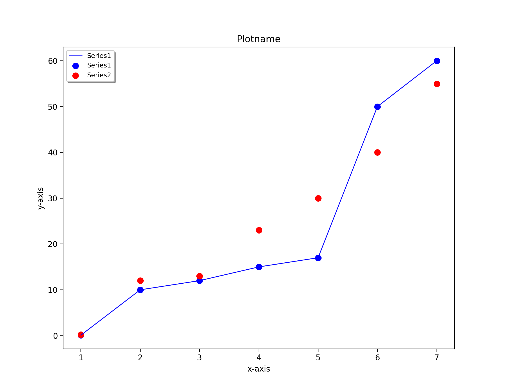
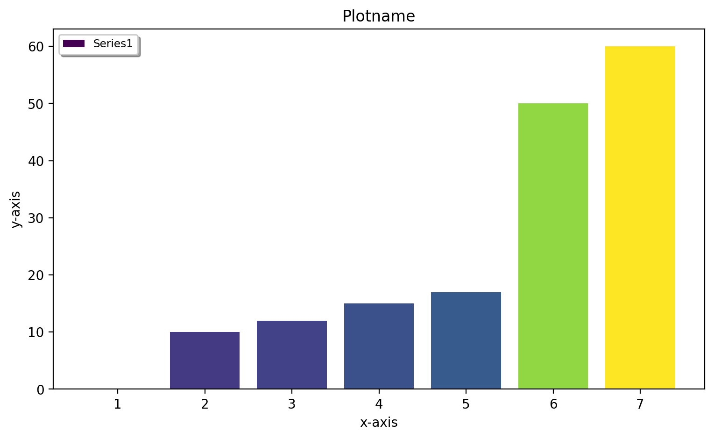
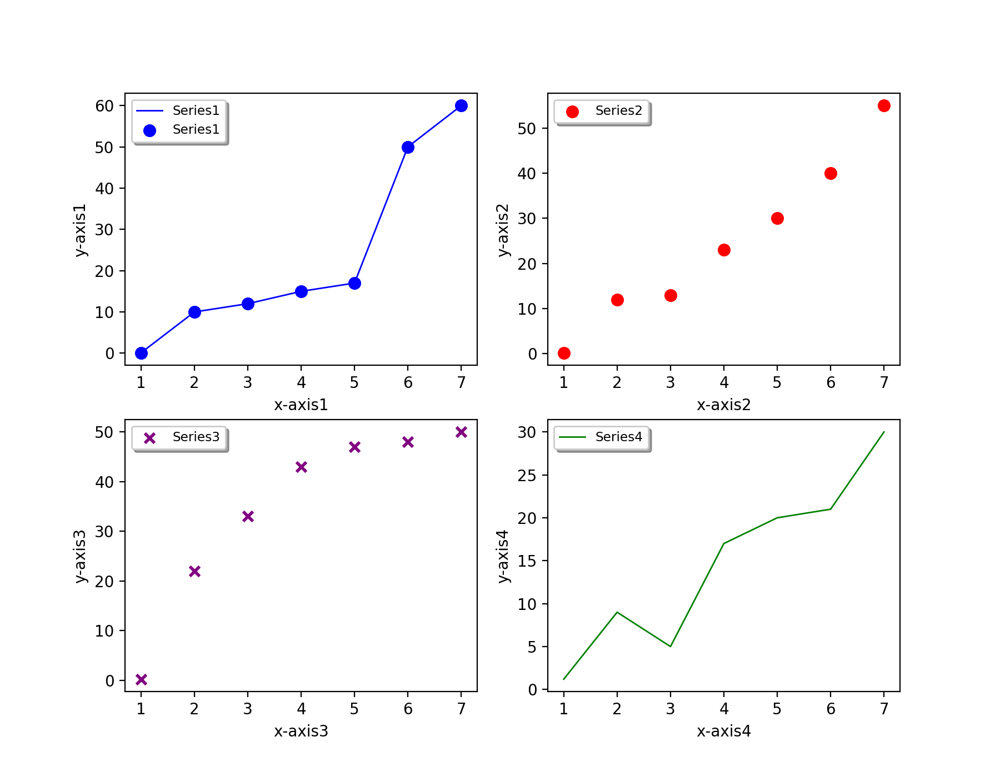
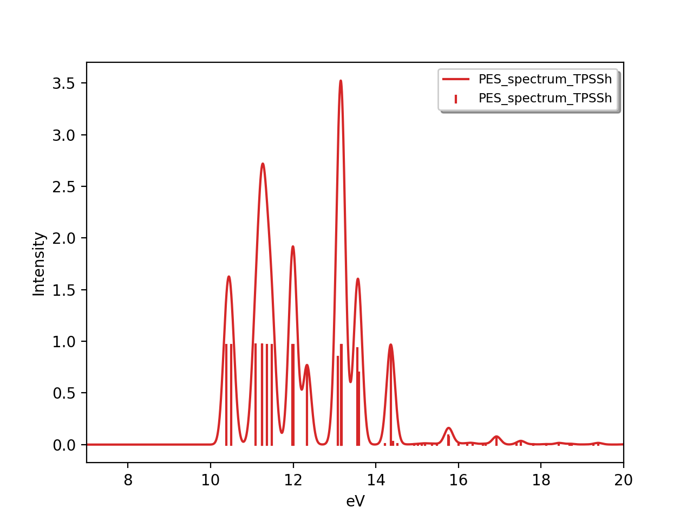
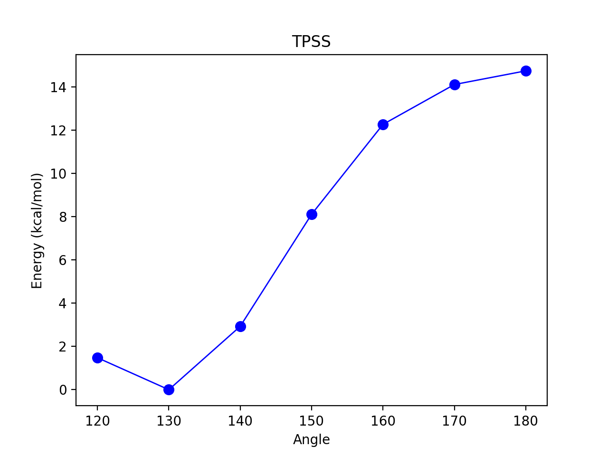
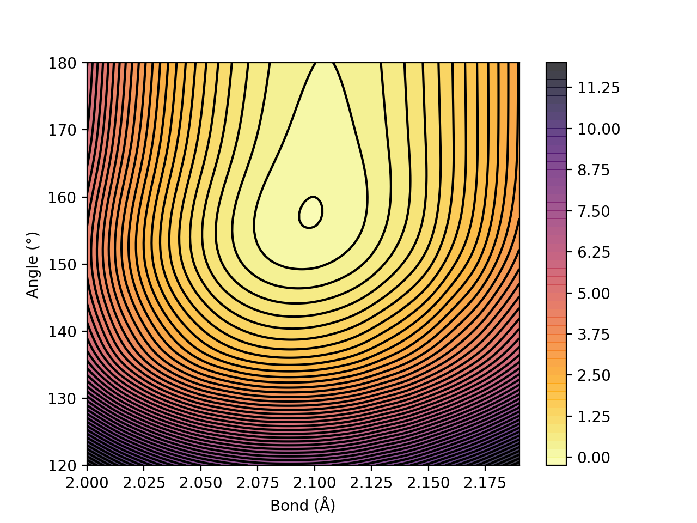

Plotting
======================================

ASH includes some basic functions for conveniently plotting data: including reaction profiles, contourplots, broadened spectra etc.
These are essentially wrapper-functions around `Matplotlib <https://matplotlib.org>`_  functionality.

All the plotting functions documented here require a Matplotlib installation in the Python environment. Should be easily installed via either pip or Anaconda.

##############################################################################
 ASH_plot: Basic plotting
##############################################################################

ASH_plot is a simple wrapper around the powerful `Matplotlib <https://matplotlib.org>`_  library, just designed to make basic plotting of data (calculated by ASH) as straightforward as possible.

.. note::  If you need more advanced plotting options than provided here, it is probably best to use Matplotlib directly instead of ASH_plot. 
    Let the developer know if you have suggestions for simple improvements to ASH_plot.

.. code-block:: python

  class ASH_plot():
    def __init__(self, figuretitle='Plottyplot', num_subplots=1, dpi=200, imageformat='png', figsize=(9,5),
        x_axislabel='X-axis', y_axislabel='Energy (X)', x_axislabels=None, y_axislabels=None, title='Plot-title', 
        subplot_titles=None, xlimit=None, ylimit=None, backend='Agg',
        legend_pos=None, horizontal=False, tight_layout=True, padding=None):
    def addseries(self,subplot, surfacedictionary=None, x_list=None, y_list=None, x_labels=None, label='Series', color='blue', pointsize=40, 
                    scatter=True, line=True, bar=False, scatter_linewidth=2, line_linewidth=1, barwidth=None, barcolors=None, marker='o', legend=True, x_scaling=1.0,y_scaling=1.0,
                    xticklabelrotation=80, x_scale_log=False, y_scale_log=False, colormap='viridis'):
    def invert_x_axis(self,subplot):
    def invert_y_axis(self,subplot):
    def savefig(self, filename, imageformat=None, dpi=None):
    def showplot(self):

..  https://draft-edx-style-guide.readthedocs.io/en/latest/ExampleRSTFile.html

**ASH_plot** options:

.. list-table::
   :widths: 15 15 15 60
   :header-rows: 1

   * - Keyword
     - Type
     - Default value
     - Details
   * - ``figuretitle``
     - string
     - 'Plottyplot'
     - Title of the figure.
   * - ``num_subplots``
     - integer
     - 1
     - Number of subplots.
   * - ``dpi``
     - integer
     - 200
     - Resolution of the final figure (dots per inch).
   * - ``imageformat``
     - string
     - 'png'
     - Imageformat. Options: 'png', 'pdf', 'jpg', '.tiff, 'svg' etc.
   * - ``figsize``
     - tuple of integers
     - (9,5)
     - Figure size dimensions.
   * - ``x_axislabel``
     - string
     - 'X-axis'
     - x-axis label of plot (when num_subplots=1).
   * - ``y_axislabel``
     - string
     - 'Energy(X)'
     - y- axis label of plot (when num_subplots=1).
   * - ``x_axislabels``
     - list of strings
     - None
     - x-axes labels of each subplot (when num_subplots>1)
   * - ``y_axislabels``
     - list of strings
     - None
     - y-axes labels of each subplot (when num_subplots>1)
   * - ``title``
     - string
     - Plot-title
     - Title of plot (when num_subplots=1)
   * - ``subplots_title``
     - list of strings
     - None
     - Titles for each subplot.
   * - ``invert_x_axis``
     - Boolean
     - False
     - Invert x-axis or not
   * - ``invert_y_axis``
     - Boolean
     - False
     - Invert y-axis or not
   * - ``xlimit``
     - list of floats
     - None
     - x-axis limit
   * - ``ylimit``
     - list of floats
     - None
     - y-axis limit
   * - ``legend_pos``
     - list of floats
     - None
     - Position of legend on plot

**ASH_plot.add_series** options:

.. list-table::
   :widths: 15 15 15 60
   :header-rows: 1

   * - Keyword
     - Type
     - Default value
     - Details
   * - ``subplot``
     - integer
     - None
     - What subplot to add data-series to. Use 0 for first subplot. 
   * - ``x_list``
     - list
     - None
     - List of x-values for series.
   * - ``y_list``
     - list
     - None
     - List of y-values for series.
   * - ``surfacedictionary``
     - dict
     - None
     - Alternative to x_list/y_list. Dictionary should have x-values as keys and y-values as values.
   * - ``label``
     - string
     - 'Series'
     - Label of series added. Will show up in legend.
   * - ``color``
     - string
     - 'blue'
     - What color to use for series. `Matplotlib colors <https://matplotlib.org/stable/gallery/color/named_colors.html>`_
   * - ``barcolors``
     - list
     - None
     - List of colors to use for each bar. `Matplotlib colors <https://matplotlib.org/stable/gallery/color/named_colors.html>`_
   * - ``pointsize``
     - integer
     - 40
     - Marker-size in scatterplots.
   * - ``scatter``
     - Boolean
     - True
     - Do scatterplot or not.
   * - ``line``
     - Boolean
     - True
     - Do lineplot or not.
   * - ``bar``
     - Boolean
     - False
     - Do barplot or not. Incompatible with line and scatter above.
   * - ``scatter_linewidth``
     - integer
     - 2
     - Linewidth of scatter-marker edges.
   * - ``line_linewidth``
     - integer
     - 1
     - Linewidth of lines in line-plots.
   * - ``barwidth``
     - integer
     - None
     - Width of bar columns. Default is None, ie. width is automatically adapted to data.
   * - ``marker``
     - string
     - 'o'
     - What marker symbol to use in scatterplots. `Matplotlib markers <https://matplotlib.org/stable/api/markers_api.html>`_ 
   * - ``legend``
     - Boolean
     - True
     - Whether to plot legend or not.
   * - ``colormap``
     - string
     - 'viridis'
     - Optional colormap to use. Currently only used for barplots (if barcolors=None)

To use, you just need to create an ASH_plot object, add one or more dataseries to the object (using the .addseries method) and then save (using the .savefig method). 
Since the data is provided via simply Python lists you could of course run an ASH job that first generates the data from e.g. QM or QM/MM calculations and then plot the data at the end, all in the same script.

**Basic 1-subplot example:**

.. code-block:: python

    from ash import *

    #Dataseries1. Data are simply Python lists
    xvalues1=[1,2,3,4,5,6,7]
    yvalues1=[0.1, 10.0, 12.0, 15.0, 17.0, 50.0, 60.0]
    #Dataseries2
    xvalues2=[1,2,3,4,5,6,7]
    yvalues2=[0.2, 12.0, 13.0, 23.0, 30.0, 40.0, 55.0]

    #Create ASH_plot object named edplot
    eplot = ASH_plot("Plotname", num_subplots=1, x_axislabel="x-axis", y_axislabel='y-axis')

    #Add a dataseries to subplot 0 (the only subplot)
    eplot.addseries(0, x_list=xvalues1, y_list=yvalues1, label='Series1', color='blue', line=True, scatter=True)
    eplot.addseries(0, x_list=xvalues2, y_list=yvalues2, label='Series2', color='red', line=False, scatter=True)

    #Save figure
    eplot.savefig('Simpleplot')

**Barplot 1-subplot example:**

Barplots are sometimes more suitable. Use bar=True in this case and turn off lines and scatter by: line=False and scatter=False.
To control the colors of the barplot you can use the barcolors keyword. This should be a list of colors, one for each bar.
By default (if no barcolors list provided), a colormap is used to generate colors for the datapoints, here taken from the default colormap 'viridis'.
You can change the colormap via the colormap keyword (some options: 'viridis', 'inferno', 'inferno_r', 'plasma', 'magma')

.. code-block:: python

    from ash import *

    #Dataseries1. Data are simply Python lists
    xvalues1=[1,2,3,4,5,6,7]
    yvalues1=[0.1, 10.0, 12.0, 15.0, 17.0, 50.0, 60.0]
    #Dataseries2
    xvalues2=[1,2,3,4,5,6,7]
    yvalues2=[0.2, 12.0, 13.0, 23.0, 30.0, 40.0, 55.0]

    #Create ASH_plot object named edplot
    eplot = ASH_plot("Plotname", num_subplots=1, x_axislabel="x-axis", y_axislabel='y-axis')

    #Add a dataseries to subplot 0 (the only subplot)
    eplot.addseries(0, x_list=xvalues1, y_list=yvalues1, label='Series1', color='blue', bar=True, scatter=False, line=False)

    #Save figure
    eplot.savefig('Barplot')

You can also create a figure with multiple subplots. Currently, num_subplots=1, 2, 3 or 4 works.

**Basic 4-subplot example:**

.. code-block:: python

  from ash import *

  #Series1
  xvalues1=[1,2,3,4,5,6,7]
  yvalues1=[0.1, 10.0, 12.0, 15.0, 17.0, 50.0, 60.0]
  #Series2
  xvalues2=[1,2,3,4,5,6,7]
  yvalues2=[-5, 12.0, 13.0, 23.0, 30.0, 40.0, 55.0]
  #Series3
  xvalues3=[1,2,3,4,5,6,7]
  yvalues3=[0.25, 22.0, 33.0, 43.0, 47.0, 48.0, 50.0]
  #Series4
  xvalues4=[1,2,3,4,5,6,7]
  yvalues4=[1.2, 9.0, 5.0, 17.0, 20.0, 21.0, 30.0]

  #Create ASH_plot object named edplot
  eplot = ASH_plot("Plotname", num_subplots=4, x_axislabels=["x-axis1", "x-axis2","x-axis3","x-axis4"],
          y_axislabels=["y-axis1", "y-axis2","y-axis3","y-axis4"], figsize=(9,7))

  #Add a series to each subplot (0, 1, 2 or 3)
  eplot.addseries(0, x_list=xvalues1, y_list=yvalues1, label='Series1', color='blue', line=True, scatter=True)
  eplot.addseries(1, x_list=xvalues2, y_list=yvalues2, label='Series2', bar=True, line=False, scatter=False)
  eplot.addseries(2, x_list=xvalues3, y_list=yvalues3, label='Series3', color='purple', line=False, scatter=True, marker='x')
  eplot.addseries(3, x_list=xvalues4, y_list=yvalues4, label='Series4', color='green', line=True, scatter=False)

  #Save figure
  eplot.savefig('Simple-subplot4')

##############################################################################
 plot_Spectrum: Plotting broadened spectrum
##############################################################################
The plot_Spectrum function takes a list of x-axis values (xvalues keyword), y-axis values (yvalues keyword),
broadens each transition (stick) to create a broadened spectrum (written to a .dat file). 
The xvalues list is traditionally a Python list of energies (e.g. transition energies, Ionization-energies) and yvalues
list is typically a list of intensities. Typically these quantities come from a current or previous ASH job.
A Gaussian lineshape is used by default, Lorentz and Voight lineshapes are also possible.

.. code-block:: python

  def plot_Spectrum(xvalues=None, yvalues=None, plotname='Spectrum', range=None, unit='eV', broadening=0.1, points=10000, 
      imageformat='png', dpi=200, matplotlib=True, CSV=True, color='blue', plot_sticks=True, lineshape='Gaussian', voigt_broadening=None):

The output is a broadened data-file (e.g. Spectrum.dat), a stick-spectrum file (e.g. Spectrum.stk) and an image file (e.g Spectrum.png),
the latter requires Matplotlib.

Options:

- **plotname** : String (name, used to name the output files)
- **range** : List (x-axis range to plot; first value is start, second value is end)
- **unit** : String (unit of x-axis used to label axis, default: eV)
- **lineshape** : The lineshape function to use (Gaussian, Lorentz, Voigt). Default: Gaussian
- **broadening** : number (the broadening factor in same unit as data, default: 0.1)
- **voight_broadening** : list (list of 2 values to control sigma and gamma of Gaussian and Lorentz part of Voigt).
- **points** : integer (number of points in broadened spectrum, default:10000)
- **imageformat** : string-option (Matplotlib image format, e.g. png, svg; default: png)
- **dpi** : integer (resolution of image, default:200)
- **matplotlib** : Boolean(True/False) (whether to create image-file using Matplotlib or not, default: True)
- **CSV** : Boolean(True/False) (whether to comma-separate values or not in dat and stk files, default: True)
- **plot_sticks** : Boolean(True/False) (whether to plot sticks in plot or not default: True)
  
.. code-block:: python

    #Dummy example
    transition_energies=[1.0, 2.0, 3.0]
    transition_intensities=[0.05, 0.11, 0.57]

    plot_Spectrum(xvalues=transition_energies, yvalues=transition_intensities, plotname='PES_spectrum_TPSSh', range=[7,20], unit='eV',
        broadening=0.1, points=10000, imageformat='png', dpi=200)

The .dat and .stk  files are CSV files that can be easily read into a numpy array like this:

.. code-block:: python

  import numpy as np

  with open('Spectrum.dat') as csvfile:
      dataseries = np.genfromtxt(csvfile, delimiter=',')
  print("dataseries", dataseries)

and can then be plotted separately. 

##############################################################################
 MOplot_vertical: Plot vertical MO diagram
##############################################################################

Input: Dictionary containing lists of molecular-orbital energies.

Created by MolecularOrbitalgrab in ORCA interface

Example: mos_dict= {"occ_alpha":[-1.0,-2.0,-3.0], "occ_beta":[-1.0,-2.0,-3.0], "unocc_alpha":[1.0,2.0,3.0], "unocc_beta":[1.0,2.0,3.0], "Openshell":True}

.. code-block:: python

  def MOplot_vertical(mos_dict, pointsize=4000, linewidth=2, label="Label", yrange=[-30,3], imageformat='png')

Example plotting MO diagrams for multiple ORCA outputfiles:

.. code-block:: python

  from ash import *
  from ash.interfaces.interface_ORCA import MolecularOrbitalGrab
  import glob

  for file in glob.glob("*.out"):
      label=file.split(".")[0]
      orbdict = MolecularOrbitalGrab(file)
      MOplot_vertical(orbdict, pointsize=4000, linewidth=2, label=label, yrange=[-30,3], imageformat='png')

##############################################################################
 Reaction_profile
##############################################################################
For a 1D scan (see :doc:`job-types`), the result dictionary can be given to the **reactionprofile_plot** function which will visualize the
relative energy surface as a lineplot. Dictionary should contain key-value pairs: coordinate : energy (in Eh).
The output is an imagefile (PNG by default).

.. code-block:: python

  def reactionprofile_plot(surfacedictionary, finalunit='',label='Label', x_axislabel='Coord', y_axislabel='Energy', dpi=200, mode='pyplot',
                          imageformat='png', RelativeEnergy=True, pointsize=40, scatter_linewidth=2, line_linewidth=1, color='blue',
                          filename='Plot'):

- By default, the *RelativeEnergy* =True keyword option is on but can be turned off. This assumes energies are initially in Eh (Hartree) and they will be converted into the desired unit.
- The desired relative-energy unit is chosen via the *finalunit* keyword (valid options are: 'kcal/mol', 'kJ/mol', 'eV', 'cm-1').
- The x-axis label or y-axis label of the plot can be changed via: *x_axislabel* ='String' or *y_axislabel* ='String'.
- The *label* keyword is used to named the file saved: e.g.: PlotXX.png
- The *imageformat* and *dpi* keywords can be used to specify the image format: default is PNG and 200.
- *pointsize*, *scatter_linewidth*, *line_linewidth* and *color* keywords can be used to modify the plot.

.. code-block:: python

    import ash
    #Simple with default options
    reactionprofile_plot(surfacedictionary, finalunit='kcal/mol',label='TPSS', x_axislabel='Angle', y_axislabel='Energy')
    #Specifying options

    reactionprofile_plot(surfacedictionary, finalunit='kcal/mol',label='TPSS', x_axislabel='Angle', y_axislabel='Energy',
        imageformat='png', RelativeEnergy=True, pointsize=40, scatter_linewidth=2, line_linewidth=1, color='blue')

##############################################################################
 Contour_plot
##############################################################################

For a 2D scan (see :doc:`job-types`), the dictionary can be given to the **contourplot** function which will visualize the energy surface as a contourplot.
The output is an imagefile (PNG by default).

- The unit of the surface can be chosen via finalunit keyword (kcal/mol, kJ/mol, eV etc.).
- A relative energy surface is by default calculated (RelativeEnergy=True) but this can be turned off (RelativeEnergy=False) e.g. for plotting a non-energetic surface.
- Datapoint interpolation can be performed (currently only 'Cubic' option; the cubic power can be modified via interpolparameter). This requires a scipy installation.
- The axes labels of the plot can be changed via: x_axislabel and y_axislabel.
- The label keyword is used to named the file saved: e.g.: SurfaceXX.png
- The imageformat and dpi keywords can be used to specify the image format: default is PNG and 200. See Matplotlib documentation for other imageformat options.
- The default colormap is 'inferno_r'. Other colormaps are e.g. 'viridis', 'inferno', 'plasma', 'magma' (matplotlib keywords).
- The number of contourlines used both for the filled contoursurface is by default 500 (numcontourlines=500). This value can be changed.
- Alternatively only a few selected contour-lines can be shown by providing a list as argument to contour_values keyword. e.g. contour_values=[0.1,1.0,2.0.5.0]
- Contourlines can be labelled or not: clinelabels=True/False
- The filled surface can be made more opaque or more transparent via the contour_alpha keyword (default 0.75).
- The color of the contour lines can be changed (contourline_color=black by default)

.. code-block:: python

    contourplot(surfacedictionary, finalunit='kcal/mol',label=method, interpolation='Cubic', x_axislabel='Bond (Å)', y_axislabel='Angle (°)')

Figure. Energy surface of FeS2 scanning both the Fe-S bond and the S-Fe-S angle. The Fe-S reaction coordinate applies to both Fe-S bonds.