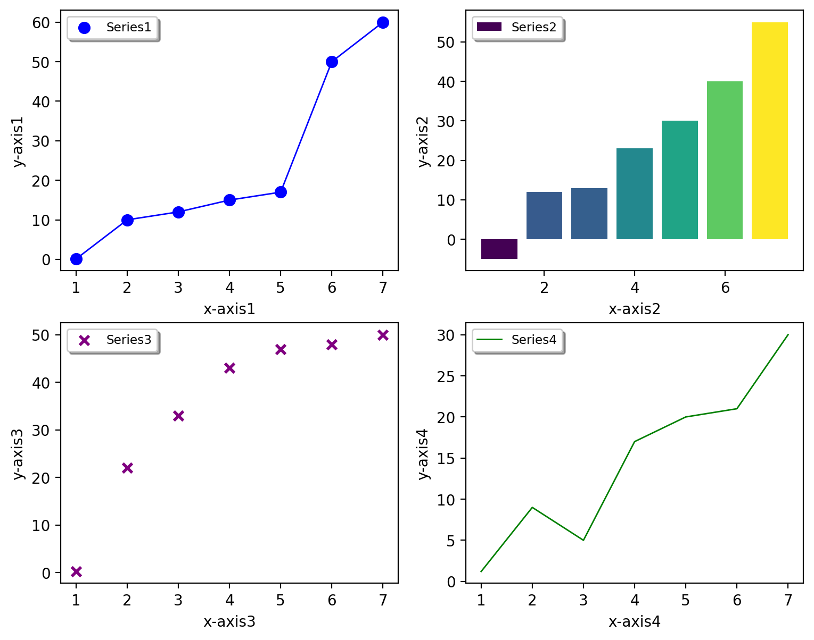

Plotting
======================================

ASH includes some basic functions for conveniently plotting data: including reaction profiles, contourplots, broadened spectra etc.
These are essentially wrapper-functions around Matplotlib functionality.

All the plotting functions documented here require a Matplotlib installation in the Python environment. Should be easily installed via either pip or Anaconda.

##############################################################################
 ASH_plot: Basic plotting
##############################################################################

ASH_plot is a simple wrapper around the powerful Matplotlib library, just designed to make basic plotting as straightforward as possible.

.. note::  If you need more advanced plotting options than provided here, it is probably best to use Matplotlib directly.

.. code-block:: python

    class ASH_plot():
        def __init__(self, figuretitle='Plottyplot', num_subplots=1, dpi=200, imageformat='png', figsize=(9,5),
            x_axislabel='X-axis', y_axislabel='Energy (X)', x_axislabels=None, y_axislabels=None, title='Plot-title', subplot_titles=None):
            print_line_with_mainheader("ASH_energy_plot")
        def addseries(self,subplot, surfacedictionary=None, x_list=None, y_list=None, label='Series', color='blue', pointsize=40, 
                        scatter=True, line=True, scatter_linewidth=2, line_linewidth=1, marker='o'):
        def savefig(self, filename, imageformat=None, dpi=None):

**ASH_plot** options:

- figuretitle (string): Title of the plot. Default: 'Plottyplot'
- num_subplots (integer): Number of subplots. Default=1
- dpi (integer): Resolution of the final figure (dots per inch). Default: 200
- imageformat (string). Imageformat. Options: 'png', 'pdf', 'jpg', '.tiff, 'svg' etc. Default: 'png'
- figsize (tuple of integers): 
- x_axislabel/y_axislabel (string): x- and y- axes labels of plot (when num_subplots=1). Default: 'X-axis' and 'Energy (X).
- x_axislabels/y_axislabels (list of strings). x- and y-axes labels of each subplot (when num_subplots>1).
- title (string). Title of plot (when num_subplots=1)
- subplots_title (list of strings). Titles for each subplot.

**ASH_plot.add_series** options

- subplot (integer). What subplot to add data-series to. Use 0 for first subplot. 
- x_list (list). List of x-values. Deafult: None
- y_list (list). List of x-values. Deafult: None
- surfacedictionary (dict). Alternative to x_list/y_list. (NOT CURRENTLY ACTIVE) 
- label (string). Label of series added. Will show up in legend. Default:'Series'
- color (string). What color to use. `Matplotlib colors <https://matplotlib.org/stable/gallery/color/named_colors.html>`_ . Default: 'blue'
- pointsize (integer). Marker-size in scatterplots. Default: 40
- scatter (Boolean). Do scatterplot or not. Default: True
- line (Boolean). Do lineplot or not. Default: True
- scatter_linewidth (integer). Linewidth of scatter-marker edges. Default:2
- line_linewidth (integer). Linewidth of line plots. Default:1
- marker (string). What marker symbol to use in scatterplots. `Matplotlib markers <https://matplotlib.org/stable/api/markers_api.html>`_ . Default: 'o'

To use, you just need to create an ASH_plot object, add one or more dataseries to the object (using the .addseries method) and then save (using the .savefig method). 
Since the data is provided via simply Python lists you could of course run an ASH job that first generates the data from e.g. QM or QM/MM calculations and then plot the data at the end, all in the same script.

**Basic 1-subplot example:**

.. code-block:: python

    from ash import *

    #Dataseries1. Data are simply Python lists
    xvalues1=[1,2,3,4,5,6,7]
    yvalues1=[0.1, 10.0, 12.0, 15.0, 17.0, 50.0, 60.0]
    #Dataseries2
    xvalues2=[1,2,3,4,5,6,7]
    yvalues2=[0.2, 12.0, 13.0, 23.0, 30.0, 40.0, 55.0]

    #Create ASH_plot object named edplot
    eplot = ASH_plot("Plotname", num_subplots=1, x_axislabel="x-axis", y_axislabel='y-axis')

    #Add a dataseries to subplot 0 (the only subplot)
    eplot.addseries(0, x_list=xvalues1, y_list=yvalues1, label='Series1', color='blue', line=True, scatter=True)
    eplot.addseries(0, x_list=xvalues2, y_list=yvalues2, label='Series2', color='red', line=False, scatter=True)

    #Save figure
    eplot.savefig('Simpleplot')

You can also create a figure with multiple subplots. Currently, num_subplots=1, 2, 3 or 4 works.

**Basic 4-subplot example:**

.. code-block:: python

    from ash import *

    #Series1
    xvalues1=[1,2,3,4,5,6,7]
    yvalues1=[0.1, 10.0, 12.0, 15.0, 17.0, 50.0, 60.0]
    #Series2
    xvalues2=[1,2,3,4,5,6,7]
    yvalues2=[0.2, 12.0, 13.0, 23.0, 30.0, 40.0, 55.0]
    #Series3
    xvalues3=[1,2,3,4,5,6,7]
    yvalues3=[0.25, 22.0, 33.0, 43.0, 47.0, 48.0, 50.0]
    #Series4
    xvalues4=[1,2,3,4,5,6,7]
    yvalues4=[1.2, 9.0, 5.0, 17.0, 20.0, 21.0, 30.0]

    #Create ASH_plot object named edplot
    eplot = ASH_plot("Plotname", num_subplots=4, x_axislabels=["x-axis1", "x-axis2","x-axis3","x-axis4"], 
            y_axislabels=["y-axis1", "y-axis2","y-axis3","y-axis4"], figsize=(9,7))

    #Add a series to each subplot (0, 1, 2 or 3)
    eplot.addseries(0, x_list=xvalues1, y_list=yvalues1, label='Series1', color='blue', line=True, scatter=True)
    eplot.addseries(1, x_list=xvalues2, y_list=yvalues2, label='Series2', color='red', line=False, scatter=True)
    eplot.addseries(2, x_list=xvalues3, y_list=yvalues3, label='Series3', color='purple', line=False, scatter=True, marker='x')
    eplot.addseries(3, x_list=xvalues4, y_list=yvalues4, label='Series4', color='green', line=True, scatter=False)

    #Save figure
    eplot.savefig('Simple-subplot4')

##############################################################################
 plot_Spectrum: Plotting broadened spectrum
##############################################################################
The plot_Spectrum function takes a list of x-axis values (xvalues keyword), y-axis values (yvalues keyword) and plots
a broadened spectrum and a stick spectrum. The xvalues list is traditionally a Python list of energies (e.g. transition energies, Ionization-energies) and yvalues
list is typically a list of intensities. Typically these quantities come from a current or previous ASH job.
Gaussian broadening is used.

The output is a broadened data-file (e.g. Spectrum.dat), a stick-spectrum file (e.g. Spectrum.stk) and an image file (e.g Spectrum.png),
the latter requires Matplotlib.

Options:

- **plotname** : String (name, used to name the output files)
- **range** : List (x-axis range to plot; first value is start, second value is end)
- **unit** : String (unit of x-axis used to label axis, default: eV)
- **broadening** : number (the broadening factor in same unit as data, default: 0.1)
- **points** : integer (number of points in broadened spectrum, default:10000)
- **imageformat** : string-option (Matplotlib image format, e.g. png, svg; default: png)
- **dpi** : integer (resolution of image, default:200)
- **matplotlib** : Boolean(True/False) (whether to create image-file using Matplotlib or not, default: True)
- **CSV** : Boolean(True/False) (whether to comma-separate values or not in dat and stk files, default: True)

.. code-block:: python

    import module_plotting

    #Dummy example
    transition_energies=[1.0, 2.0, 3.0]
    transition_intensities=[0.05, 0.11, 0.57]

    module_plotting.plot_Spectrum(xvalues=transition_energies, yvalues=transition_intensities, plotname='PES_spectrum_TPSSh', range=[7,20], unit='eV',
        broadening=0.1, points=10000, imageformat='png', dpi=200)

.. image:: figures/PES_spectrum_TPSSh.png
   :align: center
   :width: 600

##############################################################################
 MOplot_vertical: Plot vertical MO diagram
##############################################################################

Input: Dictionary containing lists of molecular-orbital energies.

Created by MolecularOrbitalgrab in ORCA interface

Example: mos_dict= {"occ_alpha":[-1.0,-2.0,-3.0], "occ_beta":[-1.0,-2.0,-3.0], "unocc_alpha":[1.0,2.0,3.0], "unocc_beta":[1.0,2.0,3.0], "Openshell":True}

.. code-block:: python

  def MOplot_vertical(mos_dict, pointsize=4000, linewidth=2, label="Label", yrange=[-30,3], imageformat='png')

##############################################################################
 Reaction_profile
##############################################################################
For a 1D scan (see :doc:`job-types`), the result dictionary can be given to the **module_plotting.reactionprofile_plot** function which will visualize the
relative energy surface as a lineplot. Dictionary should contain key-value pairs: coordinate : energy (in Eh).
The output is an imagefile (PNG by default).

- By default, the *RelativeEnergy* =True keyword option is on but can be turned off. This assumes energies are initially in Eh (Hartree) and they will be converted into the desired unit.
- The desired relative-energy unit is chosen via the *finalunit* keyword (valid options are: 'kcal/mol', 'kJ/mol', 'eV', 'cm-1').
- The x-axis label or y-axis label of the plot can be changed via: *x_axislabel* ='String' or *y_axislabel* ='String'.
- The *label* keyword is used to named the file saved: e.g.: PlotXX.png
- The *imageformat* and *dpi* keywords can be used to specify the image format: default is PNG and 200.
- *pointsize*, *scatter_linewidth*, *line_linewidth* and *color* keywords can be used to modify the plot.

.. code-block:: python

    import ash
    import module_plotting
    #Simple with default options
    module_plotting.reactionprofile_plot(surfacedictionary, finalunit='kcal/mol',label='TPSS', x_axislabel='Angle', y_axislabel='Energy')
    #Specifying options

    module_plotting.reactionprofile_plot(surfacedictionary, finalunit='kcal/mol',label='TPSS', x_axislabel='Angle', y_axislabel='Energy',
        imageformat='png', RelativeEnergy=True, pointsize=40, scatter_linewidth=2, line_linewidth=1, color='blue')

.. image:: figures/PlotTPSS.png
   :align: center
   :width: 600

##############################################################################
 Contour_plot
##############################################################################

For a 2D scan (see :doc:`job-types`), the dictionary can be given to the **module_plotting.contourplot** function which will visualize the energy surface as a contourplot.
The output is an imagefile (PNG by default).

- The unit of the surface can be chosen via finalunit keyword (kcal/mol, kJ/mol, eV etc.).
- A relative energy surface is by default calculated (RelativeEnergy=True) but this can be turned off (RelativeEnergy=False) e.g. for plotting a non-energetic surface.
- Datapoint interpolation can be performed (currently only 'Cubic' option; the cubic power can be modified via interpolparameter). This requires a scipy installation.
- The axes labels of the plot can be changed via: x_axislabel and y_axislabel.
- The label keyword is used to named the file saved: e.g.: SurfaceXX.png
- The imageformat and dpi keywords can be used to specify the image format: default is PNG and 200. See Matplotlib documentation for other imageformat options.
- The default colormap is 'inferno_r'. Other colormaps are e.g. 'viridis', 'inferno', 'plasma', 'magma' (matplotlib keywords).
- The number of contourlines used both for the filled contoursurface is by default 500 (numcontourlines=500). This value can be changed.
- Alternatively only a few selected contour-lines can be shown by providing a list as argument to contour_values keyword. e.g. contour_values=[0.1,1.0,2.0.5.0]
- Contourlines can be labelled or not: clinelabels=True/False
- The filled surface can be made more opaque or more transparent via the contour_alpha keyword (default 0.75).
- The color of the contour lines can be changed (contourline_color=black by default)

.. code-block:: python

    import module_plotting
    plotting.contourplot(surfacedictionary, finalunit='kcal/mol',label=method, interpolation='Cubic', x_axislabel='Bond (Å)', y_axislabel='Angle (°)')

.. image:: figures/SurfaceTPSSh.png
   :align: center
   :width: 600

Figure. Energy surface of FeS2 scanning both the Fe-S bond and the S-Fe-S angle. The Fe-S reaction coordinate applies to both Fe-S bonds.