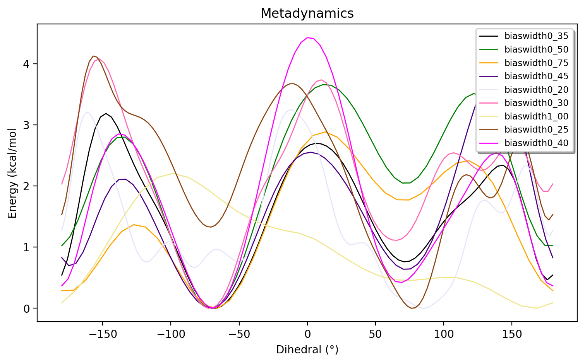

Metadynamics in ASH: Tutorial
======================================

Examples on how to perform metadynamics in ASH in general. See :doc:`Biased-sampling` for the general documentation.
In the examples below we use GFN1-xTB as a convenient QM level of theory due to it's low computational cost and qualitatively correct results.
ASH, however, allows one to perform metadynamics using any level of theory that is capable of providing an energy and gradient.
Both 1 and 2 collective variables (CVs) are supported.

**Examples:** 

- 1 CV MTD on butane using QM dynamics (xTB)
- 2 CV MTD on 3F-GABA using QM dynamics (xTB)
- 1 CV MTD on lysozyme using both MM and QM/MM dynamics

The scripts and files can be found in the examples/metadynamics directory of the ASH repository.

######################################################
**1. Single-CV metadynamics on n-butane**
######################################################

The conformational surface of n-butane is a good simple example for demonstrating the basics of the metadynamics method with a single CV.
The basic energy surface should be familiar to most as shown in the relaxed potential energy surface scan below (at the semi-empirical GFN1-xTB level of theory) where
the C0-C1-C2-C3 dihedral angle acts as a convenient reaction coordinate.

.. image:: figures/butane_potenergy_scan.png
   :align: center
   :width: 400

This relaxed surface-scan was performed using the **calc_surface function**  (see :doc:`surfacescan` ) like this:

.. code-block:: python

    #Creating the ASH fragment 
    frag = Fragment(databasefile="butane.xyz", charge=0, mult=1)
    #Defining the xTB theory (GFN1-xTB)
    theory = xTBTheory(runmode='library')

    #Calling the calc_surface function
    surfacedictionary = calc_surface(fragment=frag, theory=theory, scantype='Relaxed',
        resultfile='surface_results.txt', runmode='serial',
        RC1_range=[-180,180,10], RC1_type='dihedral', RC1_indices=[0,1,2,3])

The symmetry of n-butane and the fact that the free-energy surface would be expected to be highly similar to the potential energy surface 
(i.e. one already knows the approximate final result) is here an advantage.
Running metadynamics on the molecule allows one to get a feel for what it takes to converge a free energy surface with respect to minima and barriers.
Any major deviation from the basic potential energy profile, including symmetry breaking, should be interpreted as sampling noise or other simulation deficiency.

A metadynamics simulation at the same level of theory is straightforward to set up:

.. code-block:: python

    from ash import *

    #Creating the ASH fragment 
    frag = Fragment(databasefile="butane.xyz", charge=0, mult=1)
    #Defining the xTB theory (GFN1-xTB)
    theory = xTBTheory(runmode='library')

    #The name and path of the biasdirectory
    biasdir="./biasdirectory"

    #Calling the OpenMM_metadynamics function with a time of 1 ps
    OpenMM_metadynamics(fragment=frag, theory=theory, 
                timestep=0.001, simulation_time=1, traj_frequency=1, 
                temperature=300,
                CV1_atoms=[0,1,2,3], CV1_type='dihedral', CV1_biaswidth=0.5,
                biasfactor=6, height=1,
                frequency=1, savefrequency=1,
                biasdir=biasdir)

Here we simply call the **OpenMM_metadynamics** function ( See :doc:`Biased-sampling`) on the same fragment and the same theory level, 
and we run an MD simulation for the desired length (1 ps in the script above) and temperature (300 K here).
We choose the CV to be the dihedral angle as previously defined (defined by carbon atoms 0-4) with a bias width of 0.5 radians (a common choice).
Additionally the Gaussian height is here chosen to be 1 kJ/mol and the biasfactor is 6 (higher values are also common).
The frequency and savefrequency values (here both 1) should be adjusted for longer simulations. 
The biasdirectory variable needs to point to a directory that exist and can either be local 
(make sure the jobscript or Python script creates it in this case) or can point to the full path of a globally available directory.

Running the script above for 1 ps, 10 ps and 100 ps gives us the following plot:

.. image:: figures/MTD_1-10-100-ps.png
   :align: center
   :width: 400

As shown, a 1 ps simulation gives a qualitatively wrong energy surface, while 10 ps is qualitatively OK but strongly breaks symmetry.
The 100 ps simulation is qualitatively correct but breaks symmetry a little bit and obviously these simulations are still far from being converged.

The overall quality of the simulation and the resulting free-energy surface will depend on the simulation time (as shown) but also on the biaswidth, biasfactor and Gaussian height.

The effect of the biaswidth is shown in the figure below (keeping simulation length at 10 ps)

A width of biaswidth=1.0 radians clearly is too large while biaswidth=0.20 is too small.
It is more difficult to tell apart the other values (due to sampling noise) but a width of 0.25-0.50 radians seems appropriate here. 
As discussed in the metadynamics literature, a common way to determine the biaswidth is to run a regular MD simulation and choose a biaswidth based on the fluctuation of the CV.

To reduce the sampling error, we could continue to increase the simulation time beyond 100 ps.
However, an even better approach is to utilize multi-walker metadynamics. By simply running multiple metadynamics simulations (each simulation being a walker) with a shared
biasdirectory, the different walkers will more quickly sample the free-energy surface. Multiple walkers is more efficient as we can e.g. use 10 CPU cores to run 10
metadynamics simulations for a tenfold improvement in sampling. This is more efficient than using the CPU cores to speed-up the speed of the Hamiltonian in each timestep 
(i.e. speeding up xTB by its own parallelization). Multiple-walker metadynamics only requires one to launch multiple ASH metadynamics jobs where the biasdirectory variable points to a shared, globally available biasdirectory.
As shown in the figure below we get a much improved sampling error by running 10 walkers instead of 1 walker (each simulation being 10 ps).

.. image:: figures/MTD_1-vs-10-walkers.png
   :align: center
   :width: 400

The slight breaking of symmetry of the 2 barriers (at approx 3 kcal/mol) and the minima at 1-1.2 kcal/mol still suggest a sampling error to remain.
To further reduce the sampling error we could utilize even more walkers or run each simulation for longer, the choice will depend on the computional resources available.
Note that by keeping the biasdirectory the same we can run simulation as different times, i.e. come back to previou

TODO: Better ways of estimating the sampling error

TODO: Plot showing a fixed number of walkers with increased simulation time: 1,10,100, 1000 ps. Hopefully reaching convergence

######################################################
**2. 2-CV metadynamics on 3F-GABA**
######################################################

2 collective variables are often required to better describe the overall free-energy surface.
The conformational energy surface of the 3F-GABA molecule is here a good example.  