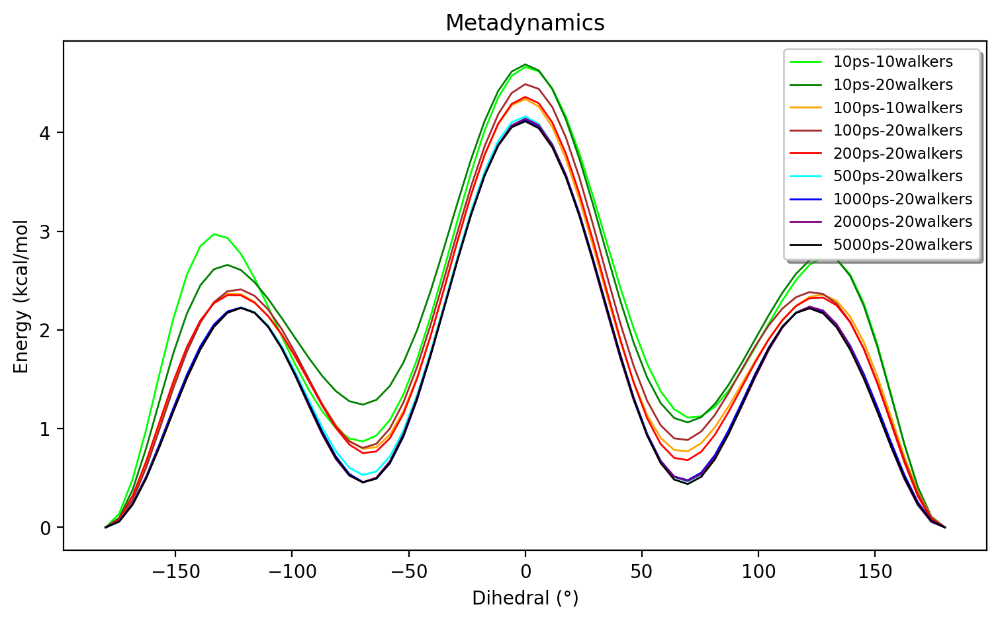

Metadynamics in ASH: Tutorial
======================================

Examples on how to perform metadynamics in ASH in general. See :doc:`Biased-sampling` for the general documentation.
In the examples below we use GFN1-xTB as a convenient QM level of theory due to it's low computational cost and qualitatively correct results.
ASH, however, allows one to perform metadynamics using any level of theory that is capable of providing an energy and gradient.
Both 1 and 2 collective variables (CVs) are supported.

**Examples:** 

- 1 CV MTD on butane using QM dynamics (xTB)
- 2 CV MTD on 3F-GABA using QM dynamics (xTB)
- 1 CV MTD on lysozyme using both MM and QM/MM dynamics

The scripts and files can be found in the examples/metadynamics directory of the ASH repository.

######################################################
**1. Single-CV metadynamics on n-butane**
######################################################

The conformational surface of n-butane is a good simple example for demonstrating the basics of the metadynamics method with a single CV.
The basic energy surface should be familiar to most as shown in the relaxed potential energy surface scan below (at the semi-empirical GFN1-xTB level of theory) where
the C0-C1-C2-C3 dihedral angle acts as a convenient reaction coordinate.

.. image:: figures/butane_potenergy_scan.png
   :align: center
   :width: 400

This relaxed surface-scan was performed using the **calc_surface function**  (see :doc:`surfacescan` ) like this:

.. code-block:: python

    #Creating the ASH fragment 
    frag = Fragment(databasefile="butane.xyz", charge=0, mult=1)
    #Defining the xTB theory (GFN1-xTB)
    theory = xTBTheory(runmode='library')

    #Calling the calc_surface function
    surfacedictionary = calc_surface(fragment=frag, theory=theory, scantype='Relaxed',
        resultfile='surface_results.txt', runmode='serial',
        RC1_range=[-180,180,10], RC1_type='dihedral', RC1_indices=[0,1,2,3])

The symmetry of n-butane and the fact that the free-energy surface would be expected to be highly similar to the potential energy surface 
(i.e. one already knows the approximate final result) is here an advantage.
Running metadynamics on the molecule allows one to get a feel for what it takes to converge a free energy surface with respect to minima and barriers.
Any major deviation from the basic potential energy profile, including symmetry breaking, should be interpreted as sampling noise or other simulation deficiency.

A metadynamics simulation at the same level of theory is straightforward to set up:

.. code-block:: python

    from ash import *

    #Creating the ASH fragment 
    frag = Fragment(databasefile="butane.xyz", charge=0, mult=1)
    #Defining the xTB theory (GFN1-xTB)
    theory = xTBTheory(runmode='library')

    #The name and path of the biasdirectory
    biasdir="./biasdirectory"

    #Calling the OpenMM_metadynamics function with a time of 1 ps
    OpenMM_metadynamics(fragment=frag, theory=theory, 
                timestep=0.001, simulation_time=1, traj_frequency=1, 
                temperature=300,
                CV1_atoms=[0,1,2,3], CV1_type='dihedral', CV1_biaswidth=0.5,
                biasfactor=6, height=1,
                frequency=100, savefrequency=100,
                biasdir=biasdir)

   #Plot the final (this function can be called outside this script)
   metadynamics_plot_data(biasdir=biasdir, dpi=200, imageformat='png')

Here we simply call the **OpenMM_metadynamics** function ( See :doc:`Biased-sampling`) on the same fragment and the same theory level, 
and we run an MD simulation for the desired length (1 ps in the script above) and temperature (300 K here).
We choose the CV to be the dihedral angle as previously defined (defined by carbon atoms 0-4) with a bias width of 0.5 radians (a common choice).
Additionally the Gaussian height is here chosen to be 1 kJ/mol and the biasfactor is 6 (higher values are also common).
The frequency and savefrequency values (here both 100) should be adjusted as needed. 
The biasdirectory variable needs to point to a directory that exist and can either be local 
(make sure the jobscript or Python script creates it in this case) or can point to the full path of a globally available directory.

Running the script above for 1 ps, 10 ps and 100 ps and plotting (using the **metadynamics_plot_data** function) gives us the following plot:

As shown, a 1 ps simulation gives a qualitatively wrong energy surface, while 10 ps is qualitatively OK but strongly breaks symmetry.
The 100 ps simulation is qualitatively correct but breaks symmetry a little bit and obviously these simulations are still far from being converged.

To reduce the sampling error, we could continue to increase the simulation time beyond 100 ps.
However, an even better approach is to utilize multi-walker metadynamics. By simply running multiple metadynamics simulations (each simulation being a walker) with a shared
biasdirectory, the different walkers will more quickly sample the free-energy surface. Multiple walkers is more efficient as we can e.g. use 10 CPU cores to run 10
metadynamics simulations for a tenfold improvement in sampling. This is more efficient than using the CPU cores to speed-up the speed of the Hamiltonian in each timestep 
(i.e. speeding up xTB by its own parallelization). Multiple-walker metadynamics only requires one to launch multiple ASH metadynamics jobs where the biasdirectory variable points to a shared, globally available biasdirectory.
As shown in the figure below we get a much improved sampling error by running 10 walkers instead of 1 walker (each simulation being 10 ps).

The slight breaking of symmetry of the 2 barriers (at approx 3 kcal/mol) and the minima at 1-1.2 kcal/mol still suggest a sampling error to remain.
To further reduce the sampling error we could utilize even more walkers or run each simulation for longer, the choice will depend on the computional resources available.
Note that by keeping the biasdirectory the same we can run simulation as different times, i.e. come back to previous simulations and continue.

The figure below shows even longer simulations (up to 5000 ps) with up to 20 walkers and it appears that decent convergence is reached at ~1000 ps for 20 walkers.

Finally we can compare the original 0 K potential energy surface to the 300 K free energy surface:

Some differences between the potential energy and the free energy surface can indeed be seen with respect to barrier height. 
Such differences need to be carefully interpreted, however, in view of sampling errors and of course with respect to how the simulations are carried out with respect to thermostats, ensemble effects etc.

The simulation will also depend on the biaswidth, biasfactor and Gaussian height. A Gaussian height of 1 kJ/mol is pretty standard.
The effect of the biaswidth is shown in the figure below (simulation length of 1000 ps)

A width of biaswidth=1.0 radians clearly is too large and biaswidth=0.6 and biaswidth=0.75 radians show some minor deviations compared to the smaller values.
As discussed in the metadynamics literature, another common way to determine the biaswidth is to run a regular unbiased MD simulation for one minimum and choose a biaswidth based on the fluctuation of the CV (e.g. a third of the fluctation).

#####################################################################
**2. 2-CV metadynamics on 3F-GABA in continuum solvent and QM/MM**
#####################################################################

2 collective variables are often required to better describe the overall free-energy surface.
The conformational energy surface of the zwitterion 3F-GABA molecule in aqueous solution is here a good example.
Previous studies have indicated that zwitterions like 3F-GABA require careful consideration of solvent effects to give a qualitative correct description, with QM/MM being required
for quantitative results. See for example this `QM/MM study <https://chemistry-europe.onlinelibrary.wiley.com/doi/10.1002/chem.201101674>`_

*Metadynamics in continuum solvent*

Here we first study the zwitterion at the GFN1-xTB level of theory in solution using the built-in xTB polarizable continuum model (ALPB).
Like before, we define our fragment and theory and then call the **OpenMM_metadynamics** function, this time specifying 2 dihedral angles (C1,C3,C4,C5 and C3,C4,C5,N6) as collective variables
that together map out the whole conformational energy surface of the molecule.

.. code-block:: python

   from ash import *

   biasdir="/path/to/biasdirectory"

   #Fragment and theory
   frag = Fragment(xyzfile="3fgaba.xyz", charge=0, mult=1)
   theory = xTBTheory(xtbmethod='GFN1', runmode='library', solvent="H2O")

   OpenMM_metadynamics(fragment=frag, theory=theory, timestep=0.001,
               simulation_time=500,
               traj_frequency=100, temperature=300, integrator='LangevinMiddleIntegrator',
               CV1_type="torsion", CV1_atoms=[1,3,4,5],
               CV2_type="torsion", CV2_atoms=[3,4,5,6],
               biasfactor=6, height=1,
               CV1_biaswidth=0.5, CV2_biaswidth=0.5,
               frequency=10, savefrequency=10,
               biasdir=biasdir)

Running a 500 ps metadynamics simulation using 10 walkers (and plotting using **metadynamics_plot_data**) results in the following free-energy surface:

The result reveals that, is in the original study, there is a strong tendency to prefer the hydrogen-bonded conformers (**A** and **B** in the original study) 
with dihedral angles of -80°,+80° **A**) and +80°,-80° (**B**) and not conformers like **F** (+180°,-180°) which NMR experiments indicate is likely dominant in solution.
This is most likely due to the continuum solvation description of the environment.

*Metadynamics in QM/MM explicit solvent*

We need to go beyond continuum solvation and so we explore explicit solvation. Explicit solvation typically requires many more water molecules than can be handled quantum
mechanically so we will do QM/MM.

1. Setting up the QM/MM system.
To conveniently create an explicitly solvated system we can use the **solvate_small_molecule** function (documented at :doc:`OpenMM-interface`).

.. code-block:: python

   from ash import *
   numcores=1
   #Defining solute and theory
   frag = Fragment(xyzfile="3fgaba.xyz", charge=0, mult=1)
   theory = xTBTheory(runmode='library', solvent="H2O")
   #Call solvate_small_molecule with frag as input, choosing TIP3P water molecule 
   #and box dimensions of 70x70x70 Angstrom
   solvate_small_molecule(fragment=frag, watermodel='tip3p', solvent_boxdims=[70.0,70.0,70.0],
                              nonbonded_pars="CM5_UFF", orcatheory=None, numcores=numcores)

This simple function creates a 70x70x70 Angstrom cubic box full of TIP3P water molecule with the solute in the middle of the box.
The nonbonded_pars="CM5_UFF" option automatically creates nonbonded MM parameters for the solute molecule: atom charges for the solute and defines Lennard-Jones parameters (here UFF).
For QM/MM only the Lennard-Jones parameters are strictly needed while for MM simulations (with solute frozen), the atom charges are needed.
**solvate_small_molecule** automatically calls ORCA to do a single-point DFT calculation at the r2SCAN/def2-SVP level of theory with Hirshfeld population analysis from which CM5 atom charges
are derived. Alternatively an ORCATheory object with another level of theory can be read into orcatheory.

The function creates the following files:
newfragment.xyz # An XYZ-file containing the full 33799 atom system.
system_aftersolvent.pdb # A PDB-file of the whole system. Defines the topology
solute.xml # An OpenMM XML forcefield file defining the solute nonbonded parameters

2. Defining the QM/MM metadynamics simulation

Now we can define our QM/MM metadynamics simulation. 
We need to read in the full fragment and define which atoms should be in the QM-region.
We also need to reate an OpenMMTheory object and define the forcefield by pointing to a TIP3P XML forcefield file (found in the ASH database dir), the solute XML file
and point to the PDB-file for topology, additionally we want the water model to be fully rigid so we specify rigidwater=True. Finally we need to define a QM/MM theory object that combines a QM-theory object and an MM-theory object.
The metadynamics function call is otherwise the same, we just need to point to the QM/MM object instead of the QM-object. As the solute coordinates are in the beginning
of the solvated-system file, the atom indices defining the CVs will be the same. 

.. code-block:: python

   from ash import *

   numcores=1
   biasdir="/home/rb269145/CALCDIR/ASH-metadynamics/3fgaba/tutorial/QM-MM/test1/biasdirectory"

   #System
   xyzfile="newfragment.xyz"
   pdbfile="system_aftersolvent.pdb"
   frag = Fragment(xyzfile=xyzfile, charge=0, mult=1)
   qmatoms = list(range(0,16)) # A list of atom indices that are in the QM-region. Here the solute atoms.

   #Define QM, MM and QM/MM Theory
   qm_theory = xTBTheory(runmode='inputfile') #QM-level of theory
   mm_theory = OpenMMTheory(xmlfiles=["/home/rb269145/PROGRAMS/ASH/NEW/ash/databases/forcefields/tip3p_water_ions.xml", "solute.xml"], 
      pdbfile=pdbfile, rigidwater=True, platform='CPU') #The MM-level of theory
   qm_mm_theory = QMMMTheory(qm_theory=qm_theory, mm_theory = mm_theory, qmatoms=qmatoms, fragment=frag) # The QM/MM object

   #Call metadynamics. Everything is the same, we just specify the theory as the QM/MM object instead
   OpenMM_metadynamics(fragment=frag, theory=qm_mm_theory, timestep=0.001,
               simulation_time=5, printlevel=0,
               traj_frequency=100, temperature=300, integrator='LangevinMiddleIntegrator',
               CV1_type="torsion", CV1_atoms=[1,3,4,5],
               CV2_type="torsion", CV2_atoms=[3,4,5,6],
               biasfactor=6, height=1,
               CV1_biaswidth=0.5, CV2_biaswidth=0.5,
               frequency=10, savefrequency=10,
               biasdir=biasdir)

Running a X ps QM/MM metadynamics simulation using 10 walkers (and plotting using **metadynamics_plot_data**) results in the following free-energy surface
at the QM/MM level:

############################################################
**2. Metadynamics on a protein using MM and QM/MM**
############################################################

We can also perform metadynamics simulations of a whole protein at either the MM level or the QM/MM level.
For a protein we need first a fully set-up MM system: all hydrogens present, fully solvated and neutralized and with a proper forcefield defined for both protein and solvent.
Here we use a previously set-up solvated lysozyme system.

