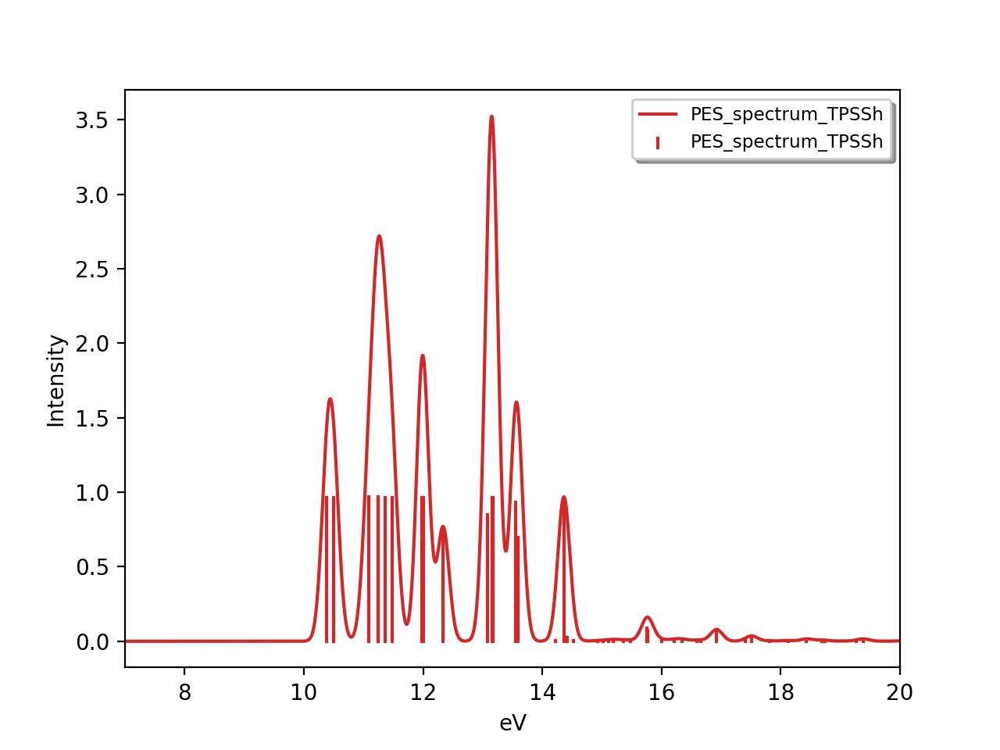
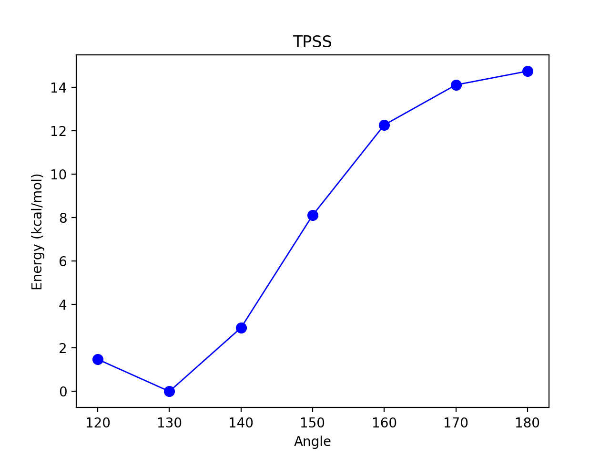
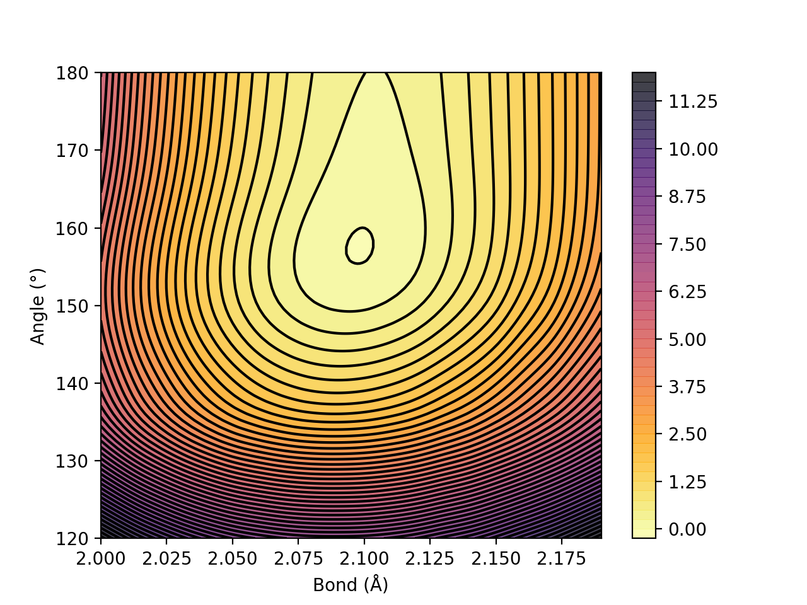

Plotting results
======================================

ASH includes some basic functions for conveniently plotting data: including reaction profiles, contourplots, broadened spectra etc.
These are essentially wrapper-functions around Matplotlib functionality.
This requires a Matplotlib installation (easily installed via Anaconda) to the Python environment.

##############################################################################
 plot_Spectrum: Plotting broadened spectrum
##############################################################################
The plot_Spectrum function takes a list of x-axis values (xvalues keyword), y-axis values (yvalues keyword) and plots
a broadened spectrum and a stick spectrum. The xvalues list is traditionally a Python list of energies (e.g. transition energies, Ionization-energies) and yvalues
list is typically a list of intensities. Typically these quantities come from a current or previous ASH job.
Gaussian broadening is used.

The output is a broadened data-file (e.g. Spectrum.dat), a stick-spectrum file (e.g. Spectrum.stk) and an image file (e.g Spectrum.png),
the latter requires Matplotlib.

Options:

- **plotname** : String (name, used to name the output files)
- **range** : List (x-axis range to plot; first value is start, second value is end)
- **unit** : String (unit of x-axis used to label axis, default: eV)
- **broadening** : number (the broadening factor in same unit as data, default: 0.1)
- **points** : integer (number of points in broadened spectrum, default:10000)
- **imageformat** : string-option (Matplotlib image format, e.g. png, svg; default: png)
- **dpi** : integer (resolution of image, default:200)
- **matplotlib** : Boolean(True/False) (whether to create image-file using Matplotlib or not, default: True)
- **CSV** : Boolean(True/False) (whether to comma-separate values or not in dat and stk files, default: True)

.. code-block:: python

    import plotting

    #Dummy example
    transition_energies=[1.0, 2.0, 3.0]
    transition_intensities=[0.05, 0.11, 0.57]

    plotting.plot_Spectrum(xvalues=transition_energies, yvalues=transition_intensities, plotname='PES_spectrum_TPSSh', range=[7,20], unit='eV',
        broadening=0.1, points=10000, imageformat='png', dpi=200)

##############################################################################
 Reaction_profile
##############################################################################
For a 1D scan (see :doc:`job-types`), the result dictionary can be given to the **plotting.reactionprofile_plot** function which will visualize the
relative energy surface as a lineplot. Dictionary should contain key-value pairs: coordinate : energy (in Eh).
The output is an imagefile (PNG by default).

- By default, the *RelativeEnergy* =True keyword option is on but can be turned off. This assumes energies are initially in Eh (Hartree) and they will be converted into the desired unit.
- The desired relative-energy unit is chosen via the *finalunit* keyword (valid options are: 'kcal/mol', 'kJ/mol', 'eV', 'cm-1').
- The x-axis label or y-axis label of the plot can be changed via: *x_axislabel* ='String' or *y_axislabel* ='String'.
- The *label* keyword is used to named the file saved: e.g.: PlotXX.png
- The *imageformat* and *dpi* keywords can be used to specify the image format: default is PNG and 200.
- *pointsize*, *scatter_linewidth*, *linewidth* and *color* keywords can be used to modify the plot.

.. code-block:: python

    import plotting
    #Simple with default options
    plotting.reactionprofile_plot(surfacedictionary, finalunit='kcal/mol',label='TPSS', x_axislabel='Angle', y_axislabel='Energy')
    #Specifying options

    plotting.reactionprofile_plot(surfacedictionary, finalunit='kcal/mol',label='TPSS', x_axislabel='Angle', y_axislabel='Energy',
        imageformat='png', RelativeEnergy=True, pointsize=40, scatter_linewidth=2, linewidth=1, color='blue')

##############################################################################
 Contour_plot
##############################################################################

For a 2D scan (see :doc:`job-types`), the dictionary can be given to the **plotting.contourplot** function which will visualize the energy surface as a contourplot.
The output is an imagefile (PNG by default).

- The unit of the surface can be chosen via finalunit keyword (kcal/mol, kJ/mol, eV etc.).
- A relative energy surface is by default calculated (RelativeEnergy=True) but this can be turned off (RelativeEnergy=False) e.g. for plotting a non-energetic surface.
- Datapoint interpolation can be performed (currently only 'Cubic' option; the cubic power can be modified via interpolparameter). This requires a scipy installation.
- The axes labels of the plot can be changed via: x_axislabel and y_axislabel.
- The label keyword is used to named the file saved: e.g.: SurfaceXX.png
- The imageformat and dpi keywords can be used to specify the image format: default is PNG and 200. See Matplotlib documentation for other imageformat options.
- The default colormap is 'inferno_r'. Other colormaps are e.g. 'viridis', 'inferno', 'plasma', 'magma' (matplotlib keywords).
- The number of contourlines used both for the filled contoursurface is by default 500 (numcontourlines=500). This value can be changed.
- Alternatively only a few selected contour-lines can be shown by providing a list as argument to contour_values keyword. e.g. contour_values=[0.1,1.0,2.0.5.0]
- Contourlines can be labelled or not: clinelabels=True/False
- The filled surface can be made more opaque or more transparent via the contour_alpha keyword (default 0.75).
- The color of the contour lines can be changed (contourline_color=black by default)

.. code-block:: python

    import plotting
    plotting.contourplot(surfacedictionary, finalunit='kcal/mol',label=method, interpolation='Cubic', x_axislabel='Bond (Å)', y_axislabel='Angle (°)')

Figure. Energy surface of FeS2 scanning both the Fe-S bond and the S-Fe-S angle. The Fe-S reaction coordinate applies to both Fe-S bonds.