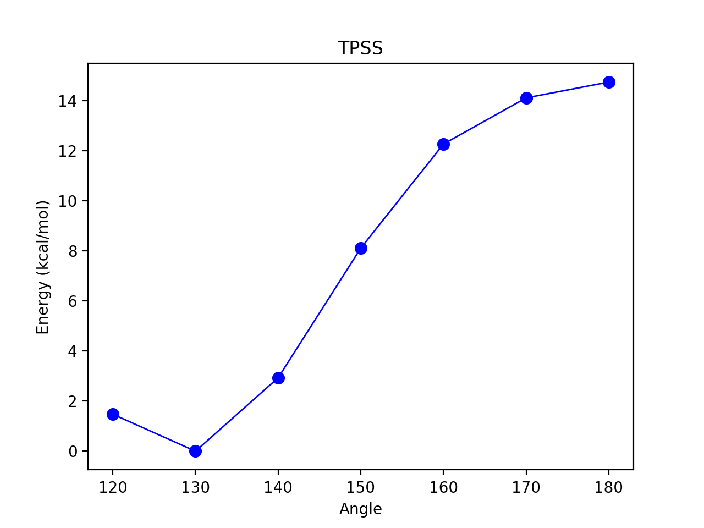
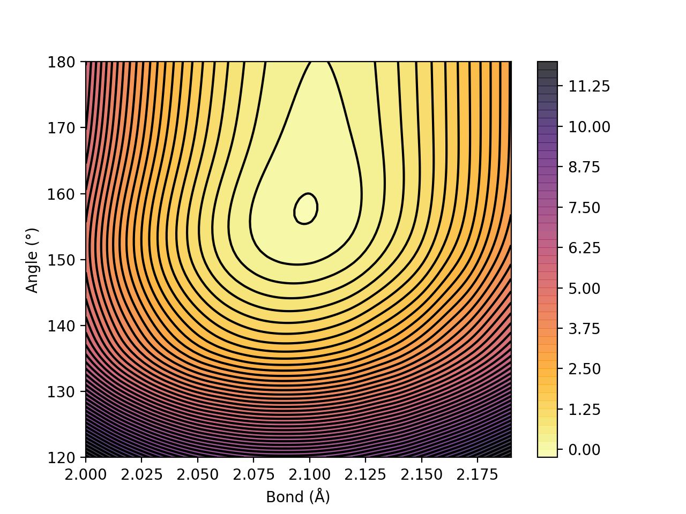

Surface Scan
======================================

Potential Energy Surfaces can be conveniently scanned in ASH using the **calc_surface function** .
This function utilizes the **Optimizer** (from  :doc:`Geometry-optimization`) to change coordinates and carry out constrained optimizations.

This allows one to conveniently scan the potential energy surface using a convenient reaction coordinate.
Both unrelaxed and relaxed scans be calculated, using either 1 and 2 reaction coordinates.

While surface scans can also be used to approximate minimum energy paths between minima and locate approximate saddlepoints ("Transition states"),
it is strongly advised to instead use the :doc:`neb` for this purpose. 

.. code-block:: python

    def calc_surface(fragment=None, theory=None, charge=None, mult=None, scantype='Unrelaxed', resultfile='surface_results.txt', 
                    keepoutputfiles=True, keepmofiles=False,runmode='serial', coordsystem='dlc', maxiter=50, extraconstraints=None, 
                    convergence_setting=None, ActiveRegion=False, actatoms=None):

.. list-table::
   :widths: 15 15 15 60
   :header-rows: 1

   * - Keyword
     - Type
     - Default value
     - Details
   * - ``theory``
     - ASH THeory
     - None
     - An ASH Theory.
   * - ``fragment``
     - ASH Fragment
     - None
     - An ASH fragment.
   * - ``scantype``
     - string
     - 'Unrelaxed'
     - What type of scan to perform. Options: 'Unrelaxed' and 'Relaxed'
   * - ``RC_list``
     - list
     - None
     - New syntax: A list of dictionaries that define the reaction coordinates (RC)..
   * - ``RC1_indices/RC2_indices``
     - list of integers
     - None
     - Old syntax: List of atom indices defining Reaction coordinate(RC) 1 or 2.
   * - ``RC1_type/RC2_type``
     - string
     - None
     - Old syntax: String indicating the type of reaction coordinate (either RC1 or RC2). Option: 'bond', 'angle', 'dihedral'
   * - ``RC1_range/RC2_range``
     - list of floats
     - None
     - | Old syntax:  List of number indicating the range of values to scan for RC1 or RC2. 
       | Example: [2.0,2.2,0.01] indicates scan value from 2.0 to 2.2 in 0.01 increments.
   * - ``runmode``
     - string
     - 'serial'
     - Whether to run calculations in serial or parallel. Options: 'serial', 'parallel'.
   * - ``resultfile``
     - string
     - 'surface_results.txt'
     - Change name of the results-file.
   * - ``extraconstraints``
     - Dict
     - None
     - Dictionary of additional constraints to apply during optimization. See :doc:`Geometry-optimization`.
   * - ``coordsystem``
     - string
     - 'tric'
     - | Which coordinate system to use during optimization. 
       | Options: 'tric', 'hdlc', 'dlc', 'prim', 'cart'  
       | Default: 'tric' (TRIC: translation+rotation internal coordinates), 
       | for an active region 'hdlc' is used instead. See :doc:`Geometry-optimization`.
   * - ``maxiter``
     - integer
     - 100
     - Maximum number of optimization iterations before giving up (for scantype='Relaxed').
   * - ``convergence_setting``
     - string
     - None.
     - | Specifies the type of convergence criteria for Optimizer. 
       | Options: 'ORCA', 'Chemshell', 'ORCA_TIGHT', 'GAU',
       | 'GAU_TIGHT', 'GAU_VERYTIGHT', 'SuperLoose'. See Convergence section for details.
   * - ``ActiveRegion``
     - Boolean
     - False
     - | Whether to use an Active Region during the optimization. This requires setting
       |  the number of active atoms (actatoms list) below.
   * - ``actatoms``
     - list
     - None
     - List of atom indices that are active during the optimization job. All other atoms are frozen. 
   * - ``keepoutputfiles``
     - Boolean
     - False
     - Whether to keep outputfile for each surfacepoint from QM code or not.     
   * - ``keepmofiles``
     - Boolean
     - False
     - Whether to keep MO-files for each surfacepoint from QM code or not. Only works for ORCATheory.
   * - ``read_mofiles``
     - Boolean
     - False
     - Whether to read MO-files (from mofilesdir) for each surfacepoint or not.                         
   * - ``mofilesdir``
     - string
     - None
     - Path to the directory containing MO-files. Use with read_mofiles=True option.
   * - ``charge``
     - integer
     - None
     - | Optional specification of the charge of the system (if QM)
       | if the information is not present in the fragment.
   * - ``mult``
     - integer
     - None
     - | Optional specification of the spin multiplicity of the system (if QM) 
       | if the information is not present in the fragment.

######################################################
Parallelization
######################################################

Surface scans can be parallelized in one of 2 ways. Either you run :
i) each surfacepoint one after the other (runmode="serial", this is default)
(using the optimized geometry of the previous surfacepoint and possible MOs as well) while parallelizing the Theory-level of each surfacepoint.
This approach does not parallelize as well (QM calculations have limitations regardign parallelization) but has the advantage of likely avoiding
convergence issues or falling into local minima.

This strategy is the simplest to start with.

ii) (runmode="parallel" and select numcores)
Here surfacepoints are run in parallel and independently of each other. 
Here we can utilize all X available CPU cores on the computer and run X surfacepoint calculations at the same time.
We typically want to turn off and Theory parallelization for this scenario (almost never desired) by setting numcores in Theory object to be 1.
For many surfacepoints, this will be the most efficient parallelization strategy.
A disadvantage is that convergence can be affected and one could fall into local minima.

######################################################
How to use
######################################################

The **calc_surface** function always takes a Fragment and Theory object as input. 
The type of scan should be specified via *scantype* ('Unrelaxed' or 'Relaxed') and runmode should be chosen according to the parallelization strategy (see above).

We then need to define the reaction coordinate.

**New syntax: Defining Reaction Coordinates via RC_list**
It is recommended to use the newer syntax of using the *RC_list* keyword.
Here we define a list of dictionaries that define the desired Reaction-Coordinates

.. code-block:: python

  # Defining RCs via list of dictionaries:
  RC_list=[{'type': 'dihedral',  'indices': [[0,1,2,3]], 'range': [-180, 180, 10]},
            {'type': 'angle',  'indices': [[1,0,2]], 'range': [180, 100, -10]}
            {'type': 'bond',  'indices': [[1,0]], 'range': [1.1, 1.5, 10]}])

This general syntax allows any number of RCs to be defined, meaning we can define 1D, 2D, 3D surface scans and even beyond that.

**Old syntax: Defining Reaction Coordinates via RCX_type/RCX_indices/RCX_range keywords**

The older syntax is only available for either 1 or 2 reaction coordinates.
One specifies RC1_type, RC1_range and RC1_indices (and also RC2 versions if 2 reaction coordinates are wanted).

- The RC1_type/RC2_type keyword can be: 'bond', 'angle' or 'dihedral' .
- The RC1_indices/RC2_indices keyword defines the atom indices for the bond/angle/dihedral. Note: ASH counts from zero.
- The RC1_range/RC2_range keyword species the start coordinate, end coordinate and the stepsize (Å units for bonds, ° for angles/dihedrals).

The old syntax is only kept for backward compatibility and will probably be removed at some point.

**Result file**
The resultfile keyword should be used to specify the name of the file that contains the results of the scan ( format: coord1 coord2 coord3... energy).
This file can be used to restart an incomplete/failed scan and to plot the final surface.
If ASH finds this file in the same dir as the script, it will read the data and skip unneeded calculations.
By default it is named: 'surface_results.txt'

**calc_surface** returns an ASH Results object that contains a dictionary of total energies for each surface point. 
The key is a tuple of coordinate values and the value is the energy, i.e. (RC1value,RC2value) : energy

**1D scan:**

Here scanning an angle (defined by atom indices 1,0,2 and scanning from 180° to 110 by taking decreasing steps of 10°).

.. code-block:: python

    results = calc_surface(fragment=frag, theory=ORCAcalc, scantype='Unrelaxed', resultfile='surface_results.txt', 
          runmode='serial', RC_list=[{'type': 'angle',  'indices': [[1,0,2]], 'range': [180, 110, -10]}],
          keepoutputfiles=True, surfacedictionary = results.surfacepoints

**2D scan:**

If 2 dictionaries are defined in *RC_list*   (or alternatively in the old syntax: if both RC1 and RC2 keywords are provided)
then a 2D scan will be calculated. 
Below we scan both a bond(distance) between 2.0 and 2.2 Å (0.01 Å step) for atom-pairs [0,1] and [0,2].
and the angle (between atoms 1,0,2) from 180° to 100°.

As can be seen it is possible to have each RC apply to multiple sets of atom indices by specifying a list of lists.
In this 2D scan example , the first RC (bond/distance) is applied to both atoms [0,1] as well as [0,2].
This typically makes sense when one wants to preserve the symmetry of a system e.g. this might apply to the O-H bonds in H2O.

.. code-block:: python

    results = calc_surface(fragment=frag, theory=ORCAcalc, scantype='Unrelaxed', resultfile='surface_results.txt', runmode='serial',
              RC_list=[{'type': 'bond',  'indices': [[0,1],[0,2]], 'range': [2.0, 2.2, 0.01]},
                       {'type': 'angle',  'indices': [[1,0,2]], 'range': [180, 100, -10]}],
                        keepoutputfiles=True, surfacedictionary = results.surfacepoints)

Other options to calc_surface:

- coordsystem  (for geomeTRICOptimizer, default: 'dlc'. Other options: 'hdlc' and 'tric')
- maxiter (for geomeTRICOptimizer,default : 50)
- extraconstraints (for geomeTRICOptimizer, default : None. dictionary of additional constraints. Same syntax as constraints in **geomeTRICOptimizer**)
- convergence_setting (for geomeTRICOptimizer, same syntax as in **geomeTRICOptimizer**)
- keepoutputfiles  (Boolean, keep outputfiles for each point. Default is True. )
- keepmofiles (Boolean, keep MO files for each point in a directory. Default is False.)

Note: See :doc:`Geometry-optimization` for geomeTRICOptimizer-related features.

######################################################
Periodic boundary conditions
######################################################

Thanks to the feature in the ASH interface to geomeTRIC, it is possible to perform geometry optimizations of both atom and lattice positions
in a periodic system. This feature can be extended to constrained optimizations allowing surface scans via **calc_surface** 
to be carried out under PBCs. See  :doc:`Geometry-optimization` documentation for more information on the optimization aspect.

To enable PBC-based surface scans one simply needs to :

- create an ASH Fragment containing the Cartesian coordinates of the unitcell (can be an XYZ-file or something else).
- provide an ASH Theory object that has native support for PBCs (and PBC enabled) and provide cell vectors or cell dimensions to object.
- **calc_surface** will automatically recognize whether the Theory object has PBCs enabled.

See  :doc:`Periodic-systems` for information on what Theory objects are supported.

The *PBC_format_option* keyword can be used to specify the file format used for each surfacepoint that will be 
stored in the surface_pbcfiles directory. PBC_format_option takes options: 'CIF', 'XSF' or 'POSCAR'
CIF-files and POSCAR file can be visualized in Chemcraft while XSF files can be visualized in VMD.

An example  

.. code-block:: python

  from ash import *

  numcores=1

  #Create fragment from xyz-file
  fragment=Fragment(xyzfile="system_unitcell.xyz", charge=0, mult=1)

  #Periodic CP2KTheory definition with specified cell dimensions
  qm = CP2KTheory(cp2k_bin_name="cp2k.psmp",parallelization='OMP',
      basis_method='XTB', xtb_type='GFN1',
      numcores=numcores, scf_maxiter=1500,
      periodic=True,cell_dimensions=[13.8,8.9,15.4,90,90,90],
      psolver='periodic', OT_preconditioner="FULL_SINGLE_INVERSE",
      eps_default=1e-12, stress_tensor=True)

  # Scan using HDLC internal coordinates for the constrained optimizations
  # NOTE: PBC_format_option: 'CIF', 'XSF', or 'POSCAR
  results = calc_surface(fragment=fragment, theory=qm, scantype='relaxed',
      resultfile='surface_results.txt',
      runmode='serial', 
      RC_list=[{'type': 'dihedral',  'indices': [[6,17,14,10]], 'range': [0,360,10]},
          {'type': 'dihedral',  'indices': [[51,62,59,55]], 'range': [0, 360, 10]}],
          coordsystem='hdlc', PBC_format_option="CIF")

###########################################################
Working with a previous scan from collection of XYZ files
###########################################################

If a surface scan has already been performed (by **calc_surface** or something else), it's possible to use the created XYZ-files and 
calculate single-point energies or optimizations for each surfacepoint with any level of theory.

.. code-block:: python

    def calc_surface_fromXYZ(xyzdir=None, theory=None, dimension=None, resultfile=None, scantype='Unrelaxed',runmode='serial',
                            coordsystem='dlc', maxiter=50, extraconstraints=None, convergence_setting=None, numcores=None,
                            RC_list=None, RC1_type=None, RC2_type=None, RC1_indices=None, RC2_indices=None, 
                            keepoutputfiles=True, keepmofiles=False, read_mofiles=False, mofilesdir=None):
        """Calculate 1D/2D surface from XYZ files

        Args:
            xyzdir (str, optional): Path to directory with XYZ files. Defaults to None.
            theory (ASH theory, optional): ASH theory object. Defaults to None.
            dimension (int, optional): Dimension of surface. Defaults to None.
            resultfile (str, optional): Name of resultfile. Defaults to None.
            scantype (str, optional): Tyep of scan: 'Unrelaxed' or 'Relaxed' Defaults to 'Unrelaxed'.
            runmode (str, optional): Runmode: 'serial' or 'parallel'. Defaults to 'serial'.
            coordsystem (str, optional): Coordinate system for geomeTRICOptimizer. Defaults to 'dlc'.
            maxiter (int, optional): Max number of iterations for geomeTRICOptimizer. Defaults to 50.
            extraconstraints (dict, optional): Dictionary of constraints for geomeTRICOptimizer. Defaults to None.
            convergence_setting (str, optional): Convergence setting for geomeTRICOptimizer. Defaults to None.
            numcores (float, optional): Number of cores. Defaults to None.
            RC1_type (str, optional):  Reaction-coordinate type (bond,angle,dihedral). Defaults to None.
            RC2_type (str, optional): Reaction-coordinate type (bond,angle,dihedral). Defaults to None.
            RC1_indices (list, optional):  List of atom-indices involved for RC1. Defaults to None.
            RC2_indices (list, optional): List of atom-indices involved for RC2. Defaults to None.

        Returns:
            [type]: [description]
        """

We can use the **calc_surface_fromXYZ** function to read in previous XYZ-files (named like this: RC1_2.0-RC2_180.0.xyz for a 2D scan and like this: RC1_2.0.xyz for a 1D scan).
These files should have been created from **calc_surface** already (present in surface_xyzfiles results directory).
By providing a theory level object we can then easily perform single-point calculations for each surface point or alternatively relax the structures employing constraints.
The results is a dictionary like before.

.. code-block:: python

    #Directory of XYZ files. Can be full path or relative path.
    surfacedir = '/users/home/ragnarbj/Fe2S2Cl4/PES/Relaxed-Scan-test1/SP-DLPNOCC/surface_xyzfiles'

    #Calculate surface from collection of XYZ files. Will read old surface-results.txt file if requested (resultfile="surface-results.txt")
    #Unrelaxed single-point job
    results = calc_surface_fromXYZ(xyzdir=surfacedir, scantype='Unrelaxed', theory=ORCAcalc, dimension=2, resultfile='surface_results.txt' )
    surfacedictionary = results.surfacepoints
    
    #Relaxed optimization job. A geometry optimization with constraints will be done for each point
    #The RC1_type and RC1_indices (and RC2_type and RC2_indices for a 2D scan) also need to be provided
    results = calc_surface_fromXYZ(xyzdir=surfacedir, scantype='Relaxed', theory=ORCAcalc, dimension=2, resultfile='surface_results.txt',
                        coordsystem='dlc', maxiter=50, extraconstraints=None, convergence_setting=None,
                        RC_list=[{'type': 'bond',  'indices': [[0,1],[0,2]], 'range': [2.0, 2.2, 0.01]},
                        {'type': 'angle',  'indices': [[1,0,2]], 'range': [100, 150, 10]}],)
    surfacedictionary = results.surfacepoints

Other options:

- keepoutputfiles=True  (outputfile for each point is saved in a directory. Default True)
- keepmofiles=False (Boolean, MO-file for each point is saved in a directory. Default False)
- read_mofiles=False (Boolean: Read MO-files from directory if True. Default False.)
- mofilesdir=path   (Directory path containing MO-files (GBW files if ORCA) )
- ActiveRegion= True/False
- actatoms=list  (list of active atoms if doing relaxed scan)

######################################################
Plotting
######################################################

The final result of the scan can be found in a textfile ('surface_results.txt' by default)
or as a dictionary in the ASH Results object (returned by calc_surface and calc_surface_fromXYZ ).

To plot the results, the dictionary can be given as input to some ASH plotting functions (based on Matplotlib).
See :doc:`module_plotting`) page.

The dictionary has the format: (coord1,coord2) : energy  for a 2D scan  and (coord1) : energy for a 1D scan
where (coord1,coord2)/(coord1) is a tuple of floats and energy is the total energy as a float.

A dictionary using data from a previous job (stored e.g. in surface_results.txt) can be created via the **read_surfacedict_from_file** function:

**Example**

.. code-block:: python

    from ash import *

    # Read in the results of a previous scan from file surface_results.txt into a dictionary
    surfacedictionary = read_surfacedict_from_file("surface_results.txt")

    #Plot a 1D scan:
    reactionprofile_plot(surfacedictionary, finalunit='kcal/mol',label='Plotname', x_axislabel='Angle', y_axislabel='Energy',
    imageformat='png', RelativeEnergy=True, pointsize=40, scatter_linewidth=2, line_linewidth=1, color='blue')
    #Plot a 2D scan:
    contourplot(surfacedictionary, finalunit='kcal/mol',label="Plotname", interpolation='Cubic', x_axislabel='Bond (Å)', y_axislabel='Angle (°)')
    # Plot a 3D scan (requires plotly)
    volumeplot(surfacedictionary, x_axislabel='Bond length (Å)', y_axislabel='Angle (°)',z_axislabel='Dihedral (°)', 
                colorbar_label='Energy', finalunit='kcal/mol', RelativeEnergy=True) 

Figure 2. 1D Energy Surface scanning an angle of some molecule

Figure 2. 2D Energy surface of FeS2 scanning both the Fe-S bond and the S-Fe-S angle. The Fe-S bond coordinate applies to both Fe-S bonds.

.. raw:: html
   :file: _static/3dsurface.html

Figure 3. 3D energy surface of ethanol, scanning C-C bond length, <O-C-C> angle and <C-C-O-H torsion